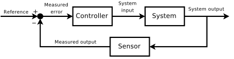

# Introduction

Control theory is an interdisciplinary branch of engineering and mathematics that deals with the behavior of dynamical systems with inputs, and how their behavior is modified by feedback [1].

The objective of control theory is to design a controller so that the system has some desired characteristics. Typical objectives are [2]:

* Stabilization
* Regulation
* Tracking
* Disturbance rejection

## Feedback Control Approach
1. Establish control objectives
    - Qualitative
    - Quantitative: step response time
    - Require understanding of expected commands, disturbances and bandwitdh
    - Require understanding of physical dynamics and appropriate control method  
2. Select sensors and actuators
    - What aspect to be sensed and controlled?
    - Sensor noise, cost, reliability, size ...
3. Obtain system model
    - First principle or system identification
    - Evaluation model -> reduce size and complexity
    - Accuracy? Error model?
4. Design controller
    - SISO or MIMO?
    - Classical or state-space?
    - Choose parameters (rule-of-thumb or optimization)
5. Analyze closed-loop performance
    - Does closed loop meet objectives?
    - Analysis, simulation, experimentation and iterate.

## Declaration
This document includes basic descriptions and implementations of a Control System. The materials covered are: system modelling, controller design, classical control theory, modern control theory and C/Matlab/Simulink implementations.

This wiki site is maintained by myself at an irregularly base. Contents might be inconsistent when I am working on them. Please use it with caution as I assume no other user than myself would be using this website.

## Reference
1. Control Theory - Wikipedia, [link](https://en.wikipedia.org/wiki/Control_theory)
2. Jonathan How, and Emilio Frazzoli. 16.30 Feedback Control Systems. Fall 2010. Massachusetts Institute of Technology: MIT OpenCourseWare, https://ocw.mit.edu. License: Creative Commons BY-NC-SA.

---

** 本条目贡献者:**

- automaticdai

---
