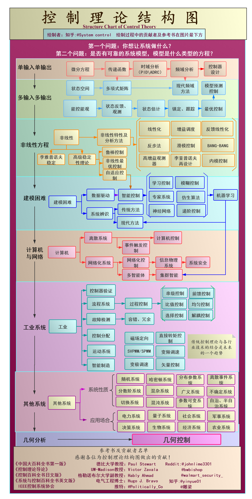

# 控制系统指南

!!! note "引言"
    本页面由我(automaticdai)早期整理而成，现已翻译成中文。欢迎[贡献该条目](/contribute)。

## 控制理论介绍
控制理论是工程学和数学的一个跨学科分支，研究具有输入的动态系统的行为，以及如何通过反馈来改变它们的行为 [1]。

控制理论的目标是设计一个控制器，使系统具有某些期望的特性。典型的目标包括 [2]：

* 稳定化 (Stabilization)
* 调节 (Regulation)
* 跟踪 (Tracking)
* 扰动抑制 (Disturbance rejection)

## 控制理论结构图

该图描述了控制理论的体系结构，由 [@系统与控制](https://www.zhihu.com/people/xiang-yi-55-49) 创作并授权使用。

## 反馈控制方法 (Feedback Control Approach)
1. 建立控制目标
    - 定性目标 (Qualitative)
    - 定量目标：阶跃响应时间 (Quantitative: step response time)
    - 需要理解期望的命令、扰动和带宽
    - 需要理解物理动力学和适当的控制方法
2. 选择传感器和执行器
    - 需要感知和控制哪些方面？
    - 传感器噪声、成本、可靠性、尺寸等
3. 获得系统模型
    - 第一性原理或系统辨识
    - 评估模型 -> 减小规模和复杂度
    - 精度如何？误差模型？
4. 设计控制器
    - 单输入单输出 (SISO) 还是多输入多输出 (MIMO)？
    - 经典控制还是状态空间？
    - 选择参数（经验法则或优化）
5. 分析闭环性能
    - 闭环是否满足目标？
    - 分析、仿真、实验和迭代

# 分析 (Analysis)
- 频域分析 (Frequency Domain Analysis)
	- 增益裕度 (Gain margin)
	- 相位裕度 (Phase margin)

- 时域分析 (Time Domain Analysis)
	- 上升时间 (Rising Time)
	- 峰值时间 (Peak Time)
	- 稳态时间 (Steady-state Time)

## 声明 (Declaration)
本文档包含控制系统的基本描述和实现。涵盖的材料包括：系统建模、控制器设计、经典控制理论、现代控制理论以及 C/Matlab/Simulink 实现。

本维基站点由我本人不定期维护。在我进行编辑时，内容可能不一致。请谨慎使用，因为我假设除了我自己之外没有其他用户会使用本网站。

## 参考资料
1. [Control Theory - Wikipedia](https://en.wikipedia.org/wiki/Control_theory)
2. Jonathan How and Emilio Frazzoli. [16.30 Feedback Control Systems](https://ocw.mit.edu/courses/aeronautics-and-astronautics/16-30-feedback-control-systems-fall-2010/). Fall 2010.  MIT OpenCourseWare
