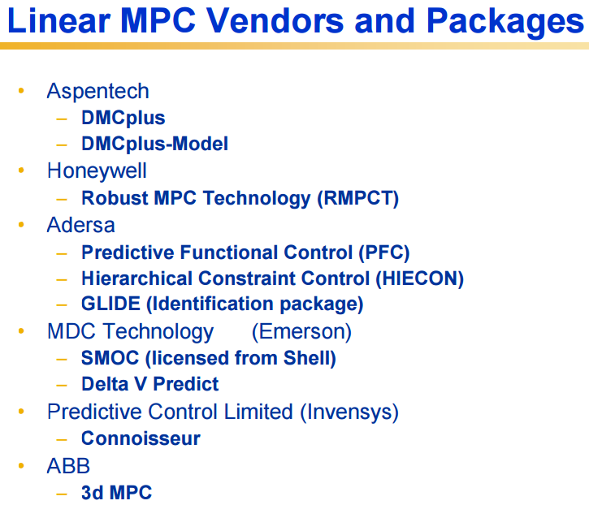
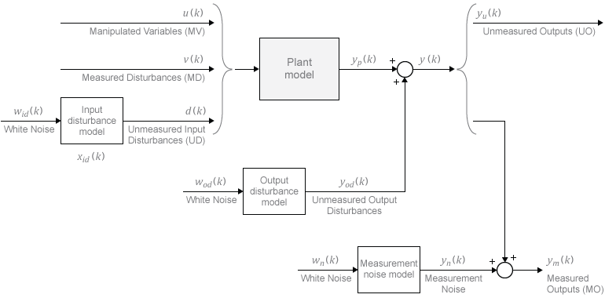

# MPC

## Generals
- MPC: regulatory controls using an explicit dynamic model of the response of process variables to changes in manipulated variables.
- \(obj = min(\sum (y - y_{trajectory})^2)\)
- basic version uses linear model. Can also be empirical model.
- advantages over PID:
    - long time constants, substaintial time delays, inverse response, etc;
    - multiple variables
    - has constraints over process variables

- General characteristcs:
    - targets (set points) selected by real-time optimization software based on current operating and economic conditions
    - minimize square of deviations between predicted future outputs and specific reference trajectory to new targets
    - handles MIMO control problems
    - can include equality and inequality constraints on controlled and manipulated variables
    - solves a nonlinear programming problem at each sampling instant
    - disturbance is estimated by comparing the actual controlled variable with the model prediction
    - usually implements the first move out of \(M\) calculated moves

- MPC target trajectories

    - Types:
        - Funnel Trajectory
        - Pure dead-band
        - Referecen Trajectory
    - Near-term vs. long-term objectives
    - Response Target
    - Response Speed

- Quadratic objective
  $$\sum_{i=0}^p x_i^TQx_i + \sum_{i=0}^{m-1} u_i^TRu_i$$

## Details
- Impulse and step response models and the prediction equation
- Use of state estimation
- Optimization
- Infinite-horizon MPC and stability
- Use of nonlinear models

