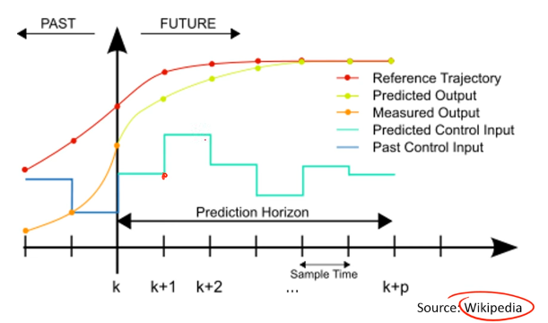
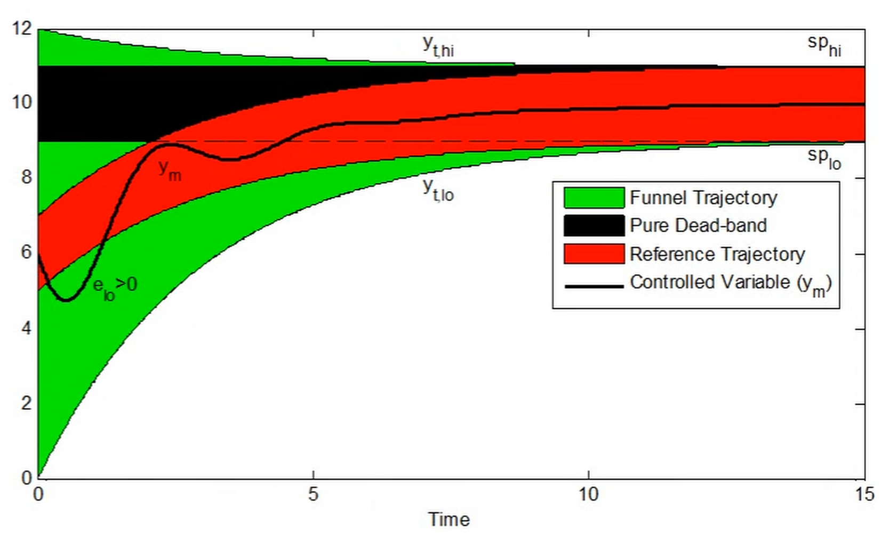
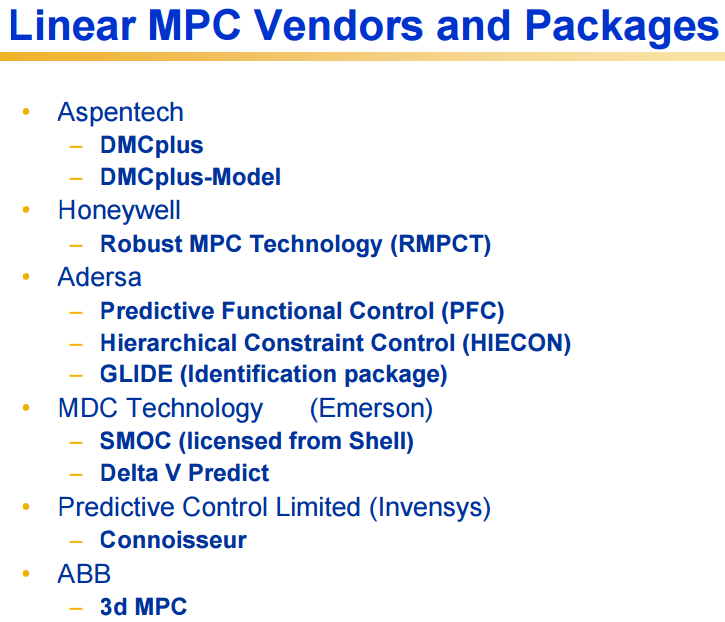
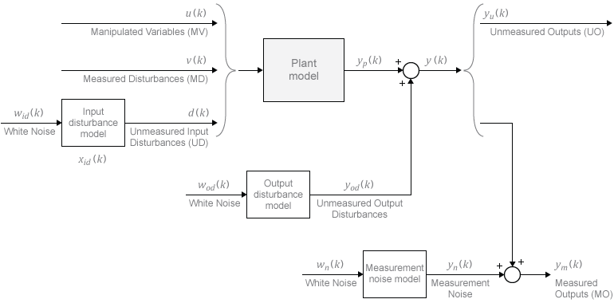

# MPC控制器

!!! note "引言"
    模型预测控制（Model Predictive Control, MPC）是一类基于在线优化的先进控制方法。MPC在每个采样时刻利用系统的动态模型预测未来行为，并通过求解优化问题确定最优控制序列。MPC天然支持多变量系统和约束处理，是工业过程控制和自主系统领域中应用最广泛的高级控制策略之一。



## 概述 (Generals)

- MPC：使用过程变量对操纵变量变化的响应的显式动态模型进行调节控制。
- \(obj = min(\sum (y - y_{trajectory})^2)\)
- 基本版本使用线性模型。也可以是经验模型。
- 相对于 PID 的优点：
    - 长时间常数、显著的时间延迟、反向响应等
    - 多变量
    - 对过程变量有约束

- 一般特征：
    - 目标（设定点）由实时优化软件根据当前运行和经济条件选择
    - 最小化预测未来输出与特定参考轨迹到新目标之间的偏差平方
    - 处理 MIMO 控制问题
    - 可以包括对受控变量和操纵变量的等式和不等式约束
    - 在每个采样时刻求解非线性规划问题
    - 通过比较实际受控变量与模型预测来估计扰动
    - 通常实现 \(M\) 个计算移动中的第一个移动

- MPC 目标轨迹

    - 类型：
        - 漏斗轨迹 (Funnel Trajectory)
        - 纯死区 (Pure dead-band)
        - 参考轨迹 (Reference Trajectory)
    - 近期与长期目标
    - 响应目标
    - 响应速度

- 二次目标函数
  $$\sum_{i=0}^p x_i^TQx_i + \sum_{i=0}^{m-1} u_i^TRu_i$$




## 详细内容 (Details)

- 脉冲和阶跃响应模型以及预测方程
- 状态估计的使用
- 优化
- 无限时域 MPC 和稳定性
- 非线性模型的使用




### 线性MPC公式

线性MPC是最常见的MPC形式，使用线性状态空间模型进行预测。给定离散时间线性系统：

$$x_{k+1} = Ax_k + Bu_k$$
$$y_k = Cx_k$$

MPC在每个时间步求解以下优化问题：

$$\min_{u_0, u_1, \ldots, u_{m-1}} J = \sum_{i=0}^{p} \|y_{k+i|k} - r_{k+i}\|_Q^2 + \sum_{i=0}^{m-1} \|\Delta u_{k+i|k}\|_R^2$$

其中：

- \(p\) 为预测时域（Prediction Horizon），定义模型向前预测的步数。
- \(m\) 为控制时域（Control Horizon），定义优化变量的个数，通常 \(m \leq p\)。
- \(Q\) 为输出误差权重矩阵，\(R\) 为控制增量权重矩阵。
- \(r\) 为参考轨迹（Reference Trajectory）。
- \(\Delta u = u_k - u_{k-1}\) 为控制增量。

预测时域和控制时域的选择是MPC设计中的关键参数。预测时域过短可能导致闭环不稳定；控制时域过长会增加计算负担。


### 约束处理

MPC的核心优势之一是能够显式处理系统约束。常见的约束类型包括：

- **输入约束（Input Constraints）**：执行器的物理限制，如电机的最大力矩、阀门的开度范围。

$$u_{min} \leq u_k \leq u_{max}$$

- **输入增量约束（Input Rate Constraints）**：限制控制量的变化速率，防止执行器的剧烈运动。

$$\Delta u_{min} \leq \Delta u_k \leq \Delta u_{max}$$

- **输出约束（Output Constraints）**：系统输出的安全范围，如温度上限、位置边界。

$$y_{min} \leq y_k \leq y_{max}$$

在线性MPC中，这些约束使得优化问题成为一个二次规划（Quadratic Programming, QP）问题，可以使用高效的QP求解器进行求解。


### 滚动时域原理 (Receding Horizon Principle)

滚动时域（也称为移动时域，Receding Horizon）是MPC的核心工作原理：

1. 在当前时刻 \(k\)，基于当前状态测量值（或估计值），求解一个有限时域的优化问题，得到未来 \(m\) 步的最优控制序列 \(\{u_k^*, u_{k+1}^*, \ldots, u_{k+m-1}^*\}\)。
2. 仅执行该控制序列的**第一个元素** \(u_k^*\)，将其施加到系统上。
3. 在下一个采样时刻 \(k+1\)，获取新的状态测量值，重复步骤1和2。

滚动时域策略的核心思想是：通过在每个时间步重新优化并结合最新的状态反馈，补偿模型误差和外部扰动的影响，从而实现闭环反馈控制。


### 计算考量

MPC的在线计算是其工程实现中的核心挑战。每个采样周期内，控制器必须完成从状态测量到优化求解再到控制输出的全部计算。

影响计算量的关键因素：

- **预测时域和控制时域的长度**：更长的时域意味着更多的优化变量和约束，计算量增大。
- **模型复杂度**：非线性模型的预测比线性模型复杂得多。
- **约束数量**：更多的约束增加了QP问题的规模。
- **采样周期**：更高的控制频率要求更快的求解速度。

对于线性MPC，求解QP问题的典型时间在微秒到毫秒级别，适合大多数工业控制场景。对于非线性MPC（Nonlinear MPC, NMPC），需要求解非线性规划（Nonlinear Programming, NLP）问题，计算量显著增大。常用的加速策略包括：

- **实时迭代（Real-Time Iteration, RTI）**：每个采样周期仅执行一次SQP（序列二次规划）迭代，用计算精度换取求解速度。
- **显式MPC（Explicit MPC）**：对于小规模问题，预先离线计算所有可能状态下的最优控制律，在线时仅需查表。
- **并行计算**：利用GPU或FPGA加速矩阵运算和优化求解。


## Python 代码示例

### do-mpc 倒立摆控制

do-mpc 是一个基于 Python 和 CasADi 的开源 MPC 框架，适合快速原型开发和学术研究。以下示例展示了如何使用 do-mpc 控制一个倒立摆（Inverted Pendulum）系统。

倒立摆系统的线性化状态方程为：

$$\dot{x} = Ax + Bu$$

其中状态向量 \(x = [p, \dot{p}, \theta, \dot{\theta}]^T\) 分别表示小车位置、小车速度、摆角和摆角速度，控制输入 \(u\) 为施加在小车上的水平力。

```python
import numpy as np
import do_mpc

# 简单倒立摆 MPC 示例
model_type = 'continuous'
model = do_mpc.model.Model(model_type)

# 状态变量
x = model.set_variable(var_type='_x', var_name='x', shape=(4,1))
# 控制变量
u = model.set_variable(var_type='_u', var_name='u', shape=(1,1))

# 倒立摆系统参数
M = 0.5   # cart mass (kg)
m = 0.2   # pole mass (kg)
l = 0.3   # pole length (m)
g = 9.81  # gravity

# 设置系统方程（线性化）
A = np.array([[0, 1, 0, 0],
              [0, 0, -m*g/M, 0],
              [0, 0, 0, 1],
              [0, 0, (M+m)*g/(M*l), 0]])
B = np.array([[0], [1/M], [0], [-1/(M*l)]])

model.set_rhs('x', A @ x + B @ u)
model.setup()

# MPC 控制器
mpc = do_mpc.controller.MPC(model)
setup_mpc = {'n_horizon': 20, 't_step': 0.05,
             'state_discretization': 'collocation'}
mpc.set_param(**setup_mpc)

# 代价函数
Q = np.diag([1, 0.1, 10, 0.1])
R = np.array([[0.01]])
mterm = x.T @ Q @ x
lterm = x.T @ Q @ x + u.T @ R @ u
mpc.set_objective(mterm=mterm, lterm=lterm)

# 约束
mpc.bounds['lower', '_u', 'u'] = -10
mpc.bounds['upper', '_u', 'u'] = 10
mpc.setup()
```

权重矩阵 \(Q\) 中摆角项（第3个对角元素为10）的权重远大于位置项（第1个对角元素为1），这体现了控制目标的优先级：首先保证摆杆不倒，其次再调节小车位置。

### 仿真闭环运行

完成控制器配置后，可以搭建仿真循环来验证控制性能：

```python
import do_mpc

# 构建仿真器
simulator = do_mpc.simulator.Simulator(model)
simulator.set_param(t_step=0.05)
simulator.setup()

# 设置初始状态（摆杆偏离竖直方向约 5 度）
x0 = np.array([[0.0], [0.0], [0.087], [0.0]])
mpc.x0 = x0
simulator.x0 = x0
mpc.set_initial_guess()

# 闭环仿真 100 步
for k in range(100):
    u0 = mpc.make_step(x0)       # 求解 MPC 优化问题
    x0 = simulator.make_step(u0) # 推进系统状态
```

该闭环结构清晰地反映了 MPC 的滚动时域原理：`make_step` 在每步重新求解优化问题，并只将第一个控制量作用于系统。


## 非线性MPC (NMPC)

### 适用场景

当系统具有显著的非线性特性时，基于线性化模型的线性MPC精度会下降，甚至导致控制失败。以下情况通常需要采用非线性MPC（Nonlinear Model Predictive Control, NMPC）：

- 系统工作点变化范围大，线性化误差不可忽略（如高机动飞行器、高速车辆）。
- 系统本身具有本质非线性，无法用线性模型合理近似（如化学反应器、柔性机器人）。
- 约束本身是非线性的（如摩擦锥约束、避障椭球约束）。
- 需要在大范围状态空间内保证稳定性和最优性。

相比线性MPC，NMPC在预测精度上有明显优势，但代价是计算量显著增大：每个采样周期需要求解一个非线性规划（NLP）问题。

### NMPC问题公式

NMPC的标准公式为：

$$\min_{u(\cdot)} \quad V_N(x_k, u(\cdot)) = \sum_{i=0}^{N-1} l(x_{k+i|k}, u_{k+i|k}) + V_f(x_{k+N|k})$$

$$\text{s.t.} \quad x_{k+i+1|k} = f(x_{k+i|k}, u_{k+i|k}), \quad i = 0, 1, \ldots, N-1$$

$$\quad\quad\quad x_{k+i|k} \in \mathcal{X}, \quad u_{k+i|k} \in \mathcal{U}$$

$$\quad\quad\quad x_{k|k} = x_k$$

其中 \(f(\cdot)\) 为非线性系统方程，\(l(\cdot)\) 为阶段代价，\(V_f(\cdot)\) 为终端代价，\(\mathcal{X}\) 和 \(\mathcal{U}\) 分别为状态和控制的可行集。

### 实时迭代 (RTI) 方案

实时迭代（Real-Time Iteration, RTI）是由 Diehl 等人提出的快速NMPC求解方法，其核心思想是：在每个采样周期内，不对NLP问题求解到收敛，而是只执行一次序列二次规划（Sequential Quadratic Programming, SQP）迭代，将上一时刻的解作为热启动（warm start）的初始点。

RTI 的求解步骤：

1. **准备阶段（Preparation Phase）**：在等待新测量值的同时，计算当前解点处的雅可比矩阵（Jacobian）和海森矩阵（Hessian），组装QP子问题。
2. **反馈阶段（Feedback Phase）**：获取新的状态测量值后，更新QP的右端项并快速求解，得到控制输出。

RTI 使得 NMPC 的计算时间接近于线性MPC，是目前工程应用中最主流的快速NMPC方案，被 ACADO Toolkit 等工具广泛采用。RTI 方案的稳定性和收敛性分析表明，当初始化充分接近最优解时，闭环系统的性能与完全求解NLP的标准NMPC接近。


## CasADi + IPOPT 非线性轨迹优化

CasADi 是一个强大的开源符号计算框架，支持自动微分（Automatic Differentiation），特别适合构建和求解非线性最优控制问题。IPOPT（Interior Point OPTimizer）是与 CasADi 搭配最常用的开源 NLP 求解器，基于内点法（Interior Point Method）实现。

### 简单双积分器示例

以下示例使用 CasADi 的 `Opti` 接口构建一个双积分器（Double Integrator）系统的MPC问题，状态为位置和速度 \([p, v]^T\)，控制输入为加速度 \(a\)，离散时间步长为 \(\Delta t = 0.1\,\text{s}\)：

```python
import casadi as ca

# 使用 CasADi 构建 MPC 问题
opti = ca.Opti()
N = 20  # 预测步数

X = opti.variable(2, N+1)  # 状态 [pos, vel]
U = opti.variable(1, N)    # 控制

# 系统动力学约束
for k in range(N):
    x_next = X[0,k] + 0.1*X[1,k]
    v_next = X[1,k] + 0.1*U[0,k]
    opti.subject_to(X[0,k+1] == x_next)
    opti.subject_to(X[1,k+1] == v_next)

# 代价函数
cost = ca.sumsqr(X) + 0.1*ca.sumsqr(U)
opti.minimize(cost)

# 约束
opti.subject_to(opti.bounded(-2, U, 2))

# 求解
opti.solver('ipopt')
sol = opti.solve()
```

### 设置初始状态与参数化

在实际滚动时域实现中，初始状态需要作为参数（parameter）传入，而非固定常数，以支持在每个采样周期更新：

```python
import casadi as ca
import numpy as np

opti = ca.Opti()
N = 20
dt = 0.1

X = opti.variable(2, N+1)
U = opti.variable(1, N)
x0_param = opti.parameter(2, 1)  # 当前状态作为参数

# 初始状态约束
opti.subject_to(X[:, 0] == x0_param)

# 动力学约束
for k in range(N):
    opti.subject_to(X[0, k+1] == X[0, k] + dt * X[1, k])
    opti.subject_to(X[1, k+1] == X[1, k] + dt * U[0, k])

# 代价函数（跟踪目标位置 p_ref = 1.0）
p_ref = 1.0
cost = ca.sumsqr(X[0, :] - p_ref) + 0.1 * ca.sumsqr(U)
opti.minimize(cost)

opti.subject_to(opti.bounded(-2, U, 2))
opti.subject_to(opti.bounded(-3, X[1, :], 3))  # 速度约束

# 配置求解器（关闭详细输出以提高速度）
opti.solver('ipopt', {}, {'print_level': 0, 'max_iter': 100})

# 闭环仿真示例
x_current = np.array([[0.0], [0.0]])
for step in range(50):
    opti.set_value(x0_param, x_current)
    sol = opti.solve()
    u_opt = sol.value(U[:, 0])    # 取第一个控制量
    # 推进系统（此处省略实际仿真器调用）
    x_current[0] += dt * x_current[1]
    x_current[1] += dt * u_opt
```

CasADi 的符号微分能力使得 IPOPT 可以获得精确的梯度和海森矩阵信息，从而保证求解速度和可靠性。对于具有数百个优化变量的中等规模MPC问题，IPOPT 通常能在毫秒量级内完成求解。


## 无人机轨迹跟踪

### 四旋翼动力学模型

四旋翼无人机（Quadrotor）的完整动力学模型是高度非线性的，但对于轨迹跟踪MPC设计，通常采用简化的线性化模型或分层控制结构。

简化的四旋翼平移动力学（在世界坐标系下）为：

$$\ddot{x} = \frac{T}{m} (\cos\phi \sin\theta \cos\psi + \sin\phi \sin\psi)$$

$$\ddot{y} = \frac{T}{m} (\cos\phi \sin\theta \sin\psi - \sin\phi \cos\psi)$$

$$\ddot{z} = \frac{T}{m} \cos\phi \cos\theta - g$$

其中 \(T\) 为总推力，\(m\) 为飞行器质量，\(\phi, \theta, \psi\) 分别为滚转角（roll）、俯仰角（pitch）和偏航角（yaw）。

在小角度假设（\(\phi, \theta \ll 1\)）下，平移动力学可以线性化为：

$$\ddot{x} \approx g\theta, \quad \ddot{y} \approx -g\phi, \quad \ddot{z} \approx \frac{T}{m} - g$$

### 状态空间与MPC设计

四旋翼轨迹跟踪MPC通常采用以下状态向量：

$$x = [p_x, p_y, p_z, v_x, v_y, v_z]^T$$

控制输入为：

$$u = [T, \phi_{cmd}, \theta_{cmd}]^T$$

其中 \(\phi_{cmd}, \theta_{cmd}\) 为内环姿态控制器的参考指令，实际的电机转速由内环姿态控制器（通常运行在更高频率）跟踪执行。

MPC问题的代价函数设计为：

$$J = \sum_{k=0}^{N-1} \left[ (p_k - p_k^{ref})^T Q_p (p_k - p_k^{ref}) + (v_k - v_k^{ref})^T Q_v (v_k - v_k^{ref}) + u_k^T R u_k \right] + (p_N - p_N^{ref})^T P (p_N - p_N^{ref})$$

### 约束处理

无人机MPC中的典型约束包括：

- **推力约束**：\(T_{min} \leq T \leq T_{max}\)，由电机特性决定
- **姿态角约束**：\(|\phi| \leq \phi_{max}\)，\(|\theta| \leq \theta_{max}\)，保证飞行安全
- **速度约束**：\(\|v\| \leq v_{max}\)，防止超速导致失控
- **位置约束**：用于障碍物回避，可表示为椭球或多面体约束

分层控制结构的优势在于：外层MPC运行在较低频率（如50-100 Hz）处理轨迹规划和约束，内层姿态控制器运行在高频率（如500-1000 Hz）确保姿态稳定性，两层解耦设计大幅降低了外层MPC的计算需求。


## 足式机器人步态规划

### 质心动力学模型

足式机器人（Legged Robot）的MPC通常基于质心动力学（Centroidal Dynamics）模型，该模型将机器人简化为一个质点，通过接触力对质心施加影响。质心动量（Centroidal Momentum）的变化率由以下方程描述：

$$\dot{h} = \sum_i (p_i - c) \times f_i + mg$$

其中：

- \(h\) 为质心角动量和线动量组成的6维向量（\(h = [l^T, k^T]^T\)，\(l\) 为线动量，\(k\) 为角动量）
- \(p_i\) 为第 \(i\) 个接触点（foot contact point）在世界坐标系中的位置
- \(c\) 为质心（Center of Mass, CoM）位置
- \(f_i\) 为第 \(i\) 个接触点的地面反力（Ground Reaction Force, GRF）
- \(m\) 为机器人总质量，\(g\) 为重力加速度向量

质心线动量方程简化为：

$$m\ddot{c} = \sum_i f_i + mg$$

这是一个与机器人构型（configuration）无关的简洁模型，非常适合在MPC框架中使用。

### 接触时序调度

在步态规划中，MPC需要处理接触时序（Contact Scheduling）问题。不同的步态（gait）对应不同的接触序列：

- **静步态（Static Walk）**：任意时刻至少三条腿着地，重心投影始终在支撑多边形内。
- **对角小跑（Trot）**：两条对角腿同时着地，适合中速运动。
- **奔跑（Gallop）**：存在四脚腾空阶段，适合高速运动。

在MPC优化中，接触状态通常预先由步态调度器（Gait Scheduler）确定，然后作为已知参数传入MPC。在预测时域内，哪些腿处于支撑相（Stance Phase）、哪些腿处于摆动相（Swing Phase）是固定的，MPC只优化支撑腿的接触力。

### 摩擦锥约束

接触力必须满足摩擦锥（Friction Cone）约束，以确保脚部不打滑：

$$f_{i,z} \geq 0 \quad \text{（法向力为正）}$$

$$\sqrt{f_{i,x}^2 + f_{i,y}^2} \leq \mu f_{i,z} \quad \text{（摩擦约束）}$$

其中 \(\mu\) 为地面摩擦系数。为使问题保持凸性，通常将摩擦锥线性化为摩擦棱锥（Friction Pyramid）：

$$|f_{i,x}| \leq \frac{\mu}{\sqrt{2}} f_{i,z}, \quad |f_{i,y}| \leq \frac{\mu}{\sqrt{2}} f_{i,z}$$

### MIT Cheetah 与 ANYmal 中的 MPC 实践

**MIT Cheetah 3 和 Mini Cheetah** 使用了基于质心动力学的凸MPC控制器（Convex MPC）。该方法将状态方程在参考轨迹附近线性化，并将摩擦锥约束线性化，从而将整个优化问题转化为QP，可在约0.25毫秒内完成求解（运行在250 Hz控制频率）。优化变量为每条腿在预测时域内的接触力序列，优化完成后将当前时刻的接触力通过全身控制（Whole-Body Control, WBC）分配到各关节力矩。

**ANYmal** 系列机器人采用了类似的分层MPC-WBC架构：

- **运动规划层（Locomotion Planner）**：MPC以约50 Hz运行，基于质心动力学模型优化接触力和质心轨迹。
- **全身控制层（Whole-Body Controller）**：以约400 Hz运行，将MPC输出的质心期望力转化为关节力矩，同时满足关节限位和接触约束。

这种分层结构是当前高性能足式机器人运动控制的主流方案，兼顾了计算效率和控制性能。


## 线性 MPC vs 非线性 MPC 选择指南

在实际工程中，选择线性MPC还是NMPC需要综合考虑系统特性、计算资源和性能需求。下表从多个维度进行对比：

| 对比维度 | 线性 MPC | 非线性 MPC (NMPC) |
|---|---|---|
| 系统模型 | 线性或可线性化系统 | 一般非线性系统 |
| 优化问题类型 | 二次规划 (QP) | 非线性规划 (NLP) |
| 典型求解时间 | 微秒 ~ 毫秒 | 毫秒 ~ 百毫秒 |
| 建模精度 | 工作点附近精度高 | 全范围精度高 |
| 实现复杂度 | 低，工具链成熟 | 高，需专业优化知识 |
| 稳定性保证 | 理论成熟，易于验证 | 需额外终端约束设计 |
| 嵌入式部署 | 容易，代码生成工具多 | 较难，资源需求大 |
| 典型应用频率 | 可达 1 kHz 以上 | 通常 10 ~ 200 Hz |
| 代表工具 | OSQP, qpOASES, HPIPM | ACADO, CasADi+IPOPT, FORCES Pro |

**选择建议**：

- 若系统在工作范围内基本线性，或计算资源严格受限，优先选择线性MPC。
- 若系统非线性显著（如四旋翼大机动飞行、高速赛车），且计算平台允许（如嵌入式GPU、高性能处理器），选择NMPC。
- 工程实践中，常用分层方案：高层采用NMPC（低频、高精度规划），低层采用线性MPC或PID（高频、快速执行）。


## 嵌入式 MPC 实现

### 嵌入式部署的挑战

将MPC部署到嵌入式控制器（Embedded Controller）面临以下主要挑战：

- **实时性**：求解时间必须严格小于采样周期，且具有确定性上界（worst-case guarantee）。
- **内存限制**：嵌入式处理器的RAM通常以KB到MB计量，无法运行通用NLP求解器。
- **浮点运算能力**：低端微控制器（Microcontroller Unit, MCU）可能不具备浮点运算单元（FPU）或只支持单精度浮点。
- **无动态内存分配**：嵌入式系统通常要求所有内存在编译时静态分配。

### 代码生成工具

主流的嵌入式MPC代码生成方案：

**ACADO Toolkit** 支持从符号模型自动生成用于嵌入式部署的C代码，实现RTI方案。生成的代码不依赖任何外部库，只需一个小型线性代数库即可在MCU上运行。适合采样周期在毫秒量级的应用。

**FORCES Pro**（Embotech）是商业嵌入式优化代码生成工具，支持针对特定硬件平台（ARM Cortex-M/A, Intel x86）的高度优化代码生成。生成代码经过安全认证，可用于汽车电子等功能安全要求严格的场景。

**qpOASES** 是一个开源的活动集（Active Set）QP求解器，具有确定性迭代次数上界（对于凸QP问题），适合对实时性要求严格的嵌入式线性MPC。

**OSQP** 基于ADMM（交替方向乘子法，Alternating Direction Method of Multipliers）算法，代码小巧、可移植性强，已被广泛部署在嵌入式平台上。

### 不同应用层次的频率需求

机器人系统通常采用多层次控制架构，不同层次对MPC的计算速度要求差异显著：

| 控制层次 | 典型频率 | 任务 | 推荐方案 |
|---|---|---|---|
| 任务规划层 | 1 ~ 10 Hz | 全局路径规划、目标决策 | Python/MATLAB + 通用求解器 |
| 运动规划层 | 10 ~ 100 Hz | 轨迹生成、步态规划 | NMPC / 凸MPC，C++ 实现 |
| 运动控制层 | 100 ~ 500 Hz | 质心控制、平衡控制 | 线性MPC，QP求解器 |
| 关节控制层 | 500 Hz ~ 5 kHz | 关节力矩控制 | PID 或简单线性MPC，FPGA/DSP |

以四足机器人为例，典型配置为：质心MPC运行在250 Hz，全身控制器运行在1 kHz，底层关节电流控制器运行在5 kHz以上。

### 显式 MPC

显式MPC（Explicit MPC）是另一种嵌入式部署方案：离线穷举所有可能的状态区域，为每个区域预计算最优仿射控制律，在线时只需查找当前状态所属区域并计算线性函数。

其优点是在线计算量极低（仅需查表和矩阵向量乘法），缺点是离线计算量和存储空间随状态维数和约束数量指数增长（维数灾难），通常只适用于状态维数不超过5~6维的小规模问题。

### 实际部署示例：OSQP 嵌入式使用

```python
import osqp
import numpy as np
import scipy.sparse as sp

# 构建线性 MPC 的 QP 问题
# 以简单一维双积分器为例，N=10 步预测
N = 10
nx, nu = 2, 1

# 系统矩阵
A = np.array([[1, 0.1], [0, 1]])
B = np.array([[0.005], [0.1]])

# 权重矩阵
Q = np.diag([10.0, 1.0])
R = np.array([[0.1]])
QN = Q  # 终端代价

# 构建批量预测矩阵（此处简化，实际需构建稀疏结构）
# 目标：最小化 sum Q*x^2 + R*u^2，受动力学和约束
prob = osqp.OSQP()

# 实际应用中需填充稀疏矩阵 P（代价）和 A_con（约束）
# prob.setup(P, q, A_con, l, u, warm_start=True, verbose=False)
# res = prob.solve()
# u_opt = res.x[:nu]  # 提取第一步控制量
```

OSQP 支持热启动（warm start），即用上一时刻的解初始化当前时刻的求解，可将迭代次数减少50%以上，显著降低最差情况求解时间。


## 在机器人中的应用

MPC在机器人领域有广泛的应用，以下是几个典型场景：

### 自动驾驶

在自动驾驶中，MPC被广泛用于横向和纵向控制。控制器根据车辆动力学模型预测未来轨迹，在满足车道边界、舒适性和安全距离等约束的条件下跟踪参考路径。非线性MPC可以在高速和紧急避障场景中提供更准确的预测。

### 无人机控制

MPC适合多旋翼无人机的轨迹跟踪和避障控制。无人机的多输入多输出（MIMO）特性和飞行包络约束（如最大倾斜角、推力限制）都可以在MPC框架中自然处理。

### 足式机器人

MPC被用于四足和双足机器人的步态规划和运动控制。控制器在预测时域内优化足端接触力和关节力矩，同时满足摩擦锥约束和动力学约束。

### 机械臂

在工业机器人和协作机器人中，MPC可以在笛卡尔空间或关节空间进行轨迹规划和跟踪，同时处理关节限位、速度限制和碰撞避免等约束。


## 软件工具

以下是常用的MPC开发和仿真工具：

- **ACADO Toolkit**：开源的自动控制和动态优化工具包，支持快速生成嵌入式MPC代码。
- **CasADi**：开源的符号计算框架，支持自动微分，广泛用于非线性MPC的建模和求解。
- **OSQP**：高效的开源QP求解器，适合嵌入式线性MPC应用。
- **MATLAB MPC Toolbox**：MathWorks提供的商业MPC工具箱，集成了设计、仿真和代码生成功能。
- **do-mpc**：基于Python和CasADi的开源MPC框架，适合快速原型开发和学术研究。
- **FORCESPRO**：Embotech公司的商业嵌入式优化求解器，专为实时MPC设计。
- **qpOASES**：开源活动集QP求解器，具有确定性迭代次数上界，适合安全关键应用。
- **HPIPM**：高性能内点法QP求解器，专为MPC结构化问题优化，由 Frison 等人开发。


## 参考资料

1. J. M. Maciejowski, *Predictive Control with Constraints*, Prentice Hall, 2002.
2. J. B. Rawlings, D. Q. Mayne, and M. M. Diehl, *Model Predictive Control: Theory, Computation, and Design*, 2nd Edition, Nob Hill Publishing, 2017.
3. L. Grüne and J. Pannek, *Nonlinear Model Predictive Control: Theory and Algorithms*, 2nd Edition, Springer, 2017.
4. M. Diehl, H. G. Bock, and J. P. Schlöder, "A Real-Time Iteration Scheme for Nonlinear Optimization in Optimal Feedback Control," *SIAM Journal on Control and Optimization*, 43(5):1714–1736, 2005.
5. D. Kim, J. Di Carlo, B. Katz, G. Bledt, and S. Kim, "Highly Dynamic Quadruped Locomotion via Whole-Body Impulse Control and Model Predictive Control," *arXiv:1909.06586*, 2019.
6. R. Grandia, F. Farshidian, R. Ranftl, and M. Hutter, "Feedback MPC for Torque-Controlled Legged Robots," *IEEE/RSJ IROS*, 2019.
7. B. Stellato, G. Banjac, P. Goulart, A. Bemporad, and S. Boyd, "OSQP: An Operator Splitting Solver for Quadratic Programs," *Mathematical Programming Computation*, 12(4):637–672, 2020.
8. G. Frison and M. Diehl, "HPIPM: a High-Performance Quadratic Programming Framework for Model Predictive Control," *IFAC World Congress*, 2020.
9. [CasADi 官方文档](https://web.casadi.org/)
10. [OSQP 求解器](https://osqp.org/)
11. [do-mpc 官方文档](https://www.do-mpc.com/)
12. [ACADO Toolkit](https://acado.github.io/)
13. [FORCESPRO 文档](https://forces.embotech.com/)
