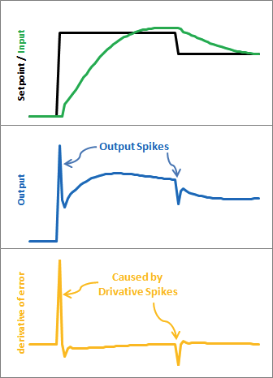
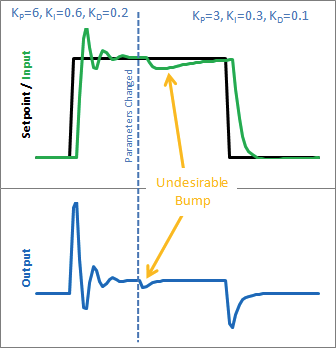
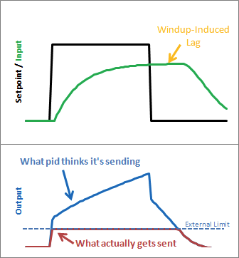
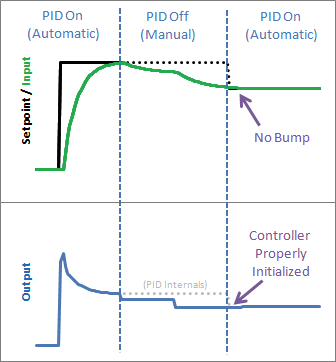

# PID Improvement Techniques

According to [1], a few improvements can be made to improve the so called Beginner's PID. The author of [1] wrote the PID library for Arduino. Here is a list of his advices:

1. Sample Time - The PID algorithm functions best if it is evaluated at a regular
interval. If the algorithm is aware of this interval, we can also simplify some of
the internal math.
2. Derivative Kick - Not the biggest deal, but easy to get rid of, so we’re going to do
just that.
3. On-The-Fly Tuning Changes - A good PID algorithm is one where tuning
parameters can be changed without jolting the internal workings.
4. Reset Windup Mitigation - We’ll go into what Reset Windup is, and implement a
solution with side benefits
5. On/Off (Auto/Manual) - In most applications, there is a desire to sometimes turn
off the PID controller and adjust the output by hand, without the controller
interfering
6. Initialization - When the controller first turns on, we want a “bumpless transfer.” That is, we don’t want the output to suddenly jerk to some new value
7. Controller Direction - This last one isn’t a change in the name of robustness per se.
it’s designed to ensure that the user enters tuning parameters with the correct sign

In this section, I will follow his advices and rewrite my version of code to illustrate the main ideas.

### Fixed Sampling Time
The first thing to make sure is the controller is called at a regular time interval. We can create a periodic control task, making use of ADC sampling interrupts, or we can use OS utilities to test if the specified sampling time has elapsed. With a fixed sampling time, we do not need to calculate the math related to $dt$ every time, and we can incorporate $dt$ into coefficients $K_i$ and $K_d$:

```c
/* ... */

void pid_init(float kp_, float ki_, float kd_, float dt){
  k_p = kp_;
  k_i = ki_ * dt;
  k_d = kd_ / dt;
  /* ... */
}

void pid_controller() {
  /* ... */
  e_i += e;
  float u = k_p * e + k_i * e_i + k_d * (e - e_p);
  /* ... */
}
```

### Derivative Kick
Since error = set-point - input, any change in the set-point would cause an instantaneous change in error, especially for derivative as this change leads to a close-to-infinity large number. When this number is fed into the PID equation, the result will lead to an undesirable spike in the output.



As $\dot{e} = \dot{r} - \dot{y}$, we can ignore the setpoint as constant, so $\frac{de}{dt} = -\frac{dy}{dt}$. This leads to a "Derivative on Measurement" method.

```c
/* ... */
float y_p = 0;

void pid_controller() {
  /* ... */
  e_i += e;
  float u = k_p * e + k_i * e_i + k_d * (y - y_p);
  /* ... */
  y_p = y;
}
```

### Tuning Changes
Changing PID parameters while the system is running may cause undesirable behaviors.



The major change comes from the "I" term. The solution is simply multiply k_i every time instead of multiply it on the overall sum. This leads to a smooth solution without additional computation.

```c
/* ... */
float ITerm = 0;

void pid_controller() {
  /* ... */
  ITerm += k_i * e;
  float u = k_p * e + ITerm + k_d * (y - y_p);
  /* ... */
}
```

### Reset Windup
The problem of windup comes from the fact that there is limitations on the output that a PID controller can send. For example, for Arduino, the PWM output can only accept values from 0-255. If the output value reaches this range, the controller should stop increasing its output and stop accumulating integral error. If the controller is not aware its output is not the actual output, the output will saturate and will introduce lag when the setpoint drop back again.



The C code after this step:

```c
/* ... */
float u_limit_upp = xxx;
float u_limit_low = xxx;

void pid_controller() {
  /* ... */
  if (pid_output_saturated(u)) {
    pid_output_reset(u);
    /* roll back the I term */
    ITerm -= k_i * e;
  }
  /* ... */
}

int pid_output_saturated(float u) {
  if (u > u_limit_upp || u < u_limit_low) {
    return 1;
  }
  else {
    return 0;
  }
}

int pid_output_reset(float u) {
  if (u > u_limit_upp) {
    u = u_limit_upp;
  } else if (u < u_limit_low) {
    u = u_limit_low;
  }
}
```

### Switch On/off
(In very rare situations), we may want to switch on/off a PID controller and manually feed control input to the process. This action may confuse the controller as it totally lose control of the output.


The solution is simple, adding a on/off control variable to enable/disable the controller and stop changing its internal state variables.

```c
/* ... */
int pid_switch_on = 1;

void pid_controller() {
  if (pid_switch_on == 0) {
    return;
  }
  /* ... */
}

void pid_switch(int new_state) {
  pid_switch_on = new_state;
}
```

### Initialization after Switch
A side effect of using on/off control is that when the controller switches from off to on, an undesirable bump would appear. This is illustrated in the following diagram:


To make the output smooth after switch back on the controller, we can reset the controller internal variables:

- "P": the proportional term does not rely on any past information, so it doesn't need any initilization, so P = 0.
- "D": set last_input = previous_input, so D = 0.
- "I": set ITerm = previous_output, so P + I + D = previous_output.

The result controller has a smooth response after switch the controller back on:



### Reverse Control
For some systems, the increasing in input will result decreasing in output. For example, an inceasing speed of a cooling fan will cause the temerature to go down. To handle these systems, we introduce a direction variable to address the difference between direct/reserve control. The only difference of reverse control is the sign of the PID parameters need to be negative instead of postive in the direct case.

```c
#define DIRECT_CONTROL  (0)
#define REVERSE_CONTROL (1)
int direction = DIRECT_CONTROL;

void pid_init() {
  /* ... */
  if (direction == REVERSE_CONTROL) {
    k_p = 0 - k_p;
    k_i = 0 - k_i;
    k_d = 0 - k_d;
  }
  /* ... */
}

void pid_setdir(int d_) {
  direction = d_;
}
```

---

## Other Improvements
### Input Filtering
To avoid problems of high frequency measurement noise in the derivative part, a low-pass filter is added.

$$U_D(s) = \frac{K T_D s}{1 + s T_D / N}(\gamma Y_{sp}(s) - Y(s))$$

$\gamma$ is for set-point weighting, which can be interpreted as feedforward from the set point.

### Timing Compensation
- The I and D parts are dependent on the actual interval between two control actions. If the interval is inconsistent, we need to compensate them.


### Feedforward

### Reset Tiebacks

### $I$ term Saturation


### $D$ term Filtering


### Error Dead-zone


### Output Limitation

### Dead band

### Anti Windup

---

## Event-based PID [2]
Event Detector (event-trigged) -> PID Controller (time-trigged)

Event trig condition should have small complexity to compare with time-trigged controller:

$|e(t_k) - e(t_{s}) > e_{lim}|$ OR $h_{act} > h_{max}$

which implies the detector operates at the nominal sampling frequency but the PID calculation only performs when an event is detected. This algorithm, however, requires more calculations due to the fact that each time the PID coefficients need to be recalculated.

It is important to filter the measurement noise properly and to set the error limit sufficiently large to avoid trigging control due to noise.

---

## References
1. Improving the Beginner’s PID, [web page link](http://brettbeauregard.com/blog/2011/04/improving-the-beginners-pid-introduction/)
2. Årzén, K-E. (1999), A Simple Event-Based PID Controller, Paper presented at 14th IFAC World Congress (1999), Beijing, China.
