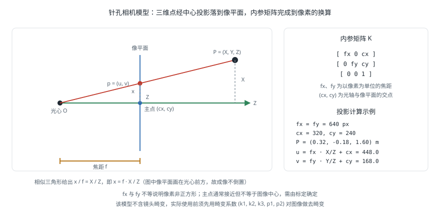

# 三维视觉

!!! note "引言"
    三维视觉（3D Vision）是计算机视觉的重要分支，研究如何从二维图像或传感器数据中恢复三维结构与空间信息。与传统二维视觉不同，三维视觉能够感知物体的深度、形状与空间位置，是机器人抓取、自主导航、场景重建和增强现实等应用的核心技术基础。随着深度传感器普及和神经网络方法的快速发展，三维视觉正经历从经典几何方法向深度学习方法演进的重大变革。


## 双目立体视觉 (Stereo Vision)

双目立体视觉模仿人眼的双目视差原理，通过两台相机从不同视角同时拍摄同一场景，利用左右图像中同一物点的位置差（视差）来推算该点的三维坐标。

### 双目相机标定

在进行立体测量之前，必须对相机进行精确标定，以获取相机的内参和外参。

#### 内参标定 (Intrinsic Calibration)

相机内参矩阵 \(K\) 描述从三维相机坐标到二维像素坐标的投影关系：

$$
K = \begin{bmatrix} f_x & 0 & c_x \\ 0 & f_y & c_y \\ 0 & 0 & 1 \end{bmatrix}
$$

其中 \(f_x\)、\(f_y\) 为以像素为单位的焦距，\((c_x, c_y)\) 为主点坐标（光轴与像平面的交点）。这一投影关系的几何来源是相似三角形：



镜头畸变（Lens Distortion）分为径向畸变和切向畸变。径向畸变系数 \((k_1, k_2, k_3)\) 修正桶形或枕形变形；切向畸变系数 \((p_1, p_2)\) 修正制造装配误差导致的偏斜：

$$
x_{\text{distorted}} = x(1 + k_1 r^2 + k_2 r^4 + k_3 r^6) + 2p_1 xy + p_2(r^2 + 2x^2)
$$

#### 外参标定 (Extrinsic Calibration)

外参描述左右相机之间的相对位姿，包括旋转矩阵 \(R \in SO(3)\) 和平移向量 \(t \in \mathbb{R}^3\)。对于标准双目系统，两相机光轴平行，基线（Baseline）\(B = \|t\|\) 即两相机光心之间的距离。

标定通常使用张正友棋盘格标定法（Zhang's Method），在多个不同位置和角度拍摄标定板，利用角点检测和最小二乘优化求解内外参。OpenCV 提供了完整的标定函数：

```python
import cv2
import numpy as np

# 准备标定板的世界坐标（棋盘格角点）
objp = np.zeros((9*6, 3), np.float32)
objp[:, :2] = np.mgrid[0:9, 0:6].T.reshape(-1, 2)

# 收集左右图像的角点
ret_l, corners_l = cv2.findChessboardCorners(img_left, (9, 6))
ret_r, corners_r = cv2.findChessboardCorners(img_right, (9, 6))

# 立体标定
ret, K_l, D_l, K_r, D_r, R, T, E, F = cv2.stereoCalibrate(
    objpoints, imgpoints_l, imgpoints_r,
    K_l, D_l, K_r, D_r, image_size,
    flags=cv2.CALIB_FIX_INTRINSIC
)
```

### 极线校正 (Epipolar Rectification)

极线几何（Epipolar Geometry）是双目视觉的数学基础。对于左图中一个点 \(x_l\)，其在右图中的对应点必定位于一条称为极线（Epipolar Line）的直线上，该关系由基础矩阵（Fundamental Matrix）\(F\) 描述：

$$
x_r^T F x_l = 0
$$

极线校正（Rectification）将左右图像变换，使得对应的极线水平对齐——即同一物点在左右图像中的行坐标相同，视差搜索退化为一维问题，大幅降低匹配计算量。

```python
# 极线校正
R1, R2, P1, P2, Q, roi1, roi2 = cv2.stereoRectify(
    K_l, D_l, K_r, D_r, image_size, R, T,
    flags=cv2.CALIB_ZERO_DISPARITY, alpha=0
)

# 生成校正映射
map1_l, map2_l = cv2.initUndistortRectifyMap(K_l, D_l, R1, P1, image_size, cv2.CV_32FC1)
map1_r, map2_r = cv2.initUndistortRectifyMap(K_r, D_r, R2, P2, image_size, cv2.CV_32FC1)

# 应用校正
img_rect_l = cv2.remap(img_left, map1_l, map2_l, cv2.INTER_LINEAR)
img_rect_r = cv2.remap(img_right, map1_r, map2_r, cv2.INTER_LINEAR)
```

校正后，可在同一行扫描窗口中搜索对应点，如下所示（示意图）：

```
左图（校正后）          右图（校正后）
+------------------+   +------------------+
|    ←← 极线行 →→  |   |    ←← 极线行 →→  |
|        ●         |   |      ●           |
|    （物点投影）    |   |  （同行，左移d像素）|
+------------------+   +------------------+
视差 d = 左图列坐标 - 右图列坐标
```

### 立体匹配算法

立体匹配（Stereo Matching）是双目视觉的核心步骤，目标是在校正后的图像中找到左右对应点，计算视差图（Disparity Map）。

#### BM（Block Matching）算法

块匹配（Block Matching，BM）是最经典的局部立体匹配方法。对于左图中每个像素，以该像素为中心取固定大小的窗口（块），在右图同一行的搜索范围内滑动同尺寸窗口，以代价函数（如 SAD、SSD、NCC）最小处为匹配点。

代价函数（绝对差之和，SAD）：

$$
\text{SAD}(x, y, d) = \sum_{(u,v) \in W} |I_L(x+u, y+v) - I_R(x+u-d, y+v)|
$$

**特点**：

- 计算简单，速度快，可在嵌入式设备上实时运行
- 适合纹理丰富、无大面积平坦区域的场景
- 在遮挡区域、均匀纹理区域精度较差

OpenCV 使用示例：

```python
stereo = cv2.StereoBM_create(numDisparities=64, blockSize=15)
disparity = stereo.compute(img_rect_l_gray, img_rect_r_gray)
```

#### SGM（Semi-Global Matching）算法

半全局匹配（Semi-Global Matching，SGM）由 Hirschmüller 于 2008 年提出，在保持较快速度的同时引入全局平滑约束，显著提升了平坦区域和遮挡边界的匹配精度。

SGM 的代价聚合沿多个方向（通常 8 或 16 个方向）传播，最终视差由各方向聚合代价之和决定：

$$
L_r(\mathbf{p}, d) = C(\mathbf{p}, d) + \min \begin{cases} L_r(\mathbf{p}-\mathbf{r}, d) \\ L_r(\mathbf{p}-\mathbf{r}, d \pm 1) + P_1 \\ \min_k L_r(\mathbf{p}-\mathbf{r}, k) + P_2 \end{cases} - \min_k L_r(\mathbf{p}-\mathbf{r}, k)
$$

其中 \(P_1\) 和 \(P_2\) 为平滑惩罚项，控制视差变化的代价。

OpenCV 提供 `StereoSGBM`（Semi-Global Block Matching）实现：

```python
stereo = cv2.StereoSGBM_create(
    minDisparity=0,
    numDisparities=128,
    blockSize=5,
    P1=8 * 3 * 5**2,
    P2=32 * 3 * 5**2,
    disp12MaxDiff=1,
    uniquenessRatio=10,
    speckleWindowSize=100,
    speckleRange=32,
    mode=cv2.STEREO_SGBM_MODE_SGBM_3WAY
)
disparity = stereo.compute(img_rect_l, img_rect_r).astype(np.float32) / 16.0
```

#### RAFT-Stereo：基于 Transformer 的深度学习方法

RAFT-Stereo（Recurrent All-Pairs Field Transforms for Stereo）将光流估计网络 RAFT 迁移至立体匹配任务，利用 Transformer 注意力机制构建全局相关体积（Correlation Volume），通过迭代更新机制逐步精化视差估计。

**核心流程**：

1. 特征提取网络（Feature Encoder）提取左右图像的密集特征
2. 构建 4D 相关体积（Correlation Volume）：\(C(u, v, d) = \langle f_L(u,v), f_R(u-d, v) \rangle\)
3. 循环更新单元（Recurrent Update Unit，GRU）迭代精化视差场
4. 上采样模块输出全分辨率视差图

**特点**：

- 在 ETH3D、KITTI 2015 等标准数据集上达到最高精度
- 对纹理稀少、强反光、遮挡区域鲁棒性强
- 推理速度较传统方法慢，需要 GPU 支持

### 视差图到深度图的转换

三角测量（Triangulation）原理：对于平行双目系统，物点深度 \(Z\) 与视差 \(d\) 存在以下关系：

$$
Z = \frac{f \cdot B}{d}
$$

其中：

- \(f\)：相机焦距（像素单位），\(f = f_x\)
- \(B\)：基线长度（米），即两相机光心距离
- \(d\)：视差（像素），\(d = x_L - x_R\)（左图列坐标减去右图列坐标）

三角测量几何原理示意：

```
     物点 P
      /\
     /  \
    /    \
   / Z    \
  /        \
 CL----B----CR        （CL：左相机光心，CR：右相机光心）
  \        /
   \  f   /
    \    /
     \  /
      \/
    像平面
  |--d--|              （d = xL - xR，视差）
```

由视差图获取三维点云：

```python
# Q 为 stereoRectify 返回的重投影矩阵
points_3d = cv2.reprojectImageTo3D(disparity, Q)
# 过滤无效点（视差为 0 的点）
mask = disparity > disparity.min()
output_points = points_3d[mask]
```


## 结构光与 ToF 深度感知

主动深度感知（Active Depth Sensing）通过主动向场景投射已知模式的光，与被动双目视觉互补，在无纹理或均匀场景下表现更优。

### 结构光 (Structured Light)

结构光深度相机向场景投射经过编码的光图案（如正弦条纹、二进制编码条纹或随机散斑），通过检测图案的变形来计算深度。

**相位偏移法**（Phase Shifting）是最常用的结构光方案之一。投射多幅正弦条纹图像，利用相位计算深度：

$$
I_k(x, y) = A(x,y) + B(x,y)\cos\!\left(\phi(x,y) + \frac{2\pi k}{N}\right), \quad k = 0, 1, \ldots, N-1
$$

通过四步相移（\(N=4\)）解出绝对相位：

$$
\phi(x,y) = \arctan\!\left(\frac{I_3 - I_1}{I_0 - I_2}\right)
$$

相位与深度之间通过标定建立查找表映射。

**代表产品**：

- **Intel RealSense L515**：采用 LiDAR 结构光，室内精度 \(\pm 5\) mm，分辨率 1024×768，帧率 30 fps
- **Apple Face ID**：点阵投影结构光用于人脸识别
- **Photoneo PhoXi 3D Scanner**：工业级高精度结构光扫描仪

**局限性**：强环境光（如户外阳光）会干扰结构光信号，通常仅适合室内使用。

### 飞行时间 (Time-of-Flight, ToF)

飞行时间深度相机通过测量光脉冲或调制光信号从发射到接收的往返时间来计算深度。对于直接 ToF（dToF）：

$$
d = \frac{c \cdot t}{2}
$$

其中 \(c \approx 3 \times 10^8 \, \text{m/s}\) 为光速，\(t\) 为往返时间。

间接 ToF（iToF）则通过测量调制光信号的相位偏移来推算距离，代表产品包括：

- **Microsoft Azure Kinect**：iToF 深度传感器，深度范围 0.25–5.46 m，分辨率 640×576
- **Intel RealSense D435i**：结合立体视觉与 iToF，适合机器人抓取
- **Sony DepthSense**：用于移动设备的小型 dToF 模块

### 结构光与 ToF 对比

| 特性 | 结构光 | 飞行时间（ToF） |
|------|--------|-----------------|
| 深度精度 | 高（\(\sim\)0.1 mm，工业级） | 中（\(\sim\)1–5 mm） |
| 深度范围 | 近距离（0.1–3 m） | 中远距离（0.5–10 m） |
| 帧率 | 低（需多帧投影，\(\sim\)10 fps） | 高（30–90 fps） |
| 户外适应性 | 差（易受阳光干扰） | 中（近红外滤波） |
| 功耗 | 中 | 低 |
| 成本 | 中到高 | 低到中 |
| 典型应用 | 工业检测、3D 扫描 | 机器人、手势识别、SLAM |


## 运动恢复结构 (Structure from Motion, SfM)

运动恢复结构（Structure from Motion，SfM）是从一组无序或有序图像中同时恢复相机位姿和场景稀疏三维结构的技术，是摄影测量学与计算机视觉交叉的核心方法。

### 基本流程

```
图像采集 → 特征提取 → 特征匹配 → 几何验证 → 初始重建 → 增量注册 → 束调整 → 稀疏点云
```

#### 第一步：图像采集

拍摄场景时，相邻视角之间的重叠率建议保持在 60%–80%，以保证足够的特征匹配对。

#### 第二步：特征提取

**传统方法**：

- **SIFT**（Scale-Invariant Feature Transform）：尺度和旋转不变，提取关键点和 128 维描述子，是 SfM 最常用的特征
- **SURF**（Speeded Up Robust Features）：SIFT 的加速版本
- **ORB**（Oriented FAST and Rotated BRIEF）：二进制描述子，速度快，适合实时 SLAM

**深度学习方法**：

- **SuperPoint**：自监督训练的关键点检测与描述网络，在室内场景表现优异
- **D2-Net**：联合检测与描述，对重复纹理更鲁棒

#### 第三步：特征匹配

暴力匹配（Brute-Force Matching）对大规模图像集效率低，通常使用近似最近邻（Approximate Nearest Neighbor，ANN）搜索，如 FLANN（Fast Library for Approximate Nearest Neighbors）。

深度学习匹配器 **SuperGlue** 使用图神经网络在 SuperPoint 特征之间建立对应关系，在弱纹理和大视角变化下效果显著提升。

#### 第四步：几何验证与本质矩阵分解

利用随机采样一致性（RANSAC，Random Sample Consensus）算法鲁棒估计本质矩阵（Essential Matrix）\(E\) 或单应矩阵（Homography）\(H\)，并剔除外点（Outlier）：

$$
x_2^T E x_1 = 0, \quad E = [t]_\times R
$$

从本质矩阵分解出相机间的相对旋转 \(R\) 和平移方向 \(\hat{t}\)（平移尺度不可恢复，需通过场景约束确定）。

#### 第五步：束调整 (Bundle Adjustment)

束调整（Bundle Adjustment，BA）是 SfM 的关键优化步骤，同时优化所有相机位姿 \(\{P_i\}\) 和三维点坐标 \(\{X_j\}\)，最小化重投影误差：

$$
\min_{\{P_i\}, \{X_j\}} \sum_{i,j} \rho\!\left(\left\|x_{ij} - \pi(P_i, X_j)\right\|^2\right)
$$

其中 \(\pi(P_i, X_j)\) 为三维点 \(X_j\) 在第 \(i\) 相机中的重投影坐标，\(x_{ij}\) 为观测到的图像坐标，\(\rho(\cdot)\) 为鲁棒核函数（如 Huber 或 Cauchy 核）以抑制外点影响。

束调整通常采用 Ceres Solver 或 g2o 等非线性最小二乘优化库求解，利用稀疏矩阵结构（Schur 补）加速计算。

### 增量式 vs 全局式 SfM 对比

| 方式 | 增量式 SfM | 全局式 SfM |
|------|-----------|-----------|
| 原理 | 逐步注册新图像，频繁 BA | 全局估计所有旋转和平移后统一 BA |
| 鲁棒性 | 高（局部错误可修正） | 较低（误差累积难以纠正） |
| 速度 | 慢（频繁 BA） | 快（BA 次数少） |
| 大规模场景 | 内存消耗大 | 扩展性更好 |
| 代表软件 | COLMAP | OpenMVG（全局模式） |

### 代表软件

#### COLMAP

COLMAP 是目前最流行的开源 SfM+MVS（Multi-View Stereo）系统，支持增量式和全局式 SfM，集成完整的稠密重建流程。

命令行使用示例：

```bash
# 特征提取
colmap feature_extractor \
    --database_path ./database.db \
    --image_path ./images \
    --ImageReader.camera_model OPENCV \
    --SiftExtraction.use_gpu 1

# 特征匹配（顺序匹配，适合有序视频帧）
colmap sequential_matcher \
    --database_path ./database.db \
    --SiftMatching.use_gpu 1

# 增量式稀疏重建
colmap mapper \
    --database_path ./database.db \
    --image_path ./images \
    --output_path ./sparse

# 稠密重建（MVS）
colmap image_undistorter \
    --image_path ./images \
    --input_path ./sparse/0 \
    --output_path ./dense

colmap patch_match_stereo \
    --workspace_path ./dense

colmap stereo_fusion \
    --workspace_path ./dense \
    --output_path ./dense/fused.ply
```

#### OpenMVG

OpenMVG（Open Multiple View Geometry）是另一个开源 SfM 库，提供增量式和全局式两种重建模式，代码结构清晰，适合研究使用。

### 从稀疏到稠密重建

SfM 产生的稀疏点云（Sparse Point Cloud）只包含特征点对应的三维点，不足以描述完整场景表面。多视角立体重建（Multi-View Stereo，MVS）在 SfM 的相机位姿基础上，对所有像素进行深度估计，生成稠密点云（Dense Point Cloud）：

**主要 MVS 方法**：

- **PatchMatch Stereo**（COLMAP 集成）：基于随机采样的高效稠密匹配
- **OpenMVS**：开源稠密重建系统，支持网格生成和纹理贴图
- **MVSNet**：深度学习 MVS，构建代价体积进行深度回归


## 点云处理 (Point Cloud Processing)

点云（Point Cloud）是三维空间中离散点的集合，每个点包含 \((x, y, z)\) 坐标，可选附带颜色 \((r, g, b)\) 或法向量等属性。点云是激光雷达（LiDAR）、深度相机和 SfM/MVS 的主要输出格式。

### 点云数据格式

| 格式 | 全称 | 特点 |
|------|------|------|
| PCD | Point Cloud Data | PCL 原生格式，支持 ASCII 和二进制，含头部元数据 |
| PLY | Polygon File Format | 支持顶点、面、颜色等属性，通用性强 |
| LAS | LASer File Format | 地理空间测绘标准格式，支持 GPS 时间戳和分类信息 |
| E57 | ASTM E57 | 三维成像系统数据交换标准，支持大规模扫描仪数据 |

### 基础处理

#### 滤波

**直通滤波（PassThrough Filter）**：按照指定坐标轴范围裁剪点云，去除感兴趣区域之外的点：

```python
import open3d as o3d

pcd = o3d.io.read_point_cloud("scene.pcd")
# 保留 z 坐标在 [0.5, 3.0] 范围内的点
bbox = o3d.geometry.AxisAlignedBoundingBox(
    min_bound=(-10, -10, 0.5),
    max_bound=(10, 10, 3.0)
)
pcd_cropped = pcd.crop(bbox)
```

**体素下采样（Voxel Downsampling）**：将点云按体素网格划分，每个体素内取重心点，均匀降低点密度，减少后续处理计算量：

```python
pcd_down = pcd.voxel_down_sample(voxel_size=0.05)  # 5 cm 体素
```

**统计离群点去除（Statistical Outlier Removal，SOR）**：对每个点计算其邻域内的平均距离，将统计上显著偏离均值的点标记为噪声并移除：

```python
pcd_clean, ind = pcd_down.remove_statistical_outlier(
    nb_neighbors=20, std_ratio=2.0
)
```

#### 法线估计 (Normal Estimation)

法线（Normal Vector）描述点云局部表面的朝向，是许多后续算法（配准、分割、特征提取）的基础。法线估计通过对每个点的 \(k\) 个近邻进行主成分分析（PCA，Principal Component Analysis），将最小特征值对应的特征向量作为法线方向：

$$
\mathbf{n}_i = \arg\min_{\|\mathbf{v}\|=1} \mathbf{v}^T C_i \mathbf{v}
$$

其中协方差矩阵 \(C_i = \frac{1}{k}\sum_{j \in \mathcal{N}(i)} (\mathbf{p}_j - \bar{\mathbf{p}})(\mathbf{p}_j - \bar{\mathbf{p}})^T\)。

```python
pcd_down.estimate_normals(
    search_param=o3d.geometry.KDTreeSearchParamHybrid(radius=0.1, max_nn=30)
)
# 确保法线朝向相机（法线方向一致性）
pcd_down.orient_normals_towards_camera_location(camera_location=[0, 0, 0])
```

#### 关键点检测

- **ISS（Intrinsic Shape Signatures）**：基于点邻域散度分析，检测几何显著点
- **SIFT-3D**：将 SIFT 思想扩展至三维，在尺度空间中检测极值点

### 点云配准 (Registration)

配准是将来自不同视角或不同时刻采集的点云对齐到统一坐标系的过程，是场景重建和 LiDAR SLAM 的核心步骤。

#### ICP（迭代最近点）

迭代最近点（Iterative Closest Point，ICP）是最经典的点云配准算法。给定源点云 \(\{q_i\}\) 和目标点云 \(\{p_i\}\)，交替执行"寻找最近点对"和"优化刚体变换"两步，最小化点对距离：

$$
\min_{R \in SO(3),\, t \in \mathbb{R}^3} \sum_{i=1}^{N} \left\|p_i - (R q_i + t)\right\|^2
$$

该优化问题有解析解，通过对协方差矩阵进行奇异值分解（SVD）可直接求得最优 \(R\) 和 \(t\)。

**ICP 变体**：

- **Point-to-Plane ICP**：最小化点到平面距离，收敛速度更快
- **Generalized ICP（G-ICP）**：考虑点邻域协方差，更鲁棒

```python
# Open3D ICP 示例
threshold = 0.05  # 最大对应点距离
trans_init = np.eye(4)  # 初始变换（单位矩阵）

reg_p2p = o3d.pipelines.registration.registration_icp(
    source, target, threshold, trans_init,
    o3d.pipelines.registration.TransformationEstimationPointToPoint(),
    o3d.pipelines.registration.ICPConvergenceCriteria(max_iteration=2000)
)
print("配准变换矩阵：\n", reg_p2p.transformation)
```

**局限性**：ICP 对初始位姿敏感，容易陷入局部最优，需要较好的初始估计。

#### NDT（正态分布变换）

正态分布变换（Normal Distributions Transform，NDT）将目标点云体素化，每个体素内的点用均值和协方差描述的正态分布表示，然后优化源点云落入各体素高斯分布的概率之积。

$$
\text{score} = \sum_i \exp\!\left(-\frac{(\mathbf{p}_i' - \boldsymbol{\mu}_k)^T \Sigma_k^{-1} (\mathbf{p}_i' - \boldsymbol{\mu}_k)}{2}\right)
$$

NDT 对初始位姿不敏感，计算效率高，是自动驾驶激光雷达 SLAM（如 Autoware 的定位模块）的首选配准算法。

#### 全局配准：FPFH + RANSAC

当初始位姿完全未知时，需先进行全局配准。快速点特征直方图（Fast Point Feature Histograms，FPFH）计算每个点邻域的几何关系直方图作为描述子，再通过 RANSAC 随机采样三对点估计初始变换：

```python
# 计算 FPFH 特征
radius_feature = 0.25
fpfh_src = o3d.pipelines.registration.compute_fpfh_feature(
    source_down, o3d.geometry.KDTreeSearchParamHybrid(radius=radius_feature, max_nn=100)
)
fpfh_tgt = o3d.pipelines.registration.compute_fpfh_feature(
    target_down, o3d.geometry.KDTreeSearchParamHybrid(radius=radius_feature, max_nn=100)
)

# RANSAC 全局配准
result_global = o3d.pipelines.registration.registration_ransac_based_on_feature_matching(
    source_down, target_down, fpfh_src, fpfh_tgt,
    mutual_filter=True, max_correspondence_distance=0.15
)
```

### 深度学习点云处理

传统点云处理方法需要手工设计特征，深度学习方法可以端到端地学习三维表示。

#### PointNet

PointNet 由 Qi 等人于 2017 年提出，直接以原始点云（无序点集）作为输入，通过以下方式处理点集的置换不变性（Permutation Invariance）：

- 对每个点独立应用共享的多层感知机（MLP），提取点级特征
- 通过全局最大池化（Global Max Pooling）聚合所有点的特征，获得全局描述子
- 输入变换网络（Input Transform Network，T-Net）学习对齐变换，提升旋转鲁棒性

全局特征维度通常为 1024，可用于分类或与点级特征拼接用于分割。

#### PointNet++

PointNet++ 是 PointNet 的层次化扩展，引入分层抽象结构：

1. **最远点采样（Farthest Point Sampling，FPS）**：从点云中均匀选取关键点
2. **Ball Query**：以关键点为中心、固定半径内的邻域点
3. **PointNet 局部特征学习**：对每个邻域应用 PointNet 提取局部特征
4. **层次化聚合**：多个抽象层次逐步扩大感受野

#### VoxelNet

VoxelNet 将点云体素化，在每个非空体素内用小型 PointNet（体素特征编码器，VFE）提取特征，然后将体素特征排列成三维张量，输入三维卷积神经网络（3D CNN）进行目标检测。


## 神经辐射场 (NeRF) 与 3D 高斯泼溅 (3D Gaussian Splatting)

近年来，基于神经网络的隐式和显式场景表示方法在新视角合成与三维重建领域取得突破，并逐步进入机器人应用场景。

### 神经辐射场 (Neural Radiance Field, NeRF)

NeRF 由 Mildenhall 等人于 2020 年提出，将场景表示为一个连续的五维函数 \(F_\Theta: (\mathbf{x}, \mathbf{d}) \to (\mathbf{c}, \sigma)\)，将空间位置 \(\mathbf{x} = (x,y,z)\) 和视角方向 \(\mathbf{d} = (\theta, \phi)\) 映射到颜色 \(\mathbf{c} = (r,g,b)\) 和体积密度 \(\sigma\)。

#### 体渲染方程

给定相机光线 \(\mathbf{r}(t) = \mathbf{o} + t\mathbf{d}\)，像素颜色通过体积渲染方程积分：

$$
C(\mathbf{r}) = \int_{t_n}^{t_f} T(t)\,\sigma(\mathbf{r}(t))\,\mathbf{c}(\mathbf{r}(t), \mathbf{d})\,\mathrm{d}t
$$

其中累积透射率 \(T(t) = \exp\!\left(-\int_{t_n}^{t} \sigma(\mathbf{r}(s))\,\mathrm{d}s\right)\)，表示光线从 \(t_n\) 到 \(t\) 未被阻挡的概率。

实践中用分层采样（Stratified Sampling）和重要性采样（Importance Sampling）将连续积分离散化。

#### NeRF 的局限性

- **训练时间长**：单场景训练需要数小时到数天
- **推理速度慢**：每帧需要数千次 MLP 前向传播
- **场景泛化差**：每次训练只对应一个场景
- **动态场景支持弱**：原始 NeRF 假设静态场景

**改进工作**：Instant-NGP（哈希编码加速，训练降至数分钟）、TensorRF（张量分解表示）、Deformable NeRF（动态场景）等。

### 3D 高斯泼溅 (3D Gaussian Splatting, 3DGS)

3D Gaussian Splatting 由 Kerbl 等人于 2023 年提出，以**显式**的三维高斯基元（Gaussian Primitive）表示场景，克服了 NeRF 推理慢的瓶颈。

每个高斯基元由以下参数描述：

- **位置**（均值）：\(\boldsymbol{\mu} \in \mathbb{R}^3\)
- **协方差矩阵**：\(\Sigma = R S S^T R^T\)（通过旋转四元数 \(q\) 和缩放 \(s\) 参数化，确保正定性）
- **不透明度**：\(\alpha \in [0, 1]\)
- **颜色**：球谐函数（Spherical Harmonics）系数，表示与视角相关的外观

渲染时将三维高斯投影（Splatting）到像平面上，按深度排序后进行 alpha 混合，全程可微分，支持 GPU 加速。

$$
\Sigma' = J W \Sigma W^T J^T
$$

其中 \(J\) 为射影变换的雅可比矩阵，\(W\) 为视图变换矩阵，\(\Sigma'\) 为投影到像平面的二维协方差。

**优势**：

- 实时渲染速度（\(>100\) FPS），远超 NeRF
- 训练时间大幅缩短（数分钟到数十分钟）
- 渲染质量接近甚至超越 NeRF

### 机器人应用

| 应用场景 | 方法 | 说明 |
|----------|------|------|
| 高保真场景建模 | NeRF / 3DGS | 从多张图像重建高质量环境模型 |
| 机器人训练数据增强 | NeRF 渲染 | 合成多视角图像扩充训练集 |
| 场景理解与地图 | 3DGS-SLAM | 实时重建可渲染的场景地图 |
| 物体抓取位姿估计 | NeRF-Grasp | 基于隐式表示的抓取位姿优化 |
| 可变形物体操作 | Deformable NeRF | 建模布料、绳索等非刚体 |


## 常用工具与库

| 工具/库 | 语言 | 主要功能 | 典型使用场景 |
|---------|------|----------|-------------|
| **Open3D** | C++ / Python | 点云处理、可视化、三维深度学习 | 机器人研究、快速原型开发 |
| **PCL**（Point Cloud Library） | C++ | 滤波、分割、配准、特征提取 | 机器人 ROS 集成、自动驾驶 |
| **CloudCompare** | C++ | 点云可视化、编辑、对比分析 | 测绘、建筑信息模型（BIM） |
| **COLMAP** | C++ | SfM + MVS 三维重建 | 摄影测量、场景重建 |
| **Meshroom** | C++ / Python | 基于 AliceVision 的 GUI 重建 | 面向用户的三维扫描 |
| **OpenCV** | C++ / Python | 双目视觉、相机标定、基础视觉 | 工业相机、嵌入式视觉 |
| **Ceres Solver** | C++ | 非线性最小二乘优化（BA） | SfM 后端优化 |

### Open3D 快速上手

```python
import open3d as o3d

# 读取并可视化点云
pcd = o3d.io.read_point_cloud("bunny.ply")
print(f"点云共 {len(pcd.points)} 个点")
o3d.visualization.draw_geometries([pcd])

# 体素下采样 + 法线估计
pcd_down = pcd.voxel_down_sample(0.005)
pcd_down.estimate_normals(
    o3d.geometry.KDTreeSearchParamHybrid(radius=0.01, max_nn=30)
)

# 泊松表面重建
mesh, densities = o3d.geometry.TriangleMesh.create_from_point_cloud_poisson(
    pcd_down, depth=9
)
o3d.io.write_triangle_mesh("output.ply", mesh)
```

### PCL（Point Cloud Library）ROS 集成示例

```cpp
#include <ros/ros.h>
#include <sensor_msgs/PointCloud2.h>
#include <pcl_conversions/pcl_conversions.h>
#include <pcl/filters/voxel_grid.h>

void cloudCallback(const sensor_msgs::PointCloud2::ConstPtr& msg)
{
    pcl::PointCloud<pcl::PointXYZ>::Ptr cloud(new pcl::PointCloud<pcl::PointXYZ>);
    pcl::fromROSMsg(*msg, *cloud);

    // 体素下采样
    pcl::VoxelGrid<pcl::PointXYZ> vg;
    vg.setInputCloud(cloud);
    vg.setLeafSize(0.05f, 0.05f, 0.05f);
    pcl::PointCloud<pcl::PointXYZ>::Ptr cloud_filtered(new pcl::PointCloud<pcl::PointXYZ>);
    vg.filter(*cloud_filtered);

    ROS_INFO("降采样后点数：%zu", cloud_filtered->size());
}
```


## 机器人应用场景

### 三维物体识别与抓取

三维视觉是机器人抓取（Grasping）的基础感知模块：

1. **位姿估计（6-DoF Pose Estimation）**：识别目标物体的位置和姿态（6 个自由度：3 平移 + 3 旋转），代表方法包括 PVNet、DenseFusion、FoundationPose
2. **抓取位姿规划（Grasp Pose Detection）**：从点云中检测可行的抓取位姿，代表方法包括 GPD（Grasp Pose Detection）、GraspNet-1Billion
3. **RGB-D 感知**：深度图像与颜色图像融合，同时利用外观和几何信息

### 室内外场景建图

- **激光 SLAM**：LiDAR 点云配准（NDT/ICP）实时建立三维地图，代表系统：Cartographer（Google）、LOAM（Zhang Ji）、LIO-SAM
- **视觉 SLAM（Visual SLAM）**：单目、双目或 RGB-D 相机实时重建环境地图，代表系统：ORB-SLAM3、VINS-Mono、ElasticFusion
- **大规模三维重建**：SfM + MVS 用于室外建筑、城市场景重建，结合无人机航拍采集数据

### BIM 建筑信息测量

建筑信息模型（Building Information Modeling，BIM）结合地面激光扫描仪（Terrestrial Laser Scanning，TLS）和摄影测量，实现毫米级精度的建筑三维测量，用于施工质量检测、竣工验收和历史建筑数字化保存。主流流程：

```
TLS 扫描 → 点云拼接（标靶配准）→ 语义分割 → BIM 模型生成（Autodesk Revit / IFC 标准）
```

### 自动驾驶感知

自动驾驶（Autonomous Driving）系统依赖三维视觉进行环境感知：

- **LiDAR 点云 3D 目标检测**：检测行人、车辆、骑车人等，代表方法：PointPillars、CenterPoint、SECOND
- **多传感器融合**：LiDAR + 摄像头融合（如 BEVFusion），利用各传感器互补优势
- **高精地图构建（HD Map）**：厘米级精度三维地图，用于定位和规划
- **自由空间检测（Freespace Detection）**：实时确定可通行区域，避障决策依据


## 参考资料

1. Hirschmüller, H. (2008). Stereo processing by semiglobal matching and mutual information. *IEEE Transactions on Pattern Analysis and Machine Intelligence*, 30(2), 328–341.
2. Lipson, L., Teed, Z., & Deng, J. (2021). RAFT-Stereo: Multilevel Recurrent Field Transforms for Stereo Matching. *International Conference on 3D Vision (3DV)*.
3. Mildenhall, B., Srinivasan, P. P., Tancik, M., Barron, J. T., Ramamoorthi, R., & Ng, R. (2020). NeRF: Representing Scenes as Neural Radiance Fields for View Synthesis. *ECCV*.
4. Kerbl, B., Kopanas, G., Leimkühler, T., & Drettakis, G. (2023). 3D Gaussian Splatting for Real-Time Radiance Field Rendering. *ACM SIGGRAPH*, 42(4).
5. Qi, C. R., Su, H., Mo, K., & Guibas, L. J. (2017). PointNet: Deep Learning on Point Sets for 3D Classification and Segmentation. *CVPR*.
6. Qi, C. R., Yi, L., Su, H., & Guibas, L. J. (2017). PointNet++: Deep Hierarchical Feature Learning on Point Sets in a Metric Space. *NeurIPS*.
7. Schönberger, J. L., & Frahm, J.-M. (2016). Structure-from-Motion Revisited. *CVPR*.
8. Zhou, Q.-Y., Park, J., & Koltun, V. (2018). Open3D: A Modern Library for 3D Data Processing. *arXiv:1801.09847*.
9. Rusu, R. B., & Cousins, S. (2011). 3D is here: Point Cloud Library (PCL). *ICRA*.
10. Biber, P., & Straßer, W. (2003). The Normal Distributions Transform: A New Approach to Laser Scan Matching. *IROS*.

