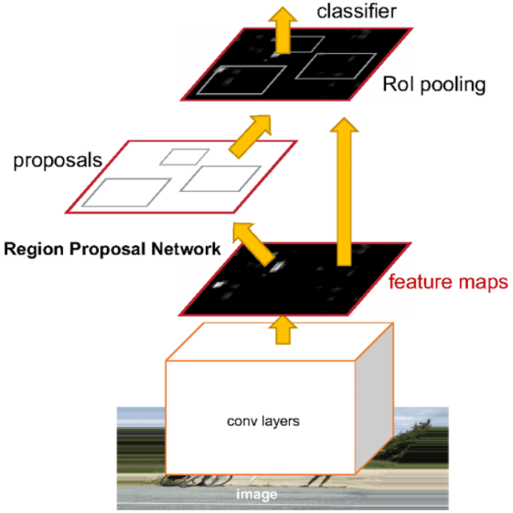
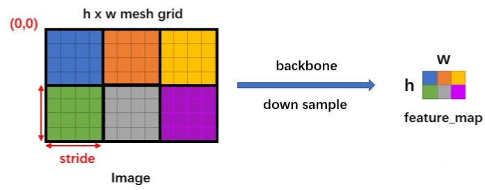
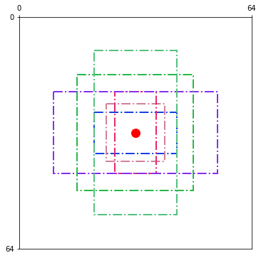
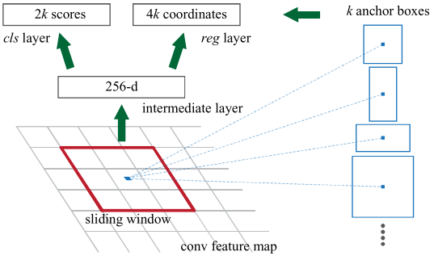
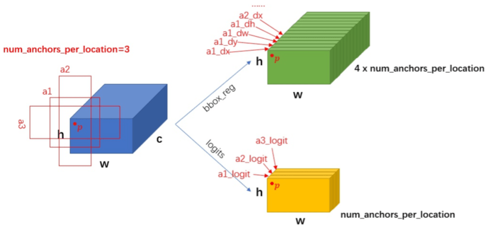
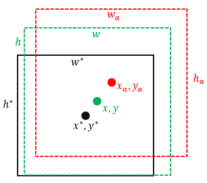
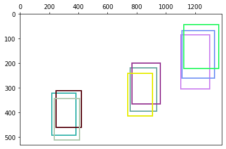
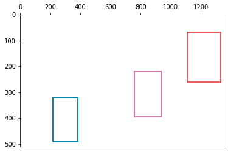
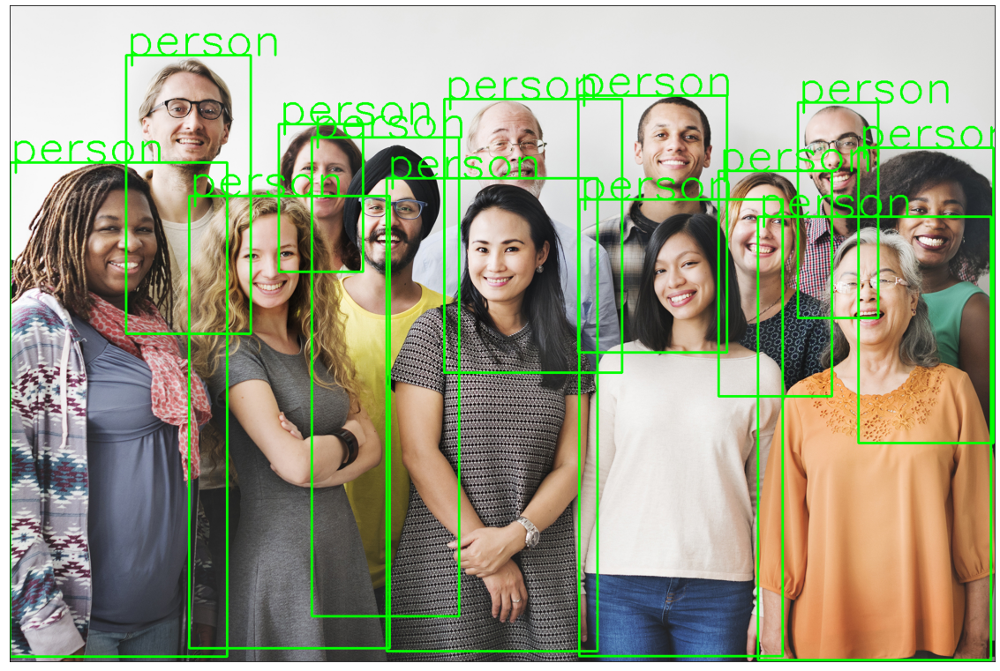

# Faster R-CNN


Faster R-CNN将Fast R-CNN中的Selective Search换成了Region Proposal Network，这样位置网络就和分类网络结合起来，**于是CNN提取的特征feature maps被两者共用**，不仅极大加快了速度，还提升了精度（两者会互相促进）。




Faster R-CNN的训练过程：

1. 提取图片features
2. 创建目标anchors
3. RPN网络输出这些anchors的locations和objectness分数
4. 取locations和objectness分数最好的前N个anchors，又称为proposal layer
5. 将这N个anchors输入网络，取得更精确的locations得分和classification得分
6. 计算步骤3中的`rpn_cls_loss`和`rpn_reg_loss`
7. 精算步骤5中的`roi_cls_loss`和`roi_reg_loss`


## 1. Input
我们用PyTorch官方实现的Faster R-CNN网络来学习，论文中使用提取features的backbone网络是VGG，PyTorch优化使用了ResNet-50并结合了FPN，我们先看下第一层`transform`：

```python
# get the pretrained model from torchvision.models
# Note: pretrained=True will get the pretrained weights for the model.
# model.eval() to use the model for inference
model = torchvision.models.detection.fasterrcnn_resnet50_fpn(pretrained=False)
model.eval()

list(model._modules.items())[0]
```

可以看出先对数据做了归一化`Normalize`，然后调整图片大小（等比缩放），在保证最长边不超过`1333`情况下，最短边缩放到`800`：

```python
def resize(image, min_size=800, max_size=1333):
    im_shape = torch.tensor(image.shape[-2:])
    min_s = float(torch.min(im_shape))
    max_s = float(torch.max(im_shape))
    scale_factor = min_size / min_s
    if max_s * scale_factor &gt; max_size:
        scale_factor = max_size / max_s

    return(torch.nn.functional.interpolate(
        image[None], scale_factor=scale_factor, mode='bilinear', recompute_scale_factor=True,
        align_corners=False)[0])


image = torch.rand(3, 200, 300)  # get some dummy image
resize(image).shape
```

保证输入图片最长边不超过`1333`，避免内存爆炸：

```python
image = torch.rand(3, 3000, 1300)  # get some dummy image
print(resize(image).shape)

del image, model
```

## 2. Feature Extraction
Faster R-CNN网络主要有三个部分，如下图所示，分别为`feature extraction`、`region proposal`和`predication`：


### 2.1 FPN
注意上图论文中的`feature extraction`使用的backbone是VGG，PyTorch官方版本使用了带FPN的ResNet-50。如下图所示，ResNet-50四个阶段的features都被使用了。低层的特征语义信息比较少，但是目标位置准确；高层的特征语义信息比较丰富，但是目标位置比较粗略。将低层的特征和高层的特征融合起来，有利于网络性能。另外目标框会随着features减小而减小，这样在被缩小了32倍的最后一层features上，小目标就会变得非常小，难以被检测出来，**于是融合后不同尺度的特征负责检测不同大小的物体**。


如图所示，高层的特征会被放大2倍后，加上经过1x1卷积的底层特征，下面是结合了FPN的ResNet-50的输出：

```python
from torchvision.models.detection.backbone_utils import resnet_fpn_backbone
backbone = resnet_fpn_backbone('resnet50', pretrained=False)

x = torch.rand(1, 3, 800, 800)  # get some dummy image
output = backbone(x)
for k, v in output.items():
    print('features', k, v.shape)
    
del x, output, backbone
```

`features 0/1/2/3`分别对应图中的`P2/3/4/5`，接下来就需要在这些features上预测原图中的物体。


## 3 Region Proposal Network



如上图所示，假设backbone的`stride=4`或者说原图Image被down sample了4倍，由于多次卷积操作，`feature_map`中一个cell的感受野要远大于左边的一个grid，甚至能达到整幅图的区域。上文中带FPN的ResNet-50提供了4种尺寸的feature maps，我们可以用这些feature maps中的cells来预测原图中的物体。


### 3.1 Anchors
因为物体的形状和大小各种各样，所以一个cell需要能够预测形状和大小不同的物体（物体中心靠近cell中心）。如果直接让网络学习各种不确定的目标框会很难，所以我们对这些cells预先设置了一些anchors，让cells基于这些anchors预测大小和位置的偏移量。

设anchors的大小为$s$，宽高比为$r&gt;0$，那么anchors的宽和高分别为$s/\sqrt{r}$和$s\sqrt{r}$。如果$r$有3种，$s$有2种，那么组合起来能得到6种框：

```python
ratio = [0.5, 1, 2]
scale = [16., 32.]

# [width, height]
anchors = [[s*np.sqrt(1/r), s*np.sqrt(r)] for s in scale
                                          for r in ratio]

np.around(anchors, 2)
```

假设图像大小为$64\times 64$，我们看下上面6种anchors画在中心的样子：

```python
from matplotlib.patches import Rectangle


def plot_init_grid(ax, w=416, h=416, grid=13):
    ax.set_xticks(np.arange(0, w+1, w/grid))
    ax.set_yticks(np.arange(0, h+1, h/grid))
    ax.xaxis.tick_top()
    ax.set_aspect('equal')
    plt.xlim([0, w])
    plt.ylim([0, h])
    ax.invert_yaxis()


def plot_anchors(cx, cy, anchors):
    for w, h in anchors:
        xy = (cx-w/2., cy-h/2.)
        rect = Rectangle(xy, w, h, linewidth=2, fill=False, linestyle='-.',
                         edgecolor=np.random.rand(3,))
        ax.add_patch(rect)


# 图片尺寸
img_w = 64
img_h = 64
cx = img_w / 2
cy = img_h / 2

plt.figure(figsize=(6, 6))
ax = plt.gca()
plot_init_grid(ax, img_w, img_h, grid=1)


plt.plot(cx, cy, '.r', markersize=24)
plot_anchors(cx, cy, anchors)
plt.show()
```



我们可以脑补一下feature maps的每个cell都有预先设定的anchors，于是Region Proposal Network（RPN）就要对这些anchors进行处理。

- 训练时，凡是越过图片边界（cross the boundary of the image）的anchors都被忽略
- 测试时，越过边界的anchors被截断在边界处


### 3.2 RPN
如下图所示，假设每个cell有$k$个anchors，于是RPN要判断这$k$个anchors否为物体（分类，classification layer），还要判断准确的位置和形状（回归，regression layer），在这之前先做一次3x3卷积得到channel数为256-d的featuer maps。





RPN网络代码如下：

```python
import torch.nn.functional as F

class RPNHead(nn.Module):
    """
    Adds a simple RPN Head with classification and regression heads

    Arguments:
        in_channels (int): number of channels of the input feature
        num_anchors (int): number of anchors to be predicted
    """

    def __init__(self, in_channels, num_anchors):
        super(RPNHead, self).__init__()
        self.conv = nn.Conv2d(in_channels, in_channels,
                              kernel_size=3, stride=1, padding=1)
        self.cls_logits = nn.Conv2d(in_channels, num_anchors, 
                                    kernel_size=1, stride=1)
        self.bbox_pred = nn.Conv2d(in_channels, num_anchors * 4, 
                                   kernel_size=1, stride=1)

        for layer in self.children():
            torch.nn.init.normal_(layer.weight, std=0.01)
            torch.nn.init.constant_(layer.bias, 0)

    def forward(self, x):
        # type: (List[Tensor]) -&gt; Tuple[List[Tensor], List[Tensor]]
        logits = []
        bbox_reg = []
        for feature in x:
            t = F.relu(self.conv(feature))
            logits.append(self.cls_logits(t))
            bbox_reg.append(self.bbox_pred(t))
        return logits, bbox_reg
```
由于FPN的backbone会输出多组feature maps（分别为`stride=4/8/16/32`），所以`RPNHead`的`forward()`默认输入`x`为iteratble类型的，例如`[fm_1/4, fm_1/8, fm_1/16, fm_1/32]`。整个过程如下图所示（设$k=3$）：



需要注意的是，这里黄色`scores`的`channels=3`，而非$2k=10$，这是因为是判断框是否为物体的分类函数用了逻辑回归，直接输出的是logit而非概率，loss函数用了`binary_cross_entropy_with_logits`，应该是为了优化cross entropy和sigmoid的联合求导（类似softmax和corss entropy联合求导）。假设$w,h=32,c=10$，那么对应的代码为：

```python
x = torch.rand(1, 10, 32, 32)
scores, coordinates = RPNHead(10, 3)([x])
print("scores:", scores[0].shape)
print("coordinates:", coordinates[0].shape)
del x, scores, coordinates
```

### 3.3 Bounding Box Regression
现在RPN预测的物体bounding box。如下图所示，$x_a, y_a, w_a, h_a$是某一个anchor，$x, y, w, h$是RPN基于这个anchor预测的bbox，$x^*, y^*, w^*, h^*$是对应目标的ground truth。



那么将中心坐标偏移量和宽高比分别归一化后可以得到$t_x, t_y, t_w, t_h$，也就是RPN网络需要学习输出的bbox信息，而$t_*, t_*, t_*, t_*$是ground truth，两者结合可以计算出bounding box regreesion分支的loss。

$$t_{\mathrm{x}}=\left(x-x_{\mathrm{a}}\right) / w_{\mathrm{a}}, \quad t_{\mathrm{y}}=\left(y-y_{\mathrm{a}}\right) / h_{\mathrm{a}}$$

$$t_{\mathrm{w}}=\log \left(w / w_{\mathrm{a}}\right), \quad t_{\mathrm{h}}=\log \left(h / h_{\mathrm{a}}\right)$$

$$t_{\mathrm{x}}^{\*}=\left(x^{*}-x_{\mathrm{a}}\right) / w_{\mathrm{a}}, \quad t_{\mathrm{y}}^{\*}=\left(y^{\*}-y_{\mathrm{a}}\right) / h_{\mathrm{a}}$$

$$t_{\mathrm{w}}^{\*}=\log \left(w^{\*} / w_{\mathrm{a}}\right), \quad t_{\mathrm{h}}^{\*}=\log \left(h^{\*} / h_{\mathrm{a}}\right)$$

分别除以$w_a, h_a$进行归一化利于网络学习，但是为什么宽高比值都加了一个log函数呢？**因为宽高比必须大于等于0，所以变成了一个带约束的优化问题，而$w/w_a=e^{t_w}$恒大于0，这样网络输出的$t_w, t_h$就没有限制了！！！**


### 3.4 Training RPN
anchors根据有无物体分为正样本和负样本：如果一个anchor和某一个gt框的IoU大于0.7就被认为是正样本，如果特殊情况下某个gt框没有任何一个anchor与之对应，就选IoU最高的那个anchor；凡是IoU小于0.3的都被认为是负样本。

尽管可以所有的正负样本都可以参与训练，但是因为图片中目标个数有限，所以会导致大多数anchors都是负样本（背景）。例如$k=9$，feature maps的 $w=h=50$时，anchors总数为$9\times 50 \times50=22500$个，这样正负样本很不平衡，于是作者在一张图中随机各选取128个正负样本组成256个anchors的mini batch。

RPN网络的Loss函数如下，$N_{reg}$只包括$p^*=1$的正样本：

$$L(\{p_i\},\{t_{i}\})=\frac{1}{N_{cls}} \sum_{i} L_{cls}\left(p_i, p_{i}^{\*}\right)+\lambda \frac{1}{N_{reg}} \sum_{i} p_{i}^{\*} L_{reg}\left(t_{i}, t_{i}^{\*}\right)$$

### 3.5 NMS
因为RPN输出的目标框会有很多重叠的（如下图所示），所以我们需要使用NMS进行过滤。



```python
from matplotlib.patches import Rectangle


def plt_boxes(bboxes, ax):
    """ matplotlib Rectangle --- (xy, w, h)
    """
    for box in bboxes:
        x1, y1, x2, y2, _ = box
        w = x2 - x1
        h = y2 - y1
        ax.add_patch(Rectangle((x1, y1), w, h, linewidth=2, fill=False,
                               edgecolor=np.random.rand(3,)))
    plt.xlim([0, max(bboxes[:, 2])+20])
    plt.ylim([0, max(bboxes[:, 3])+20])
    ax.xaxis.tick_top()
    ax.invert_yaxis()


# [x1, y1, x2, y2, score]
dets = np.array([[218,  322, 385,  491, 0.98],
                 [247,  312, 419,  461, 0.83],
                 [237,  344, 407,  510, 0.92],
                 [757,  218, 937,  394, 0.96],
                 [768,  198, 962,  364, 0.85],
                 [740,  240, 906,  414, 0.83],
                 [1101, 84,  1302, 303, 0.82],
                 [1110, 67,  1331, 260, 0.97],
                 [1123, 42,  1362, 220, 0.85]])

ax = plt.gca()
plt_boxes(dets, ax)
plt.show()
```



首先按照分类得分高低将框排序，然后遍历（已删除的不再遍历），删除和当前框$\text{IoU}&gt;\text{threshold}$（论文中为0.7）的框。

IoU的公式和示意图如下：

$$J(\mathcal{A}, \mathcal{B})=\frac{|\mathcal{A} \cap \mathcal{B}|}{|\mathcal{A} \cup \mathcal{B}|}$$


```python
def nms(dets, thres):
    """
    @dets, detecion results, shape: [batch, 5], form: [[x1, y1, x2, y2, score]]
    @thres, threshold
    """
    x1 = dets[:, 0]
    y1 = dets[:, 1]
    x2 = dets[:, 2]
    y2 = dets[:, 3]
    scores = dets[:, 4]
    area = (x2 - x1 + 1) * (y2 - y1 + 1)
    order = scores.argsort()[::-1]

    kept_idx = []
    while order.size &gt; 0:
        i = order[0]
        kept_idx.append(i)
        xx1 = np.maximum(x1[i], x1[order[1:]])
        yy1 = np.maximum(y1[i], y1[order[1:]])
        xx2 = np.minimum(x2[i], x2[order[1:]])
        yy2 = np.minimum(y2[i], y2[order[1:]])

        w = np.maximum(0.0, xx2-xx1+1)
        h = np.maximum(0.0, yy2-yy1+1)

        inter = w * h
        IoU = inter / (area[i] + area[order[1:]] - inter)

        inds = np.where(IoU 0.7的为正样本， threshold
        are chosen.
    
  """
  img = Image.open(img_path)
  transform = T.Compose([T.ToTensor()])
  img = transform(img)
  pred = model([img])
  pred_class = [COCO_INSTANCE_CATEGORY_NAMES[i] for i in list(pred[0]['labels'].numpy())]
  pred_boxes = [[(i[0], i[1]), (i[2], i[3])] for i in list(pred[0]['boxes'].detach().numpy())]
  pred_score = list(pred[0]['scores'].detach().numpy())
  pred_t = [pred_score.index(x) for x in pred_score if x&gt;threshold][-1]
  pred_boxes = pred_boxes[:pred_t+1]
  pred_class = pred_class[:pred_t+1]
  return pred_boxes, pred_class
  


def object_detection_api(img_path, threshold=0.5, rect_th=3, text_size=3, text_th=3):
  """
  object_detection_api
    parameters:
      - img_path - path of the input image
      - threshold - threshold value for prediction score
      - rect_th - thickness of bounding box
      - text_size - size of the class label text
      - text_th - thichness of the text
    method:
      - prediction is obtained from get_prediction method
      - for each prediction, bounding box is drawn and text is written 
        with opencv
      - the final image is displayed
  """
  boxes, pred_cls = get_prediction(img_path, threshold)
  img = cv2.imread(img_path)
  img = cv2.cvtColor(img, cv2.COLOR_BGR2RGB)
  for i in range(len(boxes)):
    cv2.rectangle(img, boxes[i][0], boxes[i][1],color=(0, 255, 0), thickness=rect_th)
    cv2.putText(img,pred_cls[i], boxes[i][0], cv2.FONT_HERSHEY_SIMPLEX, text_size, (0,255,0),thickness=text_th)
  plt.figure(figsize=(20,30))
  plt.imshow(img)
  plt.xticks([])
  plt.yticks([])
  plt.show()
```

```python
object_detection_api("../_files/people.jpg", threshold=0.8)
```



```python
object_detection_api('../_files/traffic-143391_960_720.jpg', threshold=0.8, text_size=1)
```


## 4. 推荐阅读
- [Faster R-CNN Object Detection with PyTorch](https://www.learnopencv.com/faster-r-cnn-object-detection-with-pytorch/)
- [捋一捋pytorch官方FasterRCNN代码](https://zhuanlan.zhihu.com/p/145842317)
- [一文读懂Faster RCNN](https://zhuanlan.zhihu.com/p/31426458)
- [Guide to build Faster RCNN in PyTorch](https://medium.com/@fractaldle/guide-to-build-faster-rcnn-in-pytorch-95b10c273439)

---

**参考资料：**

1. Yang Dawei, [Faster R-CNN原理与使用 (Pytorch)](https://www.yfworld.com/?p=6049), 云飞机器人实验室

---

**本条目贡献者**：

- [LinkHS](https://github.com/LinkHS)

---
