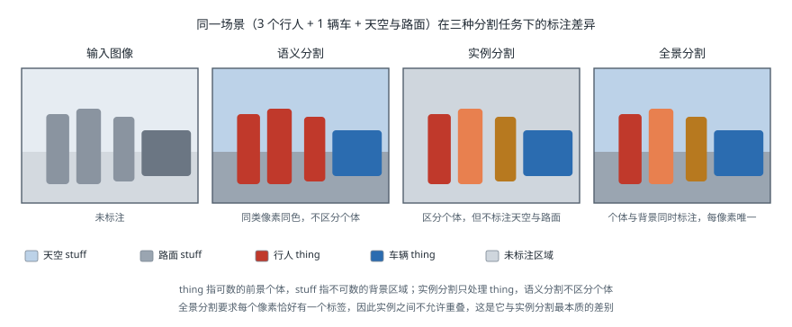

# 图像分割

!!! note "引言"
    图像分割 (Image Segmentation) 是计算机视觉中将图像划分为若干有意义区域的核心任务，其目标是为图像中的每个像素赋予语义标签或实例编号。与目标检测输出矩形边界框不同，分割提供了像素级别的精细理解，使机器人能够准确感知可通行区域、识别操作对象的精确轮廓，并构建精细的环境语义地图，是自动驾驶、机器人抓取与场景理解等应用的关键技术基础。


## 分割任务类型

图像分割按照输出粒度和目标的不同，通常分为三种主要类型：语义分割、实例分割和全景分割。三者的差别用同一个场景对比最为直观：



### 语义分割 (Semantic Segmentation)

语义分割为图像中的每个像素赋予一个预定义类别的标签（如"道路"、"行人"、"车辆"），但不区分同一类别下的不同个体。例如，图像中两个行人会被标注为同一种颜色，无法区分是"行人1"还是"行人2"。

**机器人应用场景**：

- **自主导航**：识别可通行区域（地面、走廊）与障碍物，为路径规划提供语义约束
- **场景理解**：构建语义地图，使机器人理解"厨房"、"桌面"等高层语义
- **农业机器人**：区分作物与杂草，指导精准喷洒和采摘

### 实例分割 (Instance Segmentation)

实例分割不仅对像素进行类别分类，还区分同一类别中的不同实例，为每个独立个体生成单独的掩码 (Mask)。例如，图像中的三个苹果会被分别标注为"苹果1"、"苹果2"、"苹果3"，各自有独立的像素级轮廓。

**机器人应用场景**：

- **抓取规划**：精确获得目标物体的像素轮廓，计算抓取点和姿态
- **仓储物流**：识别并分拣杂乱堆叠的货物，支持单件拣选
- **手术机器人**：精确定位并分割不同器官或病灶区域

### 全景分割 (Panoptic Segmentation)

全景分割 (Panoptic Segmentation) 由 Kirillov 等人于 2019 年提出，统一了语义分割和实例分割，对图像中每个像素同时给出类别标签和实例编号。它将像素分为两类：

- **可数物体 (Things)**：有明确边界的个体，如人、车辆、机器人（同时输出实例 ID）
- **不可数背景 (Stuff)**：无明确边界的区域性语义，如天空、地面、草地（仅输出类别标签）

**机器人应用场景**：

- **高精度地图构建**：融合背景语义（道路/建筑）和前景实例（行人/车辆），生成完整的场景描述
- **社会感知机器人**：同时理解环境背景与人员分布，支持人机共存场景下的导航

### 三类任务对比

| 任务类型 | 输出 | 区分实例 | 背景处理 | 典型算法 |
|---------|------|---------|---------|---------|
| 语义分割 | 类别掩码 | 否 | 有标签 | FCN、DeepLab、SegFormer |
| 实例分割 | 实例掩码 + 类别 | 是 | 忽略 | Mask R-CNN、SOLOv2 |
| 全景分割 | 实例掩码 + 语义掩码 | 是 | 有标签 | Panoptic-DeepLab、Mask2Former |


## 经典语义分割算法

### FCN（全卷积网络）

全卷积网络 (Fully Convolutional Network, FCN) 由 Long 等人于 2015 年提出，是深度学习语义分割的奠基之作。其核心思想是将传统分类网络（如 VGG、AlexNet）中的全连接层替换为卷积层，使网络能够接受任意尺寸的输入并输出对应尺寸的密集预测。

**跳跃连接 (Skip Connection) 原理**：

深层特征具有高语义性但空间分辨率低，浅层特征空间分辨率高但语义性弱。FCN 通过跳跃连接将不同尺度的特征图融合：

- **FCN-32s**：仅使用最后一层特征，上采样 32 倍，边界粗糙
- **FCN-16s**：将第 4 池化层特征与上采样结果相加，再上采样 16 倍
- **FCN-8s**：进一步融合第 3 池化层特征，上采样 8 倍，边界更精细

跳跃连接的融合操作为逐元素相加（需要通过 \(1 \times 1\) 卷积对齐通道数）：

$$
F_{\text{fuse}} = \text{Upsample}(F_{\text{deep}}) + \text{Conv}_{1\times1}(F_{\text{shallow}})
$$

FCN 存在的主要局限：上采样方式简单（双线性插值），对细节边界的恢复能力有限，后续 U-Net 和 DeepLab 等工作在此基础上进行了改进。

### U-Net（编码器-解码器架构）

U-Net 于 2015 年由 Ronneberger 等人提出，最初面向医学图像分割，因其精准的边界恢复能力被广泛应用于工业检测、遥感和机器人视觉。

**架构设计**：

U-Net 采用对称的编码器-解码器 (Encoder-Decoder) 结构，形如字母"U"：

- **编码器（收缩路径）**：由多个卷积块和最大池化层组成，逐步降低空间分辨率，提取深层语义特征。每个卷积块包含两个 \(3 \times 3\) 卷积层，并跟随 ReLU 激活。
- **解码器（扩张路径）**：通过转置卷积 (Transposed Convolution) 或双线性插值逐步恢复空间分辨率。
- **跳跃连接**：将编码器各尺度的特征图通过通道拼接 (Concatenation) 的方式传入解码器对应层，与 FCN 的相加融合不同，拼接保留了更多细节信息。

设编码器第 \(l\) 层特征图为 \(E_l \in \mathbb{R}^{H_l \times W_l \times C_l}\)，解码器对应层上采样特征为 \(D_l\)，则跳跃连接后的融合特征为：

$$
F_l = \text{Concat}(D_l, E_l) \in \mathbb{R}^{H_l \times W_l \times 2C_l}
$$

**损失函数**：

U-Net 原文使用带权重的交叉熵损失 (Weighted Cross-Entropy Loss)，对类别边界区域赋予更高权重，以解决前背景类别不平衡问题：

$$
L = -\sum_{x \in \Omega} w(x) \log \hat{p}_{l(x)}(x)
$$

其中 \(w(x)\) 为像素 \(x\) 的权重，\(\hat{p}_{l(x)}(x)\) 为对应类别的预测概率，\(\Omega\) 为图像像素集合。

### DeepLab v3+

DeepLab 系列由 Google 团队持续发展，v3+ 版本（Chen 等，2018）结合了空洞卷积和编解码结构，在语义分割上取得了当时的最优性能。

#### 空洞卷积 (Atrous Convolution)

标准卷积为了扩大感受野需要增加网络深度或使用池化，但会降低特征图分辨率。空洞卷积（又称扩张卷积，Dilated Convolution）通过在卷积核元素之间插入空隙（膨胀率 \(r\)），在不增加参数量和不降低分辨率的前提下扩大感受野：

$$
y[i] = \sum_k x[i + r \cdot k] \cdot w[k]
$$

其中 \(x\) 为输入特征图，\(w\) 为卷积核，\(r\) 为膨胀率 (Dilation Rate)，\(i\) 为输出位置，\(k\) 为卷积核索引。当 \(r=1\) 时退化为标准卷积；当 \(r=2\) 时，每个卷积核元素之间插入 1 个空格，感受野翻倍。

#### ASPP 模块

空洞空间金字塔池化 (Atrous Spatial Pyramid Pooling, ASPP) 模块使用多个不同膨胀率的空洞卷积并行处理同一特征图，捕获多尺度上下文信息：

$$
F_{\text{ASPP}} = \text{Concat}\bigl(\text{Conv}_{1\times1}(X),\ \text{AtrousConv}_{r=6}(X),\ \text{AtrousConv}_{r=12}(X),\ \text{AtrousConv}_{r=18}(X),\ \text{GAP}(X)\bigr)
$$

其中 GAP 为全局平均池化 (Global Average Pooling)，用于融合全局上下文。

**DeepLab v3+ 整体架构**：

以 Xception 或 ResNet 为骨干网络 (Backbone)，ASPP 模块提取多尺度特征，结合轻量级解码器（借鉴 U-Net 的跳跃连接）对边界细节进行精细化，最终通过双线性插值恢复到原始分辨率。

### Transformer 架构方案

#### SegFormer

SegFormer（Xie 等，2021）采用层级式视觉 Transformer (Hierarchical Vision Transformer) 作为编码器，无需位置编码，输出多尺度特征图；解码器设计极为轻量——仅使用多层感知机 (Multi-Layer Perceptron, MLP) 融合多尺度特征，大幅降低计算量。SegFormer-B5 在 Cityscapes 数据集上达到 84.0% mIoU，同时具有良好的实时推理性能。

#### Mask2Former

Mask2Former（Cheng 等，2021）提出统一的掩码分类 (Masked Attention) 框架，通过可学习查询 (Learnable Query) 和遮蔽注意力机制，在同一框架下完成语义分割、实例分割和全景分割三类任务，无需针对不同任务设计不同架构，代表了分割领域"大一统"方向的重要进展。


## 轻量级实时分割

机器人嵌入式平台（如 NVIDIA Jetson Nano/Xavier、Raspberry Pi）对分割模型的推理速度有严格要求。以下介绍适合边缘部署的轻量级实时分割算法。

### BiSeNetV2

双边分割网络 v2 (Bilateral Segmentation Network v2, BiSeNetV2)（Yu 等，2021）设计了双路并行架构：

- **细节分支 (Detail Branch)**：浅层、大特征图，保留空间细节和边界信息，使用大步长卷积堆叠
- **语义分支 (Semantic Branch)**：深层、小特征图，捕获全局语义上下文，计算高效
- **双边融合层 (Bilateral Guided Aggregation Layer)**：融合两路特征，平衡精度与速度

BiSeNetV2 在 Cityscapes 上以 156 FPS 的速度（GTX 1080Ti）达到 72.6% mIoU，适合实时机器人导航场景。

### PP-LiteSeg

PP-LiteSeg（Peng 等，2022）由百度 PaddlePaddle 团队提出，面向嵌入式端侧部署：

- **灵活轻量级解码器 (Flexible and Lightweight Decoder, FLD)**：随编码器特征图尺度自适应调整通道数，减少冗余计算
- **统一注意力融合模块 (Unified Attention Fusion Module, UAFM)**：利用通道注意力和空间注意力融合多尺度特征
- **简单金字塔池化模块 (Simple Pyramid Pooling Module, SPPM)**：轻量化的多尺度上下文聚合

### 轻量级模型对比

| 模型 | 速度 (FPS) | mIoU (Cityscapes) | 参数量 | 适用平台 | 特点 |
|------|-----------|------------------|--------|---------|------|
| BiSeNetV1 | 105 | 68.4% | 13M | GPU | 双路架构先驱 |
| BiSeNetV2 | 156 | 72.6% | 3.4M | GPU/Jetson | 无需预训练骨干 |
| PP-LiteSeg-T | 273 | 73.0% | 3.6M | Jetson/CPU | PaddlePaddle 优化 |
| PP-LiteSeg-B | 195 | 75.0% | 10.2M | Jetson Xavier | 精度速度均衡 |
| DDRNet-23-slim | 170 | 77.8% | 5.7M | GPU/Jetson | 双分辨率融合 |
| MobileNetV3-Seg | 67 | 72.6% | 5.0M | 手机/MCU | ARM 友好 |

> 速度测试均在 GTX 1080Ti 或等效平台，输入分辨率 1024×512。实际部署时需在目标硬件上重新测试。


## 实例分割算法

### Mask R-CNN

Mask R-CNN（He 等，2017）在 Faster R-CNN 两阶段检测框架基础上增加了并行的掩码预测分支，是实例分割的里程碑工作。

**RoI Align**：

Faster R-CNN 中的 RoI Pooling 存在量化误差（坐标取整），导致特征与实际区域对不准，对掩码精度影响显著。RoI Align 通过双线性插值在连续坐标上采样特征，消除量化误差：

对于 RoI 内的采样点 \((x, y)\)，双线性插值公式为：

$$
f(x, y) = \sum_{i,j} f(x_i, y_j) \cdot \max(0, 1 - |x - x_i|) \cdot \max(0, 1 - |y - y_j|)
$$

其中 \((x_i, y_j)\) 为邻近的整数坐标网格点，\(f(x_i, y_j)\) 为对应特征值。

**掩码分支 (Mask Branch)**：

在检测头（分类 + 边界框回归）之外，Mask R-CNN 为每个候选区域 (Region of Interest, RoI) 独立预测一个 \(28 \times 28\) 的二值掩码，每个类别对应一个掩码（共 \(K\) 个类别），训练时仅对真实类别的掩码计算二元交叉熵损失：

$$
L_{\text{mask}} = -\frac{1}{28^2} \sum_{i,j} \bigl[ y_{ij} \log \hat{m}_{ij} + (1 - y_{ij}) \log(1 - \hat{m}_{ij}) \bigr]
$$

**总损失**为分类损失、边界框回归损失和掩码损失之和：

$$
L = L_{\text{cls}} + L_{\text{box}} + L_{\text{mask}}
$$

**机器人应用**：Mask R-CNN 精度高，适合机器人抓取场景中的物体轮廓提取，可与深度相机结合生成精确的 3D 点云掩码。

### SOLOv2

SOLOv2（Wang 等，2020）摒弃了两阶段检测框架，以纯卷积的方式实现实例分割，推理速度更快。

**网格预测策略**：

将图像划分为 \(S \times S\) 个网格，每个网格单元 \((i, j)\) 负责预测中心落在该格内的实例掩码：

- **类别分支**：预测每个网格的实例类别，输出形状为 \(S \times S \times C\)
- **掩码分支**：为每个网格预测对应实例的全图掩码，输出形状为 \(H \times W \times S^2\)

**Matrix NMS（矩阵化非极大值抑制）**：

传统非极大值抑制 (Non-Maximum Suppression, NMS) 需要逐对比较掩码的交并比 (IoU)，计算复杂度为 \(\mathcal{O}(n^2)\)。Matrix NMS 将掩码 IoU 的估算矩阵化，利用边界框 IoU 近似排序，并行抑制低置信度实例，速度提升显著，实现近似线性复杂度。

SOLOv2 在 COCO 上以约 31 FPS 达到与 Mask R-CNN 相当的精度，更适合对速度有要求的机器人系统。


## 全景分割算法

### Panoptic-DeepLab

Panoptic-DeepLab（Cheng 等，2020）采用自底向上 (Bottom-up) 的全景分割方案，无需目标检测流程，端到端训练效率高。

**中心点热图 + 偏移量聚类**：

模型同时预测三个输出：

1. **语义分割图**：为每个像素预测类别标签（处理 Stuff 和 Things）
2. **实例中心热图 (Instance Center Heatmap)**：预测每个实例中心的高斯热图 \(H \in [0, 1]^{H \times W}\)，实例中心处响应值最高
3. **中心偏移量图 (Center Offset Map)**：预测每个像素指向其所属实例中心的偏移向量 \(\Delta \in \mathbb{R}^{H \times W \times 2}\)

聚类时，像素 \(p\) 被分配到距离其预测中心位置 \(p + \Delta_p\) 最近的检测到的实例中心：

$$
\text{instance}(p) = \arg\min_{c \in \mathcal{C}} \| (p + \Delta_p) - c \|_2
$$

其中 \(\mathcal{C}\) 为热图中检测到的实例中心集合。最终将实例分割结果与语义分割结果融合，得到全景分割输出。

### Mask2Former 统一框架

Mask2Former（Cheng 等，2021）基于可变形 Transformer (Deformable Transformer) 和掩码注意力 (Masked Attention) 机制，提出了统一的分割框架：

- **像素解码器 (Pixel Decoder)**：从骨干网络提取多尺度特征，类似 FPN (Feature Pyramid Network)
- **Transformer 解码器**：通过 \(N\) 个可学习查询 (Learnable Query) 与多尺度特征交互，每个查询对应一个潜在的分割目标
- **掩码注意力**：每次注意力计算仅关注当前查询对应的前景区域，加速收敛并提升精度

最终每个查询预测一个掩码和对应类别，通过匈牙利匹配 (Hungarian Matching) 与真值对齐：

$$
\hat{\sigma} = \arg\min_{\sigma \in \mathfrak{S}_N} \sum_{i=1}^{N} \mathcal{L}_{\text{match}}\bigl(\mathbf{y}_i,\ \hat{\mathbf{y}}_{\sigma(i)}\bigr)
$$

Mask2Former 在语义分割 (ADE20K: 57.8% mIoU)、实例分割 (COCO: 50.1% AP) 和全景分割 (COCO: 57.8% PQ) 上均达到最优性能，是当前多任务统一分割的代表工作。


## 评测指标

### 像素精度 (Pixel Accuracy, PA)

像素精度是最直观的分割指标，计算预测正确的像素占总像素的比例：

$$
\text{PA} = \frac{\sum_{c=1}^{C} n_{cc}}{\sum_{c=1}^{C} \sum_{j=1}^{C} n_{cj}}
$$

其中 \(n_{cc}\) 为类别 \(c\) 被正确预测的像素数，\(n_{cj}\) 为类别 \(c\) 被预测为类别 \(j\) 的像素数，\(C\) 为总类别数。PA 对类别不平衡敏感（背景像素多则易虚高），通常与 mIoU 联合使用。

### 均值交并比 (mean Intersection over Union, mIoU)

交并比 (Intersection over Union, IoU) 衡量预测掩码 \(P_c\) 与真实掩码 \(G_c\) 的重叠程度：

$$
\text{IoU}_c = \frac{|P_c \cap G_c|}{|P_c \cup G_c|}
$$

均值交并比对所有类别的 IoU 取平均：

$$
\text{mIoU} = \frac{1}{C} \sum_{c=1}^{C} \frac{n_{cc}}{n_{cc} + \sum_{j \neq c} n_{cj} + \sum_{j \neq c} n_{jc}}
$$

mIoU 是语义分割领域最常用的评测指标，对各类别均等对待，不受背景像素数量影响。

### 边界 F1 值 (Boundary F1, BF)

边界 F1 值专门评估分割边界的质量，对于需要精确轮廓的机器人抓取任务尤为重要：

$$
\text{BF} = \frac{2 \cdot \text{Precision}_B \cdot \text{Recall}_B}{\text{Precision}_B + \text{Recall}_B}
$$

其中精确率 \(\text{Precision}_B\) 和召回率 \(\text{Recall}_B\) 基于预测边界与真实边界在阈值距离 \(\tau\)（通常为图像对角线的 0.75%）内的匹配情况计算。

### 平均精度 (Average Precision, AP)

实例分割通常使用 COCO 评测协议下的平均精度，在不同 IoU 阈值（0.50 至 0.95，步长 0.05）下计算精确率并取平均：

$$
\text{AP} = \frac{1}{10} \sum_{\text{IoU} \in \{0.50, 0.55, \ldots, 0.95\}} \text{AP}_{\text{IoU}}
$$

此外常用 \(\text{AP}_{50}\)（IoU=0.5）和 \(\text{AP}_{75}\)（IoU=0.75）作为参考指标。

### 全景质量 (Panoptic Quality, PQ)

全景质量 (Panoptic Quality, PQ) 是全景分割的标准评测指标，将识别质量和分割质量解耦：

$$
\text{PQ} = \underbrace{\frac{\sum_{(p, g) \in \text{TP}} \text{IoU}(p, g)}{|\text{TP}|}}_{\text{分割质量 (SQ)}} \times \underbrace{\frac{|\text{TP}|}{|\text{TP}| + \frac{1}{2}|\text{FP}| + \frac{1}{2}|\text{FN}|}}_{\text{识别质量 (RQ)}}
$$

其中 TP、FP、FN 分别为真正例、假正例和假负例（以 IoU > 0.5 为匹配标准）。PQ = SQ × RQ，最终对所有类别取平均。


## 常用数据集

| 数据集 | 任务类型 | 类别数 | 图像数 | 特点 |
|-------|---------|--------|--------|------|
| Cityscapes | 语义/实例/全景 | 19 (语义) / 8 (实例) | 5,000（精标）+ 20,000（粗标） | 城市道路场景，高分辨率（2048×1024），自动驾驶基准 |
| ADE20K | 语义/实例/全景 | 150 | 25,574 | 室内外场景，类别丰富，MIT 发布，场景解析基准 |
| COCO | 实例/全景 | 80 (实例) / 133 (全景) | 123,287 | 通用物体，密集标注，实例分割和全景分割主流基准 |
| Pascal VOC 2012 | 语义/实例 | 20 | 11,530 | 经典基准，标注质量高，适合小规模实验 |
| SUN RGB-D | 语义 | 37 | 10,335 | 室内 RGB-D 场景，深度信息辅助，机器人室内感知基准 |
| Mapillary Vistas | 语义/实例/全景 | 124 | 25,000 | 多样化街景，地理分布广，自动驾驶补充基准 |

**数据集选择建议**：

- **机器人导航（室外）**：优先使用 Cityscapes，并用 Mapillary Vistas 增强泛化性
- **机器人导航（室内）**：使用 ADE20K 或 SUN RGB-D
- **机器人抓取**：使用 COCO 实例分割数据集，并在目标域数据上微调


## 与 ROS 集成

在 ROS (Robot Operating System) 系统中，图像分割模型的输出需要转换为标准消息格式，方便与导航、规划等模块协同工作。

### 常用 ROS 包

- **`cv_bridge`**：ROS 图像消息（`sensor_msgs/Image`）与 OpenCV/NumPy 数组之间的相互转换
- **`image_transport`**：高效的图像话题传输，支持压缩传输
- **`sensor_msgs`**：提供 `Image`、`CameraInfo` 等标准消息类型
- **`vision_msgs`**：提供 `Detection2DArray`、`SegmentationMask` 等视觉任务专用消息类型（ROS 2）

### 分割结果发布示例

以下示例展示如何在 ROS 节点中运行语义分割模型，并将掩码结果发布为 ROS 图像消息：

```python
#!/usr/bin/env python3
"""
语义分割 ROS 节点示例
将分割掩码发布为伪彩色图像，同时发布原始标签图（用于下游模块）
"""

import rospy
import numpy as np
import cv2
from sensor_msgs.msg import Image
from cv_bridge import CvBridge, CvBridgeError

# 假设已通过 ONNX Runtime 或 PyTorch 加载分割模型
# import onnxruntime as ort

# Cityscapes 类别颜色映射（19 类）
CITYSCAPES_COLORS = np.array([
    [128,  64, 128],  # 道路 (road)
    [244,  35, 232],  # 人行道 (sidewalk)
    [ 70,  70,  70],  # 建筑 (building)
    [102, 102, 156],  # 墙 (wall)
    [190, 153, 153],  # 围栏 (fence)
    [153, 153, 153],  # 电线杆 (pole)
    [250, 170,  30],  # 红绿灯 (traffic light)
    [220, 220,   0],  # 交通标志 (traffic sign)
    [107, 142,  35],  # 植被 (vegetation)
    [152, 251, 152],  # 地形 (terrain)
    [ 70, 130, 180],  # 天空 (sky)
    [220,  20,  60],  # 行人 (person)
    [255,   0,   0],  # 骑手 (rider)
    [  0,   0, 142],  # 汽车 (car)
    [  0,   0,  70],  # 卡车 (truck)
    [  0,  60, 100],  # 公交车 (bus)
    [  0,  80, 100],  # 列车 (train)
    [  0,   0, 230],  # 摩托车 (motorcycle)
    [119,  11,  32],  # 自行车 (bicycle)
], dtype=np.uint8)


class SegmentationNode:
    def __init__(self):
        rospy.init_node('segmentation_node', anonymous=True)

        self.bridge = CvBridge()

        # 订阅原始图像
        self.image_sub = rospy.Subscriber(
            '/camera/rgb/image_raw',
            Image,
            self.image_callback,
            queue_size=1,
            buff_size=2**24
        )

        # 发布伪彩色分割可视化图
        self.seg_vis_pub = rospy.Publisher(
            '/segmentation/color_mask',
            Image,
            queue_size=1
        )

        # 发布原始标签图（uint8 单通道，值为类别 ID）
        self.seg_label_pub = rospy.Publisher(
            '/segmentation/label_map',
            Image,
            queue_size=1
        )

        # 加载模型（示例：ONNX Runtime）
        # self.session = ort.InferenceSession('deeplabv3plus.onnx',
        #     providers=['CUDAExecutionProvider', 'CPUExecutionProvider'])

        rospy.loginfo("分割节点已启动，等待图像输入...")

    def preprocess(self, cv_image):
        """图像预处理：缩放、归一化"""
        img = cv2.resize(cv_image, (1024, 512))
        img = img.astype(np.float32) / 255.0
        mean = np.array([0.485, 0.456, 0.406])
        std  = np.array([0.229, 0.224, 0.225])
        img = (img - mean) / std
        # ONNX 模型输入格式：NCHW
        img = img.transpose(2, 0, 1)[np.newaxis, ...]
        return img

    def run_inference(self, input_tensor):
        """
        调用分割模型推理（此处用随机掩码模拟，实际替换为模型输出）
        返回形状为 (H, W) 的类别标签图
        """
        H, W = input_tensor.shape[2], input_tensor.shape[3]
        # 实际推理示例：
        # outputs = self.session.run(None, {'input': input_tensor})
        # label_map = outputs[0].argmax(axis=1)[0].astype(np.uint8)
        label_map = np.random.randint(0, 19, (H, W), dtype=np.uint8)  # 仅用于示例
        return label_map

    def colorize_mask(self, label_map):
        """将类别标签图转换为伪彩色 BGR 图像"""
        color_mask = CITYSCAPES_COLORS[label_map]          # (H, W, 3) RGB
        color_mask_bgr = cv2.cvtColor(color_mask, cv2.COLOR_RGB2BGR)
        return color_mask_bgr

    def image_callback(self, msg):
        try:
            # 将 ROS 图像消息转换为 OpenCV BGR 格式
            cv_image = self.bridge.imgmsg_to_cv2(msg, desired_encoding='bgr8')
        except CvBridgeError as e:
            rospy.logerr(f"cv_bridge 转换失败: {e}")
            return

        # 推理
        input_tensor = self.preprocess(cv_image)
        label_map = self.run_inference(input_tensor)

        # 将标签图缩放回原始分辨率
        orig_h, orig_w = cv_image.shape[:2]
        label_map_full = cv2.resize(
            label_map, (orig_w, orig_h),
            interpolation=cv2.INTER_NEAREST  # 标签图使用最近邻插值，避免产生无效类别值
        )

        # 发布伪彩色可视化图
        color_mask = self.colorize_mask(label_map_full)
        try:
            vis_msg = self.bridge.cv2_to_imgmsg(color_mask, encoding='bgr8')
            vis_msg.header = msg.header  # 保留时间戳和坐标系
            self.seg_vis_pub.publish(vis_msg)

            # 发布原始标签图（mono8 编码，值为类别 ID）
            label_msg = self.bridge.cv2_to_imgmsg(label_map_full, encoding='mono8')
            label_msg.header = msg.header
            self.seg_label_pub.publish(label_msg)
        except CvBridgeError as e:
            rospy.logerr(f"消息发布失败: {e}")


if __name__ == '__main__':
    try:
        node = SegmentationNode()
        rospy.spin()
    except rospy.ROSInterruptException:
        pass
```

### ROS 2 集成说明

在 ROS 2（Humble/Iron）中，上述代码结构基本一致，主要差异如下：

- 将 `rospy` 替换为 `rclpy`，继承 `Node` 基类
- 话题订阅/发布改为 `self.create_subscription` / `self.create_publisher`
- `cv_bridge` 在 ROS 2 中依然可用，安装包名为 `ros-humble-cv-bridge`
- 推荐使用 `vision_msgs/msg/SemanticSegmentation`（ROS 2 专用消息）替代原始图像消息，便于与导航栈集成

### 与 Nav2 导航栈集成

将语义分割结果集成到 Nav2 (Navigation2) 的代价地图中，可实现语义感知导航：

1. 订阅 `/segmentation/label_map` 话题
2. 将特定类别（如"可通行地面"）标记为代价值 0，"障碍物"类别标记为代价值 254
3. 通过自定义代价地图层 (Costmap Layer) 插件将语义掩码写入代价地图
4. Nav2 规划器基于语义代价地图规划避开语义障碍物的路径


## 参考资料

1. Long, J., Shelhamer, E., & Darrell, T. (2015). Fully convolutional networks for semantic segmentation. *Proceedings of CVPR*, 3431-3440.
2. Ronneberger, O., Fischer, P., & Brox, T. (2015). U-Net: Convolutional networks for biomedical image segmentation. *Proceedings of MICCAI*, 234-241.
3. Chen, L.-C., Zhu, Y., Papandreou, G., Schroff, F., & Adam, H. (2018). Encoder-decoder with atrous separable convolution for semantic image segmentation (DeepLabv3+). *Proceedings of ECCV*, 801-818.
4. He, K., Gkioxari, G., Dollár, P., & Girshick, R. (2017). Mask R-CNN. *Proceedings of ICCV*, 2961-2969.
5. Wang, X., Zhang, R., Kong, T., Li, L., & Shen, C. (2020). SOLOv2: Dynamic and fast instance segmentation. *Proceedings of NeurIPS*, 33, 17721-17732.
6. Xie, E., Wang, W., Yu, Z., Anandkumar, A., Alvarez, J. M., & Luo, P. (2021). SegFormer: Simple and efficient design for semantic segmentation with transformers. *Proceedings of NeurIPS*, 34, 12077-12090.
7. Cheng, B., Misra, I., Schwing, A. G., Kirillov, A., & Garg, R. (2022). Masked-attention mask transformer for universal image segmentation (Mask2Former). *Proceedings of CVPR*, 1290-1299.
8. Cheng, B., Collins, M. D., Zhu, Y., Liu, T., Huang, T. S., Adam, H., & Chen, L.-C. (2020). Panoptic-DeepLab: A simple, strong, and fast baseline for bottom-up panoptic segmentation. *Proceedings of CVPR*, 12475-12485.
9. Kirillov, A., He, K., Girshick, R., Rother, C., & Dollar, P. (2019). Panoptic segmentation. *Proceedings of CVPR*, 9404-9413.
10. Yu, C., Gao, C., Wang, J., Yu, G., Shen, C., & Sang, N. (2021). BiSeNet V2: Bilateral network with guided aggregation for real-time semantic segmentation. *International Journal of Computer Vision*, 129, 3051-3068.
11. Peng, J., Liu, Y., Tang, S., Hao, Y., Chu, L., Chen, G., ... & Liu, Y. (2022). PP-LiteSeg: A superior real-time semantic segmentation model. *arXiv preprint arXiv:2204.02681*.
12. Cordts, M., Omran, M., Ramos, S., Rehfeld, T., Enzweiler, M., Benenson, R., ... & Schiele, B. (2016). The Cityscapes dataset for semantic urban scene understanding. *Proceedings of CVPR*, 3213-3223.
13. Zhou, B., Zhao, H., Puig, X., Fidler, S., Barriuso, A., & Torralba, A. (2017). Scene parsing through ADE20K dataset. *Proceedings of CVPR*, 633-641.
14. Lin, T.-Y., Maire, M., Belongie, S., Hays, J., Perona, P., Ramanan, D., ... & Zitnick, C. L. (2014). Microsoft COCO: Common objects in context. *Proceedings of ECCV*, 740-755.
