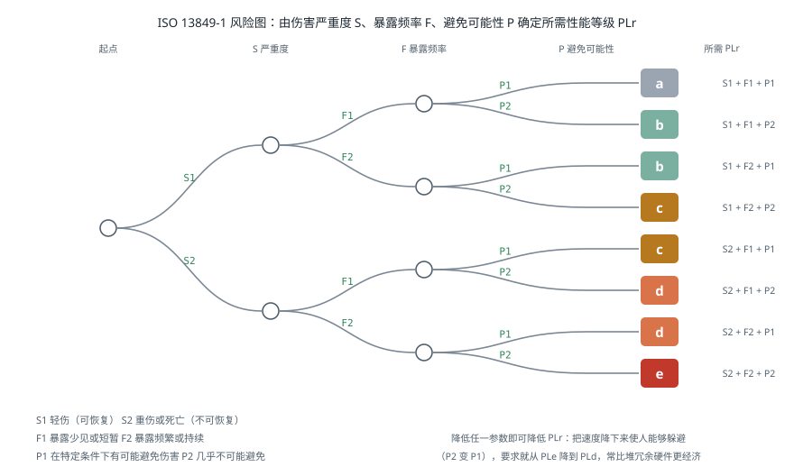
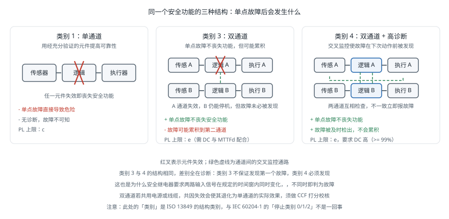

# 功能安全

!!! note "引言"
    功能安全（Functional Safety）关心的不是「系统正常时是否安全」，而是「系统出故障时是否仍然安全」。一个急停按钮在正常情况下当然能停机；功能安全要回答的是：如果它的触点粘连了、线缆被压断了、控制器的这一位翻转了，机器人还会不会停下来。这套方法论用量化的方式回答这个问题，并给出可验证的设计流程。[标准清单](../database/standard.md) 已经列出了相关标准是什么，本页面讨论的是怎么用它们——如何确定所需的性能等级、如何设计能达到该等级的回路、以及如何验证。


## 基本概念

**安全功能**（Safety Function）是为降低某个具体风险而设计的功能，必须逐条定义清楚。「机器人是安全的」不是一个安全功能；「打开安全门后，机械臂在 0.5 秒内停止并断开动力，达到 PLd」才是。

一个完整的安全功能定义包含：触发条件、响应动作、响应时间、以及所需的性能等级。

**性能等级**（Performance Level，PL）与**安全完整性等级**（Safety Integrity Level，SIL）是两套并行的量化体系：

| 体系 | 标准 | 等级 | 衡量对象 |
|------|------|------|---------|
| PL | ISO 13849-1 | a（最低）到 e（最高） | 每小时危险失效概率 PFH |
| SIL | IEC 62061 / IEC 61508 | 1 到 3（工业机械） | 同上 |

两者可以近似对应：PLc ≈ SIL 1，PLd ≈ SIL 2，PLe ≈ SIL 3。机械行业通常用 PL，过程工业与复杂电子系统用 SIL。**工业机器人的安全停止功能通常要求 PLd 或 PLe。**

两者的实质都是同一个量——PFH（Probability of dangerous Failure per Hour，每小时危险失效概率）：

| PL | PFH 区间（1/h） | 大致含义 |
|----|----------------|---------|
| a | 10⁻⁵ ~ 10⁻⁴ | 约每 1–10 年一次危险失效 |
| b | 3×10⁻⁶ ~ 10⁻⁵ | |
| c | 10⁻⁶ ~ 3×10⁻⁶ | |
| d | 10⁻⁷ ~ 10⁻⁶ | 约每 100–1000 年一次 |
| e | 10⁻⁸ ~ 10⁻⁷ | 约每 1000–10000 年一次 |


## 风险评估与 PLr 确定

设计的起点不是选器件，而是**确定每个安全功能需要达到什么等级**（所需性能等级，PLr）。ISO 13849-1 给出一个基于三个参数的风险图：

- **S（Severity，伤害严重度）**：S1 = 轻伤（可恢复）；S2 = 重伤或死亡（不可恢复）
- **F（Frequency，暴露频率与时长）**：F1 = 少见或短暂；F2 = 频繁或持续
- **P（Possibility，避免伤害的可能性）**：P1 = 在特定条件下可能避免；P2 = 几乎不可能避免



以一台协作机械臂为例：末端夹持金属工件、速度 1 m/s、操作员需频繁进入工作区上下料。

- S：可能造成重伤 → **S2**
- F：频繁进入 → **F2**
- P：机械臂运动速度快，人来不及躲避 → **P2**

由风险图得 **PLr = e**。这是最高等级，意味着安全回路必须是双通道带交叉监控的架构（类别 4），且元件质量要求很高。

如果通过降低速度使操作员有机会躲避（P1），要求可降到 PLd——**这说明风险评估不仅是评估，也是设计手段**：改变机器的行为可以直接降低对安全回路的要求，往往比堆冗余硬件更经济。

评估必须**逐个危险源、逐个工作模式**进行。同一台机器在自动运行、示教、维护三种模式下的风险完全不同，示教模式下人在工作区内，通常是风险最高的场景。


## 安全回路架构

达到某个 PL 需要三个要素共同满足：**结构类别**（Category）、**MTTFd**（平均危险失效前时间）、**DC**（诊断覆盖率）。三者缺一不可——用最好的元件搭一个单通道回路，仍然达不到 PLe。

### 五种结构类别

| 类别 | 结构 | 单点故障后 | 典型 PL 上限 |
|------|------|-----------|-------------|
| B | 单通道，基本安全原则 | 丧失安全功能 | b |
| 1 | 单通道，经充分验证的元件 | 丧失安全功能 | c |
| 2 | 单通道 + 周期性测试 | 测试间隔内可能丧失 | d |
| 3 | 双通道 | 单点故障不丧失，但可能累积 | e |
| 4 | 双通道 + 高诊断覆盖 | 单点故障不丧失，故障可被及时发现 | e |

**类别 3 与类别 4 的差别在于故障累积**。类别 3 中，第一个通道失效后系统仍能工作，但这个故障未必被检出；等到第二个通道也失效，安全功能才彻底丧失，而此时没人知道。类别 4 要求诊断覆盖率达到「高」（DC ≥ 99%），使第一个故障在下次动作前就被发现并报警。

这对设计的实际含义是：**类别 4 必须做交叉监控**——两个通道互相检查对方的状态，不一致就报故障。这也是为什么安全继电器和安全 PLC 都是双通道输入、且要求两路信号在规定时间窗内同时变化。



### PL 的计算

给定结构类别，PL 由 MTTFd 与 DC 共同确定。计算流程：

**第一步：算每个通道的 MTTFd。** 通道由多个元件串联，危险失效率相加：

$$\frac{1}{\text{MTTF}_{d,\,ch}} = \sum_i \frac{1}{\text{MTTF}_{d,\,i}}$$

对机电元件，MTTFd 通常由 B10d（10% 样本发生危险失效时的动作次数）换算：

$$\text{MTTF}_d = \frac{B_{10d}}{0.1 \times n_{op}}$$

其中 \(n_{op}\) 是每年的动作次数。**这一步最容易被低估**：一个 B10d = 2×10⁶ 次的接触器，若每分钟动作一次（每年约 50 万次），MTTFd 只有 40 年；若每小时动作一次，则是 2400 年。**同一个元件在不同使用频率下的安全贡献相差两个数量级。**

**第二步：算平均诊断覆盖率。**

$$\text{DC}_{avg} = \frac{\sum_i \text{DC}_i / \text{MTTF}_{d,i}}{\sum_i 1 / \text{MTTF}_{d,i}}$$

DC 分四档：无（< 60%）、低（60–90%）、中（90–99%）、高（≥ 99%）。

**第三步：校核共因失效（CCF）。** 双通道架构的前提是两个通道独立失效。若两个通道用同一颗芯片供电、走同一根线缆、装在同一个受同样振动影响的位置，一个原因就能同时打掉两路。ISO 13849-1 用一张打分表评估 CCF，要求得分 ≥ 65 分才认可双通道的效果。

**第四步：查表得 PL。** 由类别、MTTFd 档位（低/中/高）与 DC 档位查标准中的图表。

```python
def mttfd_from_b10d(b10d, ops_per_year):
    """由 B10d 与年动作次数换算 MTTFd（年）"""
    return b10d / (0.1 * ops_per_year)


def channel_mttfd(components):
    """通道内元件串联：危险失效率相加"""
    return 1.0 / sum(1.0 / m for m in components)


def dc_avg(components_mttfd, components_dc):
    """平均诊断覆盖率，按 1/MTTFd 加权"""
    num = sum(dc / m for m, dc in zip(components_mttfd, components_dc))
    den = sum(1.0 / m for m in components_mttfd)
    return num / den


def mttfd_band(years):
    """ISO 13849-1 的 MTTFd 档位；单通道上限为 100 年"""
    y = min(years, 100.0)          # 标准规定单通道计入上限
    if y < 3:    return '不可接受'
    if y < 10:   return '低'
    if y < 30:   return '中'
    return '高'


def dc_band(dc):
    if dc < 0.60: return '无'
    if dc < 0.90: return '低'
    if dc < 0.99: return '中'
    return '高'


if __name__ == '__main__':
    # 例：安全门开关 + 安全继电器 + 接触器，每小时开门 2 次
    ops = 2 * 8 * 250                        # 每年约 4000 次
    parts = [
        ('安全门开关', mttfd_from_b10d(2e6, ops), 0.99),
        ('安全继电器', 300.0,                     0.99),   # 厂商直接给 MTTFd
        ('接触器',     mttfd_from_b10d(1.3e6, ops), 0.99),
    ]
    ms = [p[1] for p in parts]
    dcs = [p[2] for p in parts]
    for name, m, dc in parts:
        print(f'{name:<12} MTTFd = {m:8.0f} 年   DC = {dc:.0%}')
    ch = channel_mttfd(ms)
    d = dc_avg(ms, dcs)
    print(f'\n通道 MTTFd = {ch:.0f} 年 -> 档位「{mttfd_band(ch)}」')
    print(f'平均 DC = {d:.1%} -> 档位「{dc_band(d)}」')
    print(f'配合类别 3 或 4 的双通道结构，可达到 PLe')

    # 敏感度：把开门频率从每小时 2 次提高到每分钟 1 次
    ops_hi = 60 * 8 * 250
    ms_hi = [mttfd_from_b10d(2e6, ops_hi), 300.0, mttfd_from_b10d(1.3e6, ops_hi)]
    ch_hi = channel_mttfd(ms_hi)
    print(f'\n若开门频率提高到每分钟 1 次（{ops_hi} 次/年）：')
    print(f'  门开关 MTTFd {ms[0]:.0f} -> {ms_hi[0]:.0f} 年，'
          f'接触器 {ms[2]:.0f} -> {ms_hi[2]:.0f} 年')
    print(f'  通道 MTTFd {ch:.0f} -> {ch_hi:.0f} 年，'
          f'档位「{mttfd_band(ch)}」-> 「{mttfd_band(ch_hi)}」')
    print(f'  本例中档位尚未跌落（单通道计入上限为 100 年），'
          f'但裕量已大幅缩水；频率再高一档就会掉到「中」')
```


## 安全功能

驱动器层面的标准安全功能由 IEC 61800-5-2 定义，现代伺服驱动器普遍内置，无需外部接触器即可实现：

| 缩写 | 全称 | 行为 | 典型用途 |
|------|------|------|---------|
| STO | Safe Torque Off | 立即切断力矩，电机自由停车 | 急停、防意外启动 |
| SS1 | Safe Stop 1 | 先受控减速，停稳后触发 STO | 高速旋转设备的急停 |
| SS2 | Safe Stop 2 | 受控减速至零，保持位置且不断力矩 | 需要保持位置的场合 |
| SOS | Safe Operating Stop | 停止后监控位置不被推动 | 安全门打开但需保持姿态 |
| SLS | Safely Limited Speed | 监控速度不超过限值 | 示教模式、协作模式 |
| SLP | Safely Limited Position | 监控位置不越界 | 安全工作空间限制 |
| SDI | Safe Direction | 监控只能朝一个方向运动 | 单向送料 |

**STO 与 SS1 的选择容易出错**。STO 立即断力矩，电机靠惯性自由滑行——对垂直轴的机械臂意味着**直接坠落**。有重力负载的轴必须先用 SS1 受控减速，或配置断电自动抱闸的制动器，并把制动器本身也纳入安全回路。

**SLS 是协作机器人的关键功能**：它使机器人在人靠近时自动降速到安全限值，从而把风险等级从 P2 降到 P1。它的实现要求速度检测本身也达到相应的 PL——通常需要双编码器交叉比对，单个编码器的故障不能导致超速不被发现。


## 器件与实现

| 器件 | 作用 | 选型要点 |
|------|------|---------|
| 急停按钮 | 手动触发安全停止 | 必须是自锁式、直接断开（正动作）触点 |
| 安全继电器 | 双通道逻辑与自检 | 简单场景够用，逻辑固定 |
| 安全 PLC | 可编程安全逻辑 | 复杂逻辑、多安全功能时使用，需认证的开发流程 |
| 安全编码器 | 提供可信的位置速度 | 支持 SLS/SLP 的前提 |
| 安全激光扫描仪 | 区域防护与速度监控 | 移动机器人与 SSM 模式的核心传感器 |
| 安全门开关 | 检测防护门状态 | 需带电磁锁时选带锁型 |
| 光幕 / 安全地毯 | 进入检测 | 注意最小安全距离计算 |

**急停不等于安全停止。** 急停（Emergency Stop）是给人用的最后手段，属于补充保护措施，不能作为主要的风险降低手段——不能因为装了急停按钮就认为风险已经受控。真正的风险降低应来自本质安全设计（降速、限力）与防护装置（围栏、光幕、区域扫描）。

**急停的停止类别**（IEC 60204-1）也常被混淆，注意与前面的 ISO 13849 结构类别不是一回事：

- **停止类别 0**：立即切断动力，对应 STO
- **停止类别 1**：受控减速后切断动力，对应 SS1
- **停止类别 2**：受控停止但保持动力，**不能用作急停**

### 与非安全系统的边界

一个反复出现的设计错误是**让非安全系统参与安全功能**。上位机的 ROS 节点、以太网通信、通用 PLC 都不是安全器件——它们的失效率没有经过认证，不能计入 PL 计算。

正确的架构是把安全逻辑放在独立的安全回路中，非安全系统只能**请求**而不能**否决**：

```
安全回路（安全继电器 / 安全 PLC）
  ├── 急停按钮、安全门、安全扫描仪   -> 直接接入
  ├── 驱动器 STO / SLS 输入          -> 直接控制
  └── 状态输出 -> 上位机（只读，用于显示与日志）

上位机 / ROS（非安全）
  └── 可以请求停止（写入安全回路的软停止输入）
      但不能阻止安全回路触发停止
```

用软件看门狗、心跳包实现的「安全」在正式评估中不予认可。它们有工程价值（能捕捉多数软件故障），但不能替代安全回路。


## 验证与文档

功能安全的合规性由文档与测试共同证明，两者缺一不可：

1. **风险评估报告**：逐个危险源列出 S/F/P 与得到的 PLr
2. **安全功能规格**：每个安全功能的触发条件、响应、响应时间、PLr
3. **PL 计算书**：结构类别、各元件的 MTTFd 与 DC 来源、CCF 打分、最终 PL
4. **验证测试记录**：逐个故障注入并记录系统响应
5. **验证（Validation）报告**：确认所有安全功能达到设计要求

**故障注入测试**是最容易被省略也最有价值的一步。逐条断开安全回路中的每一根线、短接每一对触点，确认系统进入安全状态并给出正确的故障码。实际做这一步时经常会发现：某根线断开后系统毫无反应——那条通道从一开始就没接对，而在正常测试中永远发现不了。

**响应时间必须实测。** 从触发到机器人实际停止的总时间包含：传感器检测延迟、安全回路逻辑延迟、驱动器响应延迟、机械制动时间。设计计算给出的是估计值，实际值必须用示波器或专用测量设备验证，因为它直接决定了 [安全距离](safety-collaborative-robot.md) 的计算。


## 常见问题

- **把急停当作主要防护手段**：急停是补充措施。风险降低应优先来自本质安全设计与防护装置。
- **用通用 PLC 或工控机实现安全逻辑**：未经认证的器件不能计入 PL 计算，无论软件写得多小心。
- **忽略元件的动作频率**：B10d 换算出的 MTTFd 与使用频率强相关，高频动作的元件寿命远低于铭牌印象。
- **双通道共用电源或线缆**：CCF 得分不足，双通道退化为单通道的实际效果。
- **垂直轴用 STO**：切断力矩后手臂坠落。必须用 SS1 或配安全制动器。
- **只在设计时算 PL，不做故障注入**：接线错误、参数配置错误只有实测才能发现。
- **改造后不重新评估**：换了夹爪、提高了速度、改变了工艺流程，风险评估都需要重做。


## 参考资料

1. ISO 13849-1:2023. *Safety of Machinery — Safety-Related Parts of Control Systems — Part 1: General Principles for Design*.
2. ISO 13849-2:2012. *Part 2: Validation*. — 验证方法与故障清单。
3. IEC 61508（全部部分）. *Functional Safety of Electrical/Electronic/Programmable Electronic Safety-Related Systems*.
4. IEC 62061:2021. *Safety of Machinery — Functional Safety of Safety-Related Control Systems*.
5. IEC 61800-5-2:2016. *Adjustable Speed Electrical Power Drive Systems — Part 5-2: Safety Requirements — Functional*. — STO/SS1/SLS 等安全功能的定义。
6. IEC 60204-1:2016. *Safety of Machinery — Electrical Equipment of Machines — Part 1: General Requirements*. — 停止类别 0/1/2。
7. ISO 12100:2010. *Safety of Machinery — General Principles for Design — Risk Assessment and Risk Reduction*. — 风险评估的总纲。
8. [IFA SISTEMA](https://www.dguv.de/ifa/praxishilfen/practical-solutions-machine-safety/software-sistema/) — 德国 IFA 提供的免费 PL 计算工具，附带主流厂商的元件库。
