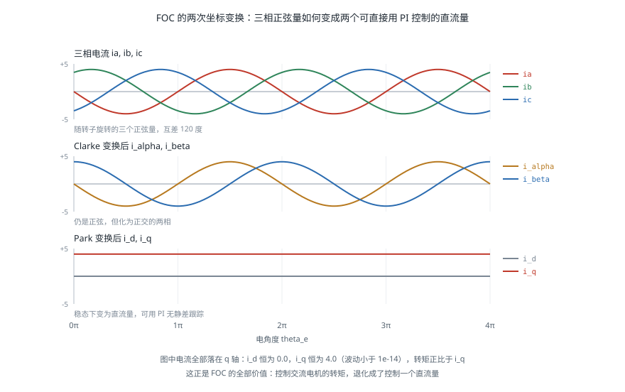
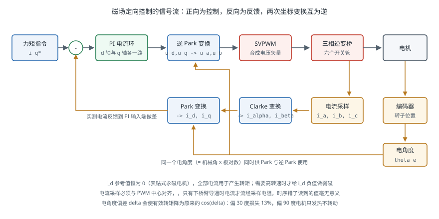

# 电机驱动与控制

!!! note "引言"
    电机驱动器把控制指令变成流过绕组的电流。它决定了关节能多快响应力矩指令、转矩有多平滑、以及能否用电流反推外力。对机器人而言最关键的技术是磁场定向控制（Field-Oriented Control，FOC）——它把三相交流电机在数学上变换成一台直流电机，从而可以像调 PID 一样直接控制转矩。本页面介绍功率级结构、六步换相与 FOC 的原理与差别、三环级联的整定顺序，以及换相对齐、堵转保护等工程细节。执行器本身的选型见 [执行器与传动](actuators.md)。


## 功率级

### H 桥与三相逆变桥

有刷直流电机用 H 桥驱动：四个开关管构成两个半桥，通过导通对角线上的两个管子决定电流方向，用 PWM 占空比调节平均电压。

无刷电机需要三相逆变桥——三个半桥、六个开关管，每一相可以被拉到电源正极或负极。三相电机的控制自由度只有两个（三相电流之和为零），六个开关管的八种组合中，有六种产生有效的电压矢量，另外两种（三相全上或全下）产生零矢量。

**死区时间**（Dead Time）是功率级绕不开的细节：同一半桥的上下管绝不能同时导通（否则电源直接短路，称为直通），因此在切换时必须插入几百纳秒到几微秒的间隔，两管都关断。死区会引入输出电压误差，在低速小电流时表现为明显的转矩畸变，高性能驱动器需要做死区补偿。

### 电流采样

FOC 需要知道实际的相电流，采样方式有三种：

| 方式 | 位置 | 优点 | 缺点 |
|------|------|------|------|
| 三电阻采样 | 每相下桥臂串采样电阻 | 精度高、时序简单 | 成本高、需三路 ADC |
| 双电阻采样 | 两相下桥臂 | 第三相由 \(i_a+i_b+i_c=0\) 推出 | 需要与 PWM 同步采样 |
| 单电阻采样 | 母线 | 成本最低 | 需在特定 PWM 时刻重构相电流，占空比极端时失效 |

采样必须**与 PWM 中心对齐**：只有在下桥臂导通期间，电流才流经采样电阻。这是 FOC 实现中时序最容易出错的地方，采样点偏了会读到毫无意义的值。


## 六步换相

六步换相（Trapezoidal / Six-Step Commutation）是最简单的无刷电机驱动方式：根据转子位置把电流依次通入六种绕组组合，每 60 电角度切换一次。位置信息由三个霍尔传感器提供，正好给出六个扇区。

它的优点是实现极简单、只需霍尔传感器、计算量极小。缺点是**换相瞬间的转矩脉动**：在一个扇区内，转矩随转子角度按余弦变化，导致理论上约 13% 的转矩波动。

$$\frac{\tau_{max} - \tau_{min}}{\tau_{avg}} = \frac{1 - \cos 30°}{\ldots} \approx 13.4\%$$

在风扇、电动工具这类应用中这无关紧要；在机器人关节上，13% 的力矩脉动会在末端表现为可感知的抖动，且脉动频率随转速变化，可能激发机械谐振。这是机器人关节普遍采用 FOC 的直接原因。


## 磁场定向控制

### 核心思想

在直流电机中，转矩正比于电流，控制转矩就是控制电流——简单直接。在三相交流电机中，三相电流是随转子位置变化的正弦量，转矩与电流的关系随时间变化，无法直接控制。

FOC 的做法是**换一个坐标系看问题**：把三相电流变换到一个随转子一起旋转的坐标系（dq 坐标系）中。在这个坐标系里，稳态时的电流变成两个直流量：

- \(i_d\)：**直轴电流**，与转子磁场方向一致，不产生转矩（表贴式永磁电机中通常控制为 0）
- \(i_q\)：**交轴电流**，与转子磁场垂直，转矩正比于它：\(\tau = \frac{3}{2} p \, \psi_f \, i_q\)

于是控制转矩就变成了控制 \(i_q\)，而 \(i_q\) 是一个直流量，可以用普通 PI 控制器无静差地跟踪。**FOC 的全部价值就在于此：它把交流电机变成了数学上的直流电机。**

### 两个变换

**Clarke 变换**把三相静止坐标系变到两相静止坐标系（\(\alpha\beta\)）：

$$\begin{bmatrix} i_\alpha \\ i_\beta \end{bmatrix} = \frac{2}{3}\begin{bmatrix} 1 & -\frac{1}{2} & -\frac{1}{2} \\ 0 & \frac{\sqrt{3}}{2} & -\frac{\sqrt{3}}{2} \end{bmatrix}\begin{bmatrix} i_a \\ i_b \\ i_c \end{bmatrix}$$

它只是去掉了冗余——三相电流之和为零，本来就只有两个自由度。变换后仍是随时间变化的正弦量，只是从三相变成了正交的两相。

**Park 变换**把两相静止坐标系旋转到随转子旋转的 dq 坐标系：

$$\begin{bmatrix} i_d \\ i_q \end{bmatrix} = \begin{bmatrix} \cos\theta_e & \sin\theta_e \\ -\sin\theta_e & \cos\theta_e \end{bmatrix}\begin{bmatrix} i_\alpha \\ i_\beta \end{bmatrix}$$

其中 \(\theta_e\) 是**电角度**，等于机械角度乘以极对数 \(p\)。正是这一步把正弦量变成了直流量——因为坐标系与电流矢量同步旋转，两者的相对关系不再变化。



### 完整控制框图



一个控制周期内的执行顺序：

1. 采样三相电流 \(i_a, i_b, i_c\) 与转子电角度 \(\theta_e\)
2. Clarke 变换得到 \(i_\alpha, i_\beta\)
3. Park 变换得到 \(i_d, i_q\)
4. 两个独立的 PI 控制器分别调节 \(i_d \to 0\) 与 \(i_q \to i_q^*\)，输出 \(u_d, u_q\)
5. 逆 Park 变换得到 \(u_\alpha, u_\beta\)
6. SVPWM 把电压矢量分解成开关序列，输出六路 PWM

**SVPWM**（空间矢量脉宽调制）把期望的电压矢量用相邻的两个基本矢量与零矢量按时间比例合成。相比逐相正弦调制，它能把直流母线电压的利用率从 86.6% 提高到 100%，即同样母线电压下可以获得约 15% 更高的转速。

### 弱磁控制

当转速升高，反电动势接近母线电压时，电流环失去调节余量，转速无法继续提升。此时可以给 \(i_d\) 一个负值，产生与转子磁场相反的磁通，等效削弱气隙磁场，从而降低反电动势、继续升速。

代价是转矩下降（一部分电流不再用于产生转矩）与效率降低。机器人关节通常工作在低速大转矩区间，很少用到弱磁；但轮式底盘的驱动电机常需要。


## 三环级联

工业与机器人驱动器普遍采用位置环、速度环、电流环三级串联结构，从内到外带宽依次降低：

| 环 | 典型带宽 | 周期 | 被控量 |
|----|---------|------|--------|
| 电流环（转矩环） | 1–3 kHz | 50–100 µs | \(i_d, i_q\) |
| 速度环 | 100–300 Hz | 0.5–1 ms | 转速 |
| 位置环 | 10–50 Hz | 1–4 ms | 角度 |

**相邻两环的带宽应相差 3–5 倍**。若外环带宽接近内环，外环会试图指挥内环做它跟不上的事，结果是振荡。这是级联控制的基本原则。

### 整定顺序

必须**从内向外**逐环整定，每次只开一环：

**第一步：电流环。** 电机的电气模型是一阶惯性环节 \(\frac{i}{u} = \frac{1/R}{1 + sL/R}\)。用零极点对消法可以直接算出 PI 参数：

$$K_p = \omega_c L, \qquad K_i = \omega_c R$$

其中 \(\omega_c\) 是期望的电流环带宽（rad/s）。这一步几乎不需要试凑——只要知道相电阻 \(R\) 与相电感 \(L\)，参数就是算出来的。多数驱动器提供的「电机参数自辨识」功能就是在测这两个值。

**第二步：速度环。** 在电流环闭合的前提下，被控对象近似为 \(\frac{\omega}{i_q} = \frac{K_t}{Js}\)，一个积分环节。从小增益起步逐步加大 \(K_p\) 直到出现轻微振荡，再退回 60%–70%；然后加入积分项消除稳态误差。

**速度环最大的困难通常不是控制器，而是速度估计**。低速时对编码器位置做差分会得到极其嘈杂的速度，加滤波又会引入相位滞后使系统不稳定。实用做法是用观测器（如龙伯格观测器或卡尔曼滤波）融合位置与电流估计速度，见 [传感器融合](../sensing/sensor-fusion.md)。

**第三步：位置环。** 通常只用 P 控制加速度前馈，因为速度环内已有积分。加入前馈可以显著降低跟踪滞后：

$$i_q^* = K_p(\theta^* - \theta) + K_{ff}\dot{\theta}^*$$

### 力矩控制模式

机器人关节常常绕过位置环与速度环，直接给驱动器发力矩（即 \(i_q^*\)）指令，由上位机运行 [阻抗控制](../manipulation/force-control.md) 或 [计算力矩控制](../kinematics/dynamics.md)。这要求驱动器提供力矩模式接口，并且通信延迟足够低——这是 EtherCAT 与 CAN FD 在机器人中普及的原因，见 [通信总线](communication-buses.md)。


## 换相对齐

FOC 需要准确的电角度。编码器安装时其零位与转子磁极位置之间存在未知偏移，必须标定，这一步称为换相对齐（Commutation Alignment）或电角度零点标定。

最简单的开环对齐方法：

1. 给定 \(i_d > 0, i_q = 0\)，即令定子磁场指向假定的 d 轴方向
2. 转子会被吸引并对齐到该方向（前提是负载力矩足够小）
3. 此时读取编码器值，即为电角度零点偏移
4. 反向再做一次取平均，以抵消摩擦引起的偏差

```python
import numpy as np


def clarke(ia, ib, ic):
    """三相 -> 两相静止坐标系（等幅值变换）"""
    i_alpha = (2*ia - ib - ic) / 3.0
    i_beta = (ib - ic) / np.sqrt(3.0)
    return i_alpha, i_beta


def park(i_alpha, i_beta, theta_e):
    """两相静止 -> 转子同步旋转坐标系"""
    c, s = np.cos(theta_e), np.sin(theta_e)
    return i_alpha*c + i_beta*s, -i_alpha*s + i_beta*c


def inv_park(u_d, u_q, theta_e):
    c, s = np.cos(theta_e), np.sin(theta_e)
    return u_d*c - u_q*s, u_d*s + u_q*c


class CurrentLoop:
    """dq 轴电流环：按零极点对消整定，参数由电机参数直接算出"""

    def __init__(self, R, L, bandwidth_hz, dt, u_max):
        wc = 2*np.pi*bandwidth_hz
        self.kp = wc * L          # 对消电气极点
        self.ki = wc * R
        self.dt, self.u_max = dt, u_max
        self.int_d = self.int_q = 0.0

    def _pi(self, err, integ):
        u_unsat = self.kp*err + self.ki*integ
        u = np.clip(u_unsat, -self.u_max, self.u_max)
        # 抗积分饱和：饱和时停止积分
        if abs(u_unsat - u) < 1e-9:
            integ += err * self.dt
        return u, integ

    def step(self, id_ref, iq_ref, i_d, i_q):
        u_d, self.int_d = self._pi(id_ref - i_d, self.int_d)
        u_q, self.int_q = self._pi(iq_ref - i_q, self.int_q)
        return u_d, u_q


if __name__ == '__main__':
    R, L, p = 0.35, 2.4e-4, 7
    loop = CurrentLoop(R, L, bandwidth_hz=1500, dt=5e-5, u_max=24.0)
    print(f'电流环参数: Kp = {loop.kp:.4f}, Ki = {loop.ki:.2f}')

    # 验证：让相电流超前电角度 90 度，则全部电流应落在 q 轴上
    # 即 i_d = 0、i_q = 幅值 —— 这正是 id = 0 控制所要达到的状态
    amp = 4.0
    for th in np.linspace(0, 2*np.pi, 7)[:4]:
        te = p * th                                  # 电角度 = 机械角度 x 极对数
        ia, ib, ic = (amp*np.cos(te + np.pi/2),
                      amp*np.cos(te + np.pi/2 - 2*np.pi/3),
                      amp*np.cos(te + np.pi/2 + 2*np.pi/3))
        i_d, i_q = park(*clarke(ia, ib, ic), te)
        print(f'  电角度 {np.rad2deg(te) % 360:6.1f}°  ->  '
              f'i_d = {i_d:+.4f}, i_q = {i_q:+.4f}')
        assert abs(i_d) < 1e-9 and abs(i_q - amp) < 1e-9

    # 转矩正比于 i_q，与转子位置无关 —— 这是 FOC 相对六步换相的核心优势
    print(f'转子转到任何位置，i_q 都恒为 {amp}，因此转矩恒定无脉动')
```

对齐偏差的影响很直接：偏差角 \(\Delta\theta\) 会使实际转矩降为 \(\tau \cos\Delta\theta\)，同时产生 \(\tau \sin\Delta\theta\) 的直轴分量（发热但不做功）。偏差 30° 就会损失 13% 的转矩；偏差 90° 则电机完全不转，只发热。


## 保护与故障处理

| 保护 | 触发条件 | 实现 |
|------|---------|------|
| 过流 | 相电流超过阈值 | 硬件比较器直接封锁 PWM（微秒级），软件限流作为第二道 |
| 堵转 | 电流大而转速近零并持续 | 需要计时判断，不能只看瞬时值——加速瞬间也是大电流低转速 |
| 过温 | NTC 或电机内置温度传感器 | 降额而非直接停机，给上位机反应时间 |
| 母线过压 | 制动能量回灌抬高母线 | 泄放电阻或能量回馈 |
| 编码器故障 | 信号丢失、CRC 错误 | 立即进入安全状态，绝不能带着错误位置继续换相 |

**制动能量回灌**在机器人中很常见：机械臂下落、底盘减速时，电机进入发电状态，能量回灌到母线导致电压抬升。若母线电容不足又没有泄放回路，过压会损坏驱动器。用电池供电时电池可以吸收，用电源供电时通常需要加泄放电阻。

**过温应当降额而非急停**：直接切断动力会让机械臂失去支撑而坠落。正确做法是逐步限制最大电流，同时向上位机报警，由上位机决定何时安全停机。


## 常见问题

- **电机发出啸叫**：PWM 频率落在可听范围。提高到 16 kHz 以上，或改用随机频率调制。
- **低速抖动**：编码器分辨率不足导致速度估计噪声，或死区补偿不足。
- **发热严重但转矩不足**：换相对齐偏差，导致大部分电流成为无用的直轴分量。重新标定电角度零点。
- **一加大速度环增益就振荡**：通常是负载惯量与电机惯量失配，或速度滤波引入了过多相位滞后，见 [执行器与传动](actuators.md) 中的惯量匹配。
- **电流波形畸变、读数跳变**：电流采样时刻与 PWM 不同步，或占空比接近极限导致采样窗口不足。
- **高速时转矩骤降**：反电动势接近母线电压，已进入需要弱磁的区间。
- **上电瞬间电机猛地一跳**：换相对齐流程在上电时执行，属正常现象；若不可接受需改用绝对编码器并存储标定值。


## 参考资料

1. Krause, P. C., Wasynczuk, O., Sudhoff, S. D. & Pekarek, S. (2013). *Analysis of Electric Machinery and Drive Systems* (3rd ed.). Wiley. — 电机建模与坐标变换的权威教材。
2. Blaschke, F. (1972). The Principle of Field Orientation as Applied to the New Transvektor Closed-Loop Control System for Rotating-Field Machines. *Siemens Review*, 34, 217-220. — FOC 的原始论文。
3. Bose, B. K. (2002). *Modern Power Electronics and AC Drives*. Prentice Hall.
4. Holmes, D. G. & Lipo, T. A. (2003). *Pulse Width Modulation for Power Converters: Principles and Practice*. Wiley-IEEE Press. — SVPWM 的完整论述。
5. [SimpleFOC 项目文档](https://docs.simplefoc.com/) — 面向爱好者的开源 FOC 实现，代码可读性好，适合入门。
6. [ODrive 文档](https://docs.odriverobotics.com/) — 开源高性能伺服驱动器，广泛用于机器人研究。
7. [VESC 项目](https://vesc-project.com/) — 开源电机驱动器，滑板与轮式机器人常用。
