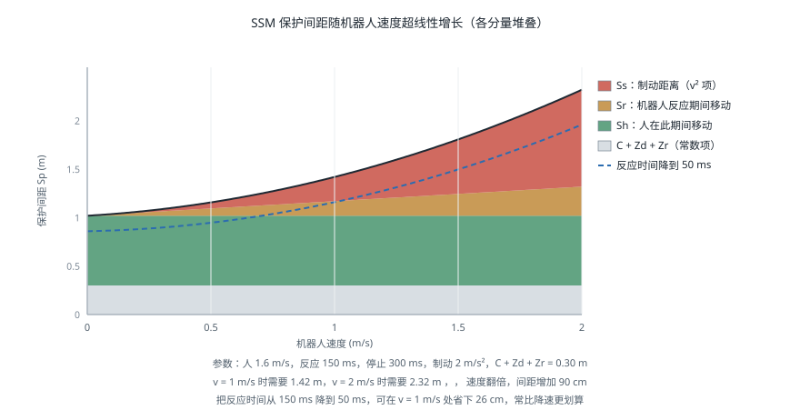

# 协作机器人安全

!!! note "引言"
    协作机器人的卖点是「可以不装围栏、和人一起工作」，但这句话在合规意义上并不成立——**没有本质安全的机器人，只有本质安全的应用**。同一台协作机器人，装上钝头夹爪慢速搬运海绵是安全的，装上刀具高速运动就必须围起来。ISO/TS 15066 给出的正是判断某个具体应用是否安全的方法：四种协作模式各自的要求、可承受的力与压强限值、以及速度与间距的定量计算。本页面介绍这套方法的工程实施，功能安全的通用框架见 [功能安全](functional-safety.md)。


## 四种协作模式

ISO 10218 与 ISO/TS 15066 定义了四种人机协作方式，可以单独使用也可以在同一应用的不同阶段切换：

| 模式 | 缩写 | 机制 | 人进入时机器人 | 典型场景 |
|------|------|------|--------------|---------|
| 安全额定监控停止 | SMS | 人进入时机器人停止并保持位置 | 停止（力矩保持） | 人工上下料 |
| 手动引导 | HG | 人握持引导装置直接拖动机器人 | 由人主动操纵 | 示教、辅助搬运 |
| 速度与间距监控 | SSM | 实时监控人机距离，动态调速 | 减速或停止 | 共享工作区 |
| 功率与力限制 | PFL | 限制接触时的力与压强不超过人体耐受限值 | 可继续运动 | 轻负载装配 |

**PFL 是唯一允许机器人在与人接触时继续运动的模式**，也是通常所说的「协作机器人」。其余三种本质上仍是「人机不同时在场」的隔离思路，只是隔离手段从物理围栏换成了传感与控制。

一个常见误解是「买了协作机器人就等于用了 PFL 模式」。实际上是否满足 PFL 要求**取决于整个应用**——机器人本体、末端执行器、工件、运动速度、可能的接触部位，缺一不可评估。夹爪上有尖角、工件是玻璃、速度设到最大，任何一条都可能使应用不再满足 PFL。


## 功率与力限制

### 人体耐受限值

ISO/TS 15066 附录 A 给出了人体各部位可承受的力与压强上限，区分**瞬态接触**（碰撞后机器人立即回退，接触时间小于 0.5 秒）与**准静态接触**（人被夹在机器人与固定物之间，无法脱离）。

| 身体部位 | 准静态力上限（N） | 瞬态力上限（N） | 准静态压强上限（N/cm²） |
|---------|-----------------|---------------|----------------------|
| 手指（指尖） | 140 | 280 | 300 |
| 手掌 | 140 | 280 | 260 |
| 前臂 | 160 | 320 | 180 |
| 上臂 | 150 | 300 | 190 |
| 胸部 | 140 | 280 | 120 |
| 腹部 | 110 | 220 | 140 |
| 骨盆 | 180 | 360 | 210 |
| 大腿 | 220 | 440 | 250 |

（表中数值为标准给出的量级，实施时须以标准正式文本为准。）

**瞬态限值约为准静态的两倍**，这个差别在设计上意义重大：如果能保证任何接触都不会形成夹持（人可以自由退开），可用的力上限直接翻倍。这也是为什么协作应用要极力避免**夹点**（Pinch Point）——机器人与工作台、立柱、料架之间的夹角区域。消除夹点通常比降低速度更有效。

**头部与颈部不在允许接触的部位之列**。任何可能接触头颈的运动都必须通过其他手段排除，比如限制机器人的工作高度或使用 SLP 安全位置监控。

### 压强往往比力更严苛

同样 140 N 的接触力，通过 10 cm² 的钝面传递是 14 N/cm²，通过 0.5 cm² 的尖角传递是 280 N/cm²——后者远超所有部位的压强限值。

**这使末端执行器的几何形状成为协作安全的关键变量**：圆角、倒棱、包覆软质材料能同时降低压强并延长碰撞持续时间（从而降低峰值力）。工程上「把夹爪的棱角磨圆、贴一层聚氨酯」这种看似粗糙的做法，对通过 PFL 验证的作用往往超过任何控制参数调整。

### 实测验证

**PFL 的合规性必须实测，不能靠计算或厂商声明。** 原因是实际接触力取决于机器人惯量、速度、接触方向、接触面积、以及被撞物体的刚度，这些无法在设计阶段准确预测。

测量使用专用的力压测量装置（内含弹簧模拟人体部位刚度、压敏膜测量压强分布）。测试要点：

- 覆盖**最坏情况**：最大速度、最大负载、最不利的接触方向与部位
- 分别测**瞬态**与**准静态**：后者要模拟人被夹住无法退开的情形
- 覆盖所有可能的接触部位：机器人本体各连杆、夹爪、工件
- 记录**峰值力与峰值压强**，而非平均值

测试往往会发现结果与直觉不符：某些中等速度下的接触力反而高于最高速度（因为控制器在不同速度区间的碰撞响应策略不同），或某个不起眼的连杆棱角是全场压强最高点。


## 速度与间距监控

SSM 模式要求机器人与人之间始终保持不小于**保护间距** \(S_p\) 的距离。ISO/TS 15066 给出的计算式为：

$$S_p(t_0) = S_h + S_r + S_s + C + Z_d + Z_r$$

各项含义：

| 项 | 含义 | 计算 |
|----|------|------|
| \(S_h\) | 人在机器人反应与停止期间移动的距离 | \(v_h (T_r + T_s)\) |
| \(S_r\) | 机器人在反应时间内继续移动的距离 | \(v_r T_r\) |
| \(S_s\) | 机器人从触发停止到停稳的距离 | 由制动性能决定 |
| \(C\) | 人体侵入距离（手伸向机器人的部分） | 通常取 0.15 m |
| \(Z_d\) | 传感器位置测量不确定度 | 由传感器规格给出 |
| \(Z_r\) | 机器人位置测量不确定度 | 由机器人规格给出 |

其中 \(v_h\) 为人的移动速度（标准建议取 1.6 m/s），\(T_r\) 为系统反应时间，\(T_s\) 为机器人停止时间。



这个公式在实践中有几个直接推论：

**保护间距随机器人速度超线性增长**，因为 \(S_r\) 与 \(S_s\) 都随 \(v_r\) 增大（停止距离近似正比于速度平方）。这意味着高速运行需要很大的安全区域，在场地紧张的产线上往往不可行。

**反应时间的贡献常被低估。** \(T_r\) 包含传感器扫描周期、通信延迟、安全逻辑处理时间。安全激光扫描仪的典型响应时间是 60–100 ms，加上通信与逻辑，总反应时间到 150 ms 并不罕见——在人以 1.6 m/s 接近时，仅这一项就贡献了 0.24 m。**降低反应时间通常比降低速度更容易换来间距的减小。**

**动态调速是 SSM 的实用形态。** 与其固定一个大间距，不如实时计算：距离远时全速，距离缩小时按公式反解出允许的最大速度并限速，距离到达最小值时停止。这样既保证安全又不牺牲节拍。

```python
import numpy as np


def protective_distance(v_robot, v_human=1.6, t_reaction=0.15,
                        t_stop=0.30, a_brake=2.0, C=0.15, Zd=0.10, Zr=0.05):
    """ISO/TS 15066 保护间距 Sp

    v_robot:    机器人当前速度 (m/s)
    t_reaction: 系统总反应时间（传感器 + 通信 + 逻辑）
    t_stop:     从触发到停稳的时间
    a_brake:    制动减速度 (m/s^2)
    """
    Sh = v_human * (t_reaction + t_stop)          # 人在此期间走过的距离
    Sr = v_robot * t_reaction                     # 机器人反应期间继续运动
    Ss = v_robot ** 2 / (2 * a_brake)             # 制动距离，正比于速度平方
    return Sh + Sr + Ss + C + Zd + Zr


def max_speed_for_distance(d_measured, **kw):
    """由实测距离反解允许的最大速度：SSM 动态调速的核心"""
    lo, hi = 0.0, 5.0
    for _ in range(60):                            # 二分求解
        mid = 0.5 * (lo + hi)
        if protective_distance(mid, **kw) <= d_measured:
            lo = mid
        else:
            hi = mid
    return lo


if __name__ == '__main__':
    print('机器人速度 -> 所需保护间距')
    for v in (0.25, 0.5, 1.0, 1.5, 2.0):
        print(f'  {v:4.2f} m/s  ->  {protective_distance(v):.3f} m')

    print('\n实测距离 -> 允许的最大速度（动态调速）')
    for d in (0.8, 1.2, 1.6, 2.4):
        v = max_speed_for_distance(d)
        print(f'  {d:4.1f} m  ->  {v:.3f} m/s' + ('   （必须停止）' if v < 0.01 else ''))

    # 反应时间的敏感度：常比降低速度更有效
    base = protective_distance(1.0, t_reaction=0.15)
    fast = protective_distance(1.0, t_reaction=0.05)
    print(f'\n反应时间由 150 ms 降到 50 ms：间距 {base:.3f} -> {fast:.3f} m，'
          f'减少 {(base-fast)*100:.0f} cm')
```


## 工程实施

### 传感方案

| 方案 | 覆盖 | 优点 | 局限 |
|------|------|------|------|
| 安全激光扫描仪 | 二维平面 | 成熟、认证齐全、可配多区域 | 只看一个高度平面，探测不到伸出的手臂 |
| 安全地毯 | 地面区域 | 简单可靠 | 只知道有人踩上，不知道位置 |
| 3D 安全相机 | 三维空间 | 覆盖完整、可测距离 | 认证产品少、成本高、受光照影响 |
| 电容式接近感应皮肤 | 机器人表面附近 | 接触前即可减速 | 覆盖机器人表面成本高 |
| 关节力矩碰撞检测 | 接触后 | 无需外部传感器 | 只能在接触发生后响应 |

**二维安全扫描仪的平面盲区是最常见的隐患**：扫描面通常设在离地 150–300 mm，一个人弯腰把手臂伸进工作区，扫描仪完全看不到。因此扫描仪往往要配合其他措施（物理挡板阻止上方进入、或机器人自身的力矩碰撞检测作为第二层防护）。

### 分层防护

成熟的协作应用通常不依赖单一模式，而是把几层措施叠加：

```
第一层：本质安全设计
        圆角夹爪、消除夹点、降低运动惯量、限制工作高度
第二层：功率与力限制（PFL）
        接触力与压强不超过人体耐受限值，需实测验证
第三层：速度与间距监控（SSM）
        人接近时自动降速，进入最小间距则停止
第四层：碰撞检测
        关节力矩观测器检出意外接触，立即停止并回退
第五层：急停
        最后的手动手段
```

每一层都可能失效，叠加起来才能把残余风险降到可接受。这与 [功能安全](functional-safety.md) 中「急停不是主要防护手段」是同一个原则的不同表述。

### 与力控的关系

第四层的碰撞检测通常用广义动量观测器实现，第一层的低惯量与柔顺特性则来自执行器架构与阻抗控制。这些实现细节见 [力控与柔顺控制](../manipulation/force-control.md) 与 [执行器与传动](actuators.md)——**准直驱与串联弹性执行器之所以对协作安全有价值，正是因为它们从物理上限制了可能施加的冲击力，而不是依赖控制器及时反应。**


## 常见问题

- **认为协作机器人天生安全**：安全属于应用而非设备。同一台机器人换个夹爪就可能不再合规。
- **只测了最大速度下的接触力**：某些中间速度的峰值反而更高，必须覆盖整个速度范围。
- **忽略夹点**：机器人与工作台之间形成的夹持是准静态接触，限值只有瞬态的一半，且人无法退开。
- **只测力不测压强**：尖角处力可能合格而压强严重超标。
- **二维扫描仪的平面盲区**：弯腰或伸手可绕过防护平面。
- **改造后不重新验证**：更换末端执行器、提高速度、改变工件，都需要重新做力压实测。
- **把碰撞检测当作 PFL 的替代**：碰撞检测在接触发生后才响应，无法保证接触瞬间的峰值力符合限值。


## 参考资料

1. ISO/TS 15066:2016. *Robots and Robotic Devices — Collaborative Robots*. — 四种协作模式、人体耐受限值表与 SSM 计算式的来源。
2. ISO 10218-1:2025 / ISO 10218-2:2025. *Robotics — Safety Requirements — Part 1: Industrial Robots / Part 2: Robot Applications and Robot Cells*.
3. ISO 12100:2010. *Safety of Machinery — General Principles for Design — Risk Assessment and Risk Reduction*.
4. Haddadin, S., Albu-Schäffer, A. & Hirzinger, G. (2009). Requirements for Safe Robots: Measurements, Analysis and New Insights. *International Journal of Robotics Research*, 28(11-12), 1507-1527. — 人机碰撞伤害的实验研究，TS 15066 限值的学术基础之一。
5. Haddadin, S., De Luca, A. & Albu-Schäffer, A. (2017). Robot Collisions: A Survey on Detection, Isolation, and Identification. *IEEE Transactions on Robotics*, 33(6), 1292-1312.
6. IEC 61800-5-2:2016. *Adjustable Speed Electrical Power Drive Systems — Safety Requirements — Functional*.
7. [ISO/TS 15066 力压测量设备说明（德国 IFA）](https://www.dguv.de/ifa/fachinfos/kollaborierende-roboter/index.jsp)
