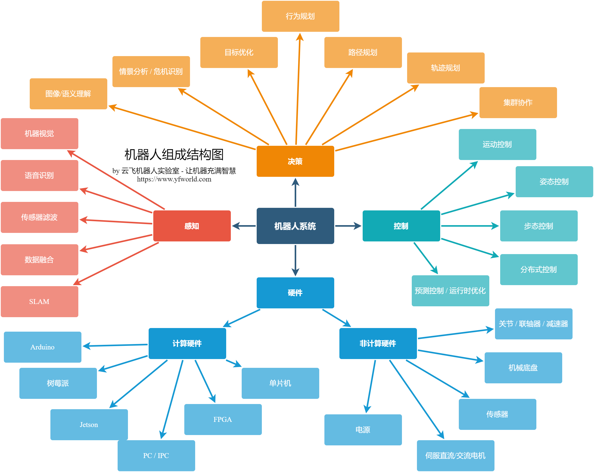

# 前言

机器人涉及的知识甚广，包括自动控制、人工智能、运筹、调度、人机交互、通信、操作系统、电力电子、数字电路、模拟电路等多个领域。

下图绘制了机器人中的一些基本概念：

如图中所示，构成一个完整的机器人系统的组成部分有：

- 机械平台
- 硬件（包括电池、传感器）
- 操作系统（包括RTOS/Linux及中间件）
- 软件（包括感知、决策、规划等）

除此之外，还有机器人之外的支持系统，如中央云服务器等。
