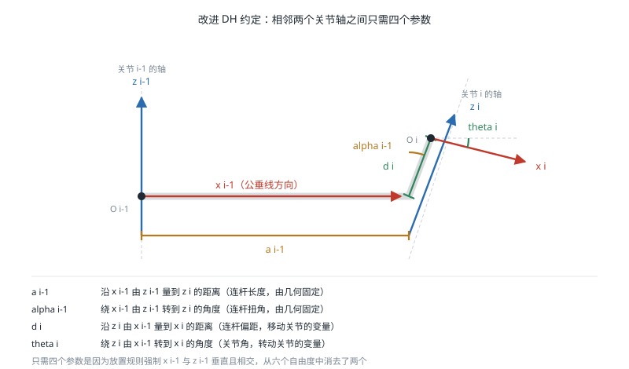

# 正运动学

!!! note "引言"
    正运动学（Forward Kinematics，FK）解决的问题是：已知机器人各关节的位置，求末端执行器（End Effector）在基座坐标系中的位姿。对串联机器人而言，这是一个"沿着连杆链条把变换矩阵连乘起来"的确定性计算，永远有唯一解。正运动学是碰撞检测、雅可比计算、可视化以及逆运动学数值求解的基础，也是把 URDF 文件"跑起来"的第一步。


## 问题描述

设机器人有 \(n\) 个关节，关节变量组成向量 \(\mathbf{q} = [q_1, q_2, \dots, q_n]^T\)。对转动关节 \(q_i\) 是关节角，对移动关节 \(q_i\) 是伸缩位移。正运动学即求映射：

$$ {}^{0}T_{n} = f(\mathbf{q}) $$

其中 \({}^{0}T_{n} \in SE(3)\) 是末端相对于基座的[齐次变换矩阵](spatial-transformation.md)。

对串联开链机构，只要建立好每个连杆的坐标系，这个映射就是相邻变换的连乘：

$$ {}^{0}T_{n} = {}^{0}T_{1}(q_1) \cdot {}^{1}T_{2}(q_2) \cdots {}^{n-1}T_{n}(q_n) $$

问题的关键因此转化为：**如何系统地、无歧义地为每个连杆分配坐标系**。这正是 DH 参数法要解决的。


## Denavit-Hartenberg 参数

### 基本思想

Denavit-Hartenberg（DH）参数法由 Denavit 和 Hartenberg 于 1955 年提出，其核心洞察是：如果按照特定规则放置连杆坐标系，那么相邻两个坐标系之间的变换只需要 **4 个参数**即可完全描述，而不是一般刚体变换所需的 6 个。

这 4 个参数是：

| 参数 | 名称 | 含义 |
|------|------|------|
| \(a_{i-1}\) | 连杆长度（Link Length） | 沿 \(\hat{x}_{i-1}\) 从 \(\hat{z}_{i-1}\) 到 \(\hat{z}_i\) 的距离 |
| \(\alpha_{i-1}\) | 连杆扭角（Link Twist） | 绕 \(\hat{x}_{i-1}\) 从 \(\hat{z}_{i-1}\) 到 \(\hat{z}_i\) 的转角 |
| \(d_i\) | 连杆偏距（Link Offset） | 沿 \(\hat{z}_i\) 从 \(\hat{x}_{i-1}\) 到 \(\hat{x}_i\) 的距离 |
| \(\theta_i\) | 关节角（Joint Angle） | 绕 \(\hat{z}_i\) 从 \(\hat{x}_{i-1}\) 到 \(\hat{x}_i\) 的转角 |

其中 \(a\) 与 \(\alpha\) 由连杆的几何形状决定（固定值），\(d\) 与 \(\theta\) 中有一个是关节变量：转动关节的变量是 \(\theta_i\)，移动关节的变量是 \(d_i\)。



之所以只需 4 个参数，是因为坐标系放置规则强制要求 \(\hat{x}_i\) 与 \(\hat{z}_{i-1}\) 垂直且相交，这两个约束消去了 6 个自由度中的 2 个。

### 标准 DH 与改进 DH

存在两种广泛使用的 DH 约定，二者的差别在于连杆坐标系原点的放置位置：

- **标准 DH**（Standard DH，SDH）：坐标系 \(\{i\}\) 固连在连杆 \(i\) 的**远端**（靠近关节 \(i+1\)），变换顺序为 \(R_z(\theta_i) \to T_z(d_i) \to T_x(a_i) \to R_x(\alpha_i)\)
- **改进 DH**（Modified DH，MDH）：坐标系 \(\{i\}\) 固连在连杆 \(i\) 的**近端**（在关节 \(i\) 的轴线上），变换顺序为 \(R_x(\alpha_{i-1}) \to T_x(a_{i-1}) \to R_z(\theta_i) \to T_z(d_i)\)

Craig 的教材与多数工业机器人厂商采用改进 DH，其变换矩阵为：

$$ {}^{i-1}T_{i} = \begin{bmatrix} \cos\theta_i & -\sin\theta_i & 0 & a_{i-1} \\ \sin\theta_i \cos\alpha_{i-1} & \cos\theta_i \cos\alpha_{i-1} & -\sin\alpha_{i-1} & -d_i \sin\alpha_{i-1} \\ \sin\theta_i \sin\alpha_{i-1} & \cos\theta_i \sin\alpha_{i-1} & \cos\alpha_{i-1} & d_i \cos\alpha_{i-1} \\ 0 & 0 & 0 & 1 \end{bmatrix} $$

标准 DH 的变换矩阵为：

$$ {}^{i-1}T_{i} = \begin{bmatrix} \cos\theta_i & -\sin\theta_i \cos\alpha_i & \sin\theta_i \sin\alpha_i & a_i \cos\theta_i \\ \sin\theta_i & \cos\theta_i \cos\alpha_i & -\cos\theta_i \sin\alpha_i & a_i \sin\theta_i \\ 0 & \sin\alpha_i & \cos\alpha_i & d_i \\ 0 & 0 & 0 & 1 \end{bmatrix} $$

**两种约定的参数表不能混用**。拿到一份 DH 参数表时，如果不确定是哪种约定，可以通过一个已知构型（如全零位）的末端位姿进行验证。参数表中下标的写法（\(a_{i-1}\) 还是 \(a_i\)）是最直接的判别线索。

### 坐标系建立步骤（改进 DH）

1. 找出所有关节轴，为轴 \(i\) 指定方向，作为 \(\hat{z}_i\)
2. 找出 \(\hat{z}_{i-1}\) 与 \(\hat{z}_i\) 的公垂线，其与 \(\hat{z}_{i-1}\) 的交点即为原点 \(O_{i-1}\)；若两轴相交，取交点为原点；若两轴平行，公垂线不唯一，可自由选择以使 \(d\) 尽量为零
3. 沿公垂线由 \(\hat{z}_{i-1}\) 指向 \(\hat{z}_i\) 的方向定义 \(\hat{x}_{i-1}\)
4. 按右手法则确定 \(\hat{y}_{i-1}\)
5. 基座坐标系 \(\{0\}\) 通常取与 \(\{1\}\) 在零位时重合，使 \(a_0 = 0, \alpha_0 = 0\)
6. 末端坐标系 \(\{n\}\) 的原点取在末端执行器的工作点（Tool Center Point，TCP）上

### 示例：Puma 560 的 DH 参数

Puma 560 是最经典的六轴工业机械臂教学模型，其改进 DH 参数为：

| \(i\) | \(\alpha_{i-1}\) (°) | \(a_{i-1}\) (m) | \(d_i\) (m) | \(\theta_i\) |
|-------|---------------------|-----------------|-------------|--------------|
| 1 | 0 | 0 | 0 | \(\theta_1\) |
| 2 | -90 | 0 | 0 | \(\theta_2\) |
| 3 | 0 | 0.4318 | 0.1491 | \(\theta_3\) |
| 4 | -90 | 0.0203 | 0.4331 | \(\theta_4\) |
| 5 | 90 | 0 | 0 | \(\theta_5\) |
| 6 | -90 | 0 | 0 | \(\theta_6\) |

后三个关节的轴线交于一点（球形手腕，Spherical Wrist），这一结构特征使其逆运动学可以解耦为位置与姿态两个子问题，详见 [逆运动学](inverse-kinematics.md)。

### DH 参数法的局限

- **不唯一**：同一机器人可以有多组合法的 DH 参数，取决于坐标系原点与轴方向的选择
- **在平行轴附近病态**：当相邻两轴接近平行时，公垂线的位置对几何误差极其敏感，微小的装配偏差会导致 \(d\) 参数剧烈变化。这使得 DH 参数不适合作为标定（Calibration）的参数化方式，标定通常改用 Hayati 参数或 POE 模型
- **不支持树状与闭链结构**：DH 只适用于串联开链；人形机器人、四足机器人这类树状结构需要更一般的描述方式（如 URDF）


## 指数积公式

### 旋量与关节螺旋轴

指数积（Product of Exponentials，POE）公式是 Brockett 提出的另一种正运动学表述，也是 Lynch 与 Park 教材的主线。它不需要为每个连杆定义坐标系，只需要：

- 一个基座坐标系与一个末端坐标系
- 机器人处于**零位**（Home Configuration）时的末端位姿 \(M \in SE(3)\)
- 每个关节在零位时的**螺旋轴**（Screw Axis）\(\mathcal{S}_i \in \mathbb{R}^6\)

螺旋轴写作 \(\mathcal{S} = (\boldsymbol{\omega}, \mathbf{v})\)，其中 \(\boldsymbol{\omega}\) 是单位旋转轴方向，\(\mathbf{v} = -\boldsymbol{\omega} \times \mathbf{p}\)（\(\mathbf{p}\) 是轴上任意一点）。对移动关节，\(\boldsymbol{\omega} = \mathbf{0}\)，\(\mathbf{v}\) 为单位移动方向。

### 公式形式

以基座坐标系（空间坐标系）表示的螺旋轴给出**空间形式**：

$$T(\mathbf{q}) = e^{[\mathcal{S}_1] q_1} e^{[\mathcal{S}_2] q_2} \cdots e^{[\mathcal{S}_n] q_n} M$$

以末端坐标系（物体坐标系）表示则给出**物体形式**：

$$T(\mathbf{q}) = M \, e^{[\mathcal{B}_1] q_1} e^{[\mathcal{B}_2] q_2} \cdots e^{[\mathcal{B}_n] q_n}$$

其中矩阵指数为：

$$e^{[\mathcal{S}]q} = \begin{bmatrix} e^{[\boldsymbol{\omega}]_\times q} & G(q)\mathbf{v} \\ \mathbf{0}^T & 1 \end{bmatrix}, \quad G(q) = Iq + (1-\cos q)[\boldsymbol{\omega}]_\times + (q - \sin q)[\boldsymbol{\omega}]_\times^2$$

\(e^{[\boldsymbol{\omega}]_\times q}\) 即 [Rodrigues 公式](spatial-transformation.md)。

### POE 与 DH 的比较

| 方面 | DH 参数 | 指数积公式 |
|------|---------|-----------|
| 中间坐标系 | 每个连杆一个，需精心放置 | 不需要 |
| 参数个数 | \(4n\) | \(6n + 6\)（有冗余但无约束） |
| 参数唯一性 | 不唯一 | 螺旋轴由几何直接确定 |
| 平行轴处的数值条件 | 病态 | 良好 |
| 适用于标定 | 需改用 Hayati 等修正 | 直接适用，参数随几何连续变化 |
| 教材普及度 | Craig、Siciliano | Lynch & Park、Murray |
| 与李群工具的衔接 | 间接 | 天然一致 |

工程上的实用建议：**读厂商文档和老代码时需要懂 DH，写新代码时 POE 更省心**，而实际项目中最常见的做法是既不手写 DH 也不手写 POE，而是直接使用 URDF 加现成的运动学库。


## URDF 中的运动学描述

### 结构

ROS 使用 URDF（Unified Robot Description Format）以 XML 描述机器人。URDF 用 `link`（连杆）与 `joint`（关节）构成一棵树，每个 `joint` 的 `origin` 给出父连杆到子连杆坐标系的固定变换，`axis` 给出关节的运动轴：

```xml
<robot name="two_link_arm">
  <link name="base_link"/>

  <link name="link1">
    <visual>
      <origin xyz="0 0 0.15" rpy="0 0 0"/>
      <geometry><cylinder radius="0.03" length="0.3"/></geometry>
    </visual>
    <inertial>
      <origin xyz="0 0 0.15"/>
      <mass value="1.2"/>
      <inertia ixx="0.01" iyy="0.01" izz="0.002" ixy="0" ixz="0" iyz="0"/>
    </inertial>
  </link>

  <joint name="joint1" type="revolute">
    <parent link="base_link"/>
    <child link="link1"/>
    <origin xyz="0 0 0.1" rpy="0 0 0"/>
    <axis xyz="0 0 1"/>
    <limit lower="-3.14" upper="3.14" effort="150" velocity="2.0"/>
  </joint>

  <link name="link2"/>

  <joint name="joint2" type="revolute">
    <parent link="link1"/>
    <child link="link2"/>
    <origin xyz="0 0 0.3" rpy="1.5708 0 0"/>
    <axis xyz="0 0 1"/>
    <limit lower="-2.5" upper="2.5" effort="100" velocity="2.0"/>
  </joint>
</robot>
```

URDF 的 `origin` 是一般的 6 参数刚体变换，不受 DH 的 4 参数约束，因此坐标系可以放在任何方便的位置——这也意味着 URDF 与 DH 参数之间没有一一对应关系，从 URDF 反推 DH 参数需要额外的计算。

### 关节类型

| type | 自由度 | 说明 |
|------|--------|------|
| `revolute` | 1 | 转动关节，有上下限 |
| `continuous` | 1 | 转动关节，无限位（如轮子） |
| `prismatic` | 1 | 移动关节，有行程限制 |
| `fixed` | 0 | 刚性连接，常用于挂载传感器 |
| `floating` | 6 | 浮动基座，URDF 不支持仿真，需用 SDF |
| `planar` | 3 | 平面运动 |

URDF 无法描述闭链（如 Delta 并联机构、四连杆膝关节），这类结构需要使用 SDF 或在 URDF 基础上通过 `<gazebo>` 标签添加额外约束。

### 常用工具命令

```bash
# 从 xacro 生成 URDF 并检查语法
xacro robot.urdf.xacro > robot.urdf && check_urdf robot.urdf

# 导出运动学树的图形化视图
urdf_to_graphiz robot.urdf

# 启动关节滑块与 RViz 交互查看正运动学
ros2 launch urdf_launch display.launch.py urdf_package:=my_robot \
    urdf_package_path:=urdf/robot.urdf
```


## 代码实现

### 手工实现改进 DH 正运动学

```python
import numpy as np


def mdh_transform(alpha, a, d, theta):
    """改进 DH 约定的单步齐次变换 {i-1} -> {i}"""
    ca, sa = np.cos(alpha), np.sin(alpha)
    ct, st = np.cos(theta), np.sin(theta)
    return np.array([
        [ct,      -st,     0,    a],
        [st * ca,  ct * ca, -sa, -d * sa],
        [st * sa,  ct * sa,  ca,  d * ca],
        [0,        0,        0,   1.0],
    ])


# Puma 560 改进 DH 参数：(alpha_{i-1}, a_{i-1}, d_i)
PUMA560_MDH = [
    (0.0,          0.0,     0.0),
    (-np.pi / 2,   0.0,     0.0),
    (0.0,          0.4318,  0.1491),
    (-np.pi / 2,   0.0203,  0.4331),
    (np.pi / 2,    0.0,     0.0),
    (-np.pi / 2,   0.0,     0.0),
]


def forward_kinematics(q, params=PUMA560_MDH):
    """返回末端位姿以及每个连杆坐标系的位姿"""
    T = np.eye(4)
    frames = [T.copy()]
    for (alpha, a, d), theta in zip(params, q):
        T = T @ mdh_transform(alpha, a, d, theta)
        frames.append(T.copy())
    return T, frames


if __name__ == '__main__':
    q_zero = np.zeros(6)
    T_end, _ = forward_kinematics(q_zero)
    print('零位末端位置 (m):', np.round(T_end[:3, 3], 4))

    q = np.array([0.1, -0.5, 0.8, 0.2, 0.4, -0.3])
    T_end, frames = forward_kinematics(q)
    print('给定构型末端位置 (m):', np.round(T_end[:3, 3], 4))
    print('连杆坐标系数量:', len(frames))
```

### 使用 Robotics Toolbox 验证

```python
import roboticstoolbox as rtb
import numpy as np

robot = rtb.models.DH.Puma560()
q = np.array([0.1, -0.5, 0.8, 0.2, 0.4, -0.3])

T = robot.fkine(q)          # 返回 SE3 对象
print(T)
print('末端位置:', T.t)
print('末端 RPY:', T.rpy())

# 打印机器人结构与 DH 参数表
print(robot)
```

### 使用 Pinocchio 从 URDF 计算

Pinocchio 直接读取 URDF，适合真实机器人项目，且同一模型可继续用于 [动力学](dynamics.md) 计算：

```python
import pinocchio as pin
import numpy as np

model = pin.buildModelFromUrdf('robot.urdf')
data = model.createData()

q = pin.neutral(model)                    # 零位构型
pin.forwardKinematics(model, data, q)
pin.updateFramePlacements(model, data)

frame_id = model.getFrameId('tool0')
T = data.oMf[frame_id]                    # SE3 对象
print('末端位置:', T.translation)
print('末端旋转:\n', T.rotation)
```


## 工作空间

正运动学映射的值域即机器人的**工作空间**（Workspace），分为两类：

- **可达工作空间**（Reachable Workspace）：末端参考点能够到达的所有位置的集合
- **灵巧工作空间**（Dexterous Workspace）：末端能以任意姿态到达的位置集合，是可达工作空间的子集，通常小得多

工作空间的边界由关节限位与连杆长度共同决定。对于平面两连杆机械臂（连杆长 \(l_1, l_2\)，无关节限位），可达工作空间是内径 \(|l_1 - l_2|\)、外径 \(l_1 + l_2\) 的圆环。当 \(l_1 = l_2\) 时内径为零，工作空间为完整圆盘，但原点处于奇异位形。

工程上常用蒙特卡洛采样估计工作空间：在关节限位内随机采样大量构型，对每个构型计算正运动学，得到末端位置点云后计算其凸包或体素占用率。这个方法简单可靠，也便于比较不同连杆长度设计方案的优劣。


## 参考资料

1. Craig, J. J. (2005). *Introduction to Robotics: Mechanics and Control* (3rd ed.). Pearson Prentice Hall. — 第 3 章详述改进 DH 约定与正运动学。
2. Denavit, J. & Hartenberg, R. S. (1955). A Kinematic Notation for Lower-Pair Mechanisms Based on Matrices. *Journal of Applied Mechanics*, 22, 215-221.
3. Lynch, K. M. & Park, F. C. (2017). *Modern Robotics*. Cambridge University Press. — 第 4 章讲解指数积公式。
4. Brockett, R. W. (1984). Robotic Manipulators and the Product of Exponentials Formula. *Mathematical Theory of Networks and Systems*, 120-129.
5. Hayati, S. & Mirmirani, M. (1985). Improving the Absolute Positioning Accuracy of Robot Manipulators. *Journal of Robotic Systems*, 2(4), 397-413. — 讨论 DH 参数在平行轴处的病态问题。
6. [URDF — ROS Wiki](http://wiki.ros.org/urdf/XML)
7. Corke, P. (2017). *Robotics, Vision and Control* (2nd ed.). Springer.
