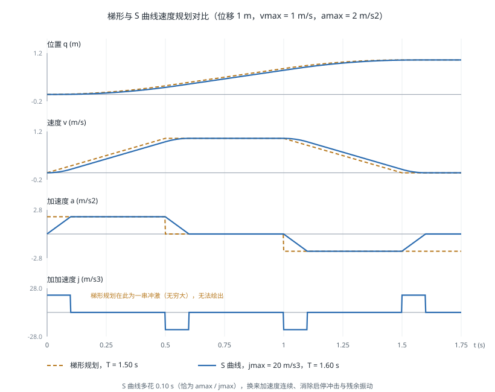

# 轨迹生成

!!! note "引言"
    轨迹生成（Trajectory Generation）负责把规划器输出的稀疏路径点变成一条随时间连续、满足速度与加速度限制、且平滑到执行器能够跟踪的时间函数。它处于运动规划与伺服控制之间：规划器回答"走哪条路"，轨迹生成回答"何时走到哪里、以多快的速度"。轨迹的光滑程度直接决定了机械冲击、跟踪误差与末端振动的大小。


## 路径与轨迹

**路径**（Path）是构型空间中的几何曲线，只有形状没有时间；**轨迹**（Trajectory）是带时间参数的路径，指定了每一时刻的位置、速度与加速度。把路径转化为轨迹的过程称为**时间参数化**（Time Parameterization）。

轨迹必须满足的条件依次是：

1. **边界条件**：起点与终点的位置、速度（有时还包括加速度）匹配
2. **运动学限制**：\(|\dot{q}| \le \dot{q}_{max}\)，\(|\ddot{q}| \le \ddot{q}_{max}\)，有时还有 \(|\dddot{q}| \le \dddot{q}_{max}\)
3. **光滑性**：至少 \(C^1\) 连续（速度连续），高性能场景要求 \(C^2\)（加速度连续）
4. **动力学可行**：所需力矩不超过电机能力，见 [机器人动力学](dynamics.md)

**连续性阶数的意义**：位置不连续意味着瞬间跳变（物理上不可能）；速度不连续意味着无穷大加速度；加速度不连续意味着无穷大加加速度（Jerk），会激发机械结构的高频振动模态、加速减速器磨损，并在末端产生残余抖动。这是 S 曲线与高阶多项式存在的根本理由。


## 关节空间与笛卡尔空间

| 方面 | 关节空间轨迹 | 笛卡尔空间轨迹 |
|------|-------------|---------------|
| 插值对象 | 关节角 \(\mathbf{q}(t)\) | 末端位姿 \(T(t)\) |
| 末端路径 | 不可预测的曲线 | 可精确指定（直线、圆弧） |
| 计算量 | 小，直接下发 | 每周期需求解[逆运动学](inverse-kinematics.md) |
| 关节限位 | 天然满足 | 需要检查，可能中途超限 |
| 奇异位形 | 无影响 | 通过奇异时关节速度爆炸 |
| 典型用途 | 点到点快速移动（PTP） | 焊接、涂胶、装配、直线趋近（LIN/CIRC） |

工程上的常见组合是：**大范围快速移动用关节空间，接触作业段用笛卡尔空间**。工业机器人指令中的 `MOVJ` 与 `MOVL` 正对应这两类。

笛卡尔轨迹的姿态部分需要单独处理：位置可以线性插值，姿态必须用四元数 SLERP（见 [空间描述与变换](spatial-transformation.md)），且位置与姿态应使用同一个归一化时间参数 \(s(t) \in [0,1]\)，以保证两者同步到达。


## 多项式插值

### 三次多项式

给定起点 \((q_0, \dot{q}_0)\) 与终点 \((q_f, \dot{q}_f)\)，四个边界条件确定唯一的三次多项式：

$$q(t) = a_0 + a_1 t + a_2 t^2 + a_3 t^3$$

系数为（取 \(t \in [0, T]\)）：

$$a_0 = q_0, \quad a_1 = \dot{q}_0$$

$$a_2 = \frac{3(q_f - q_0)}{T^2} - \frac{2\dot{q}_0 + \dot{q}_f}{T}, \quad a_3 = \frac{-2(q_f - q_0)}{T^3} + \frac{\dot{q}_0 + \dot{q}_f}{T^2}$$

对静止到静止的运动（\(\dot{q}_0 = \dot{q}_f = 0\)），峰值速度与加速度为：

$$\dot{q}_{max} = \frac{3(q_f - q_0)}{2T}, \qquad \ddot{q}_{max} = \frac{6|q_f - q_0|}{T^2}$$

由此可反解满足限制的最短时间：\(T = \max\left(\frac{3\Delta q}{2\dot{q}_{max}}, \sqrt{\frac{6\Delta q}{\ddot{q}_{max}}}\right)\)。

三次多项式的缺点是加速度在起止时刻不为零且不连续（加加速度为无穷大），会产生启停冲击。

### 五次多项式

增加加速度边界条件（通常取 0），得到五次多项式：

$$q(t) = a_0 + a_1 t + a_2 t^2 + a_3 t^3 + a_4 t^4 + a_5 t^5$$

对静止到静止的运动，用归一化时间 \(\sigma = t/T\) 可写成简洁形式：

$$q(t) = q_0 + (q_f - q_0)\left(10\sigma^3 - 15\sigma^4 + 6\sigma^5\right)$$

其中 \(10\sigma^3 - 15\sigma^4 + 6\sigma^5\) 是常用的**平滑步进函数**（Smoothstep），在两端一阶与二阶导数均为零。峰值速度为 \(1.875\Delta q/T\)，峰值加速度为 \(5.774\Delta q/T^2\)。

五次多项式保证 \(C^2\) 连续，是点到点运动的常用选择。代价是同样时间下峰值速度比三次多项式高约 25%，即执行器能力利用率较低。

### 多段轨迹与样条

通过多个中间点时，逐段独立插值会在衔接处产生速度不连续。解决方案有两类：

**指定中间点速度**：由启发式规则确定，如取前后段平均斜率（若斜率符号相反则取零，以避免过冲）：

$$\dot{q}_k = \begin{cases} 0 & \operatorname{sgn}(v_{k-1}) \ne \operatorname{sgn}(v_k) \\ \frac{1}{2}(v_{k-1} + v_k) & \text{其他} \end{cases}, \quad v_k = \frac{q_{k+1}-q_k}{t_{k+1}-t_k}$$

**三次样条**（Cubic Spline）：不预设中间点速度，而是要求所有内部节点二阶导数连续，解一个三对角线性方程组得到全局 \(C^2\) 光滑的轨迹。计算量略大但结果最平滑，是路径点较多时的标准做法。

样条的一个已知缺点是**不保形**：曲线可能在中间点附近超出数据的取值范围（过冲）。若必须严格避免超出，可使用 PCHIP 等保形插值方法，代价是只有 \(C^1\) 连续。


## 梯形速度规划

### 基本形式

梯形速度规划（Linear Segment with Parabolic Blend，LSPB）由匀加速、匀速、匀减速三段构成，速度曲线呈梯形。它在给定速度与加速度限制下**时间最优**，因此是工业机器人最常用的方案。

设位移 \(\Delta q = |q_f - q_0|\)，限制为 \(v_{max}, a_{max}\)：

加速段时间与位移：

$$t_a = \frac{v_{max}}{a_{max}}, \qquad \Delta q_a = \frac{v_{max}^2}{2a_{max}}$$

**判别条件**：若 \(\Delta q \ge 2\Delta q_a\)，能达到最大速度，为完整梯形，总时间：

$$T = \frac{\Delta q}{v_{max}} + \frac{v_{max}}{a_{max}}$$

若 \(\Delta q < 2\Delta q_a\)，行程太短无法加速到 \(v_{max}\)，退化为**三角形**速度曲线：

$$v_{peak} = \sqrt{a_{max}\Delta q}, \qquad T = 2\sqrt{\frac{\Delta q}{a_{max}}}$$

短距离运动退化为三角形是实现中最容易遗漏的分支，会导致小位移指令的时间计算错误。

### 多关节同步

多个关节同时运动时，各关节按自身限制算出的时间不同。为使它们同时到达（避免末端路径畸变），需要**时间同步**：取各关节所需时间的最大值 \(T^* = \max_i T_i\)，然后按 \(T^*\) 重新规划所有关节的轨迹（降低其余关节的速度与加速度）。

其中运动时间最长的关节称为**主导关节**（Leading Axis），它是唯一一个跑在能力极限上的关节。


## S 曲线速度规划

梯形规划的加速度在段间切换时跳变，加加速度为无穷大。S 曲线（S-Curve，也称双 S 速度曲线）对加加速度加以限制，把加速段本身也做成梯形，得到七段式速度曲线：

```
加加速 → 匀加速 → 减加速 → 匀速 → 加减速 → 匀减速 → 减减速
```

在限制 \(v_{max}, a_{max}, j_{max}\) 下，各段时间为：

$$t_j = \frac{a_{max}}{j_{max}}, \qquad t_a = \frac{v_{max}}{a_{max}} + t_j$$

同样存在多个退化分支：加速度达不到 \(a_{max}\)（无匀加速段）、速度达不到 \(v_{max}\)（无匀速段）、或两者都达不到。完整实现需处理全部情形，这也是 S 曲线代码远比梯形复杂的原因。

下图对比两种方案在同一段位移上的四阶曲线。梯形规划的加速度在段间跳变，加加速度为无穷大；S 曲线则把加速度本身也做成梯形，代价是总时间略长：



**代价与收益**：S 曲线的总时间比梯形长约 \(t_j\)（通常为几十毫秒），换来的是消除启停冲击。对于柔性关节机器人（谐波减速器）、高速取放（SCARA/Delta）以及末端携带液体或易碎物品的场景，这个代价非常值得——冲击激发的残余振动往往需要更长时间才能衰减，实际的"到位稳定时间"反而更短。

推荐的开源实现是 [Ruckig](https://ruckig.com/)，它支持在线（每控制周期）重新规划、任意初始状态、以及加加速度限制下的时间最优解，已被 MoveIt 2 采用为默认的时间参数化插件。


## 沿给定路径的时间最优参数化

当路径由规划器给定且不能改变形状时（如焊缝轨迹），问题变为：找到时间参数化 \(s(t)\)，在满足关节速度、加速度与力矩限制的前提下最小化总时间。这就是 TOPP（Time-Optimal Path Parameterization）问题。

关键洞察是：沿固定路径 \(\mathbf{q}(s)\) 运动时，关节速度与加速度可以写成路径参数导数的函数：

$$\dot{\mathbf{q}} = \mathbf{q}'(s)\dot{s}, \qquad \ddot{\mathbf{q}} = \mathbf{q}'(s)\ddot{s} + \mathbf{q}''(s)\dot{s}^2$$

因此原本 \(n\) 维的问题降为**关于 \(\dot{s}\) 与 \(\ddot{s}\) 的二维问题**，可以在 \((s, \dot{s}^2)\) 相平面上求解。经典方法是数值积分法（沿最大加速度与最大减速度曲线正反向积分，寻找切换点），现代方法 TOPP-RA 用可达集分析（Reachability Analysis）求解，鲁棒性与速度都更好。

TOPP 的价值在于它能利用**完整的动力学约束**（力矩限制而非简单的关节速度限制），在需要压榨节拍时间的产线上可以比保守的梯形规划快 20%–40%。相关的轨迹优化方法详见 [运动规划](../planning/motionplanning.md)。


## 代码实现

### 梯形与 S 曲线规划

```python
import numpy as np


def trapezoidal(q0, qf, v_max, a_max, dt=0.001):
    """梯形速度规划，返回 (t, q, dq, ddq)"""
    dq_total = qf - q0
    d = abs(dq_total)
    sign = np.sign(dq_total)

    if d < 1e-12:
        return np.array([0.0]), np.array([q0]), np.array([0.0]), np.array([0.0])

    d_acc = v_max ** 2 / (2 * a_max)

    if d >= 2 * d_acc:                      # 完整梯形
        t_a = v_max / a_max
        t_c = (d - 2 * d_acc) / v_max       # 匀速段时长
        v_peak = v_max
    else:                                   # 退化为三角形
        v_peak = np.sqrt(a_max * d)
        t_a = v_peak / a_max
        t_c = 0.0

    T = 2 * t_a + t_c
    t = np.arange(0.0, T + dt, dt)
    q = np.empty_like(t)
    dq = np.empty_like(t)
    ddq = np.empty_like(t)

    for i, ti in enumerate(t):
        if ti < t_a:                        # 加速段
            a, v, s = a_max, a_max * ti, 0.5 * a_max * ti ** 2
        elif ti < t_a + t_c:                # 匀速段
            tau = ti - t_a
            a, v = 0.0, v_peak
            s = 0.5 * v_peak * t_a + v_peak * tau
        else:                               # 减速段
            tau = min(ti - t_a - t_c, t_a)
            a, v = -a_max, v_peak - a_max * tau
            s = (0.5 * v_peak * t_a + v_peak * t_c
                 + v_peak * tau - 0.5 * a_max * tau ** 2)
        ddq[i], dq[i], q[i] = sign * a, sign * v, q0 + sign * s

    return t, q, dq, ddq


def quintic(q0, qf, T, dt=0.001):
    """五次多项式（静止到静止），C2 连续"""
    t = np.arange(0.0, T + dt, dt)
    s = t / T
    d = qf - q0
    q = q0 + d * (10 * s ** 3 - 15 * s ** 4 + 6 * s ** 5)
    dq = d / T * (30 * s ** 2 - 60 * s ** 3 + 30 * s ** 4)
    ddq = d / T ** 2 * (60 * s - 180 * s ** 2 + 120 * s ** 3)
    return t, q, dq, ddq


def synchronize(q0_vec, qf_vec, v_max_vec, a_max_vec):
    """多关节时间同步：返回同步时间与主导关节索引"""
    times = []
    for q0, qf, v, a in zip(q0_vec, qf_vec, v_max_vec, a_max_vec):
        d = abs(qf - q0)
        if d < 1e-12:
            times.append(0.0)
        elif d >= v ** 2 / a:
            times.append(d / v + v / a)
        else:
            times.append(2 * np.sqrt(d / a))
    times = np.array(times)
    return times.max(), int(times.argmax())


if __name__ == '__main__':
    t, q, dq, ddq = trapezoidal(0.0, 1.5, v_max=1.0, a_max=2.0)
    print(f'梯形规划: T={t[-1]:.3f}s, 峰值速度={np.abs(dq).max():.3f}')

    t2, q2, dq2, _ = trapezoidal(0.0, 0.1, v_max=1.0, a_max=2.0)
    print(f'短距离(三角形): T={t2[-1]:.3f}s, 峰值速度={np.abs(dq2).max():.3f}')

    T_sync, lead = synchronize([0, 0, 0], [1.5, 0.3, 2.0],
                               [1.0, 1.0, 1.0], [2.0, 2.0, 2.0])
    print(f'同步时间={T_sync:.3f}s, 主导关节=J{lead + 1}')
```

### 用 Ruckig 做在线 S 曲线规划

```python
from ruckig import Ruckig, InputParameter, OutputParameter, Result

DOF = 6
otg = Ruckig(DOF, 0.001)                    # 1 kHz 控制周期
inp = InputParameter(DOF)
out = OutputParameter(DOF)

inp.current_position = [0.0] * DOF
inp.current_velocity = [0.0] * DOF
inp.current_acceleration = [0.0] * DOF

inp.target_position = [0.5, -0.3, 0.8, 0.1, 0.4, -0.2]
inp.target_velocity = [0.0] * DOF

inp.max_velocity = [1.5] * DOF
inp.max_acceleration = [3.0] * DOF
inp.max_jerk = [20.0] * DOF                 # 加加速度限制，S 曲线的核心

res = Result.Working
steps = 0
while res == Result.Working:
    res = otg.update(inp, out)
    # out.new_position / new_velocity / new_acceleration 下发给伺服
    out.pass_to_input(inp)
    steps += 1

print(f'轨迹时长: {out.trajectory.duration:.3f}s, 控制周期数: {steps}')
```

Ruckig 的优势在于**每个控制周期都可以给出新的目标**而无需等待当前轨迹结束，从任意的当前位置、速度、加速度状态出发都能生成可行轨迹。这使它适合遥操作、视觉伺服等目标持续变化的场景，而传统的离线规划在这类场景下会产生不连续。

### MoveIt 中的时间参数化

MoveIt 的规划器（OMPL 等）输出的是没有时间信息的路径，需要单独做时间参数化：

```yaml
# moveit_config 中配置时间参数化算法
request_adapters: >-
    default_planner_request_adapters/AddTimeOptimalParameterization
    default_planner_request_adapters/ResolveConstraintFrames
    default_planner_request_adapters/FixWorkspaceBounds

# 可选值:
#   AddTimeOptimalParameterization  — TOPP，考虑速度与加速度限制
#   AddRuckigTrajectorySmoothing    — S 曲线平滑，额外限制加加速度
```

实践中推荐两者串联：先用 TOPP 得到时间最优参数化，再用 Ruckig 做加加速度平滑。


## 选型建议

| 场景 | 推荐方案 | 理由 |
|------|---------|------|
| 点到点快速移动 | 梯形 / S 曲线（关节空间） | 时间最优，实现简单 |
| 高速取放（SCARA/Delta） | S 曲线 | 抑制残余振动，缩短稳定时间 |
| 焊接、涂胶等连续作业 | 笛卡尔直线/圆弧 + TOPP | 路径精度优先 |
| 多路径点的平滑通过 | 三次样条 + TOPP-RA | 全局 \(C^2\) 且时间最优 |
| 视觉伺服、遥操作 | Ruckig 在线规划 | 目标持续变化，需要随时重规划 |
| 力控装配 | 阻抗控制 + 低速轨迹 | 轨迹只提供参考，实际由力控修正 |


## 常见问题

- **忽略三角形退化分支**：短位移时按完整梯形公式计算会得到错误的时间与速度。
- **多关节未同步**：各关节独立规划导致末端路径畸变，在笛卡尔精度要求高的场合会造成明显的路径偏差。
- **控制周期与轨迹采样不一致**：轨迹按 1 ms 生成但控制器以 4 ms 运行，会造成跟踪滞后与抖动，二者必须匹配或做正确的插值。
- **路径点过密**：从规划器直接得到的密集路径点会使时间参数化结果出现速度剧烈波动，应先做路径简化或平滑。
- **只限制速度加速度而忽略力矩**：高负载或高速时可能规划出电机无法执行的轨迹，需要用 [动力学](dynamics.md) 校验力矩可行性。
- **通过奇异位形的笛卡尔轨迹**：末端匀速时关节速度会爆炸，应在此段切换到关节空间插值，见 [雅可比矩阵与奇异性](jacobian.md)。


## 参考资料

1. Biagiotti, L. & Melchiorri, C. (2008). *Trajectory Planning for Automatic Machines and Robots*. Springer. — 轨迹生成最全面的专著，涵盖多项式、样条、S 曲线的完整推导。
2. Craig, J. J. (2005). *Introduction to Robotics: Mechanics and Control* (3rd ed.). Pearson Prentice Hall. — 第 7 章讲解轨迹生成基础。
3. Bobrow, J. E., Dubowsky, S. & Gibson, J. S. (1985). Time-Optimal Control of Robotic Manipulators Along Specified Paths. *International Journal of Robotics Research*, 4(3), 3-17. — TOPP 问题的开创性工作。
4. Pham, H. & Pham, Q.-C. (2018). A New Approach to Time-Optimal Path Parameterization Based on Reachability Analysis. *IEEE Transactions on Robotics*, 34(3), 645-659. — TOPP-RA 算法。
5. Berscheid, L. & Kröger, T. (2021). Jerk-Limited Real-Time Trajectory Generation with Arbitrary Target States. *Robotics: Science and Systems (RSS)*. — Ruckig 算法。
6. Kunz, T. & Stilman, M. (2012). Time-Optimal Trajectory Generation for Path Following with Bounded Acceleration and Velocity. *Robotics: Science and Systems (RSS)*.
7. [Ruckig — Online Trajectory Generation](https://ruckig.com/)
