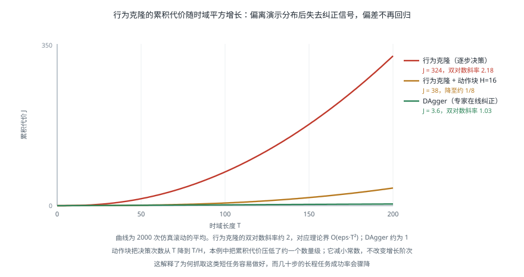

# 模仿学习与数据采集

!!! note "引言"
    机器人学习与语言、视觉领域最本质的差别在于数据：文本和图像可以从互联网上抓取，而机器人轨迹必须由人在物理世界中一条一条地做出来。一条演示要实际运行几十秒，硬件会磨损，操作者会疲劳。这个约束塑造了整个领域——它使数据采集本身成为一个研究课题，也解释了为什么行为克隆的理论缺陷（复合误差）在实践中如此棘手。本页面介绍模仿学习的基本方法与失效原理、主流的遥操作采集方案，以及数据质量的判断标准。


## 行为克隆及其根本缺陷

行为克隆（Behavior Cloning，BC）把模仿学习当作监督学习：给定演示数据集 \(\mathcal{D} = \{(s_i, a_i)\}\)，最小化预测动作与演示动作的差异。

$$\theta^* = \arg\min_\theta \sum_{(s,a) \in \mathcal{D}} \mathcal{L}\big(\pi_\theta(s),\, a\big)$$

它简单、稳定、不需要与环境交互，是当前绝大多数机器人策略学习的基础。但它有一个理论上无法回避的问题。

### 复合误差

监督学习假设训练与测试的数据分布相同。而在序贯决策中，**策略自己的动作决定了它接下来会遇到什么状态**——这个假设从根本上不成立。

一旦策略产生微小偏差，机器人就进入了演示数据中没有覆盖的状态；在这种状态下策略的行为没有训练依据，误差更大；更大的误差把它带到更陌生的状态。这就是**分布偏移**（Distribution Shift）导致的复合误差。

Ross 与 Bagnell 给出了这一现象的理论刻画：若每步的期望误差为 \(\epsilon\)，时域长度为 \(T\)，则行为克隆的期望总代价上界为

$$J(\pi_\theta) - J(\pi^*) \le \mathcal{O}(\epsilon T^2)$$

这里的 \(T^2\) 描述特定假设下的最坏情况上界，不是每个任务的实测误差都必然按平方增长。它揭示了长任务的风险：早期偏差可以影响许多后续决策。环境是否具有自恢复性、专家误差如何定义，以及策略能否获得纠正数据，都会影响实际表现。



### 缓解手段

**DAgger（Dataset Aggregation）**：让策略自己跑，在它到达的状态上请专家标注正确动作，把这些数据加入训练集并重新训练，反复迭代。理论上可把误差界改善到 \(\mathcal{O}(\epsilon T)\)，即线性而非平方。代价是需要专家持续在线标注——在机器人上意味着操作者要盯着机器人跑并随时接管，成本很高。

**动作块**：一次预测未来 \(H\) 步，可以建模时间相关性并减少推理调用。但开环执行越长，利用新观测纠错的机会也越少，不能直接把误差上界中的 \(T\) 替换成 \(T/H\)。实践中常执行动作块前几步后重新规划，见[VLA 微调与评测](vla-training-evaluation.md)。

**有意加入扰动的演示**：采集时让机器人进入可恢复的偏离状态，再演示如何纠正。这扩大了数据覆盖的状态分布。最终成功的轨迹也可以包含抓空、重新对准和再次抓取；判断恢复数据是否充足，需要查看纠正片段，不能只看 episode 的成功标签。

**多模态建模**：用扩散或流匹配替代回归，避免把多种合理做法平均成一种不合理的做法，见 [VLA 模型](embodied-ai-vla.md) 中的动作表示讨论。


## 主流方法

### ACT

Action Chunking with Transformers 用 Transformer 编码多视角图像与本体状态，一次输出未来约 100 步的动作序列，并用条件变分自编码器（CVAE）建模演示中的多样性。

它的两个关键设计是**动作块**与**时序集成**：前者预测连续动作序列，后者把多次推理对同一时刻的预测加权组合以平滑轨迹。ACT 在论文中的精细双臂任务上展示了较少演示下的学习能力；迁移到新任务时，仍需检查动作表示、数据覆盖和闭环反馈，不能把演示数量视为通用保证。

### 扩散策略

Diffusion Policy 把动作生成建模为去噪过程：从高斯噪声出发，以观测为条件逐步去噪得到动作序列。

它的优势直接来自扩散模型本身的性质——**能表示任意复杂的多模态分布**。前面提到的「绕障碍从左还是从右」问题，扩散策略会从分布中采样出一致的某一侧，而回归模型会输出中间值。在接触丰富的任务上它的表现明显优于回归基线。

代价是推理需要多步去噪，实时性受限。实践中通常用 DDIM 等加速采样把步数降到 10 步以内，或改用流匹配。

### 方法对比

| 方法 | 多模态 | 样本效率 | 推理速度 | 适合场景 |
|------|--------|---------|---------|---------|
| MSE 回归 + MLP | 差 | 高 | 极快 | 单模态、演示一致性高的任务 |
| ACT (CVAE + 动作块) | 中 | 很高 | 快 | 精细双臂操作，演示较少 |
| 扩散策略 | 好 | 中 | 慢 | 接触丰富、演示多样 |
| 流匹配策略 | 好 | 中 | 中 | 需要较高控制频率 |


## 遥操作与数据采集

采集方案的选择直接决定了数据的质量上限与采集速度。

| 方案 | 硬件 | 优点 | 缺点 |
|------|------|------|------|
| 主从遥操作（ALOHA / GELLO） | 与从臂同构的缩小版主臂 | 直觉映射、精度高、可采力反馈 | 需要制作主臂、与特定机器人绑定 |
| 手持夹爪（UMI） | 带相机的手持夹爪 | 无需机器人即可采集、速度快、场景不受限 | 观测与机器人视角有差异、无本体状态 |
| VR 手柄 | 消费级 VR 设备 | 成本低、易于部署 | 精度有限、无力反馈、易疲劳 |
| 动作捕捉 | 光学或惯性动捕 | 自然动作、速度快 | 人手与机器人夹爪的形态差异难以映射 |
| 运动学示教 | 直接拖动机器人 | 无需额外硬件 | 需要机器人可背驱，见 [执行器与传动](../hardware/actuators.md) |

**主从遥操作是目前质量最高的方案**。ALOHA 的做法是用与从臂同构但更小的主臂作为输入设备，操作者的手臂姿态直接映射到机器人，几乎没有认知负担。它的局限是主臂必须为特定机器人定制。

**手持夹爪方案（UMI）的价值在于解耦**：采集时根本不需要机器人在场，一个人拿着带相机的夹爪就能在厨房、超市、任何地方采集数据。这把采集速度提高了一个数量级。代价是采到的观测与机器人实际部署时的观测存在差异（没有机器人本体在画面中、相机运动特性不同），需要额外处理。

### 采集中容易出错的地方

- **时间同步**。图像、关节状态、动作指令必须有一致的时间戳。几十毫秒的错位就会让策略学到错误的因果关系——它会以为「看到 A 之后要做 B」，而实际上 B 发生在 A 之前。这是数据问题中最隐蔽也最有破坏性的一类，相关方法见 [传感器融合工程实践](../sensing/sensor-fusion-engineering.md)。
- **只记录成功轨迹**。如前所述，没有失败与纠正的数据，策略学不会恢复。应当保留失败轨迹并标注，或有意采集「偏离后纠正」的演示。
- **操作者习惯单一**。同一个人用同一种方式做 200 遍，数据的多样性远低于表面上的数量。应让多人参与，或有意变换做法。
- **场景过于整洁**。演示时桌面只有目标物体，部署时桌面堆满杂物——分布偏移。训练数据应包含干扰物、不同背景、不同光照。
- **动作空间定义不一致**。同一批数据中混用了绝对位姿与相对位姿，或不同的坐标系约定。这会让模型学到自相矛盾的映射。


## 数据质量

在机器人数据上，**质量与多样性的价值通常高于数量**。这与语言模型领域「数据越多越好」的直觉不同，原因是机器人数据的分布覆盖比总量更能决定泛化。

判断一个数据集是否够用，可以看几个维度：

| 维度 | 问题 | 检查方法 |
|------|------|---------|
| 状态覆盖 | 演示是否覆盖了部署时会遇到的状态 | 可视化轨迹分布，看是否存在明显空洞 |
| 物体多样性 | 训练用了多少种物体 | 计数，并检查是否覆盖目标类别的形状范围 |
| 场景多样性 | 背景、光照、桌面高度是否变化 | 抽样查看图像 |
| 演示一致性 | 同一任务的做法是否差异过大 | 对齐后计算轨迹方差 |
| 失败与恢复 | 是否包含纠正行为 | 统计包含明显纠正段的轨迹比例 |

**演示一致性是一个需要权衡的指标**：差异过大会让回归模型无所适从（此时需要多模态方法），差异过小则数据实质上是重复的。

### 数据增广

图像侧的增广（随机裁剪、颜色抖动、随机擦除）通常有效且成本低。但要注意**不能破坏动作与观测的几何一致性**——随机翻转图像会让「向左」变成「向右」，除非同时翻转动作标签，否则会直接教错模型。

动作侧的增广要谨慎。给动作加噪声会引入错误的监督信号，除非同时对观测做对应的调整（这基本上就是在做数据合成，难度很高）。

**仿真数据**可以提供大量廉价样本，但存在 sim-to-real 差距。目前较成功的用法是「仿真预训练 + 真机微调」，而不是纯仿真训练，见 [强化学习在机器人中的部署](rl-robotics-deployment.md)。


## 代码：数据集质量检查

下面检查已经对齐的动作和时间戳，包括形状、非有限值、时间单调性及统计摘要。它不解码图像，也不能判断相机与控制器是否同步；后两项需要独立的传感器时间戳、时钟映射和视频抽查。恒定动作维度可能是任务约束，也可能是记录错误，应结合任务解释。


```python
import numpy as np


def check_dataset(episodes, dt_expected, action_dim):
    """对采集到的演示数据集做基本的质量检查

    episodes: 列表，每项为 dict，含 'timestamps'、'actions'、'images'、'success'
    """
    if not episodes or not np.isfinite(dt_expected) or dt_expected <= 0 or action_dim <= 0:
        raise ValueError('需要非空数据集、正采样周期和正动作维度')
    for index, ep in enumerate(episodes):
        timestamps = np.asarray(ep['timestamps'], dtype=float)
        actions = np.asarray(ep['actions'], dtype=float)
        if timestamps.ndim != 1 or len(timestamps) < 2:
            raise ValueError(f'episode {index}: 至少需要两个一维时间戳')
        if actions.shape != (len(timestamps), action_dim):
            raise ValueError(f'episode {index}: 动作维度或时间长度不匹配')
        if not np.isfinite(timestamps).all() or not np.isfinite(actions).all():
            raise ValueError(f'episode {index}: 数据含非有限值')
        if np.any(np.diff(timestamps) <= 0):
            raise ValueError(f'episode {index}: 时间戳必须严格递增')
    report = {}

    # 1) 单路采样间隔；不能据此判断不同传感器之间是否同步
    jitters = []
    interval_errors = []
    for ep in episodes:
        d = np.diff(np.asarray(ep['timestamps']))
        jitters.append(np.std(d) / dt_expected)
        interval_errors.append(abs(np.mean(d) - dt_expected) / dt_expected)
    report['时间抖动(相对)'] = f'{np.mean(jitters):.3f}'
    report['平均周期偏差(相对)'] = f'{np.mean(interval_errors):.3f}'
    report['跨传感器同步'] = '需要各传感器时间戳与时钟映射，当前检查无法判定'

    # 2) 动作量级：各维度的分布，用于确定归一化参数
    A = np.concatenate([np.asarray(ep['actions']) for ep in episodes])
    report['动作维度'] = A.shape[1]
    report['动作 1/99 分位'] = [
        (round(float(np.percentile(A[:, i], 1)), 4),
         round(float(np.percentile(A[:, i], 99)), 4))
        for i in range(min(action_dim, 3))
    ]
    # 恒定不变的维度通常意味着该自由度未被使用或记录有误
    dead = [i for i in range(A.shape[1]) if np.std(A[:, i]) < 1e-6]
    report['无变化的动作维度'] = dead if dead else '无'

    # 3) 轨迹长度分布：过大的差异往往意味着演示质量参差
    lens = np.array([len(ep['actions']) for ep in episodes])
    report['轨迹长度'] = f'{lens.mean():.0f} ± {lens.std():.0f} (min {lens.min()}, max {lens.max()})'

    # 4) 最终结果不能代替恢复片段标签；缺失标签不视为成功
    labeled = [ep for ep in episodes if ep.get('success') is not None]
    n_fail = sum(1 for ep in labeled if not ep['success'])
    report['结果标签覆盖率'] = f'{len(labeled) / len(episodes):.1%}'
    report['已标注轨迹中的失败占比'] = (
        f'{n_fail / len(labeled):.1%}' if labeled else '无结果标签'
    )
    report['恢复覆盖'] = '需单独标注和检查纠正片段，不能由最终成功率推断'

    return report


if __name__ == '__main__':
    rng = np.random.default_rng(0)
    eps = []
    for k in range(40):
        T = int(rng.normal(180, 20))
        eps.append({
            'timestamps': np.arange(T) * 0.02 + rng.normal(0, 0.0004, T),
            'actions': np.c_[rng.normal(0, 0.01, (T, 6)), np.zeros(T)],  # 第7维恒为0
            'images': None,
            'success': k % 12 != 0,
        })
    for k, v in check_dataset(eps, dt_expected=0.02, action_dim=7).items():
        print(f'{k}: {v}')
```


## 如何补采恢复演示

恢复数据的目标是覆盖策略实际遇到的偏离状态。建议先在[仿真评测](../simulation/robot-learning-benchmarks.md)中聚类失败，再为常见失败设计采集任务，而不是任意增加动作噪声。

| 失败类型 | 可采集的恢复过程 | 需要确认的观测 |
|----------|------------------|----------------|
| 抓空 | 退出当前姿态、重新对准、再次闭合 | 夹爪内是否有物体、目标是否仍可见 |
| 物体滑落 | 松开并退让、重新定位物体、重新抓取 | 滑落后的位置、遮挡与夹爪状态 |
| 放置偏移 | 再抓取或推动修正，再确认目标区域 | 目标区域边界与物体相对位置 |
| 遮挡导致犹豫 | 调整视角或末端位置，再继续任务 | 历史图像与新视角是否足以消除歧义 |

记录偏离起点、专家接管点、恢复完成点和动作来源。用于普通行为克隆时，应筛选需要模仿的专家纠正段；此前模型产生的错误动作不能仅因轨迹最终成功就自动成为专家标签。

验证恢复能力时，保留一组未用于采集的扰动条件，并同时报告正常初始状态下的成功率和扰动后的恢复率。恢复数据增加后，还需要检查策略是否过度谨慎、是否延长原本简单任务的完成时间。

关于失败标签、空闲过滤和数据划分，继续阅读[开放机器人数据集实践](../database/open-robot-datasets.md)。


## 参考资料

1. Ross, S., Gordon, G. J. & Bagnell, J. A. (2011). A Reduction of Imitation Learning and Structured Prediction to No-Regret Online Learning. *AISTATS*, 627-635. — DAgger 与复合误差的理论分析。
2. Zhao, T. Z., Kumar, V., Levine, S. & Finn, C. (2023). Learning Fine-Grained Bimanual Manipulation with Low-Cost Hardware. *Robotics: Science and Systems (RSS)*. — ACT 与 ALOHA。
3. Chi, C., et al. (2023). Diffusion Policy: Visuomotor Policy Learning via Action Diffusion. *Robotics: Science and Systems (RSS)*.
4. Chi, C., et al. (2024). Universal Manipulation Interface: In-The-Wild Robot Teaching Without In-The-Wild Robots. *Robotics: Science and Systems (RSS)*. — UMI 手持夹爪采集方案。
5. Fu, Z., Zhao, T. Z. & Finn, C. (2024). Mobile ALOHA: Learning Bimanual Mobile Manipulation with Low-Cost Whole-Body Teleoperation. *Conference on Robot Learning (CoRL)*.
6. Wu, P., et al. (2023). GELLO: A General, Low-Cost, and Intuitive Teleoperation Framework for Robot Manipulators. *arXiv:2309.13037*.
7. Osa, T., et al. (2018). An Algorithmic Perspective on Imitation Learning. *Foundations and Trends in Robotics*, 7(1-2), 1-179.
