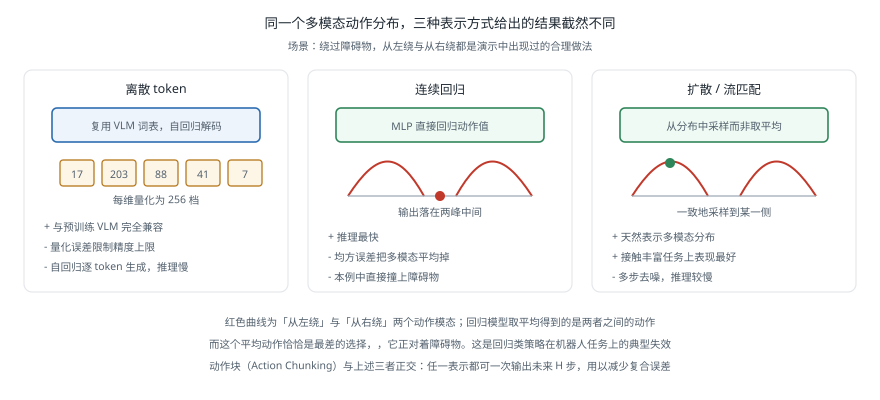

# VLA 模型

!!! note "引言"
    视觉-语言-动作模型（Vision-Language-Action Model，VLA）把机器人动作纳入视觉-语言模型的输出空间，用一个模型完成从图像与指令到关节指令的全部映射。它的核心赌注是：预训练视觉-语言模型中蕴含的世界知识与语义理解，可以迁移到物理操作上，从而让机器人泛化到训练中未见过的物体与指令。本页面讨论这类模型的工程细节——动作怎么表示、推理频率如何满足控制需求、如何在自己的机器人上微调——而不是复述各个模型的论文摘要。


## 基本结构

一个 VLA 模型通常由三部分组成：

| 组件 | 作用 | 常见选择 |
|------|------|---------|
| 视觉编码器 | 把图像变成特征 | SigLIP、DINOv2、EfficientNet |
| 语言与融合主干 | 理解指令并与视觉特征交互 | LLaMA、PaliGemma、Prismatic 等 VLM |
| 动作头 | 输出可执行的动作 | 离散 token 解码、扩散头、流匹配头 |

前两部分通常来自预训练的视觉-语言模型，动作头是新增并在机器人数据上训练的部分。**整个方法的关键假设是：VLM 预训练学到的语义与空间知识对操作有用**。有证据支持这一点——VLA 确实能理解「把最不常见的物体拿起来」这类需要常识的指令——但知识迁移的程度仍有争议，也有工作指出很多收益其实来自视觉编码器而非语言部分。


## 动作表示

动作怎么表示，是 VLA 设计中影响最大的一个决定。

### 离散 token

把每个动作维度均匀量化成若干档（常见是 256 档），复用语言模型词表中不常用的 token 来表示。这样动作就成了一串普通的文本 token，可以直接用语言模型的自回归解码生成，无需改动架构。

优点是**与预训练模型完全兼容**，可以直接在 VLM 上做微调，训练基础设施也能复用。

缺点有三个：量化误差限制了精度上限；自回归逐 token 生成慢；离散化破坏了动作空间的连续结构，相邻的两档在语义上很接近，但模型看来是两个无关的 token。

### 连续回归

直接用 MLP 回归出连续动作值。简单直接、推理快，但它有一个根本缺陷：**回归会把多模态的动作分布平均掉**。

设想绕过一个障碍物，从左边绕和从右边绕都是好的选择。用均方误差训练的回归模型会输出两者的平均——直接撞上去。这在演示数据本身具有多样性时（不同人、不同次演示的做法不同）尤其致命，而机器人演示数据恰恰总是多样的。

### 动作块

动作块（Action Chunking）一次预测未来 \(H\) 步的动作序列而非单步动作，是 ACT 引入并被广泛采用的做法。

它同时解决了两个问题：**减少复合误差**（见 [模仿学习与数据采集](embodied-ai-data.md)），因为模型不必每一步都重新决策，累积的机会变少了；以及**降低推理频率要求**，一次推理可以支撑 \(H\) 个控制周期。

执行时通常配合**时序集成**（Temporal Ensembling）：在时刻 \(t\)，把此前若干次推理中预测到 \(t\) 的动作按指数权重加权平均。这能显著平滑轨迹，代价是引入少量滞后。

### 扩散与流匹配

用扩散模型或流匹配（Flow Matching）建模动作分布，是目前的主流选择。它天然处理多模态——从分布中采样而非取平均，因此绕障碍时会一致地选择某一侧，而不是平均到中间。

扩散策略的代价是推理需要多步去噪。流匹配可以用更少的步数达到相近质量，因此在需要高频控制的场景中逐渐取代扩散。

| 表示 | 多模态 | 精度 | 推理速度 | 与 VLM 兼容 |
|------|--------|------|---------|------------|
| 离散 token | 一般 | 受量化限制 | 慢（自回归） | 好 |
| 连续回归 | 差 | 好 | 快 | 需改动 |
| 扩散头 | 好 | 好 | 慢（多步去噪） | 需改动 |
| 流匹配头 | 好 | 好 | 中 | 需改动 |




## 代表性模型

| 模型 | 时间 | 主干 | 动作表示 | 特点 |
|------|------|------|---------|------|
| RT-1 | 2022 | EfficientNet + Transformer | 离散 token | 首个大规模真机数据训练的操作 Transformer |
| RT-2 | 2023 | PaLI-X / PaLM-E | 离散 token | 首次把 VLM 直接微调为策略，展示语义泛化 |
| Octo | 2024 | Transformer（从头训练） | 扩散头 | 开源，在 Open X-Embodiment 上预训练，支持多形态 |
| OpenVLA | 2024 | Prismatic VLM (7B) | 离散 token | 开源、可复现，成为社区的常用基线 |
| π0 | 2024 | PaliGemma | 流匹配 | 高频动作输出，面向灵巧操作 |
| RDT-1B | 2024 | 扩散 Transformer | 扩散头 | 面向双臂操作 |

选型上的实际考虑：**如果目标是在自己的机器人上做研究或原型，OpenVLA 与 Octo 是最现实的起点**——权重与训练代码都开源，社区有可复现的微调流程。闭源模型的能力可能更强，但无法在自己的数据上微调，而微调几乎总是必需的。

这个领域迭代很快，上表反映的是截至 2026 年初的情况，具体选型时应查阅最新的开源实现与评测。


## 推理频率

这是 VLA 落地时最先遇到的工程约束，也是论文里通常不讨论的部分。

大模型的推理速度与控制回路的需求之间有数量级的差距：

| 层次 | 需要的频率 | VLA 能提供的 |
|------|-----------|------------|
| 关节力矩控制 | 500 Hz – 1 kHz | 不可能 |
| 末端位姿跟踪 | 50 – 200 Hz | 不可能 |
| 动作决策 | 5 – 30 Hz | 可行（配合动作块） |

一个 7B 参数的模型在 RTX 4090 上做一次前向大约需要几十毫秒；在 Jetson Orin 这类边缘设备上则要数百毫秒。因此**VLA 绝不能直接闭合底层控制回路**，必须采用分层结构：

```
VLA 模型（5–10 Hz）
    ↓  输出未来 H 步的末端位姿或关节目标
轨迹插值 / 动作块执行（100 Hz）
    ↓
阻抗控制或位置控制（1 kHz）
    ↓
电机驱动器
```

这个结构中 VLA 只负责「做什么」，实时性与安全由下层保证。相关的底层实现见 [轨迹生成](../kinematics/trajectory-generation.md) 与 [力控与柔顺控制](../manipulation/force-control.md)。

加速推理的常用手段：

- **动作块**：一次推理输出 \(H\) 步，等效频率提高 \(H\) 倍，是最有效的一招
- **量化**：INT8 或 INT4 量化可显著降低显存与延迟，精度损失通常可接受
- **异步执行**：在执行当前动作块的同时计算下一块，隐藏推理延迟
- **小主干**：并非所有任务都需要 7B 模型，很多单一任务用几千万参数的策略就够

关于边缘部署的通用技术见 [训练与部署](dl-training-deployment.md) 与 [Jetson](../jetson/index.md)。


## 微调实践

在自己的机器人上使用开源 VLA，标准流程如下。

**第一步：统一动作空间。** 预训练模型的动作定义（末端位姿增量、关节角度增量、还是绝对位姿）必须与你的机器人对齐。常见做法是统一到「末端位姿增量 + 夹爪开合」的 7 维表示，并按训练数据的统计量做归一化。**归一化统计量不匹配是微调失败最常见的原因**——如果预训练数据的位移量级是厘米而你的是毫米，模型输出会完全失准。

**第二步：采集演示数据。** 通常 50–200 条演示可以让模型在单个任务上工作。数据的质量与多样性比数量更重要，详见 [模仿学习与数据采集](embodied-ai-data.md)。

**第三步：微调。** 全参数微调效果最好但显存需求高；LoRA 微调可以在单张消费级显卡上完成，效果通常接近。

```python
# 以 OpenVLA 为例的微调骨架
from transformers import AutoModelForVision2Seq, AutoProcessor
from peft import LoraConfig, get_peft_model
import torch

processor = AutoProcessor.from_pretrained("openvla/openvla-7b",
                                          trust_remote_code=True)
model = AutoModelForVision2Seq.from_pretrained(
    "openvla/openvla-7b",
    torch_dtype=torch.bfloat16,
    trust_remote_code=True).to("cuda")

# LoRA：只训练低秩适配器，显存需求大幅下降
lora_cfg = LoraConfig(
    r=32, lora_alpha=16, lora_dropout=0.05,
    target_modules="all-linear", init_lora_weights="gaussian")
model = get_peft_model(model, lora_cfg)
model.print_trainable_parameters()

# 关键：动作归一化统计量必须与自己的数据集匹配，
# 否则模型输出的动作量级会完全错误
# dataset_statistics = {"action": {"mean": ..., "std": ..., "q01": ..., "q99": ...}}
```

**第四步：闭环评测。** 离线指标（动作 MSE）与真实成功率的相关性很弱——一个 MSE 更低的模型完全可能成功率更低，因为误差集中在了关键的接触时刻。**必须在真机或高保真仿真中做闭环评测**，并做足够多的试验次数。

```python
# 推理时的动作块执行与时序集成
import numpy as np
from collections import deque


class ChunkExecutor:
    """执行动作块，并对重叠部分做指数加权集成以平滑轨迹"""

    def __init__(self, horizon, exec_steps, m=0.1):
        self.H = horizon          # 每次推理预测的步数
        self.exec_steps = exec_steps   # 每块实际执行多少步后重新推理
        self.m = m                # 时序集成的衰减系数
        self.buffer = deque(maxlen=horizon)

    def push(self, chunk):
        """chunk: (H, action_dim)，来自一次模型推理"""
        self.buffer.append({'chunk': np.asarray(chunk), 'age': 0})

    def step(self):
        """返回当前时刻的融合动作；越新的预测权重越大"""
        acts, ws = [], []
        for item in self.buffer:
            k = item['age']
            if k < len(item['chunk']):
                acts.append(item['chunk'][k])
                ws.append(np.exp(-self.m * k))
            item['age'] += 1
        if not acts:
            return None
        w = np.asarray(ws) / np.sum(ws)
        return np.sum(np.asarray(acts) * w[:, None], axis=0)

    def needs_inference(self):
        if not self.buffer:
            return True
        return self.buffer[-1]['age'] >= self.exec_steps


if __name__ == '__main__':
    ex = ChunkExecutor(horizon=16, exec_steps=8)
    rng = np.random.default_rng(0)
    for t in range(24):
        if ex.needs_inference():
            # 实际使用时这里调用模型；此处用带噪声的斜坡代替
            base = np.linspace(t, t + 16, 16)[:, None] * 0.01
            ex.push(base + rng.normal(0, 0.004, (16, 7)))
        a = ex.step()
        if t in (0, 8, 16, 23):
            print(f't={t:2d}  融合动作首维 = {a[0]:+.4f}  '
                  f'缓存块数 = {len(ex.buffer)}')
```


## 局限与常见误解

**「VLA 能理解语言」的程度被高估了。** 多数模型对指令的处理更接近关键词匹配而非真正的语义理解。改变指令的措辞（同义替换、换一种说法）常常导致性能明显下降。稳妥的做法是在训练数据中包含指令的多种表述。

**空间推理能力弱。** 「把杯子放在盘子左边」这类涉及相对空间关系的指令，成功率通常远低于「把杯子拿起来」。原因是预训练 VLM 本身的空间推理能力就有限，而机器人数据太少不足以补上。

**对视角变化敏感。** 相机位置移动几厘米就可能导致性能显著下降。除非训练数据中包含了视角变化，否则不要假设模型对此鲁棒。部署时应把相机安装位置固定并记录，重装后需要重新验证。

**失败模式往往不合理。** 模型失败时的行为常常不是「谨慎地停下」，而是继续执行明显错误的动作——把手伸到桌子里、反复抓空。因此**外层的安全监控是必需的**，不能依赖模型自己意识到出了问题。

**离线指标不可信。** 前面提过但值得重复：动作 MSE 与成功率的相关性弱，唯一可信的评价是闭环成功率。


## 参考资料

1. Brohan, A., et al. (2022). RT-1: Robotics Transformer for Real-World Control at Scale. *arXiv:2212.06817*.
2. Brohan, A., et al. (2023). RT-2: Vision-Language-Action Models Transfer Web Knowledge to Robotic Control. *Conference on Robot Learning (CoRL)*.
3. Open X-Embodiment Collaboration (2023). Open X-Embodiment: Robotic Learning Datasets and RT-X Models. *arXiv:2310.08864*.
4. Octo Model Team (2024). Octo: An Open-Source Generalist Robot Policy. *Robotics: Science and Systems (RSS)*.
5. Kim, M. J., et al. (2024). OpenVLA: An Open-Source Vision-Language-Action Model. *Conference on Robot Learning (CoRL)*.
6. Black, K., et al. (2024). π0: A Vision-Language-Action Flow Model for General Robot Control. *arXiv:2410.24164*.
7. Liu, S., et al. (2024). RDT-1B: A Diffusion Foundation Model for Bimanual Manipulation. *arXiv:2410.07864*.
8. Lipman, Y., et al. (2023). Flow Matching for Generative Modeling. *International Conference on Learning Representations (ICLR)*.
