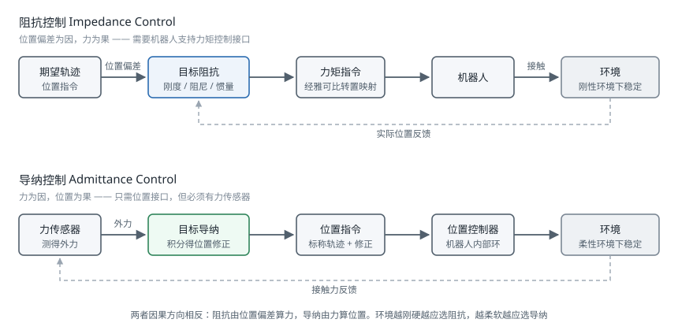

# 力控与柔顺控制

!!! note "引言"
    位置控制的机器人在自由空间中表现良好，一旦接触环境就会出问题：刚性的位置环遇到刚性的环境，几毫米的位置误差就会产生数百牛的接触力，轻则触发保护停机，重则损坏工件或机器人。柔顺控制（Compliance Control）的思路是让机器人在接触方向上"软"下来——不再固执地追求位置精度，而是调节自身对外力的响应特性。这是装配、打磨、人机协作等一切接触任务的基础。


## 为什么位置控制会失败

考虑机械臂末端以位置控制沿 \(z\) 方向下压一个刚度为 \(k_e\) 的环境。若位置指令比实际接触面低了 \(\Delta z\)，稳态接触力为：

$$f = k_e \Delta z$$

金属对金属的接触刚度可达 \(10^6\ \text{N/m}\) 量级。此时 \(\Delta z = 1\ \text{mm}\) 就意味着 1000 N 的接触力——远超多数机械臂的额定负载。

问题的本质是：**位置与力不能同时独立指定**。给定环境，指定了位置就等于指定了力，反之亦然。柔顺控制不去回避这个约束，而是显式地设计位置与力之间的关系。

实现柔顺有三条路径：

| 途径 | 做法 | 优点 | 缺点 |
|------|------|------|------|
| 被动柔顺 | 机械结构上引入弹性（RCC 柔顺装置、串联弹性执行器 SEA） | 响应带宽极高（物理响应）、本质安全 | 特性固定不可调、降低位置精度 |
| 主动柔顺 | 用力/位置反馈在控制器中构造柔顺行为 | 特性可在线调节、可按方向定制 | 受采样率与传感噪声限制、稳定性需分析 |
| 混合方案 | 弹性执行器 + 力反馈控制 | 兼顾带宽与可调性 | 硬件复杂、成本高 |

本页面主要讨论主动柔顺。


## 阻抗控制与导纳控制

### 目标阻抗

阻抗控制（Impedance Control）由 Hogan 于 1985 年提出，其核心思想是：不去直接控制位置或力，而是控制两者之间的**动态关系**，使机器人在外界看来等效于一个质量-弹簧-阻尼系统：

$$M_d \ddot{\mathbf{e}} + D_d \dot{\mathbf{e}} + K_d \mathbf{e} = \mathcal{F}_{ext}$$

其中 \(\mathbf{e} = \mathbf{x} - \mathbf{x}_d\) 为末端相对期望轨迹的偏差，\(M_d, D_d, K_d\) 分别为期望的惯量、阻尼与刚度矩阵。这三个矩阵是设计者的自由选择，决定了机器人"手感"的软硬。

关键在于**这些矩阵可以按方向分别设定**。轴孔装配中，插入方向（\(z\)）需要很软以避免卡阻，而横向（\(x, y\)）需要较硬以保持对准：

$$K_d = \text{diag}(2000,\ 2000,\ 200,\ 50,\ 50,\ 50)$$

单位为 N/m（平移）与 N·m/rad（旋转）。

### 两者的区别

阻抗控制与导纳控制的因果方向相反，这是理解它们适用场景的关键：



| | 阻抗控制 | 导纳控制 |
|---|---------|---------|
| 输入 | 位置偏差 | 测得的外力 |
| 输出 | 力矩指令 | 位置/速度指令 |
| 底层要求 | 机器人支持力矩控制 | 机器人只需位置控制接口 |
| 是否必需力传感器 | 否（可用关节力矩估计） | 是 |
| 适合的环境 | 刚性环境 | 柔性环境 |
| 机器人自身惯量的影响 | 天然被补偿 | 难以掩盖，低速时明显 |

**经验法则**：环境刚硬时用阻抗控制，环境柔软时用导纳控制。原因在于闭环稳定性——导纳控制在刚性接触下容易失稳（机器人推硬墙，测得大力，指令后退，脱离接触，力归零，又推回去，形成振荡）；阻抗控制在柔软环境中则显得迟钝。这一互补性被称为**接触稳定性的对偶问题**。

多数工业机械臂只提供位置接口，因此实际项目中导纳控制更常见，通常配一个腕部六维力传感器。而 Franka Panda、KUKA iiwa、UR e 系列等支持关节力矩控制的机器人则可以直接实现阻抗控制。

### 阻抗控制的实现

在关节空间实现笛卡尔阻抗，需要用[雅可比矩阵](../kinematics/jacobian.md)的静力学对偶把笛卡尔力映射为关节力矩：

$$\boldsymbol{\tau} = J^T\left(-K_d \mathbf{e} - D_d \dot{\mathbf{e}}\right) + \mathbf{g}(\mathbf{q}) + \boldsymbol{\tau}_{null}$$

其中 \(\mathbf{g}(\mathbf{q})\) 是重力补偿项（见 [机器人动力学](../kinematics/dynamics.md)），\(\boldsymbol{\tau}_{null}\) 是冗余机械臂的零空间力矩，用于姿态调节或关节限位规避。

注意上式**没有补偿机器人自身的惯量**，即实际的等效惯量是机器人在该位形下的操作空间惯量 \(\Lambda(\mathbf{q}) = (JM^{-1}J^T)^{-1}\) 而非设定的 \(M_d\)。要真正实现指定的 \(M_d\) 必须做惯量整形，这需要精确的动力学模型和力测量，且会放大噪声。工程上通常**接受机器人的自然惯量**，只整形刚度与阻尼——这被称为简化阻抗控制，稳定性好得多。

### 参数选取

阻尼通常按临界阻尼附近选取，以避免接触时的振荡与超调：

$$D_d = 2\zeta\sqrt{K_d \Lambda}, \qquad \zeta \in [0.7, 1.0]$$

刚度的选取要在两个约束之间权衡：

- **上界**：由采样率决定。离散实现中，刚度过高会使闭环在采样间隔内"过冲"，导致数值失稳。经验上要求 \(K_d < \frac{2 D_d}{T_s} - \Lambda \left(\frac{2}{T_s}\right)^2\) 量级，实际含义是：**采样率越低，能稳定实现的最大刚度越低**。1 kHz 控制周期通常能支持 3000–5000 N/m，250 Hz 则只有几百 N/m。
- **下界**：由任务的位置精度要求决定。刚度太低时，重力、摩擦与建模误差会造成明显的稳态位置偏差。

**被动性**（Passivity）是柔顺控制稳定性的核心概念：如果控制器保证机器人对外不产生能量，那么与任意被动环境（包括人）接触都是稳定的。基于能量罐（Energy Tank）的方法通过在线监测控制器输出的能量、在能量耗尽时自动降低刚度，可以在允许变刚度的同时保持被动性，是人机协作场景中的重要安全机制。


## 混合力/位置控制

混合力/位置控制（Hybrid Force/Position Control）由 Raibert 与 Craig 于 1981 年提出，思路与阻抗控制不同：它把任务空间按方向**划分**为力控子空间和位控子空间，各自独立闭环。

划分依据是**自然约束**（Natural Constraints）——由任务几何决定的、机器人无法违抗的约束：

| 任务 | 位置受约束的方向（做力控） | 位置自由的方向（做位控） |
|------|------------------------|----------------------|
| 平面打磨 | 垂直表面的法向 | 表面内的两个平移 + 绕法线的旋转 |
| 转动曲柄 | 除切向外的所有方向 | 沿圆周切向 |
| 沿槽滑动 | 槽壁的两个法向 | 沿槽方向 |
| 拧螺丝 | 轴向力 + 横向位移 | 绕轴旋转 |

用选择矩阵 \(S = \text{diag}(s_1,\dots,s_6)\)（\(s_i \in \{0,1\}\)）表达划分，控制律为：

$$\boldsymbol{\tau} = J^T\left[ S\,\mathbf{f}_{ctrl} + (I - S)\,\mathbf{x}_{ctrl} \right]$$

混合控制在几何明确的任务中效果很好，能实现严格的力跟踪。它的弱点是**必须准确知道接触几何**：如果表面法线估计错了 10°，力控与位控的方向就会串扰，产生沿表面的意外推力。因此在几何不确定的场景中，阻抗控制往往更稳健——它不需要区分方向，对所有方向统一施加柔顺行为。

实践中两者常结合使用：用阻抗控制作为底层保证安全，在其之上叠加特定方向的力跟踪。


## 接触检测与碰撞响应

### 无外部传感器的碰撞检测

对于有关节力矩传感或电流反馈的机器人，可以用**广义动量观测器**（Generalized Momentum Observer）估计外部力矩，无需力传感器且对加速度噪声不敏感：

定义广义动量 \(\mathbf{p} = M(\mathbf{q})\dot{\mathbf{q}}\)，残差信号为：

$$\mathbf{r}(t) = K_o\left[\mathbf{p}(t) - \int_0^t \left(\boldsymbol{\tau} + C^T\dot{\mathbf{q}} - \mathbf{g} + \mathbf{r}\right)d\tau - \mathbf{p}(0)\right]$$

可以证明 \(\mathbf{r}\) 是外部关节力矩 \(\boldsymbol{\tau}_{ext}\) 经过一阶低通滤波后的估计，截止频率由观测器增益 \(K_o\) 决定。它的优势在于**只用到位置与速度，不需要关节加速度**——加速度需二次差分，噪声极大，这是直接用动力学方程反推外力的方法在实践中不可用的原因。

残差还携带方向信息：\(\mathbf{r}\) 中哪些分量非零，可以定位碰撞发生在哪一段连杆上。

检测到碰撞后的响应策略按严重程度递增：

1. **零重力浮动**：切换到纯重力补偿，机器人变得可推动，适合人机协作
2. **沿碰撞反方向退避**：\(\dot{\mathbf{q}} = -k\,\mathbf{r}\)，主动脱离接触
3. **停止但保持使能**：保持当前位置，等待人工干预
4. **切断动力**：抱闸制动，用于严重碰撞

阈值设定是工程难点：太低会因摩擦变化和模型误差频繁误报，太高则无法在伤人前停下。实用做法是**阈值随速度自适应**——高速时收紧，静止时放宽——并在开机后先做一次空载运行以标定当前的摩擦基线。

### 安全标准

人机协作场景受 ISO 10218 与 ISO/TS 15066 约束，后者规定了人体各部位可承受的力与压强上限（例如手部瞬态接触力上限约 280 N，胸部约 210 N）。功率与力限制（Power and Force Limiting，PFL）模式下的机器人必须通过实测验证在最坏情况下不超过这些限值。这不是可以靠软件参数声明的——需要用专用的力压测量设备在实际工位上测试。四种协作模式的适用条件、人体各部位的限值表与实测方法，详见 [协作机器人安全](../hardware/safety-collaborative-robot.md)。


## 轴孔装配

轴孔装配（Peg-in-Hole）是接触任务的经典基准问题，其难点在于位置误差与几何约束的相互作用。

### 失败模式

- **卡住（Wedging）**：轴与孔在两点接触且接触力方向落在摩擦锥内，形成自锁。此时增大插入力**不会**解开，只会加剧——这是最需要避免的状态
- **卡阻（Jamming）**：施加的力与力矩组合落在不可行区域，插入停滞。与卡住不同，调整力矩方向可以解开
- **三点接触**：轴倾斜过大导致过约束

区分这两者很重要：卡住是几何自锁，只能退出重来；卡阻可通过改变加载方式化解。

### 常用策略

**倒角引导**：在孔口设计倒角，把位置误差转换为侧向力自动引导对准。这是最有效也最省事的办法——**能改机械设计就不要在控制上想办法**。倒角能容忍的位置误差约为倒角宽度的量级。

**螺旋搜索**（Spiral Search）：在孔平面内做螺旋轨迹搜索，同时施加恒定的轴向力，检测到轴向位移突变即认为找到孔位。

$$x(t) = r(t)\cos(\omega t),\quad y(t) = r(t)\sin(\omega t),\quad r(t) = v_r t$$

搜索半径的增长率 \(v_r\) 与角速度 \(\omega\) 决定螺旋线的间距，应小于轴与孔的间隙以免漏过。

**顺应中心**（Remote Center of Compliance，RCC）：机械式被动柔顺装置，其弹性中心设计在轴的末端，使侧向力产生纯平移、力矩产生纯转动，两者解耦。这是 1970 年代的发明，至今在高节拍产线上仍然是最快最可靠的方案——纯机械、零延迟。

**学习方法**：用强化学习或模仿学习直接从力/位信号学习插入策略，在间隙极小（微米级）或几何不规则的场景中优于手工策略，但需要真实机器人上的大量试错，且难以给出安全性保证。


## 代码示例

### 笛卡尔阻抗控制

```python
import numpy as np


class CartesianImpedanceController:
    """笛卡尔空间阻抗控制器（简化阻抗：不做惯量整形）"""

    def __init__(self, K_d, zeta=0.9, null_stiffness=5.0):
        self.K_d = np.asarray(K_d, dtype=float)      # (6,) 刚度对角元
        self.zeta = zeta
        self.null_stiffness = null_stiffness

    def damping(self, Lambda):
        """按临界阻尼比设定阻尼：D = 2*zeta*sqrt(K*Lambda)"""
        lam_diag = np.clip(np.diag(Lambda), 1e-6, None)
        return 2.0 * self.zeta * np.sqrt(self.K_d * lam_diag)

    def compute(self, x, x_d, dx, dx_d, J, M, g, q, q_rest):
        """返回关节力矩指令

        x, x_d:   当前与期望末端位姿误差量（6 维：平移 + 旋转向量）
        dx, dx_d: 当前与期望末端速度
        J:  (6,n) 几何雅可比;  M: (n,n) 质量矩阵;  g: (n,) 重力项
        """
        e = x - x_d
        de = dx - dx_d

        # 操作空间惯量，用于计算阻尼
        M_inv = np.linalg.inv(M)
        Lambda = np.linalg.inv(J @ M_inv @ J.T + 1e-9 * np.eye(6))
        D_d = self.damping(Lambda)

        # 笛卡尔空间的期望作用力（弹簧 + 阻尼）
        F = -self.K_d * e - D_d * de

        tau = J.T @ F + g

        # 零空间：把关节拉向舒适位形，不影响末端行为
        J_pinv = M_inv @ J.T @ Lambda
        N = np.eye(len(q)) - J.T @ J_pinv.T
        tau += N @ (-self.null_stiffness * (q - q_rest))
        return tau
```

零空间投影用的是**惯量加权伪逆** \(\bar{J} = M^{-1}J^T\Lambda\) 而非简单的 Moore-Penrose 伪逆。这一点很关键：只有惯量加权的投影才能保证零空间力矩在动力学意义上真正不影响末端运动，用普通伪逆会产生末端扰动。

### 导纳控制

```python
class AdmittanceController:
    """导纳控制：测得的力 -> 位置修正量，适合只有位置接口的机器人"""

    def __init__(self, M_d, D_d, K_d, dt):
        self.M_d = np.asarray(M_d, float)
        self.D_d = np.asarray(D_d, float)
        self.K_d = np.asarray(K_d, float)
        self.dt = dt
        self.e = np.zeros(6)          # 相对标称轨迹的位置修正
        self.de = np.zeros(6)

    def update(self, f_ext, deadband=2.0):
        """积分 M*ddx + D*dx + K*x = f_ext，返回位置修正量"""
        # 死区：滤掉传感器零漂与噪声，否则机器人会缓慢自行漂移
        f = np.where(np.abs(f_ext) > deadband,
                     f_ext - np.sign(f_ext) * deadband, 0.0)

        dde = (f - self.D_d * self.de - self.K_d * self.e) / self.M_d
        self.de += dde * self.dt
        self.e += self.de * self.dt
        return self.e.copy()

    def reset(self):
        self.e[:] = 0.0
        self.de[:] = 0.0
```

死区处理不可省略：六维力传感器普遍有 1–3 N 的零漂，且随温度变化。没有死区的导纳控制器在没有任何外力时也会缓慢漂移，这是现场调试中一个高频出现的"灵异现象"。

### 螺旋搜索插孔

```python
import numpy as np


def spiral_search_insert(arm, ft_sensor, T_start, axis_force=15.0,
                         max_radius=0.004, pitch=0.0008, omega=2.0,
                         dt=0.01, insert_thresh=0.002, timeout=30.0):
    """带轴向压力的螺旋搜索：检测到轴向突然下沉即认为对准孔位

    max_radius: 搜索范围，应覆盖标定与来料的最大位置误差
    pitch:      螺旋线间距，须小于轴孔间隙，否则会跳过孔位
    """
    z0 = T_start[2, 3]
    t = 0.0
    v_r = pitch * omega / (2 * np.pi)      # 由间距反推半径增长率

    while t < timeout:
        r = v_r * t
        if r > max_radius:
            return False, '搜索范围内未找到孔位'

        T = T_start.copy()
        T[0, 3] += r * np.cos(omega * t)
        T[1, 3] += r * np.sin(omega * t)

        # xy 位控做搜索，z 力控保持恒定压力
        arm.set_cartesian_target(T, force_axes=[2], target_force=[-axis_force])
        arm.step(dt)
        t += dt

        # 轴向明显下沉说明进入孔中
        if z0 - arm.tcp_pose()[2, 3] > insert_thresh:
            return True, f'在半径 {r * 1000:.2f} mm 处找到孔位'

        # 侧向力过大说明卡在孔口边缘，退回重试
        fx, fy = ft_sensor.read()[:2]
        if np.hypot(fx, fy) > 40.0:
            return False, '侧向力超限，可能已卡住'

    return False, '搜索超时'
```

### 广义动量碰撞检测

```python
class MomentumObserver:
    """基于广义动量的外力观测器，无需力传感器与关节加速度"""

    def __init__(self, gain, dt, n):
        self.K_o = float(gain)        # 增益即观测器截止频率 (rad/s)
        self.dt = dt
        self.integral = np.zeros(n)
        self.r = np.zeros(n)
        self.p_prev = None

    def update(self, M, C, g, q, dq, tau_cmd):
        p = M @ dq                                   # 广义动量
        if self.p_prev is None:
            self.p_prev = p.copy()

        # beta = g - C^T * dq，是动力学中与动量导数相关的项
        beta = g - C.T @ dq
        self.integral += (tau_cmd - beta + self.r) * self.dt
        self.r = self.K_o * (p - self.integral - self.p_prev)
        return self.r.copy()

    def collided(self, thresholds):
        """逐关节比较阈值，返回是否碰撞及最可能的碰撞连杆"""
        exceeded = np.abs(self.r) > np.asarray(thresholds)
        if not exceeded.any():
            return False, None
        # 残差非零的最靠近基座的关节，指示碰撞发生在其之后的连杆上
        return True, int(np.argmax(exceeded))
```


## 参数与选型速查

| 场景 | 推荐方案 | 典型刚度（平移） | 说明 |
|------|---------|----------------|------|
| 手动拖动示教 | 纯重力补偿 | 0 | 只补重力与摩擦，机器人自由浮动 |
| 人机协作作业 | 阻抗 + 能量罐 | 200–800 N/m | 需通过 ISO/TS 15066 实测验证 |
| 表面打磨抛光 | 混合力/位控制 | 法向力控，切向 2000 N/m | 需已知表面法线 |
| 轴孔装配（带倒角） | 阻抗，轴向软 | 轴向 200，横向 2000 N/m | 优先靠机械倒角引导 |
| 轴孔装配（无倒角） | 阻抗 + 螺旋搜索 | 轴向 100，横向 1500 N/m | 螺旋间距须小于间隙 |
| 精密插接（微米级） | 学习策略 + 力反馈 | 各向 100–500 N/m | 手工策略难以覆盖 |
| 碰撞检测（无力传感器） | 动量观测器 | — | 阈值随速度自适应 |


## 常见问题

- **接触瞬间振荡**：刚度超过了采样率能支持的上限。降低刚度或提高控制频率，不要试图靠增大阻尼硬压——过阻尼会让响应变得迟钝而不解决根本问题。
- **导纳控制自行漂移**：力传感器零漂未处理。上电时做一次去皮（Tare），并设置合理死区。
- **重力补偿不准，机器人下垂**：末端负载未标定。夹爪和工件的质量与质心必须计入动力学模型，可通过几个静态姿态的力矩读数辨识。
- **零空间运动引起末端抖动**：用了普通伪逆而非惯量加权伪逆做零空间投影。
- **碰撞检测频繁误报**：摩擦模型不准。先做空载慢速全行程运行，记录残差基线，把基线作为阈值的偏置。
- **力控在某些位形失效**：接近奇异位形时 \(J^T\) 病态，某些方向的力无法产生。见 [雅可比矩阵与奇异性](../kinematics/jacobian.md)。


## 参考资料

1. Hogan, N. (1985). Impedance Control: An Approach to Manipulation, Parts I-III. *Journal of Dynamic Systems, Measurement, and Control*, 107(1), 1-24. — 阻抗控制的开创性论文。
2. Raibert, M. H. & Craig, J. J. (1981). Hybrid Position/Force Control of Manipulators. *Journal of Dynamic Systems, Measurement, and Control*, 103(2), 126-133.
3. Villani, L. & De Schutter, J. (2016). Force Control. In *Springer Handbook of Robotics* (2nd ed.), 195-220.
4. De Luca, A. & Mattone, R. (2005). Sensorless Robot Collision Detection and Hybrid Force/Motion Control. *IEEE International Conference on Robotics and Automation*, 999-1004. — 广义动量观测器。
5. Haddadin, S., De Luca, A. & Albu-Schäffer, A. (2017). Robot Collisions: A Survey on Detection, Isolation, and Identification. *IEEE Transactions on Robotics*, 33(6), 1292-1312.
6. Whitney, D. E. (1982). Quasi-Static Assembly of Compliantly Supported Rigid Parts. *Journal of Dynamic Systems, Measurement, and Control*, 104(1), 65-77. — 轴孔装配与 RCC 的理论基础。
7. Ott, C., Mukherjee, R. & Nakamura, Y. (2010). Unified Impedance and Admittance Control. *IEEE International Conference on Robotics and Automation*, 554-561.
8. ISO/TS 15066:2016. *Robots and Robotic Devices — Collaborative Robots*. International Organization for Standardization.
