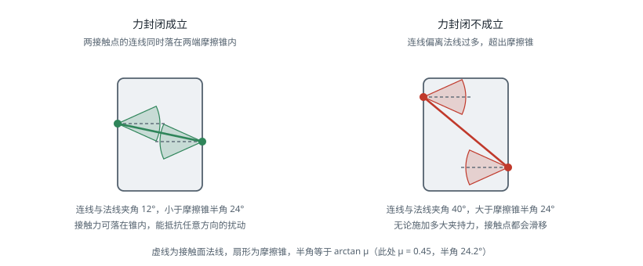

# 抓取

!!! note "引言"
    抓取（Grasping）要回答的问题看似简单：手应该放在哪里、以什么姿态闭合，才能稳稳地拿起这个物体。但它同时涉及接触力学（什么样的接触才算稳）、几何推理（夹爪能否无碰撞地插入）、机械臂运动学（这个位姿能否到达），以及在真实场景中最棘手的一点——物体往往是未知的、堆叠的、部分被遮挡的。本页面从力学判据出发，介绍解析方法与数据驱动方法两条技术路线及其工程取舍。


## 抓取的力学基础

### 接触模型

抓取分析的第一步是刻画手指与物体之间的接触能传递什么力。常用三种理想模型：

| 接触模型 | 可传递的力/力矩 | 约束维度 | 适用情形 |
|---------|----------------|---------|---------|
| 无摩擦点接触 | 沿法线的压力 | 1 | 光滑刚性接触，最保守的假设 |
| 有摩擦点接触（PCWF） | 法向力 + 两个切向摩擦力 | 3 | 指尖接触，最常用 |
| 软指接触（Soft Finger） | 上述三者 + 绕法线的扭矩 | 4 | 弹性指垫，接触为面而非点 |

有摩擦点接触要求接触力落在**摩擦锥**（Friction Cone）内：

$$\sqrt{f_t^2 + f_o^2} \le \mu f_n, \qquad f_n \ge 0$$

其中 \(f_n\) 为法向力，\(f_t, f_o\) 为两个切向分量，\(\mu\) 为摩擦系数。摩擦锥是一个二次锥约束，为便于线性规划求解，实践中常用内接的多面锥（Polyhedral Cone，通常取 8 边）近似，代价是略微保守。

摩擦系数在实际中很不可靠：橡胶指垫对纸箱可能有 \(\mu \approx 0.8\)，对光滑塑料只有 \(0.2\)，且随污染、磨损、湿度变化。因此依赖高摩擦的抓取方案在长期运行中容易退化——这是产线上偏爱形封闭夹具与吸盘的原因之一。

### 力封闭与形封闭

**形封闭**（Form Closure）：仅靠接触的几何约束就能完全限制物体的所有运动，与摩擦无关。需要至少 7 个接触点（三维刚体），条件苛刻，实际中主要出现在专用夹具中。

**力封闭**（Force Closure）：允许施加接触力（在摩擦锥内）来抵抗任意外部扰动力旋量。这是抓取分析的核心判据。

形式化地：设第 \(i\) 个接触点能施加的力旋量集合为 \(\mathcal{W}_i\)，抓取的**抓取旋量空间**（Grasp Wrench Space，GWS）为各接触点力旋量集合的凸包：

$$\mathcal{W} = \text{ConvexHull}\left(\bigcup_i \mathcal{W}_i\right)$$

**力封闭成立的充要条件是原点位于 \(\mathcal{W}\) 的内部**。直观理解：只要原点在内部，任意方向的外部扰动都能被某组合法的接触力抵消。

有摩擦时，力封闭最少只需要 2 个接触点（平面）或 3 个接触点（空间），远少于形封闭，这解释了为什么二指夹爪足以应付大量任务。

对二指夹爪而言，力封闭的判据可以直观地表述为：两接触点的连线必须同时落在两端的摩擦锥内。这也正是后文对偶点采样的依据：



### 抓取质量度量

力封闭是二元判据，工程上还需要一个连续的质量分数来排序候选抓取：

**\(\epsilon\) 度量（Ferrari-Canny）**：GWS 中能内接的最大球的半径，即原点到凸包边界的最小距离。

$$Q_\epsilon = \min_{\mathbf{w} \in \partial\mathcal{W}} \|\mathbf{w}\|$$

物理意义是抓取在**最弱方向**上能抵抗的扰动大小。这是理论上最合理的度量，但对接触点位置的微小变化很敏感，且力与力矩量纲不同，需要引入特征长度做归一化——这个归一化因子的选取相当任意，是该度量在实践中的主要弱点。

**其他常用度量**：

- **抓取旋量空间体积** \(Q_v = \text{Vol}(\mathcal{W})\)：反映整体能力，但可能掩盖某个方向上的薄弱
- **接触点分布**：接触点越接近物体质心、彼此夹角越接近对称，抓取越稳
- **抗滑移裕度**：接触力方向与摩擦锥中心线的夹角
- **鲁棒性度量**：在物体位姿、摩擦系数上加扰动后重新评估，取成功率。Dex-Net 采用的正是这一思路，它比确定性度量更贴近真实成功率

一个务实的观察：**理论度量与真实成功率的相关性并不高**。真实失败往往来自感知误差（物体位姿偏了 5 mm）、标定误差（手眼标定偏了 2°）、动力学效应（提起时的加速度），而这些都不在力封闭分析的范畴内。这正是数据驱动方法后来居上的原因。


## 夹爪类型与抓取模式

| 夹爪 | 抓取模式 | 优势 | 局限 |
|------|---------|------|------|
| 二指平行夹爪 | 侧夹（Pinch）、包裹（Power） | 结构简单、刚度高、控制只需一个自由度 | 物体宽度需在行程内，形状不能太不规则 |
| 真空吸盘 | 表面吸附 | 只需一个可吸附面，速度快，是物流分拣的主力 | 需要平整密封表面，多孔、柔软、多灰尘物体失效 |
| 自适应欠驱动手 | 包裹 | 一个电机驱动多指，自动贴合形状，容错性极好 | 抓取力受限，无法精确控制接触点 |
| 磁力夹具 | 磁吸 | 对铁磁材料极可靠 | 材料受限，断电风险需机械自锁 |
| 针刺式 / 静电吸附 | 特殊 | 可抓布料、纸张等柔软薄物 | 会损伤物体表面，应用面窄 |

两种典型抓取模式的取舍：**指尖抓取**（Precision Grasp）接触点少、可控性好，适合需要后续精细操作的场景；**包裹抓取**（Power Grasp）接触面大、承载能力强、抗扰动好，适合搬运重物。


## 解析方法

解析方法假设物体的几何模型已知，通过采样与优化搜索满足力封闭的接触点组合。

典型流程：

1. 在物体表面均匀采样候选接触点及其法线
2. 枚举接触点组合（二指夹爪即对偶点对）
3. 对每组组合构造 GWS，检验力封闭，计算 \(Q_\epsilon\)
4. 加入夹爪几何约束：开口宽度、指长、夹爪本体与物体及环境的碰撞检测
5. 加入机械臂约束：该抓取位姿的逆运动学是否有解、是否远离奇异、趋近路径是否无碰撞
6. 按质量排序输出

**对偶点采样**（Antipodal Sampling）是二指夹爪最有效的启发式：随机采样一个表面点，沿其法线反方向做射线求交得到对面点，若两点法线近似共线且反向，则这对点构成一个良好的对偶抓取。因为对于二指夹爪，力封闭的必要条件正是两个接触点的连线落在两端的摩擦锥内。

解析方法的适用边界很清楚：**物体模型必须已知且准确**。在产线上零件 CAD 模型齐备的场景，它可靠、可解释、可离线预计算抓取数据库；在面对未知物体的场景中，它无从下手。

代表性工具是 [GraspIt!](https://graspit-simulator.github.io/) 与 [Dex-Net](https://berkeleyautomation.github.io/dex-net/) 的解析部分，后者用解析方法离线生成了数百万条带标注的抓取样本，进而用于训练神经网络——这是两条路线的一次成功结合。


## 数据驱动方法

数据驱动方法直接从传感器数据预测抓取位姿，不要求物体模型，是当前处理未知物体的主流。

### 方法演进

| 方法 | 年份 | 输入 | 输出 | 关键思路 |
|------|------|------|------|---------|
| Dex-Net 2.0 | 2017 | 深度图 | 抓取质量分数 | 用解析度量在仿真中生成 670 万样本训练 GQ-CNN |
| GG-CNN | 2018 | 深度图 | 逐像素抓取质量与角度 | 全卷积、实时（>50 Hz），适合闭环抓取 |
| PointNetGPD | 2019 | 点云 | 候选抓取评分 | 直接在点云上评估接触区域 |
| 6-DOF GraspNet | 2019 | 点云 | 6 自由度抓取位姿 | 变分自编码器生成候选，再评估筛选 |
| Contact-GraspNet | 2021 | 点云 | 6 自由度抓取 | 把抓取参数化到可见接触点上，大幅缩小搜索空间 |
| GraspNet-1Billion | 2020 | RGB-D | 稠密抓取位姿 | 提供大规模真实标注数据集与统一评测基准 |
| AnyGrasp | 2023 | RGB-D | 6 自由度抓取 | 支持动态场景与时序稳定的抓取跟踪 |

一个重要的分水岭是从 **4 自由度**（自顶向下抓取：\(x, y, z\) 加绕竖直轴的旋转）到 **6 自由度**（任意方向进入）的转变。4 自由度实现简单、在货箱分拣中够用，但无法处理需要侧向或斜向进入的场景（如从架子上取物、抓取躺倒的瓶子）。

### 训练数据的来源

数据是这条路线的核心瓶颈，三种来源各有代价：

- **仿真生成**：用解析度量在物理仿真中自动标注，可以量产（百万级），但存在 sim-to-real 差距，尤其是深度相机的噪声特性和摩擦模型
- **真实机器人自监督**：让机器人反复尝试抓取并记录成败，标签最真实，但采集速度受物理时间限制（每次数秒），且硬件会磨损
- **人工标注**：质量最高、成本最高，GraspNet-1Billion 采用的是半自动方式——人工标注少量物体的抓取，再通过物体位姿变换扩展到大量场景

### 杂乱场景

真实的箱内分拣（Bin Picking）远比单物体抓取困难，额外的挑战包括：

- **实例分割**：先要把堆叠的物体分开，通常借助 [分割](../cv/segmentation.md) 中的类别无关分割方法（如 SAM、UOIS）
- **抓取顺序**：应优先抓取顶层、无遮挡、抓取后不会引起堆垛坍塌的物体
- **推-抓协同**（Push-Grasping）：当没有可行抓取时，先用夹爪推开物体制造空间，再抓取。这需要把抓取和非抓取动作放在同一个决策框架中，通常用强化学习实现
- **失败恢复**：检测抓空、滑落、多抓，并触发重试。工程上这部分代码量往往超过抓取算法本身


## 感知与标定

抓取精度的上限由感知与标定决定，算法再好也无法弥补几毫米的系统性偏差。

**手眼标定**（Hand-Eye Calibration）求解相机与机器人之间的固定变换，分两种构型：

- **眼在手上**（Eye-in-Hand）：相机装在末端，求 \({}^{tool}T_{cam}\)
- **眼在手外**（Eye-to-Hand）：相机固定在环境中，求 \({}^{base}T_{cam}\)

两者都归结为求解 \(AX = XB\) 形式的方程。实施要点：

- 标定姿态要覆盖足够大的旋转范围，且旋转轴方向要有多样性。仅做平移或绕单一轴旋转会使问题欠定，是标定结果不稳定的最常见原因
- 至少采集 15–20 组姿态，用重投影误差剔除离群值
- 标定结果应在实际工作区域内验证，而不只看拟合残差：让机器人去触碰几个已知点，测量实际偏差
- 机械臂受热后连杆会热膨胀，长时间运行的高精度系统需要定期重新标定

**深度相机的系统误差**同样关键：多数结构光与 ToF 相机在物体边缘会产生"飞点"，对反光和透明物体直接失效。工程上的常见对策是限制工作距离到相机的最佳量程、对深度图做双边滤波、以及在必要时改用双目主动红外方案。相关内容详见 [深度相机](../sensing/depth-camera.md)。


## 代码示例

### 对偶点抓取采样

```python
import numpy as np


def sample_antipodal_grasps(points, normals, mu=0.5, max_width=0.08,
                            n_samples=2000, angle_tol=None, rng=None):
    """在点云上采样二指对偶抓取

    points, normals: (N,3) 表面点及其外法线（法线需已归一化）
    mu:              摩擦系数，决定摩擦锥半角
    max_width:       夹爪最大开口
    返回: 抓取列表 [(中心点, 闭合方向, 开口宽度), ...]
    """
    rng = rng or np.random.default_rng(0)
    if angle_tol is None:
        angle_tol = np.arctan(mu)          # 摩擦锥半角

    n = len(points)
    grasps = []
    for _ in range(n_samples):
        i, j = rng.integers(0, n, size=2)
        if i == j:
            continue

        d = points[j] - points[i]
        width = np.linalg.norm(d)
        if width < 1e-3 or width > max_width:
            continue
        d /= width

        # 力封闭的必要条件：连线方向落在两端的摩擦锥内
        # 外法线朝外，故接触力方向为 -normal
        a_i = np.arccos(np.clip(np.dot(d, -normals[i]), -1, 1))
        a_j = np.arccos(np.clip(np.dot(-d, -normals[j]), -1, 1))
        if a_i < angle_tol and a_j < angle_tol:
            grasps.append(((points[i] + points[j]) / 2, d, width))

    return grasps


def grasp_score(center, axis, width, points, com, max_width):
    """简易排序打分：接触线越靠近质心、开口越有余量越好"""
    # 质心到抓取轴线的垂距，越小越稳
    v = com - center
    lever = np.linalg.norm(v - np.dot(v, axis) * axis)
    # 开口余量，避免贴着极限尺寸抓
    margin = (max_width - width) / max_width
    return float(np.exp(-lever / 0.05) * (0.5 + 0.5 * margin))


if __name__ == '__main__':
    # 构造一个长方体表面的点云做演示
    rng = np.random.default_rng(0)
    a, b, c = 0.06, 0.04, 0.10          # 半长宽高
    pts, nrm = [], []
    for axis in range(3):
        for sign in (+1, -1):
            m = rng.random((400, 3)) * 2 - 1
            m[:, axis] = sign
            pts.append(m * np.array([a, b, c]))
            nv = np.zeros(3); nv[axis] = sign
            nrm.append(np.tile(nv, (400, 1)))
    points = np.vstack(pts); normals = np.vstack(nrm)
    com = points.mean(axis=0)

    grasps = sample_antipodal_grasps(points, normals, mu=0.5, max_width=0.09)
    print(f'采样得到 {len(grasps)} 个对偶抓取')

    scored = sorted(grasps,
                    key=lambda g: -grasp_score(g[0], g[1], g[2], points, com, 0.09))
    for center, axis, width in scored[:3]:
        print(f'  中心 {np.round(center, 4)}  开口 {width * 1000:.1f} mm  '
              f'闭合方向 {np.round(axis, 3)}')
```

对偶采样只保证了力封闭的必要条件，输出的候选还必须经过夹爪碰撞检测与逆运动学可达性筛选才能执行——这两步通常淘汰掉大部分候选。

### 手眼标定（眼在手上）

```python
import cv2
import numpy as np

# R_gripper2base, t_gripper2base: 各次采样时机械臂正运动学给出的末端位姿
# R_target2cam,  t_target2cam:   同一时刻相机观测标定板得到的位姿
R_cam2gripper, t_cam2gripper = cv2.calibrateHandEye(
    R_gripper2base, t_gripper2base,
    R_target2cam,   t_target2cam,
    method=cv2.CALIB_HAND_EYE_TSAI)

T_cam2gripper = np.eye(4)
T_cam2gripper[:3, :3] = R_cam2gripper
T_cam2gripper[:3, 3] = t_cam2gripper.ravel()
print('相机相对末端的位姿:\n', np.round(T_cam2gripper, 5))

# 验证：把相机系下的抓取位姿换算到基座系
def cam_to_base(T_grasp_in_cam, T_gripper2base):
    return T_gripper2base @ T_cam2gripper @ T_grasp_in_cam
```

`calibrateHandEye` 提供多种求解器（Tsai、Park、Horaud、Andreff、Daniilidis）。建议对同一批数据用不同方法各求一次，若结果差异超过 1 mm 或 0.5°，说明数据本身的姿态多样性不足，应重新采集而不是挑一个"看起来最好"的结果。

### 抓取执行状态机

```python
from enum import Enum, auto


class GraspState(Enum):
    APPROACH = auto()      # 沿抓取轴退后一段距离的预抓取位姿
    REACH = auto()         # 直线插补到抓取位姿
    CLOSE = auto()         # 闭合夹爪
    VERIFY = auto()        # 检查是否真的抓到
    LIFT = auto()          # 垂直提起
    DONE = auto()
    FAILED = auto()


def execute_grasp(arm, gripper, T_grasp, approach_dist=0.10,
                  lift_dist=0.15, force=40.0):
    """标准抓取流水线：预抓取 -> 趋近 -> 闭合 -> 验证 -> 提起"""
    # 预抓取位姿：沿夹爪 z 轴（趋近方向）后退
    T_pre = T_grasp.copy()
    T_pre[:3, 3] -= T_grasp[:3, 2] * approach_dist

    if not arm.move_to(T_pre):                       # 自由空间规划，可绕障
        return GraspState.FAILED

    gripper.open()
    if not arm.move_linear(T_grasp):                 # 直线趋近，避免碰倒物体
        return GraspState.FAILED

    gripper.close(force=force)

    # 验证：夹爪未完全闭合说明夹住了东西；完全闭合说明抓空
    if gripper.width() < 0.002:
        gripper.open()
        return GraspState.FAILED

    T_lift = T_grasp.copy()
    T_lift[2, 3] += lift_dist
    if not arm.move_linear(T_lift):
        return GraspState.FAILED

    # 提起后再验证一次，捕捉提升过程中的滑落
    if gripper.width() < 0.002:
        return GraspState.FAILED

    return GraspState.DONE
```

两处细节值得强调：**趋近段必须用直线插补而非自由规划**，否则规划器可能选择一条绕行路径，在最后一刻从侧面撞倒物体；**提起后要再验证一次**，因为很多滑落发生在加速阶段而非闭合瞬间。


## 常见问题

- **抓取位姿可行但机械臂到不了**：抓取生成阶段没有考虑机器人运动学。应在候选筛选中加入逆运动学可达性检查，把不可达的候选直接剔除。
- **夹爪撞到物体或料箱**：碰撞检测只检查了夹爪指尖，没有检查夹爪本体与趋近路径。应对整个夹爪几何做扫掠体检测。
- **抓取成功但姿态偏了**：物体在闭合过程中被推动。可通过降低闭合速度、使用自适应指、或在抓取后用力反馈重新估计物体位姿来缓解。
- **透明或反光物体抓不到**：深度相机在这类表面上直接失效。可改用偏振相机、双目主动红外，或使用专门针对透明物体的深度补全方法（如 ClearGrasp）。
- **仿真里成功、实机失败**：优先怀疑标定与深度噪声，而不是算法。先用简单的已知物体验证整条流水线的绝对精度，确认系统误差在毫米级以内，再排查算法。
- **成功率随时间下降**：夹爪指垫磨损导致摩擦系数变化，或机械臂受热导致标定漂移。应建立定期标定与易损件更换的维护流程。


## 参考资料

1. Bicchi, A. & Kumar, V. (2000). Robotic Grasping and Contact: A Review. *IEEE International Conference on Robotics and Automation*, 348-353.
2. Ferrari, C. & Canny, J. (1992). Planning Optimal Grasps. *IEEE International Conference on Robotics and Automation*, 2290-2295. — \(\epsilon\) 度量的原始论文。
3. Mahler, J., et al. (2017). Dex-Net 2.0: Deep Learning to Plan Robust Grasps with Synthetic Point Clouds and Analytic Grasp Metrics. *Robotics: Science and Systems (RSS)*.
4. Fang, H.-S., Wang, C., Gou, M. & Lu, C. (2020). GraspNet-1Billion: A Large-Scale Benchmark for General Object Grasping. *IEEE/CVF Conference on Computer Vision and Pattern Recognition (CVPR)*.
5. Sundermeyer, M., Mousavian, A., Triebel, R. & Fox, D. (2021). Contact-GraspNet: Efficient 6-DoF Grasp Generation in Cluttered Scenes. *IEEE International Conference on Robotics and Automation (ICRA)*.
6. Fang, H.-S., et al. (2023). AnyGrasp: Robust and Efficient Grasp Perception in Spatial and Temporal Domains. *IEEE Transactions on Robotics*.
7. Zeng, A., et al. (2018). Learning Synergies Between Pushing and Grasping with Self-Supervised Deep Reinforcement Learning. *IEEE/RSJ International Conference on Intelligent Robots and Systems (IROS)*.
8. Tsai, R. Y. & Lenz, R. K. (1989). A New Technique for Fully Autonomous and Efficient 3D Robotics Hand/Eye Calibration. *IEEE Transactions on Robotics and Automation*, 5(3), 345-358.
