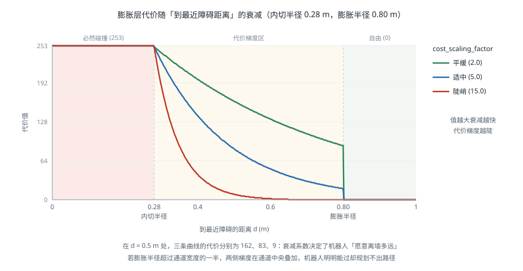

# 代价地图

!!! note "引言"
    代价地图（Costmap）是导航栈中所有规划器共同依赖的世界模型：它把传感器观测、静态地图与机器人尺寸统一成一张二维的代价栅格，规划器只需要在这张图上避开高代价区域即可。绝大多数「机器人不动了」「路径贴着墙」「过不了门」的问题，根源都在代价地图的配置而不在规划算法本身。本页面介绍分层结构、代价值的含义、膨胀模型的数学形式，以及一套参数整定与排障的方法。


## 代价值的含义

代价地图中每个栅格存一个 0–255 的字节，但取值并非连续语义，而是几个有特定含义的区间：

| 取值 | 名称 | 含义 |
|------|------|------|
| 0 | FREE_SPACE | 自由空间，机器人中心可安全通行 |
| 1–252 | 中间代价 | 越大越危险，由膨胀层生成，用于「远离障碍」的偏好 |
| 253 | INSCRIBED_INFLATED_OBSTACLE | 机器人中心若在此，其内切圆必与障碍相交，即必然碰撞 |
| 254 | LETHAL_OBSTACLE | 障碍本身所在的栅格 |
| 255 | NO_INFORMATION | 未知区域，从未被传感器观测过 |

理解 253 这个值是关键：**它不是「很危险」，而是「一定碰撞」**。规划器把 253 与 254 同等看待，都视为不可通行。而 1–252 只是偏好——路径会尽量避开，但必要时可以穿过。

`NO_INFORMATION`（255）的处理方式由参数决定。全局代价地图中通常允许穿越未知区域（否则机器人永远无法探索新地方），局部代价地图中则通常把未知视为自由（否则刚上电时机器人四周全是未知，寸步难行）：

```yaml
global_costmap:
  ros__parameters:
    track_unknown_space: true      # 保留未知状态，规划器可选择性穿越
local_costmap:
  ros__parameters:
    track_unknown_space: false     # 未知一律当作自由空间
```


## 分层结构

代价地图由若干图层依次叠加而成，每层只负责一类信息，最终按「取最大值」或各层自定义的规则合成主地图。这一设计的价值在于各层可以独立更新与独立调试。

| 图层 | 数据来源 | 作用 |
|------|---------|------|
| 静态层（Static Layer） | SLAM 建好的地图或人工绘制 | 提供墙体等固定结构 |
| 障碍层（Obstacle Layer） | 激光、深度相机点云 | 加入实时观测到的障碍，并做射线清除 |
| 体素层（Voxel Layer） | 三维点云 | 在三维体素中累积观测，再投影到二维，能正确处理悬空障碍 |
| 膨胀层（Inflation Layer） | 上述各层的输出 | 按机器人尺寸把障碍向外扩散出代价梯度 |
| 自定义层 | 任意 | 禁行区、单向通道、减速区、语义信息 |

**膨胀层必须放在最后**。它的输入是其他层合成后的障碍分布，如果顺序放错，后加入的障碍不会被膨胀，机器人会直接撞上去。

### 障碍层的清除机制

障碍层不只是「把观测到的点标记为障碍」，它还必须**清除**已经消失的障碍——否则一个走过的行人会在地图上留下永久的鬼影，最终把通道全部堵死。

清除通过射线追踪（Raytracing）完成：从传感器原点到每个观测点连一条射线，射线经过的栅格标记为自由，射线终点标记为障碍。两个关键参数：

```yaml
obstacle_layer:
  observation_sources: scan
  scan:
    topic: /scan
    max_obstacle_height: 2.0
    obstacle_max_range: 2.5      # 超过此距离的观测不用于标记障碍
    raytrace_max_range: 3.0      # 射线清除的最大距离
    clearing: true
    marking: true
```

**`raytrace_max_range` 必须大于 `obstacle_max_range`**，否则会出现只标记不清除的区域：在 2.5–3.0 m 之间标记的障碍，若清除范围只到 2.5 m，就永远无法被擦掉。这是鬼影障碍最常见的成因。

标记范围小于传感器量程也是有意为之：远处的激光点角分辨率低、位姿误差被放大，标记出的障碍位置不准。让机器人靠近了再标记，精度更高。

### 何时需要体素层

二维激光只能看到一个平面。以下情况必须用体素层或额外的三维传感器：

- **悬空障碍**：桌面、伸出的货架、横杆——激光从下方穿过，机器人一头撞上去
- **低矮障碍**：门槛、地面杂物、脚——低于激光高度，完全不可见
- **负障碍**：台阶下沿、坑洞——激光打不到「没有东西」的地方

体素层在三维体素网格中累积观测，再按高度区间投影到二维代价地图，能正确处理前两类。负障碍则需要下视深度相机或专门的悬崖传感器。


## 膨胀模型

膨胀层把障碍按机器人尺寸向外扩散，使规划器可以把机器人当作一个点来处理——这正是 [运动规划](motionplanning.md) 中构型空间的二维实现。

### 两个半径

- **内切半径**（inscribed radius）：机器人足迹内切圆的半径。中心到障碍的距离小于它，必然碰撞
- **外接半径**（circumscribed radius）：足迹外接圆的半径。中心到障碍的距离大于它，必然不碰撞
- 两者之间是「取决于朝向」的灰色地带

膨胀层据此生成代价：

$$
\text{cost}(d) = \begin{cases}
254 & d = 0 \quad (\text{障碍本身}) \\
253 & 0 < d \le r_{in} \\
\left\lfloor 252 \cdot e^{-\alpha (d - r_{in})} \right\rfloor & r_{in} < d \le r_{inf} \\
0 & d > r_{inf}
\end{cases}
$$

其中 \(d\) 为到最近障碍的距离，\(r_{in}\) 为内切半径，\(r_{inf}\) 为膨胀半径（`inflation_radius`），\(\alpha\) 为衰减系数（`cost_scaling_factor`）。



### 两个参数的实际影响

**`inflation_radius`** 决定代价梯度延伸多远。它应当**大于机器人内切半径**，否则规划器完全没有远离障碍的倾向，路径会紧贴墙面。常见取值是内切半径的 2–4 倍。

但它也不能过大：如果 `inflation_radius` 超过通道宽度的一半，通道中央的代价也会被抬高；若两侧膨胀区在中央重叠并达到 253，通道会在代价地图上被**完全封死**，机器人明明能过却规划不出路径。这是「过不了窄门」问题的头号原因。

**`cost_scaling_factor`** 决定衰减快慢。注意它出现在指数的负号上，**值越大衰减越快、代价梯度越陡**——这一点与直觉相反，是配置时最常搞错的参数。

| `cost_scaling_factor` | 代价分布 | 机器人行为 |
|----------------------|---------|-----------|
| 小（1–3） | 平缓，远处仍有可观代价 | 明显走中间，但窄通道容易被封死 |
| 中（5–10） | 适中 | 多数场景的合理起点 |
| 大（15+） | 陡峭，稍远即归零 | 贴墙走，但能通过窄处 |

### 足迹的选择

代价地图支持圆形足迹（`robot_radius`）与多边形足迹（`footprint`）两种：

```yaml
# 圆形：计算最快，适合近似圆形的底盘
robot_radius: 0.28

# 多边形：精确得多，长方形底盘必须用这个
footprint: "[[0.32, 0.22], [0.32, -0.22], [-0.24, -0.22], [-0.24, 0.22]]"
```

长方形底盘用圆形足迹近似会带来两难：用外接圆则过于保守，窄通道过不去；用内切圆则会漏检，横向通过窄缝时会剐蹭。此时必须使用多边形足迹，代价是碰撞检测变慢。

足迹坐标以 `base_link` 为原点，注意**要包含突出的部件**——机械臂、保险杠、传感器支架。一个只按底盘轮廓配置足迹、却忽略了前伸传感器的机器人，会稳定地用传感器去撞门框。


## 参数整定流程

一套务实的整定顺序：

1. **先量准足迹**。用卷尺量机器人的实际外形（含突出件），配置多边形足迹。这一步错了后面全错。
2. **确认分辨率**。`resolution` 通常取 0.05 m。太粗会导致窄通道消失，太细会显著增加 CPU 与内存开销。局部地图可以比全局地图细。
3. **设置膨胀半径**。从「内切半径 × 2」起步，然后在 RViz 中观察：机器人常走的通道中央是否仍为低代价？
4. **调整衰减系数**。从 5 起步。路径贴墙就减小它，窄通道过不去就增大它。
5. **调整局部地图尺寸**。`width`/`height` 应至少覆盖局部规划器的前瞻距离，通常 3–6 m。过大会浪费算力。
6. **验证更新频率**。用 `ros2 topic hz` 确认代价地图实际更新频率达到配置值，达不到说明 CPU 不足，需降低分辨率或缩小尺寸。

```yaml
local_costmap:
  ros__parameters:
    update_frequency: 5.0
    publish_frequency: 2.0
    global_frame: odom          # 局部地图必须在 odom 系，保证连续性
    robot_base_frame: base_link
    rolling_window: true
    width: 4
    height: 4
    resolution: 0.05
    footprint: "[[0.32, 0.22], [0.32, -0.22], [-0.24, -0.22], [-0.24, 0.22]]"
    plugins: ["obstacle_layer", "inflation_layer"]
    inflation_layer:
      plugin: "nav2_costmap_2d::InflationLayer"
      cost_scaling_factor: 5.0
      inflation_radius: 0.55

global_costmap:
  ros__parameters:
    update_frequency: 1.0
    global_frame: map           # 全局地图在 map 系，保证绝对正确
    rolling_window: false
    resolution: 0.05
    track_unknown_space: true
    plugins: ["static_layer", "obstacle_layer", "inflation_layer"]
```

注意两张地图的 `global_frame` 不同：局部地图用 `odom` 换取连续性，全局地图用 `map` 换取绝对正确性。**把局部地图配成 `map` 系是一个隐蔽而严重的错误**——定位跳变时，局部地图会整体平移，局部规划器会看到障碍瞬间移动，进而输出剧烈变化的速度指令。


## 常见问题

- **鬼影障碍越积越多**：`raytrace_max_range` 小于 `obstacle_max_range`，或传感器帧率过低导致清除不及时。也可能是 `tf` 时间戳有偏差，导致射线打在错误的位置。
- **机器人「站在」障碍里，完全无法规划**：定位偏移，或膨胀半径过大使机器人所在位置代价达到 253。RViz 中同时显示足迹与代价地图即可确认。
- **窄门通不过**：膨胀区在通道中央重叠。增大 `cost_scaling_factor` 或减小 `inflation_radius`；若通道确实很窄，需要为该区域配置单独的参数集。
- **动态障碍残留一段时间才消失**：正常现象，取决于清除频率。若不可接受，可提高障碍层更新频率，或在恢复行为中加入清空代价地图。
- **代价地图更新不及时，机器人反应迟钝**：检查实际更新频率。CPU 不足时优先降低全局地图的更新频率，它对实时性要求最低。
- **玻璃门、镜面无法被检测**：激光直接穿透或产生错误反射。需要额外的超声或红外传感器，或在地图中人工标注禁行区。


## 参考资料

1. Lu, D. V., Hershberger, D. & Smart, W. D. (2014). Layered Costmaps for Context-Sensitive Navigation. *IEEE/RSJ International Conference on Intelligent Robots and Systems (IROS)*, 709-715. — 分层代价地图的原始论文。
2. Marder-Eppstein, E., et al. (2010). The Office Marathon: Robust Navigation in an Indoor Office Environment. *IEEE International Conference on Robotics and Automation (ICRA)*.
3. [nav2_costmap_2d 配置文档](https://docs.nav2.org/configuration/packages/configuring-costmaps.html)
4. [Spatio-Temporal Voxel Layer (STVL)](https://github.com/SteveMacenski/spatio_temporal_voxel_layer) — 支持时间衰减的三维体素层实现。
