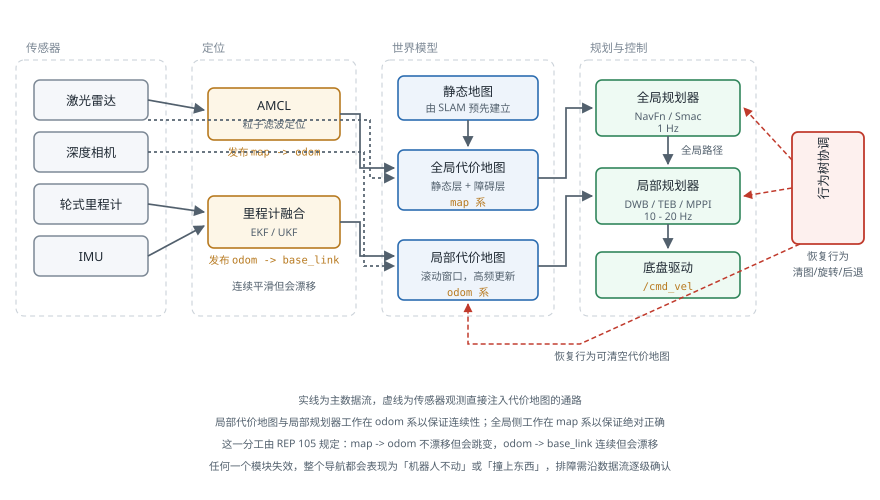

# 移动机器人导航栈

!!! note "引言"
    导航（Navigation）是把「去那边」这个指令变成轮子转速的完整链路。它不是单一算法，而是定位、代价地图、全局规划、局部规划、恢复行为若干模块的协同，任何一环失效整个系统就会停在原地或撞上东西。本页面介绍这条链路的组成与数据流、各模块的失效模式，以及一套从现象出发的排障方法。算法本身的原理见 [路径规划](pathplanning.md) 与 [运动规划](motionplanning.md)，本页面关注的是它们如何组装成一个能在真实场地跑起来的系统。


## 导航栈的组成

一个完整的二维导航栈包含以下模块：

| 模块 | 职责 | 典型实现 | 更新频率 |
|------|------|---------|---------|
| 定位 | 估计机器人在地图中的位姿 | AMCL、SLAM 定位模式 | 10–30 Hz |
| 里程计融合 | 提供连续平滑的短时位姿 | robot_localization (EKF) | 50–100 Hz |
| 全局代价地图 | 静态地图 + 已知障碍 | costmap_2d | 1–5 Hz |
| 局部代价地图 | 机器人周围的实时障碍 | costmap_2d（滚动窗口） | 5–20 Hz |
| 全局规划器 | 从当前位姿到目标的无碰撞路径 | NavFn、Smac Planner | 1 Hz 或事件触发 |
| 局部规划器 | 跟踪全局路径并实时避障 | DWB、TEB、MPPI、RPP | 10–20 Hz |
| 恢复行为 | 卡住时的自救动作 | 清代价地图、原地旋转、后退 | 按需 |
| 行为协调 | 组织上述模块的执行顺序 | 行为树（Nav2）、状态机（move_base） | — |



图中有两条容易被忽略的要点。

**里程计与定位是两回事。** `odom → base_link` 由轮式里程计或 IMU 融合给出，它连续、平滑、高频，但会随时间漂移；`map → odom` 由 AMCL 等定位模块给出，它不漂移，但会在重定位时跳变。局部规划必须工作在 `odom` 系下——因为它需要连续性，位姿跳变会让速度指令瞬间反向；全局规划则工作在 `map` 系下，因为它需要绝对正确性。这一分工由 REP 105 规定，见 [空间描述与变换](../kinematics/spatial-transformation.md)。

**全局与局部代价地图服务于不同目的。** 全局地图覆盖整张场地、分辨率较粗、更新慢，用于长距离路径搜索；局部地图只是机器人周围几米的滚动窗口、分辨率细、更新快，用于实时避障。两者的膨胀参数往往需要分别设置，详见 [代价地图](navigation-costmap.md)。


## 定位

### AMCL 的工作方式

自适应蒙特卡洛定位（Adaptive Monte Carlo Localization，AMCL）用一组带权粒子表示位姿的后验分布，每个粒子是一个候选位姿。流程为：

1. **预测**：按里程计增量移动所有粒子，并加入运动噪声
2. **更新**：用激光扫描与地图做匹配，给每个粒子打分（似然），更新权重
3. **重采样**：按权重重新采样粒子，高权重粒子被复制，低权重粒子被淘汰
4. **自适应**：用 KLD 采样动态调整粒子数——位姿不确定时用几千个粒子，收敛后降到几百个以节省算力

它本质上就是 [传感器融合](../sensing/sensor-fusion.md) 中的粒子滤波，只是观测模型换成了「激光扫描与占据栅格地图的匹配程度」。

### 关键参数

```yaml
amcl:
  ros__parameters:
    min_particles: 500
    max_particles: 2000
    # 运动模型噪声：alpha1/2 为旋转带来的误差，alpha3/4 为平移带来的误差
    alpha1: 0.2      # 旋转引起的旋转噪声
    alpha2: 0.2      # 平移引起的旋转噪声
    alpha3: 0.2      # 平移引起的平移噪声
    alpha4: 0.2      # 旋转引起的平移噪声
    # 观测模型
    laser_model_type: "likelihood_field"
    laser_likelihood_max_dist: 2.0
    z_hit: 0.5       # 命中权重
    z_rand: 0.5      # 随机噪声权重
    # 触发更新的最小运动量：太小会浪费算力，太大会导致定位滞后
    update_min_d: 0.25
    update_min_a: 0.2
    resample_interval: 1
```

`alpha1`–`alpha4` 描述里程计的噪声特性，是最需要按实际底盘调整的一组参数。轮子打滑严重的履带底盘要把 `alpha3`、`alpha4` 调大；编码器精度高、地面平整的场景可以调小以获得更紧的收敛。**调得过小是常见错误**：粒子云过于自信，一旦真实位姿偏出粒子云覆盖范围就再也回不来了。

### 定位失效的典型场景

| 场景 | 原因 | 对策 |
|------|------|------|
| 长直走廊中沿走廊方向漂移 | 该方向上激光观测无约束（几何退化） | 融合轮式里程计、加入反光柱或二维码地标 |
| 空旷大厅定位丢失 | 激光打不到墙，无有效观测 | 提高最大量程、增加里程计权重、缩短空旷区通行时间 |
| 开关门后突然跳变 | 环境与地图不一致 | 把门区域标为动态、或维护多张地图 |
| 电梯中或被推动后完全错位 | 位姿被外力改变，里程计不知情 | 全局重定位（`/reinitialize_global_localization`），或用二维码重置 |
| 对称环境中定位到错误位置 | 多个位姿的观测似然相同 | 增加非对称地标，或在启动时给出较准的初始位姿 |

几何退化是最隐蔽的一类：机器人在走廊中的横向和角度定位都很准，唯独沿走廊方向不断漂移，而 RViz 中看粒子云仍然很集中——因为所有粒子在该方向上得分都一样。相关分析见 [SLAM 工程手册](../sensing/slam-engineering-playbook.md)。


## 全局规划

全局规划器在全局代价地图上搜索一条从当前位姿到目标的无碰撞路径。常用实现：

| 规划器 | 算法 | 是否考虑运动学 | 适用场景 |
|--------|------|--------------|---------|
| NavFn | Dijkstra / A\* | 否 | 差速与全向底盘，速度快 |
| Smac 2D | A\* | 否 | NavFn 的替代，支持更多代价函数 |
| Smac Hybrid-A\* | Hybrid-A\* | 是（含转弯半径） | 阿克曼底盘、需倒车的场景 |
| Smac State Lattice | 状态格 | 是 | 有明确运动基元的车辆 |
| Theta\* | 任意角度 A\* | 否 | 需要少拐点、更直的路径 |

**底盘类型决定选型**。差速与全向底盘可以原地转向，用 NavFn 这类不考虑运动学的规划器就够——生成的折线路径由局部规划器负责平滑。阿克曼底盘（汽车式转向）不能原地转向、有最小转弯半径，用 NavFn 会规划出根本执行不了的路径，必须使用 Hybrid-A\* 或状态格规划器。这类算法的原理见 [路径规划](pathplanning.md)。

全局规划的触发时机也需要设计：

- **周期性重规划**（Nav2 默认 1 Hz）：简单可靠，但在长路径上浪费算力
- **事件触发**：路径被新障碍阻断、或偏离路径超过阈值时才重规划，效率高但需要额外的失效检测
- **两者结合**：低频周期规划兜底，事件触发做快速响应


## 局部规划与控制

局部规划器（在 Nav2 中称为 Controller）负责跟踪全局路径、实时避开全局地图中没有的障碍，并输出速度指令。这是整个导航栈中最需要调参的模块，详见 [局部规划器](navigation-local-planners.md)。


## 恢复行为

恢复行为处理「规划失败」这一必然会发生的情况。Nav2 的默认序列按代价从低到高排列：

1. **清空代价地图**：多数卡住是被残留的虚假障碍困住（传感器噪声、已经离开的行人），清掉重来即可解决
2. **原地旋转**（Spin）：让激光重新扫描一圈，刷新周围的障碍信息，同时也可能帮助定位收敛
3. **等待**（Wait）：如果挡路的是行人或另一台机器人，等几秒往往就通了
4. **后退**（Back Up）：从死角中退出，代价最高也最危险——后方通常没有传感器覆盖

设计恢复策略时有几条经验：

- **恢复次数必须有上限**，否则机器人会在原地无限循环。Nav2 的 `number_of_retries` 默认为 6，超出后应上报人工介入而不是继续重试。
- **后退要格外小心**：多数移动机器人后方没有激光覆盖，后退是盲动。应限制后退距离与速度，并优先依赖其他手段。
- **区分「暂时受阻」与「真的到不了」**：目标点本身落在障碍里、或目标区域被彻底封死时，任何恢复行为都无济于事，应尽早失败并反馈原因，而不是耗尽所有重试。
- **恢复行为期间必须继续避障**：原地旋转和后退同样可能撞到东西。

Nav2 用行为树组织这套逻辑，其结构与配置方式见 [行为树](behavior-trees.md) 与 [ROS 2](../ros/ros2.md)。


## 系统性排障

导航问题的调试难点在于现象与原因往往相距很远。下表按现象组织，给出排查顺序：

| 现象 | 优先检查 | 常见原因 |
|------|---------|---------|
| 机器人完全不动，无报错 | 代价地图上机器人是否在障碍中 | 定位偏了、或膨胀半径过大导致机器人「站在」致命代价上 |
| 规划失败，报无法找到路径 | 目标点是否可达 | 目标落在障碍或未知区域中；机器人被虚假障碍包围 |
| 路径贴着墙走 | 膨胀层的 `cost_scaling_factor` | 衰减太快，离墙稍远代价就归零，规划器没有远离墙的动机 |
| 频繁在原地转圈 | 恢复行为是否被反复触发 | 局部规划器无法产生可行速度，通常是代价地图或足迹配置有问题 |
| 走走停停、速度抖动 | 局部规划频率与代价地图更新频率 | 两者不匹配，或 CPU 不足导致控制周期不稳 |
| 过窄门时反复失败 | 足迹（footprint）与膨胀半径 | 膨胀半径大于门宽的一半，通道在代价地图上被完全封死 |
| 转弯切内角撞墙 | 局部规划器的路径跟踪权重 | 跟踪权重太低，规划器为了走捷径而偏离全局路径 |
| 定位跳变导致急停 | `map → odom` 变换是否突变 | 局部规划器错误地工作在 `map` 系下 |

调试时最有用的三件事：

```bash
# 1) 看代价地图上机器人到底"处于"什么代价
#    RViz 中把 local_costmap 与 global_costmap 都显示出来，
#    并打开机器人足迹（Polygon）显示，看足迹是否压在障碍上

# 2) 确认变换树完整且时间戳正常
ros2 run tf2_tools view_frames
ros2 run tf2_ros tf2_echo map base_link

# 3) 看各节点的实际运行频率，判断是否 CPU 不足
ros2 topic hz /local_costmap/costmap
ros2 topic hz /cmd_vel
ros2 topic hz /plan
```

**一条通用建议：先在仿真中复现。** 导航问题往往涉及时序与传感器噪声，在真实机器人上反复试验既慢又危险。用 [Gazebo](../simulation/gazebo.md) 搭一个与现场相似的场景，能把调试周期从小时级压缩到分钟级。


## ROS 1 与 ROS 2 的导航栈对比

| 方面 | move_base（ROS 1） | Nav2（ROS 2） |
|------|-------------------|--------------|
| 流程组织 | 硬编码的状态机 | 行为树，可通过 XML 重新编排 |
| 全局规划器 | NavFn、global_planner | NavFn、Smac 系列（含 Hybrid-A\*） |
| 局部规划器 | DWA、TEB、EBand | DWB、TEB、MPPI、Regulated Pure Pursuit |
| 生命周期管理 | 无 | 全部节点为生命周期节点，可有序启停 |
| 多机器人 | 需手工加命名空间 | 原生支持命名空间与 DDS 域隔离 |
| 路径平滑 | 无独立模块 | 独立的 Smoother Server |
| 三维支持 | 仅 2D | 2D 为主，配合 STVL 可用体素层 |

最实质的变化是**行为树取代状态机**：move_base 的导航流程写死在代码里，要改变「失败后先做什么」必须改源码重编译；Nav2 中这套逻辑是一个 XML 文件，可以针对不同场景配置不同的行为树——例如仓库中的机器人失败后直接上报，而家庭服务机器人则可以多尝试几次。


## 参考资料

1. Macenski, S., Martín, F., White, R. & Clavero, J. G. (2020). The Marathon 2: A Navigation System. *IEEE/RSJ International Conference on Intelligent Robots and Systems (IROS)*. — Nav2 的系统论文。
2. Thrun, S., Burgard, W. & Fox, D. (2005). *Probabilistic Robotics*. MIT Press. — 第 8 章详述蒙特卡洛定位。
3. Fox, D. (2003). Adaptive Particle Filters for Mobile Robot Localization. *International Journal of Robotics Research*, 22(12), 985-1003. — KLD 自适应采样。
4. Marder-Eppstein, E., Berger, E., Foote, T., Gerkey, B. & Konolige, K. (2010). The Office Marathon: Robust Navigation in an Indoor Office Environment. *IEEE International Conference on Robotics and Automation (ICRA)*. — move_base 导航栈的原始论文。
5. [Nav2 官方文档](https://docs.nav2.org/)
6. [REP 105 — Coordinate Frames for Mobile Platforms](https://www.ros.org/reps/rep-0105.html)
