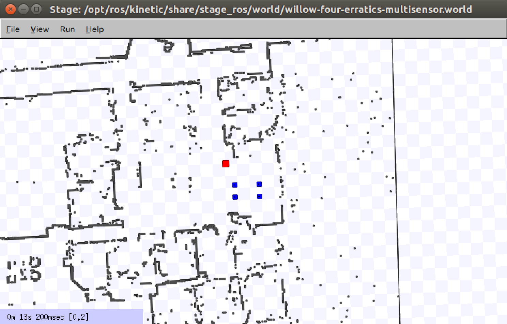

# 机器人常用可视化仿真工具
机器人系统设计离不开仿真工具的支持。机器人仿真让我们在没有物理硬件的情况下也可以快速对算法进行验证；或者提高安全性，避免实验损伤我们的设备（比如在增强学习中，就需要大量random的exploration）。这篇文章我想介绍一下当前主流的可视化仿真工具。一般来说这些仿真工具在物理引擎之上进行包装，如基于ODE、 Bullet等。有些情况下我们只需要使用物理引擎就可以满足需要，但一般情况下我们也想通过可视化平台观察机器人运行的正确性。仿真一般只在系统前期使用，因为真实物理平台与仿真环境存在差异，后期还是要转换到实际硬件平台上进行调试。当然目前也有sim-to-real的研究可以加速移植的过程，甚至可以直接将仿真结果用于实际机器人平台。

## Gazebo

- 官方网站：http://gazebosim.org/
- 支持的物理引擎：ODE/Bullet/Simbody/DART
- 开源仿真环境
- 属于ROS生态

Gazebo是目前最广泛使用的仿真环境，最早在2004年由USC Robotics Research Lab (南加州大学机器人实验室) 开发。依托于ROS的发展，Gazebo具有很强的仿真能力，同时也在机器人研究和开发中得到了广泛应用。Gazebo的功能包括：动力学仿真、传感器仿真、三维环境仿真，同时支持多种机器人模型：包括PR2、Turtlebot、AR.Drone等。

## CoppeliaSim (V-REP)

- 官方网站：http://www.coppeliarobotics.com/
- 2019年11月由V-REP更名为CoppeliaSim
- 支持的物理引擎：ODE/Bullet/Vortex/Newton
- 教育版免费 / 商业版收费

CoppeliaSim有非常完善的物理仿真引擎，支持移动机器人、飞行机器人、人型机器人、多足机器人以及多轴机械手的运动学仿真。CoppeliaSim的仿真程度非常高，不仅可以仿真机器人的本体与多种传感器，还支持障碍物以及地型(空中，地面，水底)的仿真。CoppeliaSim支持使用C/C++，Python，JAVA，Lua，Matlab编写脚本，十分适合于多机器人的仿真。作为已经商业化的软件，相比Gazebo有更好的稳定性与交互体验。

## PyBullet

- 官方网站：https://pybullet.org/
- 物理引擎：Bullet
- 开源仿真环境

PyBullet基于Bullet物理引擎，是Gazebo强有力的竞争对手。PyBullet和Python紧密结合，目前在增强学习 (RL) 中广泛应用。该环境可以结合TensorFlow实现RL训练，比如DQN、PPO、TRPO、DDPG等算法。目前看到比较多的都是仿真多关节机器人。

## MuJoCo

- 官方网站：http://www.mujoco.org

OpenAI Gym的2D/3D机器人仿真使用了MuJoCo环境。之前不太了解，使用Gym后才慢慢接触到。侧重控制与接触相关的仿真与优化。由University of Washington华盛顿大学开发维护（该校和OpenAI关系很近）。可试用30天，之后需要按年购买license。可以多备几个教育邮箱使用。

## Stage

- 官方网站：http://wiki.ros.org/stage
- 属于ROS生态

用于二维环境（无z轴高度信息）的仿真器。最早1999年由USC Robotics Research Lab开发，常用于路径规划或多机器人 (multi-agents) 仿真。

## Webots

- 官方网站：https://cyberbotics.com/
- 物理引擎：基于ODE改进
- 免费 / 咨询服务收费

之前一直不温不火，近几年从商业许可转换为了开源模式。初步测试了一下，和V-REP的使用方式非常相似。没有深入使用过，无法给出更多评价。

## MATLAB Robotics Toolbox

- 官方网站：https://uk.mathworks.com/products/robotics.html

MATLAB机器人工具箱从MATLAB 2013版本开始引入，我了解的情况是一般以研究机械手和路径规划居多。Robotics Toolbox提供了ROS的接口，使得MATLAB代码和Simulink可以和ROS很好的结合，我觉得这是最大的优点了。缺点是需要购买license. 我自己从未有机会在项目中用到，所以没法多加评论。

---

**参考资料：**

1. 胡春旭, [ROS探索总结（五十八）—— Gazebo物理仿真平台]( https://www.guyuehome.com/2256), 古月居
2. 胡春旭, [ROS史话36篇 | 25. ROS之皆大欢喜（Player与Stage）](https://zhuanlan.zhihu.com/p/74552944), 知乎
3. 任赜宇, [为什么要机器人仿真 ](https://www.zhihu.com/question/356929288/answer/913298986), 知乎
4. OpenAI, [OpenAI Gym Documentation](https://gym.openai.com/docs/)
5. 幻生如梦, [PyBullet快速上手教程](https://blog.csdn.net/yingyue20141003/article/details/89044438), CSDN
6. 戴晓天，[机器人常用可视化仿真工具 - 云飞机器人实验室](https://www.yfworld.com/?p=5453)
