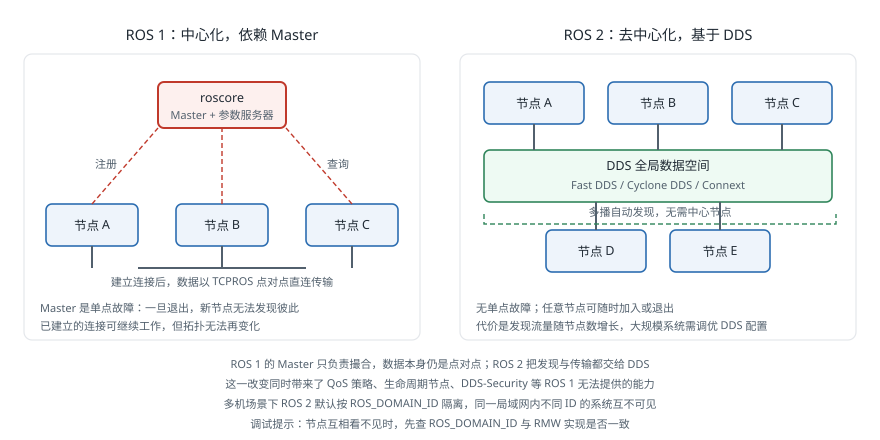

# ROS 2

!!! note "引言"
    ROS 2是ROS的第二代版本，旨在解决ROS 1在实时性、安全性、多平台支持和工业应用方面的局限性。ROS 2从底层重新设计了通信架构，采用DDS (Data Distribution Service) 作为中间件，使其能够满足从科研原型到工业部署的全场景需求。

## 概述

ROS 2的开发始于2015年，由Open Source Robotics Foundation (OSRF) 主导。与ROS 1的渐进式改进不同，ROS 2是一次彻底的架构重设计，保留了ROS 1的核心理念（模块化、工具丰富、社区驱动），同时从根本上解决了ROS 1的技术短板。

## 为什么需要ROS 2

随着机器人技术从实验室走向工业和商业应用，ROS 1的设计已无法满足新的需求：

- **工业级可靠性**：工厂、仓库和公共场所中的机器人需要7x24小时稳定运行
- **实时性要求**：运动控制、安全系统等场景需要确定性的响应时间
- **安全通信**：联网机器人需要防护未授权访问和数据篡改
- **跨平台部署**：机器人系统可能运行在Linux、Windows、macOS甚至RTOS上
- **多机器人协作**：现代机器人系统常常涉及多台机器人的协调工作
- **嵌入式集成**：微控制器和资源受限设备需要与ROS系统无缝连接

## 相比ROS 1的关键改进

### DDS通信中间件

ROS 2最根本的架构变化是采用DDS (Data Distribution Service) 作为底层通信中间件。DDS是一种由OMG (Object Management Group) 制定的工业标准通信协议，广泛应用于航空航天、国防和金融领域。



DDS的核心优势包括：

- **去中心化架构**：节点之间通过分布式发现协议自动互联，无需像ROS 1那样依赖中央Master节点
- **QoS策略 (Quality of Service)**：提供细粒度的通信质量控制，包括可靠性 (Reliability)、持久性 (Durability)、截止时间 (Deadline)、存活性 (Liveliness) 等策略
- **标准化协议**：基于成熟的工业标准，经过长期验证

ROS 2支持多种DDS实现，用户可以根据需求选择：

- **Fast DDS**（eProsima）：默认的DDS实现
- **Cyclone DDS**（Eclipse）：轻量高效的实现
- **Connext DDS**（RTI）：商业级实现，提供高级功能

### 实时性支持 (Real-time Support)

ROS 2在设计层面考虑了实时性需求：

- 通信层支持确定性延迟 (deterministic latency)
- 提供实时安全的内存分配策略
- 支持与实时操作系统（如RT-Linux）的集成
- 执行器 (Executor) 框架可配置不同的调度策略

### 安全机制 (Security)

ROS 2通过SROS2 (Secure ROS 2) 提供完整的安全框架：

- **身份认证** (Authentication)：验证节点身份
- **访问控制** (Access Control)：限制节点对话题和服务的访问权限
- **数据加密** (Encryption)：保护通信数据不被窃听

### 多平台支持

ROS 2支持在多种操作系统上运行：

- Ubuntu Linux（一级支持）
- Windows 10/11
- macOS
- 其他Linux发行版

### 多机器人支持

ROS 2通过DDS的**域 (Domain)** 概念原生支持多机器人系统。不同机器人可以被分配到不同的DDS域中以隔离通信，也可以通过桥接器实现跨域数据共享。

## 架构与核心概念

### 生命周期节点 (Lifecycle Nodes)

ROS 2引入了**管理节点** (Managed Nodes) 的概念，也称为生命周期节点 (Lifecycle Nodes)。这类节点具有明确定义的状态机：

- **Unconfigured**：节点已创建但未配置
- **Inactive**：节点已配置但未激活
- **Active**：节点正在运行
- **Finalized**：节点已清理完毕

生命周期管理使得系统启动、状态监控和故障恢复更加可控，是工业部署中的重要特性。

### 组件 (Components)

ROS 2支持将多个节点作为**组件** (Components) 加载到同一进程中运行。这种方式通过进程内通信 (intra-process communication) 避免了序列化和网络传输的开销，显著提升了性能。

### Launch系统

ROS 2的launch系统使用Python脚本替代了ROS 1的XML格式launch文件，提供更强大的编程能力：

- 支持条件启动和参数传递
- 支持事件驱动的启动逻辑
- 可以与生命周期节点配合实现有序启动

## colcon构建系统

colcon (collective construction) 是ROS 2的标准构建工具。相比ROS 1的catkin，colcon具有以下特点：

- 支持多种构建系统（CMake、Python setuptools、Cargo等）
- 逐包隔离编译，避免包之间的编译干扰
- 更清晰的工作空间管理

典型的ROS 2工作空间结构如下：

```
ros2_ws/
├── src/              # 源代码目录
│   ├── package_1/
│   │   ├── CMakeLists.txt
│   │   ├── package.xml
│   │   └── src/
│   └── package_2/
├── build/            # 编译中间文件
├── install/          # 安装目录（替代catkin的devel空间）
└── log/              # 日志文件
```

常用命令包括：

- `colcon build`：编译工作空间中的所有包
- `colcon build --packages-select <pkg>`：编译指定包
- `colcon test`：运行测试

## ROS 2版本

下表列出了ROS 2的主要发行版本，长期支持版本（LTS）支持周期为五年。

| 版本代号 | 发布时间 | 目标平台 | LTS | 终止维护日期 |
| --- | --- | --- | --- | --- |
| [Jazzy Jalisco](https://docs.ros.org/en/jazzy/) | May 2024 | Ubuntu 24.04 | 是 | May 2029 |
| [Iron Irwini](https://docs.ros.org/en/iron/) | May 2023 | Ubuntu 22.04 | 否 | Nov 2024 |
| [Humble Hawksbill](https://docs.ros.org/en/humble/) | May 2022 | Ubuntu 22.04 | 是 | May 2027 |
| [Galactic Geochelone](https://docs.ros.org/en/galactic/) | May 2021 | Ubuntu 20.04 | 否 | Nov 2022 |
| [Foxy Fitzroy](https://docs.ros.org/en/foxy/) | June 2020 | Ubuntu 20.04 | 是 | May 2023 |
| [Eloquent Elusor](https://docs.ros.org/en/ros2_documentation/foxy/Releases/Release-Eloquent-Elusor.html) | Nov 2019 | Ubuntu 18.04 | 否 | November 2020 |
| [Dashing Diademata](https://docs.ros.org/en/ros2_documentation/foxy/Releases/Release-Dashing-Diademata.html) | May 2019 | Ubuntu 18.04 | 是 | May 2021 |
| [Crystal Clemmys](https://docs.ros.org/en/ros2_documentation/foxy/Releases/Release-Crystal-Clemmys.html) | December 2018 | Ubuntu 18.04 | 否 | December 2019 |
| [Bouncy Bolson](https://docs.ros.org/en/ros2_documentation/foxy/Releases/Release-Bouncy-Bolson.html) | July 2018 | Ubuntu 18.04 | 否 | July 2019 |
| [Ardent Apalone](https://docs.ros.org/en/ros2_documentation/foxy/Releases/Release-Ardent-Apalone.html) | December 2017 | Ubuntu 16.04 | 否 | December 2018 |
| Rolling Ridley | 滚动更新 | Ubuntu（最新LTS） | — | 持续维护 |

Rolling Ridley是一个持续滚动更新的版本，始终跟踪最新的开发进展，适合开发者测试新功能，不建议用于生产环境。

## ROS 1与ROS 2对比

| 特性 | ROS 1 | ROS 2 |
| --- | --- | --- |
| 通信中间件 | 自定义TCPROS/UDPROS | DDS（工业标准） |
| 节点发现 | 依赖ROS Master（中心化） | DDS自动发现（去中心化） |
| 实时性 | 不支持 | 设计层面支持 |
| 安全性 | 无内置安全机制 | SROS2（认证、加密、访问控制） |
| 操作系统 | 主要支持Ubuntu Linux | Linux、Windows、macOS |
| 构建系统 | catkin | colcon / ament |
| Launch文件 | XML格式 | Python脚本（也支持XML和YAML） |
| 生命周期管理 | 无 | Lifecycle Nodes |
| QoS配置 | 无 | 丰富的QoS策略 |
| 多机器人 | 需要额外配置 | DDS域原生支持 |

## 从ROS 1迁移到ROS 2

对于现有的ROS 1项目，迁移到ROS 2有以下几种策略：

- **ros1_bridge**：ROS官方提供的桥接工具，允许ROS 1和ROS 2节点在同一系统中并行运行并互相通信，适合渐进式迁移
- **逐步迁移**：将ROS 1软件包逐个移植到ROS 2，通常需要修改构建配置、API调用和launch文件
- **完全重写**：对于较小的项目或需要大幅重构的项目，直接用ROS 2 API重写可能更高效

迁移过程中需要注意的主要变化包括：

- 将`CMakeLists.txt`和`package.xml`适配为ament格式
- 将回调函数和API调用更新为`rclcpp`（C++）或`rclpy`（Python）
- 将`.launch`文件转换为Python launch脚本
- 根据需要配置QoS策略

## rclpy Python节点编程

rclpy是ROS 2的Python客户端库，封装了底层的rcl（ROS Client Library）接口，是编写Python节点的标准方式。

### 节点初始化与执行器

在任何rclpy程序中，必须首先调用`rclpy.init()`初始化ROS 2上下文，并在程序退出前调用`rclpy.shutdown()`释放资源：

```python
import rclpy

rclpy.init(args=None)   # 初始化，可传入命令行参数
# ... 创建节点并使用
rclpy.shutdown()        # 清理资源
```

**spin函数**控制节点的事件循环：

- `rclpy.spin(node)`：阻塞式运行，持续处理回调直到节点被关闭，适合大多数场景
- `rclpy.spin_once(node, timeout_sec=0)`：处理一次回调后立即返回，适合需要在主循环中穿插其他逻辑的场景
- `rclpy.spin_until_future_complete(node, future)`：运行直到指定的Future完成，常用于服务客户端等待响应

**执行器 (Executor)** 管理回调的调度方式：

- `SingleThreadedExecutor`：所有回调在单一线程中顺序执行，这是默认行为，适合不需要并发的节点
- `MultiThreadedExecutor`：回调可在多个线程中并发执行，适合包含耗时回调（如图像处理）的节点，需配合`ReentrantCallbackGroup`或`MutuallyExclusiveCallbackGroup`使用

```python
from rclpy.executors import MultiThreadedExecutor

executor = MultiThreadedExecutor(num_threads=4)
executor.add_node(node_a)
executor.add_node(node_b)
executor.spin()
```

### 发布者节点

下面是一个完整的发布者节点示例，以固定频率发布字符串消息：

```python
import rclpy
from rclpy.node import Node
from std_msgs.msg import String


class MinimalPublisher(Node):
    """最简发布者节点示例。"""

    def __init__(self):
        super().__init__('minimal_publisher')
        # 创建发布者：消息类型、话题名称、队列深度
        self.publisher_ = self.create_publisher(String, 'topic', 10)
        # 创建定时器：定时周期（秒）、回调函数
        timer_period = 0.5  # 以2 Hz频率发布
        self.timer = self.create_timer(timer_period, self.timer_callback)
        self.i = 0

    def timer_callback(self):
        msg = String()
        msg.data = f'Hello World: {self.i}'
        self.publisher_.publish(msg)
        self.get_logger().info(f'发布: "{msg.data}"')
        self.i += 1


def main(args=None):
    rclpy.init(args=args)
    node = MinimalPublisher()
    rclpy.spin(node)
    node.destroy_node()
    rclpy.shutdown()


if __name__ == '__main__':
    main()
```

### 订阅者节点

```python
import rclpy
from rclpy.node import Node
from std_msgs.msg import String


class MinimalSubscriber(Node):
    """最简订阅者节点示例。"""

    def __init__(self):
        super().__init__('minimal_subscriber')
        # 创建订阅者：消息类型、话题名称、回调函数、队列深度
        self.subscription = self.create_subscription(
            String,
            'topic',
            self.listener_callback,
            10
        )
        # 防止Python垃圾回收订阅对象
        self.subscription

    def listener_callback(self, msg):
        self.get_logger().info(f'收到: "{msg.data}"')


def main(args=None):
    rclpy.init(args=args)
    node = MinimalSubscriber()
    rclpy.spin(node)
    node.destroy_node()
    rclpy.shutdown()


if __name__ == '__main__':
    main()
```

### 服务端与客户端

**服务端**使用`create_service`注册回调函数，当客户端发送请求时自动调用：

```python
import rclpy
from rclpy.node import Node
from example_interfaces.srv import AddTwoInts


class AddTwoIntsServer(Node):

    def __init__(self):
        super().__init__('add_two_ints_server')
        self.srv = self.create_service(
            AddTwoInts,
            'add_two_ints',
            self.add_two_ints_callback
        )

    def add_two_ints_callback(self, request, response):
        response.sum = request.a + request.b
        self.get_logger().info(
            f'接收请求: a={request.a}, b={request.b} -> 返回: {response.sum}'
        )
        return response


def main(args=None):
    rclpy.init(args=args)
    node = AddTwoIntsServer()
    rclpy.spin(node)
    rclpy.shutdown()
```

**服务客户端**使用`create_client`，并通过`call_async`发送异步请求：

```python
import rclpy
from rclpy.node import Node
from example_interfaces.srv import AddTwoInts


class AddTwoIntsClient(Node):

    def __init__(self):
        super().__init__('add_two_ints_client')
        self.client = self.create_client(AddTwoInts, 'add_two_ints')
        # 等待服务上线
        while not self.client.wait_for_service(timeout_sec=1.0):
            self.get_logger().info('等待服务上线...')

    def send_request(self, a, b):
        request = AddTwoInts.Request()
        request.a = a
        request.b = b
        # 发送异步请求，返回Future对象
        future = self.client.call_async(request)
        rclpy.spin_until_future_complete(self, future)
        return future.result()


def main(args=None):
    rclpy.init(args=args)
    client = AddTwoIntsClient()
    result = client.send_request(3, 5)
    client.get_logger().info(f'结果: {result.sum}')
    client.destroy_node()
    rclpy.shutdown()
```

## rclcpp C++节点编程

rclcpp是ROS 2的C++客户端库，提供与rclpy相对应的C++接口，通常用于对性能要求更高的场景。

### 发布者节点

C++节点通过继承`rclcpp::Node`类来实现，并使用智能指针管理资源：

```cpp
#include <chrono>
#include <functional>
#include <memory>
#include <string>

#include "rclcpp/rclcpp.hpp"
#include "std_msgs/msg/string.hpp"

using namespace std::chrono_literals;

class MinimalPublisher : public rclcpp::Node
{
public:
    MinimalPublisher()
    : Node("minimal_publisher"), count_(0)
    {
        // 创建发布者：话题名称、队列深度
        publisher_ = this->create_publisher<std_msgs::msg::String>("topic", 10);
        // 创建定时器：周期、回调（绑定成员函数）
        timer_ = this->create_wall_timer(
            500ms,
            std::bind(&MinimalPublisher::timer_callback, this)
        );
    }

private:
    void timer_callback()
    {
        auto message = std_msgs::msg::String();
        message.data = "Hello, world! " + std::to_string(count_++);
        RCLCPP_INFO(this->get_logger(), "发布: '%s'", message.data.c_str());
        publisher_->publish(message);
    }

    rclcpp::TimerBase::SharedPtr timer_;
    rclcpp::Publisher<std_msgs::msg::String>::SharedPtr publisher_;
    size_t count_;
};

int main(int argc, char * argv[])
{
    rclcpp::init(argc, argv);
    // make_shared自动管理节点生命周期
    rclcpp::spin(std::make_shared<MinimalPublisher>());
    rclcpp::shutdown();
    return 0;
}
```

### 订阅者节点

```cpp
#include "rclcpp/rclcpp.hpp"
#include "std_msgs/msg/string.hpp"

using std::placeholders::_1;

class MinimalSubscriber : public rclcpp::Node
{
public:
    MinimalSubscriber()
    : Node("minimal_subscriber")
    {
        subscription_ = this->create_subscription<std_msgs::msg::String>(
            "topic",
            10,
            std::bind(&MinimalSubscriber::topic_callback, this, _1)
        );
    }

private:
    void topic_callback(const std_msgs::msg::String & msg) const
    {
        RCLCPP_INFO(this->get_logger(), "收到: '%s'", msg.data.c_str());
    }

    rclcpp::Subscription<std_msgs::msg::String>::SharedPtr subscription_;
};

int main(int argc, char * argv[])
{
    rclcpp::init(argc, argv);
    rclcpp::spin(std::make_shared<MinimalSubscriber>());
    rclcpp::shutdown();
    return 0;
}
```

**关键模式说明**：

- `RCLCPP_INFO(logger, fmt, ...)`：输出INFO级别日志，类似的宏还有`RCLCPP_WARN`、`RCLCPP_ERROR`、`RCLCPP_DEBUG`
- `std::make_shared<T>()`：创建共享指针，ROS 2中节点和大多数资源都通过共享指针管理
- `std::bind(&Class::method, this, _1)`：将成员函数绑定为回调，`_1`代表回调的第一个参数占位符

## QoS策略配置

QoS (Quality of Service) 策略允许开发者根据应用场景在可靠性、资源消耗和延迟之间做出权衡。发布者和订阅者的QoS配置必须满足兼容性规则，否则连接将无法建立。

### 可靠性 (Reliability)

| 策略 | 说明 | 适用场景 |
| --- | --- | --- |
| `RELIABLE` | 保证消息送达，丢包时会重传 | 控制指令、参数配置、关键状态 |
| `BEST_EFFORT` | 尽力传输，不保证送达，延迟更低 | 传感器数据、视频流、高频IMU数据 |

### 持久性 (Durability)

| 策略 | 说明 | 适用场景 |
| --- | --- | --- |
| `VOLATILE` | 新订阅者只收到订阅后发布的消息 | 实时数据流 |
| `TRANSIENT_LOCAL` | 发布者缓存最近发布的消息，新订阅者加入时会收到缓存消息 | 地图数据、初始参数、静态变换 |

### 历史 (History)

| 策略 | 说明 |
| --- | --- |
| `KEEP_LAST(N)` | 仅保留最近N条消息，N由`depth`参数指定 |
| `KEEP_ALL` | 保留所有消息，受系统内存限制 |

### Python代码示例：传感器数据QoS配置

```python
import rclpy
from rclpy.node import Node
from rclpy.qos import QoSProfile, ReliabilityPolicy, DurabilityPolicy, HistoryPolicy
from sensor_msgs.msg import LaserScan


class LidarSubscriber(Node):

    def __init__(self):
        super().__init__('lidar_subscriber')

        # 为传感器数据配置QoS：最大努力传输，仅保留最新消息
        sensor_qos = QoSProfile(
            reliability=ReliabilityPolicy.BEST_EFFORT,
            durability=DurabilityPolicy.VOLATILE,
            history=HistoryPolicy.KEEP_LAST,
            depth=1
        )

        self.subscription = self.create_subscription(
            LaserScan,
            '/scan',
            self.scan_callback,
            sensor_qos
        )

    def scan_callback(self, msg):
        self.get_logger().info(f'收到激光雷达数据，点数: {len(msg.ranges)}')
```

### 常用QoS预设

ROS 2提供了若干预定义的QoS配置，可直接使用：

```python
from rclpy.qos import qos_profile_sensor_data, qos_profile_services_default

# qos_profile_sensor_data：BEST_EFFORT + VOLATILE + KEEP_LAST(5)，适合传感器话题
# qos_profile_services_default：RELIABLE + VOLATILE + KEEP_LAST(10)，适合服务调用
# qos_profile_parameters：RELIABLE + VOLATILE + KEEP_LAST(1000)，适合参数通信
```

### QoS兼容性规则

发布者与订阅者的QoS必须兼容，否则ROS 2不会建立连接，且终端会出现警告。

| 发布者 Reliability | 订阅者 Reliability | 是否兼容 |
| --- | --- | --- |
| `RELIABLE` | `RELIABLE` | 兼容 |
| `RELIABLE` | `BEST_EFFORT` | 兼容（发布者提供更高保证） |
| `BEST_EFFORT` | `RELIABLE` | **不兼容** |
| `BEST_EFFORT` | `BEST_EFFORT` | 兼容 |

一般规则：订阅者要求的服务等级不能高于发布者提供的等级。

## 动作（Actions）

动作 (Actions) 是ROS 2中适用于长时间运行任务的通信机制，结合了服务（请求/响应）和话题（持续反馈）的特点，并支持任务取消。典型应用场景包括导航到目标点、执行机械臂轨迹等。

### .action文件格式

动作接口定义在`.action`文件中，包含三个部分，用`---`分隔：

```
# Fibonacci.action
# 目标（Goal）：客户端发送给服务端
int32 order
---
# 结果（Result）：任务完成后服务端返回给客户端
int32[] sequence
---
# 反馈（Feedback）：任务进行中服务端持续发送给客户端
int32[] partial_sequence
```

### 动作服务端

```python
import time
import rclpy
from rclpy.action import ActionServer
from rclpy.node import Node
from action_tutorials_interfaces.action import Fibonacci


class FibonacciActionServer(Node):

    def __init__(self):
        super().__init__('fibonacci_action_server')
        self._action_server = ActionServer(
            self,
            Fibonacci,
            'fibonacci',
            self.execute_callback
        )

    def execute_callback(self, goal_handle):
        self.get_logger().info(f'执行目标: order={goal_handle.request.order}')

        feedback_msg = Fibonacci.Feedback()
        feedback_msg.partial_sequence = [0, 1]

        for i in range(1, goal_handle.request.order):
            # 检查是否收到取消请求
            if goal_handle.is_cancel_requested:
                goal_handle.canceled()
                self.get_logger().info('目标已取消')
                return Fibonacci.Result()

            # 计算下一个斐波那契数
            feedback_msg.partial_sequence.append(
                feedback_msg.partial_sequence[i] + feedback_msg.partial_sequence[i - 1]
            )
            self.get_logger().info(f'反馈: {feedback_msg.partial_sequence}')
            # 发布中间反馈
            goal_handle.publish_feedback(feedback_msg)
            time.sleep(1)

        goal_handle.succeed()
        result = Fibonacci.Result()
        result.sequence = feedback_msg.partial_sequence
        return result
```

### 动作客户端

```python
import rclpy
from rclpy.action import ActionClient
from rclpy.node import Node
from action_tutorials_interfaces.action import Fibonacci


class FibonacciActionClient(Node):

    def __init__(self):
        super().__init__('fibonacci_action_client')
        self._action_client = ActionClient(self, Fibonacci, 'fibonacci')

    def send_goal(self, order):
        goal_msg = Fibonacci.Goal()
        goal_msg.order = order

        self._action_client.wait_for_server()

        # 异步发送目标，注册反馈回调
        self._send_goal_future = self._action_client.send_goal_async(
            goal_msg,
            feedback_callback=self.feedback_callback
        )
        # 目标被服务端接受/拒绝时触发
        self._send_goal_future.add_done_callback(self.goal_response_callback)

    def goal_response_callback(self, future):
        goal_handle = future.result()
        if not goal_handle.accepted:
            self.get_logger().info('目标被拒绝')
            return
        self.get_logger().info('目标已接受')
        # 注册结果回调
        self._get_result_future = goal_handle.get_result_async()
        self._get_result_future.add_done_callback(self.get_result_callback)

    def feedback_callback(self, feedback_msg):
        feedback = feedback_msg.feedback
        self.get_logger().info(f'收到反馈: {feedback.partial_sequence}')

    def get_result_callback(self, future):
        result = future.result().result
        self.get_logger().info(f'最终结果: {result.sequence}')
        rclpy.shutdown()


def main(args=None):
    rclpy.init(args=args)
    client = FibonacciActionClient()
    client.send_goal(10)
    rclpy.spin(client)
```

## Nav2导航框架

Nav2（Navigation 2）是ROS 2的官方导航框架，为移动机器人提供自主导航能力，是ROS 1 Navigation Stack的完整重写。

### 架构概述

Nav2采用行为树（Behavior Tree）驱动的分层架构：

```
用户目标
    ↓
BT Navigator（行为树导航器）
    ├── Planner Server（全局规划器）
    │     └── NavFn / Smac Planner
    ├── Controller Server（局部控制器）
    │     └── DWB Controller / MPPI Controller
    ├── Smoother Server（路径平滑器）
    └── Recovery Server（恢复行为）
          └── Spin / Back Up / Wait
```

### 关键组件

- **AMCL (Adaptive Monte Carlo Localization)**：基于粒子滤波的自适应蒙特卡洛定位，利用激光雷达数据在已知地图上进行机器人位置估计
- **costmap_2d**：代价地图，分为全局代价地图（用于全局路径规划）和局部代价地图（用于实时避障），支持多种图层（静态层、障碍物层、膨胀层）
- **NavFn Planner**：基于Dijkstra或A*算法的全局路径规划器
- **DWB Controller**：动态窗口法局部控制器，在代价地图上实时计算速度指令
- **BT Navigator**：使用行为树组织整个导航流程，通过XML配置文件定义导航逻辑

### 行为树示例

Nav2的导航逻辑通过行为树XML文件配置，以下是一个简化示例：

```xml
<root main_tree_to_execute="MainTree">
  <BehaviorTree ID="MainTree">
    <RecoveryNode number_of_retries="6" name="NavigateRecovery">
      <PipelineSequence name="NavigateWithReplanning">
        <RateController hz="1.0">
          <ComputePathToPose goal="{goal}" path="{path}" planner_id="GridBased"/>
        </RateController>
        <FollowPath path="{path}" controller_id="FollowPath"/>
      </PipelineSequence>
      <ReactiveFallback name="RecoveryFallback">
        <GoalUpdated/>
        <RoundRobin name="RecoveryActions">
          <Sequence name="ClearingActions">
            <ClearEntireCostmap name="ClearLocalCostmap-Context"
              service_name="local_costmap/clear_entirely_local_costmap"/>
          </Sequence>
          <Spin spin_dist="1.57"/>
          <Wait wait_duration="5"/>
          <Back up backup_dist="0.15" backup_speed="0.025"/>
        </RoundRobin>
      </ReactiveFallback>
    </RecoveryNode>
  </BehaviorTree>
</root>
```

### 启动导航

以TurtleBot3为例启动Nav2完整导航栈：

```bash
# 安装TurtleBot3软件包（Humble版本）
sudo apt install ros-humble-turtlebot3-navigation2 ros-humble-turtlebot3-gazebo

# 设置机器人型号
export TURTLEBOT3_MODEL=waffle

# 启动Gazebo仿真
ros2 launch turtlebot3_gazebo turtlebot3_world.launch.py

# 在另一个终端启动Nav2（包含AMCL定位和导航服务）
ros2 launch turtlebot3_navigation2 navigation2.launch.py \
    use_sim_time:=True \
    map:=/path/to/map.yaml

# 在RViz中使用"2D Pose Estimate"设置初始位置，然后使用"Nav2 Goal"发送目标
```

## micro-ROS

micro-ROS将ROS 2的核心功能移植到资源受限的微控制器（MCU）上，使嵌入式设备能够直接参与ROS 2通信网络，无需中间转换层。

### 核心概念

micro-ROS使用Micro XRCE-DDS（eXtremely Resource Constrained Environments DDS）作为通信中间件，这是DDS协议的轻量级实现。MCU上的micro-ROS节点通过**micro-ROS Agent**桥接到标准ROS 2网络：

```
[MCU: STM32 / ESP32 / Arduino]
    micro-ROS库
        ↕ 串口 / UDP / USB
[Linux主机: micro-ROS Agent]
        ↕ DDS
[ROS 2网络]
    标准ROS 2节点
```

### 支持硬件

| 硬件平台 | 连接方式 | 备注 |
| --- | --- | --- |
| STM32系列 | 串口、USB | 通过FreeRTOS或ThreadX集成，工业场景首选 |
| ESP32 | Wi-Fi（UDP）、串口 | 无线连接，适合移动场景 |
| Arduino Due | 串口 | 基础支持，资源较紧张 |
| Raspberry Pi Pico | 串口、USB | 低成本选择，支持FreeRTOS |

### Arduino风格代码示例

以下示例在ESP32或Arduino Due上以固定频率发布里程计数据：

```cpp
#include <micro_ros_arduino.h>
#include <rcl/rcl.h>
#include <rclc/rclc.h>
#include <rclc/executor.h>
#include <std_msgs/msg/int32.h>

rcl_publisher_t publisher;
std_msgs__msg__Int32 msg;
rclc_executor_t executor;
rclc_support_t support;
rcl_allocator_t allocator;
rcl_node_t node;
rcl_timer_t timer;

void timer_callback(rcl_timer_t * timer, int64_t last_call_time)
{
    (void) last_call_time;
    if (timer != NULL) {
        rcl_publish(&publisher, &msg, NULL);
        msg.data++;
    }
}

void setup()
{
    // 通过串口连接micro-ROS Agent
    set_microros_transports();

    allocator = rcl_get_default_allocator();

    // 初始化micro-ROS支持结构
    rclc_support_init(&support, 0, NULL, &allocator);

    // 创建节点
    rclc_node_init_default(&node, "micro_ros_arduino_node", "", &support);

    // 创建发布者
    rclc_publisher_init_default(
        &publisher,
        &node,
        ROSIDL_GET_MSG_TYPE_SUPPORT(std_msgs, msg, Int32),
        "micro_ros_arduino_node_publisher"
    );

    // 创建定时器（100ms周期）
    const unsigned int timer_timeout = 100;
    rclc_timer_init_default(&timer, &support, RCL_MS_TO_NS(timer_timeout), timer_callback);

    // 创建执行器
    rclc_executor_init(&executor, &support.context, 1, &allocator);
    rclc_executor_add_timer(&executor, &timer);

    msg.data = 0;
}

void loop()
{
    // 处理一次执行器事件
    rclc_executor_spin_some(&executor, RCL_MS_TO_NS(100));
}
```

### 启动micro-ROS Agent

micro-ROS Agent是运行在Linux主机上的桥接程序，负责在MCU和ROS 2网络之间转发消息。

**串口模式**（适用于USB转串口连接）：

```bash
# 安装micro-ROS Agent（通过snap）
snap install micro-ros-agent

# 或通过Docker运行
docker run -it --rm \
    -v /dev:/dev \
    --privileged \
    microros/micro-ros-agent:humble \
    serial --dev /dev/ttyUSB0 -b 115200
```

**UDP模式**（适用于ESP32 Wi-Fi连接）：

```bash
# 监听UDP端口8888
docker run -it --rm \
    --net=host \
    microros/micro-ros-agent:humble \
    udp4 --port 8888
```

### 典型使用场景

在移动机器人系统中，STM32微控制器常承担底层驱动任务：

- **发布话题**：`/odom`（里程计）、`/imu/data`（IMU数据）
- **订阅话题**：`/cmd_vel`（速度指令）

STM32通过串口连接到运行ROS 2的上位机（Jetson Nano或树莓派），micro-ROS Agent负责透明转发，上位机的导航和感知节点无需感知底层通信细节。

## ros2cli常用命令

ros2cli是ROS 2的命令行工具集，覆盖话题、节点、服务、动作、参数、包等所有核心功能。

### 命令速查表

| 命令 | 功能 | 常用示例 |
| --- | --- | --- |
| `ros2 topic` | 话题管理 | `ros2 topic list`、`ros2 topic echo /topic`、`ros2 topic pub` |
| `ros2 node` | 节点管理 | `ros2 node list`、`ros2 node info /node_name` |
| `ros2 service` | 服务管理 | `ros2 service list`、`ros2 service call /srv type "{}"` |
| `ros2 action` | 动作管理 | `ros2 action list`、`ros2 action send_goal /action type "{}"` |
| `ros2 param` | 参数管理 | `ros2 param list`、`ros2 param get /node param`、`ros2 param set` |
| `ros2 bag` | 数据录制与回放 | `ros2 bag record -a`、`ros2 bag play file.bag` |
| `ros2 launch` | 启动launch文件 | `ros2 launch pkg file.launch.py arg:=value` |
| `ros2 pkg` | 软件包管理 | `ros2 pkg list`、`ros2 pkg create`、`ros2 pkg executables` |
| `ros2 interface` | 接口查询 | `ros2 interface show std_msgs/msg/String` |
| `ros2 doctor` | 系统诊断 | `ros2 doctor --report` |
| `ros2 run` | 运行单个节点 | `ros2 run demo_nodes_cpp talker` |

### 常用命令示例

```bash
# ===== 话题操作 =====
# 列出所有活跃话题
ros2 topic list

# 查看话题详细信息（类型、发布者、订阅者）
ros2 topic info /chatter --verbose

# 打印话题消息内容（持续输出）
ros2 topic echo /chatter

# 以指定频率发布消息
ros2 topic pub /chatter std_msgs/msg/String "data: 'Hello ROS 2'" --rate 1

# 查看话题发布频率
ros2 topic hz /scan

# ===== 节点操作 =====
# 列出所有活跃节点
ros2 node list

# 查看节点详细信息（发布/订阅的话题、服务、参数）
ros2 node info /minimal_publisher

# ===== 服务操作 =====
# 调用加法服务
ros2 service call /add_two_ints example_interfaces/srv/AddTwoInts "{a: 5, b: 3}"

# ===== 参数操作 =====
# 列出节点的所有参数
ros2 param list /my_node

# 获取参数值
ros2 param get /my_node some_param

# 动态设置参数
ros2 param set /my_node some_param 42

# ===== 数据录制 =====
# 录制所有话题
ros2 bag record -a -o my_session

# 只录制指定话题
ros2 bag record /scan /odom -o lidar_odom

# 回放录制的数据
ros2 bag play my_session/

# 查看录制包信息
ros2 bag info my_session/

# ===== 接口查询 =====
# 查看消息定义
ros2 interface show geometry_msgs/msg/Twist

# 查看服务定义
ros2 interface show nav_msgs/srv/GetPlan

# ===== 系统诊断 =====
# 运行全面系统诊断
ros2 doctor --report
```

## 组件（Component）节点

组件节点（Component Nodes）是ROS 2推荐的进程内通信方案，允许将多个节点加载到同一个进程（容器）中运行，通过绕过序列化和网络栈，显著降低大数据量通信（如相机图像、点云）的延迟和CPU占用。

### 进程内通信的优势

- **零拷贝传输**：对于支持的消息类型，消息数据不需要序列化和反序列化，直接通过指针共享
- **降低延迟**：消除了网络栈的开销，延迟可从毫秒级降至微秒级
- **减少CPU占用**：特别是对于高频大消息（1080p图像约6 MB/帧），效果显著

### 定义组件节点

组件节点与普通节点的代码几乎完全相同，唯一区别是需要在文件末尾注册组件：

```cpp
#include "rclcpp/rclcpp.hpp"
#include "rclcpp_components/register_node_macro.hpp"
#include "std_msgs/msg/string.hpp"

namespace composition
{

class Talker : public rclcpp::Node
{
public:
    explicit Talker(const rclcpp::NodeOptions & options)
    : Node("talker", options)
    {
        publisher_ = this->create_publisher<std_msgs::msg::String>("chatter", 10);
        timer_ = this->create_wall_timer(
            std::chrono::milliseconds(500),
            [this]() {
                auto msg = std_msgs::msg::String();
                msg.data = "Hello, component!";
                RCLCPP_INFO(this->get_logger(), "发布: '%s'", msg.data.c_str());
                publisher_->publish(msg);
            }
        );
    }

private:
    rclcpp::Publisher<std_msgs::msg::String>::SharedPtr publisher_;
    rclcpp::TimerBase::SharedPtr timer_;
};

}  // namespace composition

// 注册组件节点，使其可被动态加载
RCLCPP_COMPONENTS_REGISTER_NODE(composition::Talker)
```

CMakeLists.txt中还需要添加组件注册和库构建配置：

```cmake
add_library(talker_component SHARED src/talker.cpp)
rclcpp_components_register_node(talker_component
    PLUGIN "composition::Talker"
    EXECUTABLE talker_node
)
```

### 动态加载组件

使用`ros2 component`命令在运行时动态加载组件到容器进程：

```bash
# 启动一个空的组件容器进程
ros2 run rclcpp_components component_container

# 在另一个终端，将Talker组件加载进容器
ros2 component load /ComponentManager composition composition::Talker

# 列出容器中已加载的组件
ros2 component list

# 卸载组件（使用组件ID）
ros2 component unload /ComponentManager 1
```

### 在Launch文件中使用组件

通过Launch文件将多个组件加载到同一容器，是推荐的生产部署方式：

```python
from launch import LaunchDescription
from launch_ros.actions import ComposableNodeContainer
from launch_ros.descriptions import ComposableNode


def generate_launch_description():
    container = ComposableNodeContainer(
        name='my_container',
        namespace='',
        package='rclcpp_components',
        executable='component_container',
        composable_node_descriptions=[
            ComposableNode(
                package='composition',
                plugin='composition::Talker',
                name='talker'
            ),
            ComposableNode(
                package='composition',
                plugin='composition::Listener',
                name='listener'
            ),
        ],
        output='screen',
    )

    return LaunchDescription([container])
```

启动后，Talker和Listener运行在同一进程内，消息通过共享内存传递，相比跨进程通信性能大幅提升。

## 参考资料

1. [ROS 2 Documentation: Humble Hawksbill](https://docs.ros.org/en/humble/), Open Source Robotics Foundation
2. [ROS 2 Documentation: Jazzy Jalisco](https://docs.ros.org/en/jazzy/), Open Source Robotics Foundation
3. [Releases](https://docs.ros.org/en/rolling/Releases.html), ROS 2 Rolling Documentation
4. [Design](https://design.ros2.org/), ROS 2 Design Documentation
5. [About DDS](https://www.omg.org/spec/DDS/), Object Management Group
6. [Migration Guide from ROS 1](https://docs.ros.org/en/rolling/How-To-Guides/Migrating-from-ROS1.html), ROS 2 Documentation
7. [Writing a simple publisher and subscriber (Python)](https://docs.ros.org/en/humble/Tutorials/Beginner-Client-Libraries/Writing-A-Simple-Py-Publisher-And-Subscriber.html), ROS 2 Tutorials
8. [Writing a simple publisher and subscriber (C++)](https://docs.ros.org/en/humble/Tutorials/Beginner-Client-Libraries/Writing-A-Simple-Cpp-Publisher-And-Subscriber.html), ROS 2 Tutorials
9. [Writing a simple service and client (Python)](https://docs.ros.org/en/humble/Tutorials/Beginner-Client-Libraries/Writing-A-Simple-Py-Service-And-Client.html), ROS 2 Tutorials
10. [About QoS settings](https://docs.ros.org/en/humble/Concepts/Intermediate/About-Quality-of-Service-Settings.html), ROS 2 Documentation
11. [Writing an action server and client (Python)](https://docs.ros.org/en/humble/Tutorials/Intermediate/Writing-an-Action-Server-Client/Py.html), ROS 2 Tutorials
12. [Nav2 Documentation](https://navigation.ros.org/), Navigation2 Project
13. [micro-ROS Documentation](https://micro.ros.org/docs/overview/), micro-ROS Project
14. [Composing multiple nodes in a single process](https://docs.ros.org/en/humble/Tutorials/Intermediate/Composition.html), ROS 2 Tutorials
15. [About executors](https://docs.ros.org/en/humble/Concepts/Intermediate/About-Executors.html), ROS 2 Documentation
