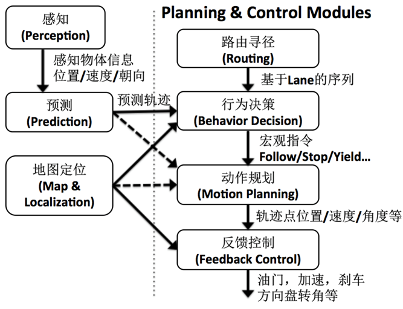

# 4.1 系统软件框架总览

## Classic Modules

- ACC(Adaptive Cruise Control自适应巡航控制)
- AEB(Autonomous Emergency Braking 自动紧急制动)
- LKA(Lane Keeping Assist 辅助车道保持)
- PPS(Pedestrian Protection System 行人保护系统)
- TSR(Traffic Sign Recognition交通标志识别)
