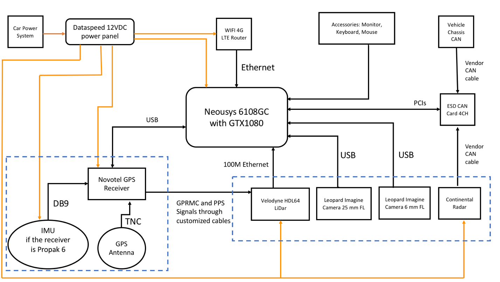
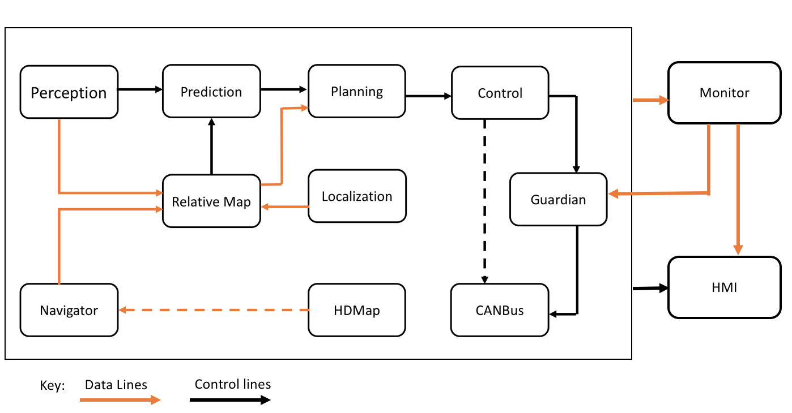

# 5.4 百度无人驾驶

http://apollo.auto/

以下评论基于知乎用户对于Apollo 1.0的评价:

定位 Localization：RTK GPS + IMU，没看到 Kalman Filter；

感知 Perception：这块应该是用来识别障碍物，车道线，交通灯等各种信息的模块，算是无人驾驶系统中非常关键的一块。这次百度并没有公开这个；

预测 Prediction：这个主要是基于感知信息进行预测，所以也没有公开；

决策 Decision：这个属于无人车系统最高层的决策系统，它的作用是基于现有的信息来判断下一步动作，没有感知，所以这部分也没公开；

规划 Planning：这个应该是一般意义上的全局规划器，用途是找到可行路径，一般会采用各种各样的花式规划算法，然后这次 Apollo 中也没有提供这部分内容；

控制 Control：这个其实就是局部规划器，用途是让无人车沿着规划的轨迹运行，这个项目中提供了基于 LQR 的算法，这部分还算可以。

