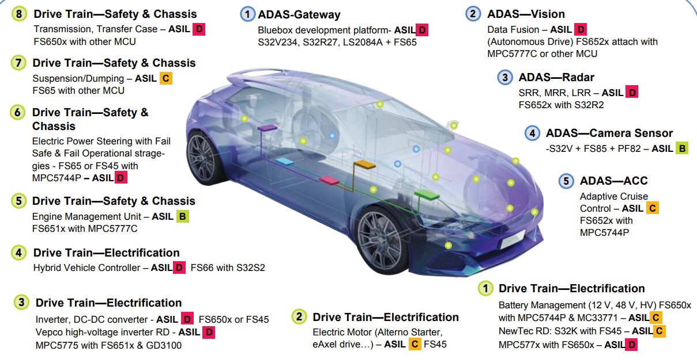

# 系统安全保障

自动驾驶和人工智能是目前最火热的话题了。在功能性不断完善的同时，系统的安全往往被人忽略。本文介绍目前自动驾驶系统中存在的安全验证困境，已经可能的解决方法。

如何验证自动驾驶

- ISO 26262 & IEC 61508的不足
- 系统无法先验
- 使用人工智能导致的困难
- Fail safe & fail operational

## RAS Safety Standard

1. Quality management system(ISO9001, IATF16949..) cover product quality, zero defect, zero DPPM
2. Functional Safety (ISO26262) cover systematic fault and random fault
3. SOTIF cover limitation of intended function
4. ASPICE cover software process and capability
5. Mobileye RSS (Responsibility-Sensitive Safety) provide model for safety
6. NVIDA Safety Force Field protect against real-world traffic
7. E-NCAP and C-NCAP for new car assessment
8. Cybersecurity to cover system security hole

## ASIL: Automotive Safety Integrity Level

---------

## 参考资料

1. A. Bhat, S. Aoki and R. Rajkumar. Tools and Methodologies for Autonomous Driving Systems. Proceedings of the IEEE. 2018
