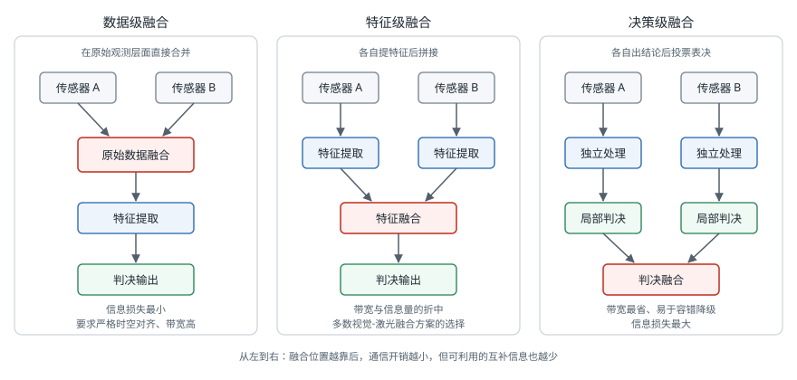
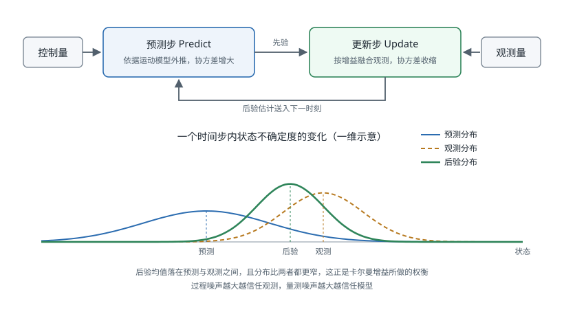

# 传感器融合

!!! note "引言"
    传感器融合（Sensor Fusion）是将来自多个传感器的数据加以综合处理，以获得比任意单一传感器更准确、更可靠的状态估计的技术。在无人机自主飞行、自动驾驶汽车、人形机器人等系统中，传感器融合是实现安全、鲁棒感知的基础。单一传感器受限于自身物理原理，存在固有缺陷，而融合互补的传感器可大幅提升系统整体性能。


## 为什么需要传感器融合

### 单一传感器的局限性

现实机器人系统依赖多种传感器，但每种传感器都有固有的缺陷：

**单目/双目相机**

- 依赖环境光照，夜间或强逆光下性能急剧下降
- 遮挡问题：前景物体遮挡背景目标，造成感知盲区
- 无法直接测量速度，仅能从图像序列中估算运动
- 运动模糊（Motion Blur）在高速场景下严重影响特征提取

**全球定位系统（Global Positioning System, GPS）**

- 城市峡谷（Urban Canyon）中信号被建筑物遮挡，产生多径效应（Multipath Effect）
- 室内环境无信号，无法使用
- 民用 GPS 精度约 2–5 m，更新频率仅 1–10 Hz，不满足高动态控制需求
- 信号延迟可达数百毫秒，无法用于实时反馈控制

**惯性测量单元（Inertial Measurement Unit, IMU）**

- 加速度计和陀螺仪存在零偏（Bias）和随机游走（Random Walk）噪声
- 通过积分估计速度和位置时，误差随时间平方增长（二次积分漂移）
- 温度变化导致零偏漂移（Thermal Drift），需要温度补偿
- 高采样率（100–1000 Hz）带来大量数据，但长期精度无保证

**激光雷达（Light Detection and Ranging, LiDAR）**

- 雨、雾、雪等恶劣天气下激光束被散射，有效测距距离大幅下降
- 无法感知颜色和纹理信息
- 稀疏点云对细小物体（如行人腿部）的检测率低
- 高端多线激光雷达成本高昂（数千至数万美元）

### 融合后的互补优势

传感器融合的核心思想是利用不同传感器在时间域、频率域、精度域上的互补性：

| 传感器组合 | 互补关系 | 典型应用 |
|-----------|---------|---------|
| IMU + GPS | IMU 高频（>100 Hz）填补 GPS 低频（1–10 Hz）间隙；GPS 校正 IMU 长期漂移 | 无人机惯性导航 |
| 相机 + IMU | 相机提供绝对尺度和纹理；IMU 在快速运动中辅助位姿预测 | 视觉惯性里程计（VIO） |
| LiDAR + 相机 | LiDAR 提供精确深度；相机提供颜色和语义 | 自动驾驶 3D 目标检测 |
| IMU + 编码器 | IMU 感知姿态变化；编码器提供轮式里程计 | 地面移动机器人 |
| LiDAR + IMU | LiDAR 提供高精度地图匹配；IMU 提供初始位姿预测 | LiDAR SLAM |

**典型应用场景**

- **无人机（Unmanned Aerial Vehicle, UAV）**：IMU + 气压计 + GPS + 光流传感器融合，实现室内外无缝切换的自主悬停
- **自动驾驶汽车**：LiDAR + 相机 + 毫米波雷达 + GPS/RTK 融合，满足 L4 级别自动驾驶的感知需求
- **人形机器人（Humanoid Robot）**：关节编码器 + IMU + 足底力传感器融合，实现稳定的动态平衡控制


## 融合层级架构

传感器融合按处理层次分为三个级别，各有适用场景和权衡取舍。三者的区别在于融合发生在流水线的哪个位置：



### 数据级融合（Low-level Fusion）

数据级融合（也称原始数据级融合）在传感器原始数据层面直接进行融合，不经过特征提取或决策步骤。

**工作流程**：原始传感器数据 → 同步与配准 → 融合处理 → 后续处理

**典型示例：双目视差计算**

双目相机左右图像在像素级进行立体匹配（Stereo Matching），计算视差图（Disparity Map）后恢复深度：

$$
Z = \frac{f \cdot B}{d}
$$

其中 \(f\) 为焦距（像素单位），\(B\) 为基线距离（m），\(d\) 为视差（像素）。这是典型的数据级融合：两路图像数据在像素级别完成融合。

**另一典型示例：LiDAR 与相机的点云着色**

将相机采集的 RGB 图像投影到 LiDAR 点云上，为每个三维点附加颜色属性，属于数据级融合。

**特点**

- 保留原始数据的最大信息量，融合精度高
- 对传感器时间同步和空间标定要求极高
- 计算量大，通常需要专用硬件加速

### 特征级融合（Feature-level Fusion）

特征级融合先从各传感器数据中独立提取特征（如边缘、角点、语义标签），再在特征空间中进行融合。

**工作流程**：原始传感器数据 → 各自特征提取 → 特征对齐与融合 → 联合推理

**典型示例：LiDAR + 相机 3D 目标检测**

- 相机提取图像特征（ResNet 骨干网络输出的特征图）
- LiDAR 提取点云特征（PointNet++ 或体素化后的稀疏卷积特征）
- 两路特征在鸟瞰图（Bird's Eye View, BEV）空间对齐后融合，输入 3D 检测头

代表算法：BEVFusion（MIT）、PointPainting、MVP（Multi-view Pseudo-labeling）

**特点**

- 比数据级融合计算量小，因特征维度远低于原始数据
- 具备一定的传感器缺失鲁棒性（缺失一路传感器时可部分降级运行）
- 特征对齐需要精确的外参标定

### 决策级融合（Decision-level Fusion）

决策级融合让各传感器独立完成推理（如检测、分类），再对各自的输出结果进行投票或加权融合。

**工作流程**：原始传感器数据 → 各自独立推理 → 决策融合（投票/加权/D-S 证据理论）

**典型示例：多雷达目标检测投票**

三个方向的毫米波雷达各自输出目标置信度，采用多数投票（Majority Voting）或加权平均得到最终检测结果。

**特点**

- 各模块高度解耦，易于独立开发和替换
- 对单一传感器故障具有最强鲁棒性
- 信息损失最大：原始数据经过推理压缩后，大量细节信息已丢失

### 三级融合架构对比

| 指标 | 数据级融合 | 特征级融合 | 决策级融合 |
|------|-----------|-----------|-----------|
| 信息保留量 | 高 | 中 | 低 |
| 融合精度 | 最高 | 较高 | 较低 |
| 计算开销 | 大 | 中 | 小 |
| 同步要求 | 严格（μs 级） | 中等（ms 级） | 宽松（帧级） |
| 传感器异构性支持 | 弱（需相同数据格式） | 中 | 强 |
| 典型场景 | 双目深度、点云着色 | BEVFusion、VIO | 冗余系统表决 |


## 概率估计框架

传感器融合的理论基础是概率论与贝叶斯统计，将状态估计问题纳入统一的概率推断框架。

### 贝叶斯估计基础

设机器人状态为 \(\mathbf{x}\)（如位姿、速度），传感器观测为 \(\mathbf{z}\)。贝叶斯后验估计（Bayesian Posterior Estimation）为：

$$
p(\mathbf{x} | \mathbf{z}) \propto p(\mathbf{z} | \mathbf{x}) \, p(\mathbf{x})
$$

其中：

- \(p(\mathbf{x})\) 为状态先验概率（Prior），表示融合观测前对状态的信念
- \(p(\mathbf{z} | \mathbf{x})\) 为似然函数（Likelihood），表示在状态 \(\mathbf{x}\) 下观测到 \(\mathbf{z}\) 的概率（由传感器模型决定）
- \(p(\mathbf{x} | \mathbf{z})\) 为后验概率（Posterior），融合观测后的更新信念

最大后验估计（Maximum A Posteriori, MAP）求解：

$$
\hat{\mathbf{x}}_{\text{MAP}} = \arg\max_{\mathbf{x}} \, p(\mathbf{z} | \mathbf{x}) \, p(\mathbf{x})
$$

### 递归贝叶斯滤波框架

对于时序状态估计，递归贝叶斯滤波（Recursive Bayesian Filter）分两步交替执行：

**预测步（Prediction Step）**

$$
p(\mathbf{x}_k | \mathbf{z}_{1:k-1}) = \int p(\mathbf{x}_k | \mathbf{x}_{k-1}) \, p(\mathbf{x}_{k-1} | \mathbf{z}_{1:k-1}) \, d\mathbf{x}_{k-1}
$$

利用运动模型 \(p(\mathbf{x}_k | \mathbf{x}_{k-1})\)（状态转移概率），将上一时刻的后验传播到当前时刻，得到当前先验。

**更新步（Update Step）**

$$
p(\mathbf{x}_k | \mathbf{z}_{1:k}) = \frac{p(\mathbf{z}_k | \mathbf{x}_k) \, p(\mathbf{x}_k | \mathbf{z}_{1:k-1})}{p(\mathbf{z}_k | \mathbf{z}_{1:k-1})}
$$

利用当前观测 \(\mathbf{z}_k\) 和传感器模型 \(p(\mathbf{z}_k | \mathbf{x}_k)\) 更新先验，得到后验。

卡尔曼滤波、扩展卡尔曼滤波、无迹卡尔曼滤波、粒子滤波均是该框架在不同假设下的具体实现。


## 卡尔曼滤波

卡尔曼滤波（Kalman Filter, KF）是线性高斯系统下递归贝叶斯滤波的最优解，由 Rudolf E. Kálmán 于 1960 年提出。

滤波器在每个时间步交替执行预测与更新两步。下图给出这一循环，以及状态不确定度在两步中的变化：预测使分布变宽，更新融合观测后分布收窄，且后验均值落在预测与观测之间。



### 系统模型

**状态转移方程（运动模型）**：

$$
\mathbf{x}_k = \mathbf{F} \mathbf{x}_{k-1} + \mathbf{B} \mathbf{u}_k + \mathbf{w}_k, \quad \mathbf{w}_k \sim \mathcal{N}(\mathbf{0}, \mathbf{Q})
$$

**观测方程（传感器模型）**：

$$
\mathbf{z}_k = \mathbf{H} \mathbf{x}_k + \mathbf{v}_k, \quad \mathbf{v}_k \sim \mathcal{N}(\mathbf{0}, \mathbf{R})
$$

其中：

- \(\mathbf{x}_k \in \mathbb{R}^n\)：k 时刻系统状态向量
- \(\mathbf{F} \in \mathbb{R}^{n \times n}\)：状态转移矩阵（State Transition Matrix）
- \(\mathbf{B} \in \mathbb{R}^{n \times m}\)：控制输入矩阵
- \(\mathbf{u}_k \in \mathbb{R}^m\)：控制输入向量
- \(\mathbf{w}_k\)：过程噪声，协方差矩阵为 \(\mathbf{Q}\)
- \(\mathbf{z}_k \in \mathbb{R}^p\)：观测向量
- \(\mathbf{H} \in \mathbb{R}^{p \times n}\)：观测矩阵（Observation Matrix）
- \(\mathbf{v}_k\)：观测噪声，协方差矩阵为 \(\mathbf{R}\)

### 预测步

利用上一时刻后验 \(\hat{\mathbf{x}}_{k-1|k-1}\) 和 \(\mathbf{P}_{k-1|k-1}\) 计算当前先验：

**先验状态预测**：

$$
\hat{\mathbf{x}}_{k|k-1} = \mathbf{F} \hat{\mathbf{x}}_{k-1|k-1} + \mathbf{B} \mathbf{u}_k
$$

**先验协方差预测**：

$$
\mathbf{P}_{k|k-1} = \mathbf{F} \mathbf{P}_{k-1|k-1} \mathbf{F}^{\top} + \mathbf{Q}
$$

### 更新步

接收到观测 \(\mathbf{z}_k\) 后，计算卡尔曼增益并更新状态：

**卡尔曼增益（Kalman Gain）**：

$$
\mathbf{K}_k = \mathbf{P}_{k|k-1} \mathbf{H}^{\top} \left( \mathbf{H} \mathbf{P}_{k|k-1} \mathbf{H}^{\top} + \mathbf{R} \right)^{-1}
$$

**状态更新（后验状态估计）**：

$$
\hat{\mathbf{x}}_{k|k} = \hat{\mathbf{x}}_{k|k-1} + \mathbf{K}_k \left( \mathbf{z}_k - \mathbf{H} \hat{\mathbf{x}}_{k|k-1} \right)
$$

其中 \(\mathbf{z}_k - \mathbf{H} \hat{\mathbf{x}}_{k|k-1}\) 称为创新量（Innovation）或残差（Residual）。

**后验协方差更新**：

$$
\mathbf{P}_{k|k} = \left( \mathbf{I} - \mathbf{K}_k \mathbf{H} \right) \mathbf{P}_{k|k-1}
$$

### 直觉理解

卡尔曼增益 \(\mathbf{K}_k\) 的物理意义是：在预测不确定性和观测不确定性之间动态权衡。

- 当 \(\mathbf{R} \to \mathbf{0}\)（传感器非常精确）：\(\mathbf{K}_k \to \mathbf{H}^{-1}\)，完全信任观测
- 当 \(\mathbf{Q} \to \mathbf{0}\)（运动模型非常精确）：\(\mathbf{K}_k \to \mathbf{0}\)，完全信任预测

### 适用条件

- 系统为**线性**（\(\mathbf{F}\)、\(\mathbf{H}\) 为常数矩阵）
- 噪声为**高斯分布**（\(\mathbf{w}_k \sim \mathcal{N}\)，\(\mathbf{v}_k \sim \mathcal{N}\)）
- 噪声不相关（\(\mathbf{w}_k\) 与 \(\mathbf{v}_k\) 独立，且不同时刻独立）

满足以上条件时，卡尔曼滤波给出**均方误差（Mean Squared Error, MSE）意义下的最优估计**。


## 扩展卡尔曼滤波

扩展卡尔曼滤波（Extended Kalman Filter, EKF）将标准卡尔曼滤波推广到非线性系统，通过局部线性化处理非线性运动模型和观测模型。

### 非线性系统模型

$$
\mathbf{x}_k = f(\mathbf{x}_{k-1}, \mathbf{u}_k) + \mathbf{w}_k
$$

$$
\mathbf{z}_k = h(\mathbf{x}_k) + \mathbf{v}_k
$$

其中 \(f(\cdot)\) 和 \(h(\cdot)\) 为非线性函数。

### Jacobian 矩阵线性化

EKF 在当前估计点处对 \(f\) 和 \(h\) 进行一阶泰勒展开（First-order Taylor Expansion），计算 Jacobian 矩阵：

**过程 Jacobian**（在 \(\hat{\mathbf{x}}_{k-1|k-1}\) 处求偏导）：

$$
\mathbf{F}_k = \left. \frac{\partial f}{\partial \mathbf{x}} \right|_{\hat{\mathbf{x}}_{k-1|k-1}, \mathbf{u}_k}
$$

**观测 Jacobian**（在 \(\hat{\mathbf{x}}_{k|k-1}\) 处求偏导）：

$$
\mathbf{H}_k = \left. \frac{\partial h}{\partial \mathbf{x}} \right|_{\hat{\mathbf{x}}_{k|k-1}}
$$

### EKF 预测与更新

**预测步**：

$$
\hat{\mathbf{x}}_{k|k-1} = f(\hat{\mathbf{x}}_{k-1|k-1}, \mathbf{u}_k)
$$

$$
\mathbf{P}_{k|k-1} = \mathbf{F}_k \mathbf{P}_{k-1|k-1} \mathbf{F}_k^{\top} + \mathbf{Q}
$$

**更新步**（与 KF 类似，但用 Jacobian 替换线性矩阵）：

$$
\mathbf{K}_k = \mathbf{P}_{k|k-1} \mathbf{H}_k^{\top} \left( \mathbf{H}_k \mathbf{P}_{k|k-1} \mathbf{H}_k^{\top} + \mathbf{R} \right)^{-1}
$$

$$
\hat{\mathbf{x}}_{k|k} = \hat{\mathbf{x}}_{k|k-1} + \mathbf{K}_k \left( \mathbf{z}_k - h(\hat{\mathbf{x}}_{k|k-1}) \right)
$$

$$
\mathbf{P}_{k|k} = \left( \mathbf{I} - \mathbf{K}_k \mathbf{H}_k \right) \mathbf{P}_{k|k-1}
$$

### 典型应用：IMU + GPS 融合

**状态向量**（以二维平面为例）：

$$
\mathbf{x} = \begin{bmatrix} x & y & \theta & v_x & v_y & \omega \end{bmatrix}^{\top}
$$

- IMU 测量加速度 \((a_x, a_y)\) 和角速度 \(\omega\)，通过非线性运动学方程更新状态（涉及三角函数，非线性）
- GPS 直接测量位置 \((x, y)\)，观测方程为线性 \(h(\mathbf{x}) = [x, y]^{\top}\)

EKF 以 IMU 频率（如 200 Hz）运行预测步，GPS 数据到达（如 10 Hz）时执行更新步，实现高频低延迟的位姿估计。

### EKF 的局限性

- Jacobian 矩阵需要解析推导，工程实现复杂，对模型变更的适应性差
- 一阶线性化仅在局部准确，对强非线性系统（如大角度旋转、高速机动）精度下降明显
- 初始估计偏差较大时，线性化点不准确，滤波器可能发散


## 无迹卡尔曼滤波

无迹卡尔曼滤波（Unscented Kalman Filter, UKF）由 Julier 和 Uhlmann 于 1997 年提出，用确定性 Sigma 点集代替 EKF 的局部线性化，无需计算 Jacobian 矩阵。

### 无迹变换核心思想

**无迹变换（Unscented Transform, UT）**：与其线性化非线性函数，不如用一组精心选取的确定性采样点（Sigma 点）近似高斯分布，将这些点通过真实非线性函数传播，再从传播后的点集重新估计均值和协方差。

对于 \(n\) 维状态 \(\mathbf{x} \sim \mathcal{N}(\bar{\mathbf{x}}, \mathbf{P})\)，选取 \(2n+1\) 个 Sigma 点：

**第 0 个 Sigma 点（均值点）**：

$$
\mathbf{x}^{(0)} = \bar{\mathbf{x}}
$$

**第 \(i\) 个 Sigma 点（\(i = 1, \ldots, n\)，正方向）**：

$$
\mathbf{x}^{(i)} = \bar{\mathbf{x}} + \left( \sqrt{(n + \lambda) \mathbf{P}} \right)_i
$$

**第 \(n+i\) 个 Sigma 点（\(i = 1, \ldots, n\)，负方向）**：

$$
\mathbf{x}^{(n+i)} = \bar{\mathbf{x}} - \left( \sqrt{(n + \lambda) \mathbf{P}} \right)_i
$$

其中 \(\lambda = \alpha^2(n + \kappa) - n\) 为缩放参数，\((\sqrt{(n+\lambda)\mathbf{P}})_i\) 表示矩阵平方根的第 \(i\) 列。

### Sigma 点权重

均值权重和协方差权重分别为：

$$
W_m^{(0)} = \frac{\lambda}{n + \lambda}, \quad W_c^{(0)} = \frac{\lambda}{n + \lambda} + (1 - \alpha^2 + \beta)
$$

$$
W_m^{(i)} = W_c^{(i)} = \frac{1}{2(n + \lambda)}, \quad i = 1, \ldots, 2n
$$

常用参数：\(\alpha = 10^{-3}\)，\(\kappa = 0\)，\(\beta = 2\)（适用于高斯分布）。

### UKF 预测步

1. 由 \(\hat{\mathbf{x}}_{k-1|k-1}\) 和 \(\mathbf{P}_{k-1|k-1}\) 生成 Sigma 点 \(\{\mathbf{x}^{(i)}_{k-1}\}\)
2. 将每个 Sigma 点通过非线性函数传播：\(\mathcal{X}^{(i)}_k = f(\mathbf{x}^{(i)}_{k-1}, \mathbf{u}_k)\)
3. 加权重构先验均值和协方差：

$$
\hat{\mathbf{x}}_{k|k-1} = \sum_{i=0}^{2n} W_m^{(i)} \mathcal{X}^{(i)}_k
$$

$$
\mathbf{P}_{k|k-1} = \sum_{i=0}^{2n} W_c^{(i)} \left( \mathcal{X}^{(i)}_k - \hat{\mathbf{x}}_{k|k-1} \right)\left( \mathcal{X}^{(i)}_k - \hat{\mathbf{x}}_{k|k-1} \right)^{\top} + \mathbf{Q}
$$

### UKF 更新步

1. 将先验 Sigma 点通过观测模型传播：\(\mathcal{Z}^{(i)}_k = h(\mathcal{X}^{(i)}_k)\)
2. 加权重构预测观测均值和协方差：

$$
\hat{\mathbf{z}}_{k} = \sum_{i=0}^{2n} W_m^{(i)} \mathcal{Z}^{(i)}_k
$$

$$
\mathbf{S}_k = \sum_{i=0}^{2n} W_c^{(i)} \left( \mathcal{Z}^{(i)}_k - \hat{\mathbf{z}}_k \right)\left( \mathcal{Z}^{(i)}_k - \hat{\mathbf{z}}_k \right)^{\top} + \mathbf{R}
$$

$$
\mathbf{T}_k = \sum_{i=0}^{2n} W_c^{(i)} \left( \mathcal{X}^{(i)}_k - \hat{\mathbf{x}}_{k|k-1} \right)\left( \mathcal{Z}^{(i)}_k - \hat{\mathbf{z}}_k \right)^{\top}
$$

3. 计算 UKF 增益并更新：

$$
\mathbf{K}_k = \mathbf{T}_k \mathbf{S}_k^{-1}
$$

$$
\hat{\mathbf{x}}_{k|k} = \hat{\mathbf{x}}_{k|k-1} + \mathbf{K}_k \left( \mathbf{z}_k - \hat{\mathbf{z}}_k \right)
$$

$$
\mathbf{P}_{k|k} = \mathbf{P}_{k|k-1} - \mathbf{K}_k \mathbf{S}_k \mathbf{K}_k^{\top}
$$

### UKF 与 EKF 对比

| 特性 | EKF | UKF |
|------|-----|-----|
| 线性化方法 | 一阶 Taylor 展开（Jacobian） | Sigma 点无迹变换 |
| 精度 | 一阶精度 | 二阶精度（高斯假设下） |
| Jacobian 要求 | 必须解析推导或数值近似 | 不需要 |
| 计算量 | \(\mathcal{O}(n^3)\) 矩阵运算 | \(\mathcal{O}(n^3)\)（稍大于 EKF） |
| 强非线性适应性 | 较差 | 较好 |
| 实现复杂度 | 中（需推导 Jacobian） | 较低（仅需实现非线性函数） |


## 粒子滤波

粒子滤波（Particle Filter, PF）又称序贯蒙特卡洛（Sequential Monte Carlo, SMC）方法，用大量随机采样的粒子（Particles）近似任意概率分布，突破了卡尔曼系列滤波器对高斯假设的限制。

### 基本原理

用 \(N\) 个粒子 \(\{\mathbf{x}_k^{(i)}, w_k^{(i)}\}_{i=1}^{N}\) 表示后验分布，其中 \(w_k^{(i)}\) 为归一化权重（\(\sum_i w_k^{(i)} = 1\)）：

$$
p(\mathbf{x}_k | \mathbf{z}_{1:k}) \approx \sum_{i=1}^{N} w_k^{(i)} \delta\left(\mathbf{x}_k - \mathbf{x}_k^{(i)}\right)
$$

### 序贯重要性采样

从建议分布（Proposal Distribution）\(q(\mathbf{x}_k | \mathbf{x}_{k-1}^{(i)}, \mathbf{z}_k)\) 采样并更新权重。

最常用的建议分布为转移先验 \(p(\mathbf{x}_k | \mathbf{x}_{k-1}^{(i)})\)，此时**权重更新**简化为：

$$
w_k^{(i)} \propto p\!\left(\mathbf{z}_k \middle| \mathbf{x}_k^{(i)}\right) w_{k-1}^{(i)}
$$

即权重正比于当前观测似然与上一时刻权重之积。

归一化：

$$
w_k^{(i)} \leftarrow \frac{w_k^{(i)}}{\sum_{j=1}^{N} w_k^{(j)}}
$$

### 粒子退化与重采样

长时间运行后，大多数粒子权重趋近于零，仅少数粒子承载有效信息，称为**粒子退化（Particle Degeneracy）**。用**有效粒子数（Effective Sample Size, ESS）**监测退化程度：

$$
N_{\text{eff}} \approx \frac{1}{\sum_{i=1}^{N} \left(w_k^{(i)}\right)^2}
$$

当 \(N_{\text{eff}} < N/2\) 时触发**重采样（Resampling）**：按权重从当前粒子集有放回地抽取 \(N\) 个粒子，重置权重为 \(1/N\)。常用重采样算法：

- **系统采样（Systematic Resampling）**：最常用，计算量 \(\mathcal{O}(N)\)，方差最小
- **多项式采样（Multinomial Resampling）**：最直观，计算量 \(\mathcal{O}(N \log N)\)
- **残差采样（Residual Resampling）**：介于两者之间

### 粒子滤波优势与局限

**优势**：

- 能处理任意非线性、非高斯系统
- 天然支持多假设状态（Multi-modal Distribution），适合机器人绑架（Kidnapped Robot）问题
- 实现简单，无需推导 Jacobian

**局限**：

- 粒子数量 \(N\) 与状态空间维度呈指数关系（维数灾难），高维状态时计算量爆炸
- 大量粒子带来高内存和计算开销

**典型应用：FastSLAM**

FastSLAM 将 SLAM 问题分解为机器人路径估计（粒子滤波）和地图特征估计（每个粒子维护独立的 EKF），实现了对非高斯噪声下 SLAM 问题的有效求解。


## 典型融合场景

### IMU + GPS 惯性导航

这是工程中最经典的传感器融合场景，广泛应用于无人机飞控（如 ArduPilot、PX4）和地面无人车。

**融合设计**：

- **IMU 高频积分（200–1000 Hz）**：利用加速度计和陀螺仪积分估计位置、速度、姿态。短期精度高，但存在累积漂移
- **GPS 低频校正（1–10 Hz）**：提供全局位置绝对参考，校正 IMU 积分漂移
- **融合算法**：EKF 或 UKF，以 IMU 频率运行预测步，GPS 触发更新步

**状态向量（15 维）**：

$$
\mathbf{x} = \begin{bmatrix} \mathbf{p}^{\top} & \mathbf{v}^{\top} & \boldsymbol{\phi}^{\top} & \mathbf{b}_a^{\top} & \mathbf{b}_g^{\top} \end{bmatrix}^{\top}
$$

其中 \(\mathbf{p} \in \mathbb{R}^3\) 为位置，\(\mathbf{v} \in \mathbb{R}^3\) 为速度，\(\boldsymbol{\phi} \in \mathbb{R}^3\) 为欧拉角，\(\mathbf{b}_a \in \mathbb{R}^3\) 和 \(\mathbf{b}_g \in \mathbb{R}^3\) 分别为加速度计和陀螺仪的零偏。

### LiDAR + 相机 3D 目标检测

**BEVFusion（俯视图特征融合）**

BEVFusion 由 MIT Han Lab 提出，将相机图像特征和 LiDAR 点云特征统一投影到鸟瞰图（Bird's Eye View, BEV）坐标系进行融合：

1. 相机分支：多视角图像经骨干网络提取特征，通过深度预测网络（Lift-Splat-Shoot）提升为 BEV 特征
2. LiDAR 分支：点云体素化后经稀疏卷积网络提取 BEV 特征
3. BEV 特征通道拼接（Concatenation）后输入融合模块，送入 3D 检测头

**PointPainting（点云着色）**

先用相机图像的语义分割结果（各类别置信度）为 LiDAR 点云中每个点附加语义标签，再将着色后的点云送入 3D 点云检测器。此方法属于数据级 + 特征级混合融合。

### 视觉-惯性里程计

视觉-惯性里程计（Visual-Inertial Odometry, VIO）结合相机和 IMU 估计机器人相对运动，是无人机和手持设备定位的核心技术。

**松耦合 VIO（Loosely-Coupled VIO）**

相机和 IMU 分别独立处理，相机输出位姿增量，IMU 输出姿态预积分量，两者在 EKF 层面融合。实现简单，但精度低于紧耦合方案。

**紧耦合 VIO（Tightly-Coupled VIO）**

相机特征观测和 IMU 测量在同一优化框架中联合处理：

$$
\min_{\mathcal{X}} \left\| \mathbf{r}_{\text{prior}} \right\|^2 + \sum_{k} \left\| \mathbf{r}_{\text{IMU},k} \right\|^2 + \sum_{k,j} \left\| \mathbf{r}_{\text{cam},kj} \right\|^2
$$

其中 \(\mathbf{r}_{\text{IMU}}\) 为 IMU 预积分残差，\(\mathbf{r}_{\text{cam}}\) 为特征重投影误差。

**代表算法**：

- **MSCKF（Multi-State Constraint Kalman Filter）**：基于 EKF，维护滑动窗口内的相机位姿集合，通过零空间投影边缘化路标点
- **VINS-Mono**：香港科技大学开源的单目 VIO，支持回环检测，采用因子图优化（Factor Graph Optimization）


## 时间同步与空间标定

传感器融合的精度上限由时间同步（Temporal Synchronization）和空间标定（Spatial Calibration）的精度决定。

### 时间同步

**硬件触发（Hardware Triggering）**

- 通过专用触发信号（如 GPIO 脉冲、PPS 信号）同步启动多个传感器采集
- 精度可达微秒（μs）级，是精度要求最高场景（如 LiDAR + 相机同步）的首选
- 典型方案：GNSS 接收机输出 PPS 信号驱动相机外触发，同时给 IMU 打时间戳

**软件时间戳对齐（Software Timestamp Alignment）**

- 各传感器各自记录系统时间戳，后处理时通过插值（Interpolation）或最近邻（Nearest-Neighbor）对齐
- 受操作系统调度抖动（Jitter）影响，精度通常在毫秒（ms）级
- 适用于对实时性和精度要求不极端的场景（如 GPS + 低频 IMU）

**时间偏移估计**

当无法硬件触发时，可将传感器间的时间偏移 \(t_d\) 纳入标定参数，在线估计：

$$
\mathbf{z}_{\text{cam}}(t) = h\!\left(\mathbf{x}(t + t_d)\right)
$$

Kalibr 工具支持相机-IMU 时间偏移在线标定。

### 空间标定（外参标定）

**相机内参标定**

利用棋盘格（Checkerboard）靶标，通过 Zhang 标定法（Zhang's Method）估计相机内参矩阵 \(\mathbf{K}\) 和畸变系数。

**相机-IMU 外参标定（Kalibr）**

Kalibr 是苏黎世联邦理工（ETH Zurich）开源的多传感器标定工具，支持：

- 相机内参标定（多种靶标）
- 相机-相机外参标定
- 相机-IMU 时空外参标定（包含时间偏移 \(t_d\)）

标定时需对靶标进行充分激励（平移 + 旋转），覆盖多个姿态以提高可观性（Observability）。

**LiDAR-相机外参标定（ACSC）**

ACSC（Automatic Calibration for Solid-state LiDAR Camera System）利用专用标定板，通过最小化 LiDAR 平面点投影到相机图像的平面重投影误差来估计外参旋转矩阵 \(\mathbf{R}\) 和平移向量 \(\mathbf{t}\)：

$$
\min_{\mathbf{R}, \mathbf{t}} \sum_{i} d\!\left(\pi(\mathbf{R} \mathbf{p}_i + \mathbf{t}),\, \mathbf{l}_i\right)^2
$$

其中 \(\pi(\cdot)\) 为相机投影函数，\(\mathbf{p}_i\) 为 LiDAR 点，\(\mathbf{l}_i\) 为对应图像特征，\(d(\cdot)\) 为点到直线距离。


## ROS 中的传感器融合工具

机器人操作系统（Robot Operating System, ROS）提供了丰富的传感器融合软件包，可快速搭建原型系统。

### robot_localization 包

`robot_localization` 是 ROS 中最常用的多传感器状态估计包，提供 EKF 节点（`ekf_localization_node`）和 UKF 节点（`ukf_localization_node`），支持任意数量的传感器输入。

**支持的输入消息类型**：

- `nav_msgs/Odometry`（轮式里程计、VIO 输出）
- `sensor_msgs/Imu`（IMU 加速度、角速度、姿态）
- `geometry_msgs/PoseWithCovarianceStamped`（GPS 转换后的位姿）

**示例配置文件（`ekf_config.yaml`）**：

```yaml
ekf_filter_node:
  ros__parameters:
    frequency: 50.0          # 滤波器运行频率（Hz）
    sensor_timeout: 0.1      # 传感器超时时间（s）
    two_d_mode: false        # 是否限制在 2D 平面

    # 状态变量：[x, y, z, roll, pitch, yaw, vx, vy, vz, vroll, vpitch, vyaw, ax, ay, az]
    # 各传感器的融合配置（true 表示融合该变量）
    odom0: /wheel_odom
    odom0_config: [true,  true,  false,   # x, y, z
                   false, false, true,    # roll, pitch, yaw
                   true,  true,  false,   # vx, vy, vz
                   false, false, true,    # vroll, vpitch, vyaw
                   false, false, false]   # ax, ay, az

    imu0: /imu/data
    imu0_config: [false, false, false,
                  true,  true,  true,
                  false, false, false,
                  true,  true,  true,
                  true,  true,  false]
    imu0_remove_gravitational_acceleration: true

    odom0_relative: true
    imu0_differential: false
```

### imu_filter_madgwick 包

`imu_filter_madgwick` 使用 Madgwick 滤波算法（基于梯度下降法优化四元数）将 IMU 原始数据（加速度 + 角速度）融合为四元数（Quaternion）姿态估计，发布 `sensor_msgs/Imu` 消息（带姿态）。

**特点**：

- 计算量极小，适合嵌入式系统（如 Raspberry Pi）
- 可选融合磁力计（Magnetometer），修正偏航角（Yaw）漂移
- 运行频率通常与 IMU 采样频率相同（100–400 Hz）

### 关键消息格式

**`sensor_msgs/Imu`（IMU 数据）**：

```
std_msgs/Header header
  uint32 seq
  time stamp
  string frame_id

geometry_msgs/Quaternion orientation        # 姿态四元数（可选，由滤波器计算）
float64[9] orientation_covariance          # 姿态协方差矩阵（3x3 展开）

geometry_msgs/Vector3 angular_velocity     # 角速度（rad/s）
float64[9] angular_velocity_covariance

geometry_msgs/Vector3 linear_acceleration  # 线性加速度（m/s²，含重力）
float64[9] linear_acceleration_covariance
```

**`nav_msgs/Odometry`（里程计/融合输出）**：

```
std_msgs/Header header
string child_frame_id

geometry_msgs/PoseWithCovariance pose      # 位置 + 姿态（含 6x6 协方差）
geometry_msgs/TwistWithCovariance twist    # 线速度 + 角速度（含 6x6 协方差）
```

协方差矩阵的对角元素反映各方向的估计不确定性，`robot_localization` 读取这些值作为观测噪声协方差 \(\mathbf{R}\) 的来源，因此各传感器驱动程序必须正确填写协方差字段。

### 常用 ROS 传感器融合工具汇总

| 工具包 | 功能 | 算法 | 适用场景 |
|--------|------|------|---------|
| `robot_localization` | 多传感器位姿融合 | EKF / UKF | 地面机器人、无人车定位 |
| `imu_filter_madgwick` | IMU 姿态估计 | Madgwick 梯度下降 | 机器人姿态实时估计 |
| `imu_complementary_filter` | IMU 互补滤波 | 互补滤波 | 资源受限嵌入式平台 |
| `rtabmap_ros` | 视觉/激光 SLAM | 图优化 + 粒子滤波 | 室内外建图与定位 |
| `cartographer_ros` | 2D/3D 激光 SLAM | 子图 + 位姿图优化 | 大规模室内建图 |
| `ethzasl_msf` | 多传感器融合框架 | EKF | 无人机状态估计 |


## 参考资料

1. Thrun, S., Burgard, W., & Fox, D. (2005). *Probabilistic Robotics*. MIT Press.

2. Kalman, R. E. (1960). A New Approach to Linear Filtering and Prediction Problems. *Journal of Basic Engineering*, 82(1), 35–45.

3. Julier, S. J., & Uhlmann, J. K. (1997). New Extension of the Kalman Filter to Nonlinear Systems. *Proceedings of SPIE — Signal Processing, Sensor Fusion, and Target Recognition VI*, 3068, 182–193.

4. Doucet, A., de Freitas, N., & Gordon, N. (Eds.). (2001). *Sequential Monte Carlo Methods in Practice*. Springer.

5. Mourikis, A. I., & Roumeliotis, S. I. (2007). A Multi-State Constraint Kalman Filter for Vision-aided Inertial Navigation. *Proceedings of IEEE ICRA 2007*, 3565–3572.

6. Qin, T., Li, P., & Shen, S. (2018). VINS-Mono: A Robust and Versatile Monocular Visual-Inertial State Estimator. *IEEE Transactions on Robotics*, 34(4), 1004–1020.

7. Liu, Z., Tang, H., Amini, A., et al. (2022). BEVFusion: Multi-Task Multi-Sensor Fusion with Unified Bird's-Eye View Representation. *Proceedings of IEEE ICRA 2023*.

8. Furgale, P., Rehder, J., & Siegwart, R. (2013). Unified Temporal and Spatial Calibration for Multi-Sensor Systems. *Proceedings of IEEE/RSJ IROS 2013*, 1280–1286.

9. Moore, T., & Stouch, D. (2014). A Generalized Extended Kalman Filter Implementation for the Robot Operating System. *Proceedings of the 13th International Conference on Intelligent Autonomous Systems (IAS-13)*. Springer.

10. Siegwart, R., Nourbakhsh, I., & Scaramuzza, D. (2011). *Introduction to Autonomous Mobile Robots* (2nd ed.). MIT Press.

