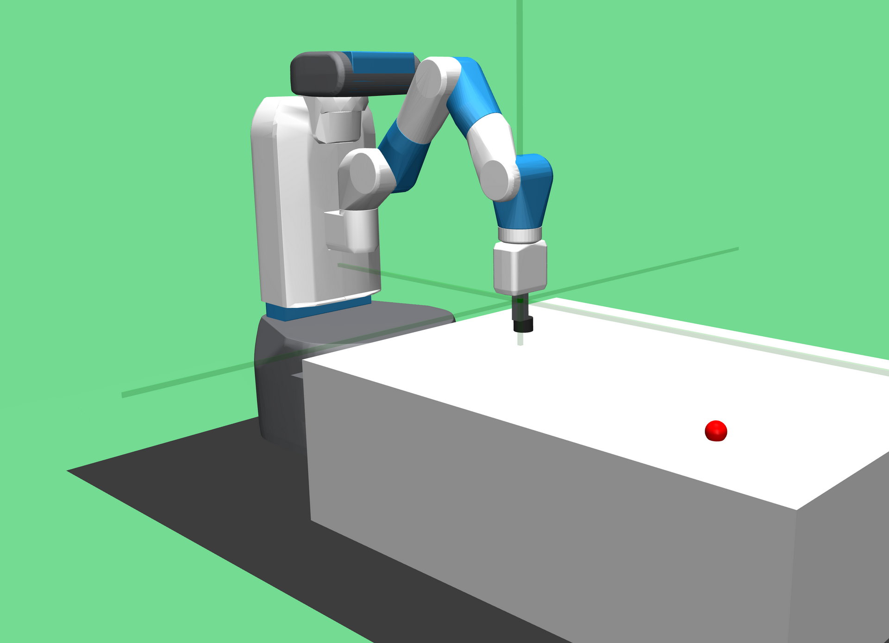

# MuJoCo


- 官方网站：http://www.mujoco.org
- GitHub：https://github.com/google-deepmind/mujoco
- 物理引擎：MuJoCo（自研）
- 许可：Apache 2.0 开源

!!! note "引言"
    MuJoCo (Multi-Joint dynamics with Contact) 是一款专注于接触动力学仿真的高性能物理引擎。MuJoCo最初由华盛顿大学 (University of Washington) 的Emo Todorov教授开发，侧重控制与接触相关的仿真与优化。2021年，DeepMind收购了MuJoCo，并于2022年将其以Apache 2.0许可证完全开源，使其成为机器人强化学习 (Reinforcement Learning) 研究领域中最重要的仿真平台之一。

## 发展历程

MuJoCo的发展经历了几个重要阶段：

- **2012年**：Emo Todorov在华盛顿大学首次发布MuJoCo，作为商业软件提供试用和付费许可
- **2015年至2020年**：随着OpenAI Gym将MuJoCo作为标准仿真后端，MuJoCo在强化学习社区中获得广泛采用
- **2021年10月**：DeepMind宣布收购MuJoCo
- **2022年5月**：MuJoCo以Apache 2.0许可证正式开源，任何人均可免费使用和修改
- **后续版本**：开源后开发节奏加快，持续引入新功能，包括原生Python绑定 (Native Python Bindings)、MuJoCo XLA (MJX) 等

## 物理引擎特性

MuJoCo的物理引擎针对机器人控制和学习任务进行了深度优化：

- **广义坐标系 (Generalized Coordinates)**：使用最小坐标表示法描述系统状态，避免了约束求解中的冗余计算
- **高效接触求解 (Contact Solver)**：采用凸优化方法处理接触动力学，保证了求解的唯一性和稳定性
- **软接触模型 (Soft Contact Model)**：通过可配置的刚度和阻尼参数模拟柔性接触，避免了刚性接触模型中常见的数值不稳定
- **肌腱与执行器建模 (Tendon and Actuator Modeling)**：支持复杂的肌腱路由和多种执行器类型，适合生物力学仿真
- **高仿真速度**：单线程下可实现远超实时的仿真速度，适合大规模并行训练

## MJCF 模型格式

MuJoCo使用自定义的MJCF (MuJoCo XML Format) 格式描述仿真模型。MJCF文件采用XML语法，定义机器人的运动学结构、动力学参数和仿真环境：

```xml
<mujoco model="example">
  <worldbody>
    <light diffuse=".5 .5 .5" pos="0 0 3" dir="0 0 -1"/>
    <geom type="plane" size="1 1 0.1" rgba=".9 .9 .9 1"/>
    <body name="box" pos="0 0 1">
      <joint type="free"/>
      <geom type="box" size=".1 .1 .1" rgba="1 0 0 1" mass="1"/>
    </body>
  </worldbody>
</mujoco>
```

MJCF支持定义关节 (Joint)、几何体 (Geom)、执行器 (Actuator)、传感器 (Sensor)、接触排除 (Contact Exclusion) 等元素。MuJoCo同时支持导入URDF格式模型并自动转换。

## Python 绑定

MuJoCo提供多种Python绑定方式：

- **原生Python绑定**：开源后官方推出的原生绑定（`mujoco` 包），安装简单，API设计清晰，性能优异
- **mujoco-py**：由OpenAI开发的早期Python绑定，目前已不再积极维护，建议迁移至原生绑定
- **dm_control**：由DeepMind开发的控制任务套件 (Control Suite)，在MuJoCo之上构建了一系列标准化的控制基准任务

安装原生Python绑定：

```bash
pip install mujoco
```

## 在强化学习研究中的应用

MuJoCo在强化学习领域的地位举足轻重。OpenAI Gym（现为Gymnasium）中大量经典的连续控制基准任务 (Benchmark Tasks) 均基于MuJoCo构建：

- **HalfCheetah**：半猎豹奔跑控制
- **Ant**：四足蚂蚁行走
- **Humanoid**：人形机器人运动控制
- **Walker2d**：双足行走
- **Hopper**：单足跳跃

这些任务已成为评估强化学习算法（如PPO、SAC、TD3等）的标准基准。MuJoCo XLA (MJX) 进一步允许在GPU/TPU上运行批量仿真，极大加速了策略训练过程。

## 与其他物理引擎的对比

| 特性 | MuJoCo | PyBullet | PhysX |
|------|--------|----------|-------|
| 坐标系统 | 广义坐标 | 笛卡尔坐标 | 笛卡尔坐标 |
| 接触模型 | 软接触 (凸优化) | 刚性接触 | 刚性接触 |
| 仿真速度 | 极快 | 快 | 快 (GPU加速) |
| 许可证 | Apache 2.0 | zlib | 商业/免费 |
| RL集成 | 原生支持 | 良好 | 通过Isaac Sim |

## MJCF 建模详解

MuJoCo 使用 MJCF（MuJoCo Modeling Format）格式的 XML 文件描述机器人和场景。MJCF 的设计哲学是简洁和默认值继承，子元素自动继承父元素的属性。

### 基本结构

```xml
<mujoco model="my_robot">
  <!-- 编译器选项 -->
  <compiler angle="radian"/>

  <!-- 物理引擎选项 -->
  <option timestep="0.002" gravity="0 0 -9.81" integrator="RK4"/>

  <!-- 资产（网格、材质、纹理） -->
  <asset>
    <material name="blue" rgba="0.2 0.4 0.8 1"/>
  </asset>

  <!-- 默认属性（子元素继承） -->
  <default>
    <joint damping="0.1" frictionloss="0.01"/>
    <geom condim="4" friction="1 0.005 0.0001"/>
  </default>

  <!-- 世界体 -->
  <worldbody>
    <light name="top" pos="0 0 3" dir="0 0 -1"/>
    <geom name="floor" type="plane" size="10 10 0.1"/>

    <body name="torso" pos="0 0 1.0">
      <freejoint/>  <!-- 6 DoF 自由关节 -->
      <site name="torso_site" pos="0 0 0" size="0.01"/>
      <geom name="torso_geom" type="capsule" fromto="0 0 -0.2 0 0 0.2" size="0.06"/>

      <body name="left_arm" pos="0 0.2 0.1">
        <joint name="left_shoulder" type="hinge" axis="0 1 0" range="-1.57 1.57"/>
        <geom name="left_arm_geom" type="capsule" fromto="0 0 0 0 0.3 0" size="0.04"/>
      </body>
    </body>
  </worldbody>

  <!-- 执行器 -->
  <actuator>
    <motor name="left_shoulder_motor" joint="left_shoulder" gear="100" ctrllimited="true" ctrlrange="-1 1"/>
  </actuator>

  <!-- 传感器 -->
  <sensor>
    <accelerometer name="imu_acc" site="torso_site"/>
    <gyro name="imu_gyro" site="torso_site"/>
    <jointpos name="left_shoulder_pos" joint="left_shoulder"/>
    <jointvel name="left_shoulder_vel" joint="left_shoulder"/>
  </sensor>
</mujoco>
```

### 关节类型

MuJoCo 支持以下关节类型：

| 关节类型 | 自由度 | 典型应用 |
|---------|--------|---------|
| `hinge` | 1（旋转） | 手臂/腿部关节 |
| `slide` | 1（平移） | 线性执行器、活塞 |
| `ball` | 3（旋转） | 球形关节、肩关节 |
| `free` | 6（平移+旋转） | 浮动基座（人形机器人躯干） |

### 执行器类型

```xml
<!-- 力矩执行器（直接控制力矩） -->
<motor name="motor1" joint="joint1" gear="100"/>

<!-- 位置伺服（目标位置控制） -->
<position name="servo1" joint="joint1" kp="1000"/>

<!-- 速度伺服 -->
<velocity name="vel_ctrl" joint="joint1" kv="100"/>

<!-- 通用执行器（结合增益和阻尼） -->
<general name="gen_act" joint="joint1" gainprm="100" biasprm="0 -100 0"/>
```

## Python API（mujoco 包）

2022 年开源后，MuJoCo 提供了原生 Python 绑定，接口简洁直观：

```python
import mujoco
import mujoco.viewer
import numpy as np

# 加载模型
model = mujoco.MjModel.from_xml_path("robot.xml")
data = mujoco.MjData(model)

# 重置到初始状态
mujoco.mj_resetData(model, data)

# 设置控制输入
data.ctrl[:] = [0.5, -0.3, 0.1]  # 各执行器控制量

# 运行仿真步骤
for _ in range(1000):
    mujoco.mj_step(model, data)

# 读取传感器数据
print("关节位置:", data.qpos)
print("关节速度:", data.qvel)
print("IMU加速度:", data.sensor("imu_acc").data)

# 交互式可视化（启动 MuJoCo 查看器）
with mujoco.viewer.launch_passive(model, data) as viewer:
    for _ in range(1000):
        mujoco.mj_step(model, data)
        viewer.sync()
```

### 关键数据结构

| 属性 | 说明 |
|------|------|
| `data.qpos` | 广义坐标（关节位置 + 浮动基座位姿） |
| `data.qvel` | 广义速度 |
| `data.ctrl` | 执行器控制输入 |
| `data.sensordata` | 所有传感器的原始数据数组 |
| `data.xpos` | 所有刚体在世界坐标系中的位置 |
| `data.xmat` | 所有刚体的旋转矩阵 |
| `model.nq` | 广义坐标维度 |
| `model.nu` | 执行器数量 |

## 无窗口运行的最小控制实验

下面的完整示例不依赖外部模型文件或图形窗口。模型只有一个转动关节，使用比例-微分（Proportional-Derivative，PD）控制跟踪 0.5 rad 的目标。为便于观察控制响应，例子关闭重力；它用于验证接口和时间推进，不是机械臂操作基准。

在安装 `mujoco` 后，将代码保存为 `minimal_control.py`，运行 `python minimal_control.py`。模型加载、状态访问与仿真推进接口见 [MuJoCo Python 文档](https://mujoco.readthedocs.io/en/stable/python.html)。

```python
import mujoco
import numpy as np

xml = """
<mujoco model="single_joint_control">
  <compiler angle="radian"/>
  <option timestep="0.002" gravity="0 0 0"/>
  <worldbody>
    <body name="link">
      <joint name="hinge" type="hinge" axis="0 0 1" damping="0.1"/>
      <geom type="capsule" fromto="0 0 0 0.3 0 0" size="0.025" mass="1"/>
    </body>
  </worldbody>
  <actuator>
    <motor name="motor" joint="hinge" gear="1"
           ctrllimited="true" ctrlrange="-2 2"/>
  </actuator>
</mujoco>
"""

model = mujoco.MjModel.from_xml_string(xml)
data = mujoco.MjData(model)
mujoco.mj_resetData(model, data)
mujoco.mj_forward(model, data)

target = 0.5
control_dt = 0.01
substeps = round(control_dt / model.opt.timestep)
if substeps < 1 or not np.isclose(substeps * model.opt.timestep, control_dt):
    raise ValueError("该示例要求控制周期是物理周期的整数倍")

history = []
for _ in range(200):
    q = float(data.joint("hinge").qpos[0])
    dq = float(data.joint("hinge").qvel[0])
    torque = np.clip(5.0 * (target - q) - 0.8 * dq, -2.0, 2.0)
    data.ctrl[0] = torque
    for _ in range(substeps):
        mujoco.mj_step(model, data)
    history.append((data.time, float(data.joint("hinge").qpos[0])))

print(f"仿真时间：{data.time:.3f} s")
print(f"最终角度：{history[-1][1]:.4f} rad，目标：{target:.4f} rad")
print(f"控制采样数：{len(history)}")
```

控制周期为 0.01 秒、物理周期为 0.002 秒，因此每次计算力矩后推进五个物理步，总仿真时间为两秒。计算机运行这段程序的实际耗时是另一回事；无窗口模式不会自动按真实时间等待。

这里 `gear="1"` 的转动关节 motor 使控制输入对应关节力矩。换成位置执行器后，`data.ctrl` 表示目标位置而不是力矩；换成其他传动比，也不能再按同样的数值解释关节力矩。执行器与限幅参数见 [MJCF 参考](https://mujoco.readthedocs.io/en/stable/XMLreference.html)。


### 状态维度与派生量

自由关节用三维位置和四元数表示位姿，因此占据 7 个 `qpos` 元素，但速度只有 6 维。球关节同样存在位置表示与速度维度不同的情况。不要假定 `model.nq == model.nv`，也不要把 `qpos` 的简单差分直接作为所有关节的速度。

直接修改 `data.qpos` 后，若需要立即读取刚体世界坐标或传感器派生量，应先调用 `mujoco.mj_forward` 更新。保存轨迹数组时使用 `.copy()`，因为很多 Python 数组访问指向内部可变缓冲区；仅保存引用可能得到被后续仿真覆盖的数据。[Python 数据访问说明](https://mujoco.readthedocs.io/en/stable/python.html)


## MJX：GPU 加速仿真

MJX（MuJoCo XLA）是 MuJoCo 的 JAX 实现，将仿真计算迁移到 GPU/TPU，实现大规模并行仿真：

```python
import mujoco
import mujoco.mjx as mjx
import jax
import jax.numpy as jnp

# 将模型转换为 MJX 格式
model = mujoco.MjModel.from_xml_path("robot.xml")
mjx_model = mjx.put_model(model)
mjx_data = mjx.put_data(model, mujoco.MjData(model))

# 使用 JAX 的 vmap 并行化：同时运行 4096 个环境
batch_size = 4096

def step_fn(data):
    return mjx.step(mjx_model, data)

# 批量初始化
batched_data = jax.tree_map(
    lambda x: jnp.stack([x] * batch_size), mjx_data
)

# JIT 编译 + vmap 并行
step_batched = jax.jit(jax.vmap(step_fn))
batched_data = step_batched(batched_data)
```

MJX 的主要优势：

- **并行规模**：单块 GPU 可同时运行数千个仿真环境
- **梯度计算**：通过 JAX 自动微分，直接对仿真过程求梯度（可微仿真）
- **与 RL 框架无缝集成**：与 Brax、Flax、Optax 等 JAX 生态完美配合

## 与 Gymnasium 集成

MuJoCo 是 Gymnasium（前 OpenAI Gym）中 MuJoCo 环境的官方物理后端：

```python
import gymnasium as gym

# 标准 MuJoCo 环境（基于 MJCF 模型）
env = gym.make("HalfCheetah-v4", render_mode="human")
obs, info = env.reset()

for _ in range(1000):
    action = env.action_space.sample()
    obs, reward, terminated, truncated, info = env.step(action)
    if terminated or truncated:
        obs, info = env.reset()

env.close()
```

Gymnasium 内置的 MuJoCo 环境包括：

| 环境名 | 任务描述 | 观测维度 | 动作维度 |
|--------|---------|---------|---------|
| `HalfCheetah-v4` | 二维猎豹奔跑 | 17 | 6 |
| `Ant-v4` | 四足机器人行走 | 111 | 8 |
| `Hopper-v4` | 单腿跳跃 | 11 | 3 |
| `Humanoid-v4` | 人形机器人行走 | 376 | 17 |
| `Swimmer-v4` | 蛇形游泳 | 8 | 2 |
| `Walker2d-v4` | 二维两足行走 | 17 | 6 |

## 强化学习工作流

以 PPO（Proximal Policy Optimization，近端策略优化）算法训练 Ant 行走为例（使用 Stable Baselines 3）：

```python
import gymnasium as gym
from stable_baselines3 import PPO
from stable_baselines3.common.vec_env import SubprocVecEnv
from stable_baselines3.common.env_util import make_vec_env

# 并行 8 个环境加速训练
vec_env = make_vec_env("Ant-v4", n_envs=8)

# 定义 PPO 策略（MLP 网络）
model = PPO(
    "MlpPolicy",
    vec_env,
    learning_rate=3e-4,
    n_steps=2048,
    batch_size=64,
    n_epochs=10,
    gamma=0.99,
    gae_lambda=0.95,
    clip_range=0.2,
    verbose=1,
)

# 训练 1000万步
model.learn(total_timesteps=10_000_000)
model.save("ant_ppo")

# 评估
eval_env = gym.make("Ant-v4", render_mode="human")
obs, _ = eval_env.reset()
for _ in range(1000):
    action, _ = model.predict(obs, deterministic=True)
    obs, _, terminated, truncated, _ = eval_env.step(action)
    if terminated or truncated:
        obs, _ = eval_env.reset()
```

## 自定义机器人模型

将 URDF（Unified Robot Description Format，统一机器人描述格式）转换为 MJCF 的推荐工具：

```bash
# 使用 MuJoCo 内置转换器
python -c "import mujoco; mujoco.MjModel.from_xml_path('robot.urdf')"

# 使用 dm_control 的 URDF 解析器（更完整）
pip install dm_control
```

常用的开源 MJCF 机器人模型资源：

- **MuJoCo Menagerie**（Google DeepMind 官方）：包含 Franka、UR5e、Boston Dynamics Spot、Shadow Hand 等高质量模型
- **unitree_mujoco**：宇树 Go2、H1、G1 的官方 MJCF 模型

## 参考资料

- [MuJoCo官方文档](https://mujoco.readthedocs.io/)
- [MuJoCo GitHub仓库](https://github.com/google-deepmind/mujoco)
- [dm_control控制任务套件](https://github.com/google-deepmind/dm_control)
- [Gymnasium MuJoCo环境](https://gymnasium.farama.org/environments/mujoco/)
- [MJX 文档](https://mujoco.readthedocs.io/en/stable/mjx.html)
- [MuJoCo Menagerie](https://github.com/google-deepmind/mujoco_menagerie)
- Todorov, E., Erez, T., & Tassa, Y. (2012). MuJoCo: A physics engine for model-based control. *IEEE/RSJ International Conference on Intelligent Robots and Systems*.
- Freeman, C. D., et al. (2021). Brax – A Differentiable Physics Engine for Large Scale Rigid Body Simulation. *NeurIPS*.
