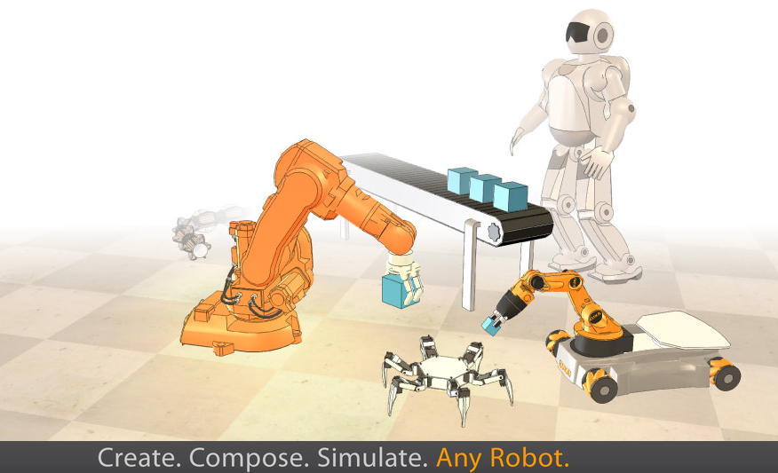

# CoppeliaSim (V-REP)

- 官方网站：http://www.coppeliarobotics.com/
- 2019年11月由V-REP更名为CoppeliaSim
- 支持的物理引擎：ODE/Bullet/Vortex/Newton
- 教育版免费 / 商业版收费

CoppeliaSim有非常完善的物理仿真引擎，支持移动机器人、飞行机器人、人型机器人、多足机器人以及多轴机械手的运动学仿真。CoppeliaSim的仿真程度非常高，不仅可以仿真机器人的本体与多种传感器，还支持障碍物以及地型(空中，地面，水底)的仿真。CoppeliaSim支持使用C/C++，Python，JAVA，Lua，Matlab编写脚本，十分适合于多机器人的仿真。作为已经商业化的软件，相比Gazebo有更好的稳定性与交互体验。
